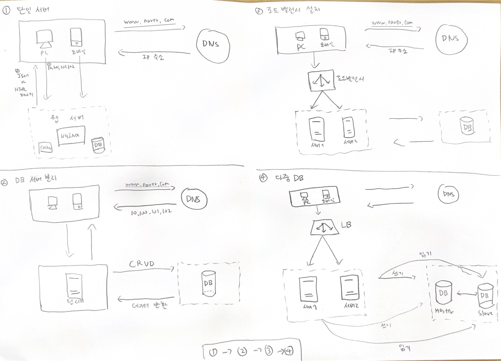

# 1장-사용자 수에 따른 규모 확장성
처음에는 아주 간단하게 설계를 하고 차츰 확장을 해나가야할 것이다 <br>

### 단일 서버
처음에는 모든 컴포넌트가 단 한 대의 서버에서 실행되는 간단한 시스템부터 설계해 보자 <br>
1개의 웹 서버에서 DNS 로 부터 들어오는 사용자의 모든 요청을 처리하고 응답을 한다고 생각해보자 <br>
ex) 웹, 앱, DB, 캐시 등 이 전부 한 서버에서 실행이 된다 <br>

1) User 가 www.naver.com 을 url 에 검색하면 www.naver.com 가 매핑되있는 서버 IP 주소를 return 한다.
2) User 가 위 서버 IP 주소로 request 를 보내면 http 요청이 서버에 전달된다.
3) 요청을 받은 웹 서버는 http 요청에 따른 html or Json(xml) 데이터를 User 에게 내려준다.


- 웹 어플리케이션: 비즈니스 로직, 데이터 저장 등을 처리하기 위한 서버 구현용 어플리케이션
  - 프레젠테이션 용은 클라이언트 구현용 언어닌 html,js 등 요즘은 react,Next 등
- 모바일 어플리케이션: http 프로토콜을 통해서 반환될 응답 데이터의 포맷으로 JSON 을 사용한다.

### 데이터베이스
User 가 늘어나면 서버 1개로는 부족하여 여러 서버를 두어야 한다 <br>
1개는 웹/모바일 트래픽 처리 용도고, 다른 하나는 데이터베이스용 서버 이다 <br>

첫번째로 확장은 웹 계층과 데이터베이스 서버를 분리하면 독립적으로 확장해 나갈 수 있어야 한다 <br>

#### 그러면 어떤 DB 를 선택해야 할까?
RDBMS 는 데이터를 테이블,열,컬럼으로 표현하고, Join 을 통해서 여러 테이블에 있는 데이터를 관계에 따라 Join 할 수 있다 <br>
비관계형 DB 는 NoSQL 이라고 부른다 ex) Cassandra, Amazon DynamoDB, MongoDB, Redis 등이 있다 <br>

여기서 4분류로 더 디테일 하게 분류하려면 Key-Value, Graph, Column, document 4자기로 나뉘고 NoSQL 은 Join 을 지원하지 않는다 <br>

대부분은 RDBMS 를 사용할텐대 필요에 의해서 NoSQL 을 도입할 수 있어야 한다
- 낮은 응답 지연시간(latency) 요구
- 다루는 데이터가 비정형이라 관계형 데이터가 아님
- 데이터를 직렬화, 역직렬화할 수 있기만 하면 됨
- 아주 많은 양의 데이터를 저장할 필요가 있음.

### 수직적 규모 확장 vs 수평적 규모 확장
수직적 규모 확장 -> 스케일 업 이라고도 불리며 보통 더 좋은 cpu, ram 을 서버에 추가하는 행위를 말한다 <br>
수평적 규모 확장 -> 스케일 아웃 이라고도 하는 수평적 규모 확장 프로세스는 더 많은 서버를 추가하여 성능을 개선하는 행위를 말한다 <br>

서버로 유입되는 트래픽의 양이 적을 때는 수직적 확장이 좋다 -> 지금 현재 내 실무가 그럼 -> 가장 단순하면서 쉬운 방법임 <br>
하지만 위 방법에 큰 단점이 있다
- 한계가 있다 ex) cpu, ram 무한 증설은 없다.
- 수직적 규모 확장법은, 자동복구(failover) 방안이나 다중화 방안을 제시하지 않는다. 서버 장애 발생시 어플리케이션은 중단된디.

위 단점 때문에, 대규모 어플리케이션을 지원하는 데는 수평적 규모 확장법이 적절하다 <br>

아직 까지 위 설계에서는 사용자 요청이오면 웹 서버에 바로 연결된다 <br>
웹 서버가 다운되면 사용자는 접속을 못하게 되고, 너무 많은 사용자가 접속하여 웹 서버가 한계 상황에 도달하게 되면 응답 속도가 느려지거나 서버 접속이 불가능해질 수도 있다 <br>
위 문제를 해결하기 위해 '부하 분산기' 또는 '로드 밸런서' 를 도입하는 것이 최선이다.

### 로드밸런서
로드밸런서는 부하 분산 집합에 속한 웹 서버들에게 트래픽 부하를 고르게 분산하는 역할을 한다 <br>

사용자는 로드밸런서의 공개 IP 주소로 접속한다. 따라서 웹 서버는 클라이언트의 접속을 직접 처리하지 않는다 <br>
더 나은 보안을 위해 서버 간 통신에는 사설 IP 주소(private IP) 가 이용된다. <br>
사설 IP 주소는 같은 네트워크에 속한 서버 사이의 통신에만 쓰일 수 있는 IP 주소로, 인터넷을 통해서 접속이 불가능하다 <br>

로드밸런서는 웹 서버와 통신하기 위해 바로 이 Private IP 를 이용한다 <br>

한대의 서버에 웹 서버를 1개더 추가하게 되면 no failover 는 해소되며, 웹 계층간의 가용성이 향상 된다 <br>
- 서버1이 off 되면 모든 트래픽은 서버2로 전송된다.
- 트래픽이 증가하면 두대의 서버로 트래픽을 감당할 수 없는 시점이 오는데, 로드밸런서가 그 처리를 해준다.
  - 웹 서버 계층에 더 많은 서버를 추가하기만 하면 된다. 처리는 로드밸런서가 알아서 해준다.

웹 계층은 로드밸런서를 통해 조금 더 나은 설계를 했다. 그럼 DB 는?

#### 데이터베이스 다중화
보통은 master/slave 관계를 설정하고 데이터 원본은 주 서버에, 사본은 부 서버에 저장하는 방식이다 <br>

쓰기 연산은 마스터에서만 지원하고, slave 는 master 에게 사본을 전달받고, read 연산만을 지원한다. <br>
대부분 어플리케이션은 읽기 연산의 비중이 쓰기 연산보다 훨씬 높다 <br>
그래서 보통 Master 보다 Slave DB 가 더 많다 <br>

DB 다중화를 통해 아래와 같은 이득을 얻을 수 있다
- 더 나은 성능
  - 역할이 분리되어 있어 분산 처리가 가능하며, 쿼리를 병렬로 처리할 수 있다
- 안정성
  - db 가 파괴되어도 데이터는 보존될 것이다.
- 가용성
  - DB 가 많음으로써 하나의 데이터베이스 서버에 장애가 발생하더라도 다른 서버에 있는 데이터를 가져와 계속 서비스를 할 수 있다.

만약 DB 하나가 다운되면?
- slave 가 한개 뿐인대 master 가 다운이라면, 읽기 연산은 write 연산또한 slave DB 에 오게될 것이다.
  - 만약 slave 가 여러개라면 1개의 slave 가 master 를 대체하고 나머지 slave 는 똑같이 read 연산을 진행할 것 이다.
- 혹시라도 데이터가 최신 상태가 아니라면 복구 스크립트를 돌려서 추가해야 한다. 다중 마스터, 원형 다중화 방식을 도입하면 좋지만 위 방식은 훨씬 복잡하다.


동작을 다시 한번 설명하자면
- user 가 dns 로 부터 로드밸런서 공개 ip 주소를 받는다.
- user 는 해당 로드밸런서 공개 ip 주소를 사용해 로드밸런서에 접속한다.
- http 요청이 서버1, 서버2 로 전달 된다.
- 웹 서버는 user 요청을 처리하기 위해 CUD 라면 master db 이용, R 이라면 slave db 를 이용한다.

아래 그림은 지금까지 점진적 설계를 그림으로 그려본 것이다



### 캐시
캐시는 값비싼 연산 결과 또는 자주 참조되는 데이터를 메모리 안에 두고 뒤 이은 요청이 보다 빨리 처리될 수 있도록 하는 저장소 이다 <br>
애플리케이션의 성능은 데이터베이스를 얼마나 자주 호출하느냐에 크게 좌우되는데, 캐시는 그런 문제를 완화 할 수 있다.

#### 캐시 계층
캐시 계층은 데이터가 잠시 보관되는 곳으로 데이터베이스보다 훨씬 빠르다 <br>
별도의 캐시 계층을 두면 성능이 개선될 뿐 아니라 데이터베이스의 부하를 줄일 수 있고 캐시 계층의 규모를 독립적으로 확장시키는것도 가능해진다 <br>

User 을 요청을 받은 웹 서버는 캐시에 응답이 저장되어 있는지를 본다, 만일 캐시에 응답이 있다면 해당 데이터를 User 에게 반환한다 <br>
캐시에 저장되어 있지 않으면 DB 에 가서 데이터를 찾아 캐시에 저장한 뒤 User 에게 반환한다 <br>

이러한 캐시 전략을 읽기 주도형 캐시 전략이라고 부른다 <br>

캐시서버를 이용하는 방법은 간단한대 대부분의 캐시 서버들이 일반적으로 널리 쓰이는 프로그래밍 언어로 API 를 제공한다 <br>
```java
SECONDS = 1
cache.set('mykey','hi there',3600*SECONDS)
cache.get('mykey')
```

#### 캐시 사용시 주의할 점
- 캐시는 어떤 상황에 바람직한가? 데이터 갱신은 자주 일어나지는 않지만 참조는 빈번하게 일어난다면 고려해볼만 하다.
- 어떤 데이터를 캐시에 두어야 하는가?
  - 캐시는 휘발성 메모리에 저장하기 때문에 캐시 서버가 재시작되면 캐시 내의 모든 데이터는 사라진다.
  - 중요 데이터는 RDBMS 에 저장해두어야 한다.
- 캐시에 보관된 데이터는 어떻게 expired 되어야 하는가?
  - 만료기한이 너무 짧으면 좋지 않지만, db 와 작업이 많아지게 될 것이다.
- 일관성은 어떻게 유지되는가?
  - 저장소의 원본을 갱신하는 연산과 캐시를 갱신하는 연산이 단일 트랜잭션이 아닌 경우 일관성이 깨질 수 있다.
- 장애에는 어떻게 대처할 것인가?
  - 캐시 서버를 한대만 두는 경우는 단일 장애 지점이 될 수있다.
  - 위 장애를 피하기 위해서는 캐시 서버를 분산시켜야 한다.
- 캐시 메모리는 얼마나 크게 잡을 것인가?
  - 캐시 메모리가 작으면 성능이 떨어지게 될것이다. 그러므로 캐시 메모리를 과할당 하여 문제를 방지하자
- 데이터 방출 정책은 무엇인가?
  - 캐시가 꽉차면 기존 캐시는 추방해야 한다. 여기서 페이지 교체 알고리즘인 LRU 기법을 사용한다.
    - 사용 시점이 오랜된 데이터부터 내보내는 것이다.
  - 위 방법이 별로라면 LFU, FIFO 정책을 사용한다.

  
어플리케이션 캐시 = 식당 주방에서 요리를 미리 만들어 놓는 것.
브라우저 캐시 = 손님이 음식을 먹고 남은 일부를 가져와 다시 쓰는 것.

브라우저 캐시는 api 요청에서 Http header 를 까서 저장해두는 것이다.


### 콘텐츠 전송 네트워크(CDN)
CDN 은 정적 콘텐츠를 전송하는 데 쓰이는, 지리적으로 분산된 서버의 네트워크 이다 ex) img,js,css 등을 캐싱 할 수 있다. <br>
위 책에서는 동적 컨텐츠가 아닌 정적 컨테츠를 캐시하는 방법에만 집중할 것이다 <br>

#### CDN 동작
- User 가 웹 사이트를 방문하면, User 에게 가장 가까운 CDN 서버가 정적 콘텐츠를 전달한다.
  - 이미지가 CDN 서버의 캐시에 에 없으면 서버에가서 직접 데이터를 가져와서 CDN 에 저장한다.
    - http header 에는 TTL 값이 존재한다.
- CDN 서버는 파일을 캐시하고 User 에게 전달한다.
  - 이 이미지는 TTL 명시 시간이 끝날 때 까지 캐시 된다
- User2 가 같은 이미지를 요청한다?
  - CDN 서버에서 이미지를 가져온다.


1) 정적 콘텐츠는 더 이상 웹 서버를 통해 서비스 하지 않고 CDN 을 통해 더 나은 성능을 보장한다.
2) 캐시가 데이터베이스 부하를 줄여준다.


### 무상태(Stateless) 웹 계층
웹 계층을 수평적으로 확장하는 방법을 고민해보자 <br>
이를 위해서는 상태 정보(세션,데이터) 를 웹 계층에서 제거해야 한다 <br>
바람직한 전략은 상태 정보를 RDBMS 나 NoSQL 같은 지속성 저장소에 저장하고 필요할 때 가져오도록 하는 것이다. <br>
이렇게 구성된 웹 계층을 무상태 웹 계층이라 부른다 <br>

#### 상태 정보 의존적인 아키텍쳐
상태 정보를 보관하는 서버와 그렇지 않은 서버 사이에는 몇 가지 중요한 차이가 있다 <br>
상태 정보를 보관하는 서버는 클라이언트 정보, 즉 상태를 유지하여 요청들 사이에 공유되도록 한다. <br>
무상태 서버에는 이런 장치가 없다 <br>

상태 정보를 서버에서 관리를 한다면 A 가 요청한 응답을 내려주는 서버 A 는 고정되어 있다 <br>
만약 A 요청이 B 서버로 요청이 들어가게 되면 응답은 실패로 내려지게 될 것이다 <br>

즉 문제는 User 을 요청은 항상 같은 서버로 전송되어야 한다는 것이다 <br>
그래서 로드밸런서는 스티키 세션이라는 기능을 제공하지만, 이는 로드밸런서에 부담을 준다 <br>
추가적으로 로드밸런서 뒷단에 서버를 추가하거나 제거하기도 까다로워 진다.

#### 무상태 아키텍쳐
무상태 아키텍쳐는 사용자로부터의 http 요청은 어떤 웹서버로도 전달될 수 있다 <br>
웹 서버는 상태 정보가 필요할 경우 공유 저장소로부터 데이터를 가져온다 <br>

따라서 상태 정보는 웹 서버로부터 물리적으로 분리되어 있다 <br>
위 구조는 단순하고, 안정적이며, 규모 확장이 쉽다 <br>

세션 데이터를 서버에서 보관하기 않게 웹 계층에서 분리하고 지속성 데이터 보관성에 저장하도록 만들었다 <br>
이 세션 저장소는 RDB 일수도 있지만, Memcached/Redis 같은 캐시 시스템일 수도 있고 NoSQL 일수도 있다 <br>

autoScaling 을 경우는 트래픽 양에 따라 웹 서버를 자동으로 추가하거나 삭제하는 기능을 말한다 <br>
상태정보가 웹 계층에서 분리가 되었으므로, 트래픽 양에 따라 서버를 오토스케일링할 수 있다 <br>


### 데이터 센터(=IDC)
넷플릭스는 장애 상황을 우려해 여러 데이터 센터에 걸쳐 데이터를 다중화 해두었다 <br>

시스템을 더 큰 규모로 확장하기 위해서는 시스템의 컨포넌트를 분리하여, 각기 독립적으로 확장 될 수 있어야 한다 <br>
메시지 큐는 많은 실제 분산 시스템이 이 문제를 풀기 위해 채용하고 있는 핵심적 전략 가운데 하나이다.

### 메시지 큐
매시지 큐는 메시지의 무손실(즉, 메시지 큐에 일단 보관된 메시지는 소비자가 꺼낼 때까지 완전히 보관된다는 특성)을 보장하는 비동기 통신 지원 컴포넌트이다 <br>
메시지의 버퍼 역할을 하며 비동기적으로 전송한다 <br>

메시지 큐의 기본 아키텍쳐는 간단하다 <br>
- 생산자(Producer)
- 발행자(Publisher)

2개가 있고, 위 입력 서비스가 메시지를 만들어 메시지 큐에 발행(pub) 한다 <br> 
Queue 는 보통 소비자(=구독자=consumer,subscriber) 라는 입력 서비스가 메시지를 만들어 메시지 큐에 발행한다 <br>
보통 큐에는 consumer 서비스 혹은 서버가 연결되어 있고, 메시지를 받아 그에 맞는 동작을 수행하는 역할을 한다 <br>

> 생산자 -> 발행 -> 메시지 큐 -> 소비자

위 루트이다 <br>

실무 구조 -> api 서버가 kafka 서버를 구독한다. 그리고 kafka 서버가 메시지를 만들어 발행한다. 그러면 구독한 서비스 또는 서버는 메시지를 받아온다 <br>

메시지 큐를 이용하면 서비스 또는 서버 간 결합이 느슨해져서, 규모 확장성이 보장되어야 하는 안정적 애플리케이션을 구성하기 좋다 <br>
생산자(=Kafka) 는 소비자(=api) 프로세스가 다운되어 있어도 메시지를 발행할 수 있고, 소비자는 생산자 서비스가 가용한 상태가 아니더라도 메시지를 수신할 수 있다 <br>

ex) 이미지 보정하는 프로세스는 비동기로 처리하면 편리하다 <br>
사진 보정 작업(=job) 을 메시지 큐에 넣고 , 사진 보정 작업 프로세스들은 메시지 큐에서 꺼내서 비동기적으로 완료한다 <br>

큐의 크기가 커지면 더 많은 작업 프로세스를 추가해야 처리 시간을 줄일 수 있다 <br>

### 로그, 매트릭 그리고 자동화
- 로그: 에러 로그를 모니터링하는 것은 중요하다
  - 시스템의 오류와 문제들을 보다 쉽게 찾아낼 수 있도록 하기 때문이다.
  - 에러 로그는 서버 단위로 모니터링 할 수도있지만, 로그를 단일 서버로 모아주는 도구를 활용하면 더 편리하게 검색하고 조회할 수 있다.
    - 프로메테우스 + 그라파나 : 
      - 프로메테우스는 오픈 소스 기반의 시스템 및 서비스 모니터링 도구 -> 프로메테우스가 메트릭 정보를 수집, 저장해준다.
      - 그라파나는 프로메테우스로 수집한 메트릭을 예쁘게 시각화해서 웹페이지로 볼수있게 해주는 도구이죠!
      - 프로메테우스는 스프링부트 프로젝트의 build 파일에 간단히 추가할 수 있다.

- 메트릭: 시스템의 현재 상태를 손쉽게 파악할 수도 있다.
  - 종합 메트릭: db 계층 성능, 캐시 계층 성능
  - 호스트 단위 메트릭: cpu,메모리,I/O 관련
  - 핵심 비즈니스 메트릭: 일별 사용자, 수익, 재방문 같은 것.
- 자동화: 시스템이 크고 복잡해지면 생산성을 높이기 위해 자동화 도구를 활용해야 한다.

### 데이터베이스의 규모 확장
저장할 데이터가 많아지면 데이터베이스에 대한 부하도 증가한다. 그떄가 되면 db 확장 방법을 찾아야 한다.<br>
- 수직적 규모 확장법
- 수평적 규모 확장법

#### 수직적 확장(=스케일 업)
기존 서버에 더 많은 또는 고성능의 자원(CPU,RAM, 디스크) 등을 확장하는 방법이다 <br>

수직적 접근법의 한계
- db 서버 하드웨어는 한계가 있으므로 CPU,RAM 등을 무한 증설을 없다.
- SPOF(single point of failure)  로 인한 위험성이크다.
- 비용이 많이 든다. 고성능 서버로 갈수록 가격이 많이 올라간다.

#### 수평적 확장(=스케일 아웃)
db 수평적 확장은 샤딩이라고도 부르는대, 더 많은 서버를 추가함으로써 성능을 향상시킬수 있도록 한다 <br>
샤딩은 대규모 데이터베이스를 샤드라고 부르는 작은 단위로 분할하는 기술을 일컫는다 <br>

모든 샤드는 같은 스키마를 쓰지만 샤드에 보관되는 데이터 사이에는 중복이 없다 <br>
ex) result = user_id % 4 에 따라 샤드가 결정된다 <br>
result 가 0 이면 1번 샤드, 1이면 1번 샤드, 2면 2번 샤드 이런식으로 결정을 할 수 있다 <br>

샤딩 전략을 구현할 때 고려해야 할 가장 중요한 점은 샤딩 키를 어떻게 정하느냐 이다 <br>
샤딩 키는 파티션 키라고도 부르는데, 데이터가 어떻게 분산될지 정하는 하나 이상의 컬럼으로 구성된다 <br>
샤딩 키를 통해 올바른 db 에 쿼리를 보내 트랜잭션에 효율을 높일 수 있다 <br>

샤딩은 db 규모 확장을 실현하는 훌륭한 기술이지만 완벽하지 않다 <br>
샤딩을 도입하면 시스템이 복잡해지고 풀어야할 새로운 문제가 생긴다. 아래를 보자
- 데이터의 재 샤딩
  - 안정 해시 기법을 활용하여 해결할 수 있음
- 유명인사 문제(=핫스팟 키 문제)
  - 특정 샤드에 쿼리가 집중되어 서버에 과부하가 걸리는 문제이다.
- 조인과 비정규화
  - 일단 하나의 db 를 여러 샤드 서버로 쪼개고 나면, 여러 샤드에 걸친 데이터를 조인하기가 힘들어진다.
  - 위를 해결하기 위해서는 데이터베이스 비정규화 하여 하나의 테이블에서 쿼리가 수행될수 있도록 하는 것이다.


### 백만 사용자, 그리고 그 이상
시스템의 규모를 확장하는 것은 지속적이고 반복적인 과정이다. <br>
수백만 사용자 이상을 지원하려면 지금까지 공부한 내용 + 새로운 전략이 필요하다 <br>
예를 들면 시스템을 최적화하고 더 작은 단위의 서비스로 분할해야 할 수도 있다. <br>