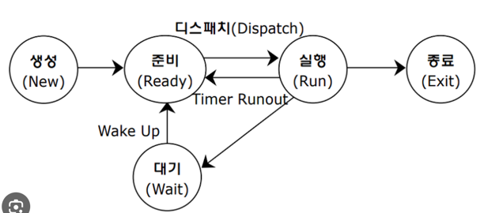

## 11장 응용 SW 기초 기술 활용1

#### 운영체제(OS)
컴퓨터 시스템의 자원들을 효율적으로 관리하며, 사용자가 컴퓨터를 편리하고 효과적으로 사용할 수 있는 환경 제공

#### 운영체제의 목적
- 처리 능력
- 반환 시간
- 사용 가능도
- 신뢰도

#### UNIX 시스템의 구성
1) 커널(Kernel)
2) 쉘(Shell)

#### Linux
리누스 토발즈가 UNIX 기반으로 개발한 운영체제.

#### Android
구글사 에서 개발한 리눅스 커널 기반의 개방형 모바일 운영체제

#### 기억장치 관리 - 배치 전략
- 최초 적합
- 최적 적합
- 최악 적합

#### 가상 기억 장치
보조기억장치의 일부를 주기억장치처럼 사용하는 것으로 
용량이 작은 주 기억장치를 마치 큰 용량을 가진 것처럼 사용하는 기법  
-> 페이징 기법, 세그먼테이션 기법

#### 페이징 기법
가상기억장치에 보관되어 있는 프로그램과 주기억장치의 영역을 동일한 크기로 나눈 후 
나눠진 프로그램을 동일하게 나눠진 주기억장치의 영역에 적재시켜 실행하는 기법이다. 
프로그램을 일정한 크기로 나눈 단위를 페이지 라고하고, 페이지 크기로 일정하게 나누어진  
주기억장치의 단위를 페이지 프레임이라고 한다. => 고정된 크기로 블록을 나눈다  

#### 세그먼테이션 기법
가상기억장치에 보관되어 있는 프로그램을 다양한 크기의 논리적인 단위로 나눈 후  
주기억장치에 적재시켜 실행시키는 기법이다.  
프로그램을 배열이나 함수 등과 같은 논리적인 크기로 나눈 단위를 세그먼트 라고 한다.  
각 세그먼트는 고유한 이름과 크기를 갖는다. => 가변적 크기로 블록을 나눈다.

### 페이지 교체 알고리즘
페이지 부재가 발생하면 가상기억장치에서 필요한 페이지를 찾아 주기억장치에 적재해야 한다 
이 때 주기억장치의 모든 페이지 프레임이 사용중이면 어떤 페이지 프레임을 선택하여 교체할 것인지를 결정하는 기법 

#### FIFO
Queue 생각 -> 눕혀진 원통이다  
즉 먼저 들어온 페이지가 먼저 교체 된다 
먼저들어온(오래된) 페이지부터 교체한다

#### LRU
Least Recently Used  
최근에 가장 오랫동안 사용하지 않은 페이지를 교체하는 기

#### LFU
Least Frequently Used  
사용 빈도가 가장 적은 페이지를 교체하는 기법 이다 

#### 프로세스
현재 실행중인 프로그램을 의미한다. 

PCB -> 운영체제가 프로세스에 대한 중요한 정보를 저장해 놓는 곳 

#### 프로세스 상태 전이

디스패치 - 준비 상태에서 대기하고 있는 프로세스 중 하나가 프로세스를 할당 받아 실행 상태로 전이 되는 과정  
wake-up - 입,출력 작업이 완료되어 프로세스가 대기 상태에서 준비 상태로 전이되는 과정이다 

#### 스레드 
프로그램의 실행하는 단위. 

### 스케쥴링
프로세스가 생성되고 실행될 때 필요한 시스템의 여러 자원을 해당 프로세스에게 할당하는 작업

#### 비선점 스케줄링 
이미 할당된 CPU 를 다른 프로세스가 강제로 빼앗아 사용할 수 없는 스케줄링 기법이다  
-> 일괄 처리 방식에 적합하다  
-> SJF, 우선순위, HRN, FCFS 알고리즘 

#### 선점 스케줄링
하나의 프로세스가 CPU 를 할당받아 실행하고 있을 때 우선순위가 높은 다른 프로세스가 CPU 를 강제로 빼앗아 사용할
수 있는 스케줄링 기법  

#### FCFS [비선점]
FIFO 준비상태 큐에 도착한 순서에 따라 차례로 CPU 를 할당하는 기법이다.

#### SJF [비선점]
준비상태 큐에서 기다리고 있는 프로세스 들 중에서 실행시간이 가장 짧은 프로세스에게 먼저 CPU를 할당한다

#### HRN [비선점]
대기시간과 서비스 시간을 이용하는 기법 
우선 순위를 계산하여 그 숫자가 가장 높은 것부터 낮은 순으로 우선순위가 부여된다. 
우선순위 계산식 = 대기시간+서비스시간/서비스 시간  
결과 숫자가 높다는 것은, 우선순위를 가진다는 뜻

#### RR [선점형]
Round-Robin 시간 할당량 동안만 실행한 후 실행이 완료되지 않으면 다음 프로세스에게 CPU 를 넘겨주는 기법 
시분할 시스템을 위해 고안된 방식이다.

#### SRT [선점형]
현재 실행중인 프로세스의 남은 시간과 준비상태 큐에 새로 도착한 프로세스의 실행 시간을 비교하여 
가장 짧은 실행 시간을 요구하는 프로세스에게 CPU 를 할당하는 기법 이다.

