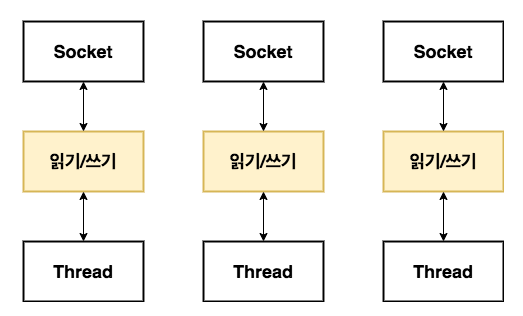
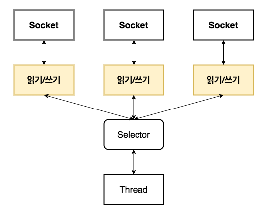
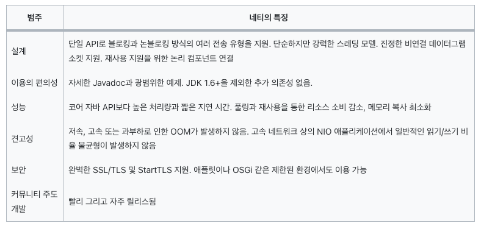

## 1장 네티: 비동기식 이벤트 기반 네트워크 프레임워크
<a href="https://velog.io/@qkrqudcks7/%EB%84%A4%ED%8B%B0-%EC%9D%B8-%EC%95%A1%EC%85%98-1.-%EB%84%A4%ED%8B%B0-%EB%B9%84%EB%8F%99%EA%B8%B0%EC%8B%9D-%EC%9D%B4%EB%B2%A4%ED%8A%B8-%EA%B8%B0%EB%B0%98-%EB%84%A4%ED%8A%B8%EC%9B%8C%ED%82%B9-%ED%94%84%EB%A0%88%EC%9E%84%EC%9B%8C%ED%81%AC">다른사람 정리본(이미지 가져오기 용)</a> <br>

우리가 다뤄야하는 기능 변경의 양과 속도가 날로 증가하면서 기존의 3계층 아키텍쳐로 감당할 수 없는 수준이 됨에 따라 이제는 애플리케이션을 여러 조각으로 나눠서 다수의 시스템으로 구성된 대규모 클러스터로 분산해야 하는 상황에 이르렀다 <br>
이러한 대규모 분산 시스템을 운영하려면 운영 비용과 대기 시간이라는 두 가지 흥미로운 문제를 고려해야 한다.<br>

단일 노드의 성능을 30% 또는 100% 이상으로 개선하면 얼마나 많은 시스템을 줄일 수 있을까?<br>
단일 웹 브라우저에서 다수의 시스템을 통해 십 여개의 내부 원격 프로시저 호출을 트리거할 때 최적의 지연 시간을 달성하려면 어떻게 해야할까? <br>
네티로 고성능 저대기 시간 네트워크 애플리케이션을 구축하는 방법으로 이러한 문제의 해결책을 제시한다 <br>
이 책은 네티를 활용해 효율적이고 재사용 가능하며 유지관리가 용이한 코드를 작성하는 방법을 설명한다 <br>

네티는 고성능 네트워킹 애플리케이션을 제작하기 위한 고급 프레임워크다.<br>
- 네트워킹 전문가가 아니라도 네티로 애플리케이션을 제작할 수 있다.
- 기본 자바 API를 직접 이용하는 것보다 네티를 이용하는 것이 훨씬 쉽다.
- 네티를 이용하면 애플리케이션 논리를 네트워크 레이어로부터 분리하는 등의 바람직한 설계 관행이 촉진된다.

### 자바의 네트워킹
고성능 시스템은 단순히 높은 수준의 코딩 기술 뿐만이 아니라 네트워킹, 멀티스레딩, 동시성을 비롯한 여러 복잡한 분야에 대한 전문 기술을 필요로 하기 때문이다 <br>
네티는 아주 풍부한 네트워킹 툴킷을 제공하며, 이 책의 거의 대부분을 그 기능을 설명하는데 할애 한다 <br>
네티는 궁극적으로 하나의 프레임워크이며, 기술적 내용에 못지 않게 아키텍처상의 접근법이나 설계 원칙도 중요한 요점이다, 따라서 다음 주제도 중요하게 다룬다.
- 관심사의 분리(비즈니스 논리와 네트워크 논리의 분리)
- 모듈성과 재사용성
- 테스트 용이성을 우선 요건으로 취급

최초의 자바 API(java.net) 는 네이티브 시스템 소켓 라이브러리가 제공하는 이르반 블로킹 함수만 지원했다
```java
	public static void main (String[] args) throws IOException {
	ServerSocket serverSocket = new ServerSocket(portNumber); // 포트 연결 수신
	Socket clientSocket = serverSocket.accept(); // accept 호출은 연결될 때 까지 진행을 블로킹

	/* 위 소켓으로부터 스트림 객체를 파생한다 */
	BufferedReader in = new BufferedReader(new InputStreamReader(clientSocket.getInputStream()));
	PrintWriter out = new PrintWriter(clientSocket.getOutputStream(), true);

	String request = in.readLine();
	String response = "";

	while(request !=  null) { // 처리 루프 시작
		if("Done".equals(request))  // 클라이언트가 "Done" 을 전송한 경우 처리 루프 종료
			break;
	}
	response = processReqeust(request); // 요청이 서버의 처리 메소드로 전달
	out.println(response); // 서버의 응답이 클라이언트로 전달
}
```

위 예제는 기본적인 Socket API 패턴의 구현을 보여준다. <br>
위 코드에서 중요한 요점을 보자
- accept() 는 ServerSocket 에서 연결될 때 까지 진행을 블로킹 한다.
- Socket, 입,출력 스트림으로부터 객체 파생
- readLine() 은 줄 바꿈이나, 문자열 읽을 때 까지 진행을 블로킹 한다.
- 클라이언트 요청이 처리된다.

이 코드는 한 번에 한 연결만 처리한다, 다수의 동시 클라이언트 처리를 하려면 새로운 클라이언트 Socket 마다 새로운 Thread 를 할당해야 한다 <br>

위 방식은 동기적 방식으로, 1요청 1응답을 기본으로 한다 <br>
여러 스레드가 입,출력 데이터가 들어오기를 기다리며 무한정 대기 상태로 유지될 수 있다, 즉 리소스 낭비로 이어진다 <br>
또 각 스레드가 스택 메모리를 할당해야 하는데, 운영체제에 따라 다르지만 스택의 기본크기는 64kb ~ 1mb 까지 차지한다 <br>
JVM 이 물리적으로 많은 수의 스레드를 지원하지만, 동시 접속 한계에 이르기 훨씬 전부터 컨텍스트 전화에 따른 오버헤드가 심각한 문제가 될 수 있다 <br>
이러한 동시성 처리 방식도 클라이언트 수가 소,중 규모라면 고려해볼만 하지만, 10만 이상의 동시 연결을 지원해야 할 때는 처음부터 배제하는것이 바람직하다.

#### 자바 NIO
블로킹 시스템 호출 방식 외에도 네이티브 소켓 라이브러리에는 오래전부터 네트워크 리소스 사용률을 세부적으로 제어할 수 있는 논블록킹 호출이 포함돼 있었다 <br>
- setsockopt() 는 데이터가 없을 때, 즉 블로킹 호출이라면 진행을 블로킹할 상황에서 읽기/쓰기 호출이 즉시 반화하도록 소켓을 구성할 수 있다.
- 시스템의 이벤트 통지 API를 이용해 논블록킹 소켓의 집합을 등록하면 읽거나 기록할 데이터가 준비됐는지 여부를 알 수 있다

#### 셀렉터

java.nio.channel.Selector 클래스는 자바의 논블로킹 입출력 구현의 핵심으로서, 논블로킹 Socket 의 집합에서 입출력이 가능한 항목을 지정하기 위해 이벤트 통지 API 를 이용한다 <br>
언제든지 읽기,쓰기 작업의 완료 상태를 확인할 수 있으므로 한 스레드로 여러 동시 연결을 처리할 수 있다. <br>

이 모델은 블로킹 입출력 모델에 비해 훨씬 개선된 리소스 관리 효율을 보여준다.
1) 적은 수의 스레드로 더 많은 연결을 처리할 수 있으므로 메모리 관리와 컨텍스트 전화에 따르는 오버헤드가 감소한다.
2) 입출력을 처리하지 않을 때는 스레드를 다른 작업에 활용할 수 있다.

부하가 높은 상황에서 입출력을 안정적이고 효율적으로 처리하고 호출하는 것과 같이 까다롭고 문제 발생 위험이 높은 일은 네티와 같은 고성능 네트워킹 전문가에게 맡기는게 좋다.

### Netty 소개
높은 수준의 처리량과 규모 가변성을 더 낮은 비용으로 구현해야 한다는 것도 언제나 가장 먼저 손꼽히는 요건이다 <br>
저수준 API 를 직접 이용하면 복잡성이 심화되며, 구하기 어려운 특수한 고급 인력에 대한 의존성이 높아진다는 사실을 알고 있을 것이다 <br>
따라서 기반 구현의 복잡성을 단순한 추상화로 감추는 객체지향의 기본 개념을 도입해야 한다 <br>

이 기본 원칙은 특히 분산 시스템 개발 분야에서 공통적인 프로그래밍 작업을 위한 솔루션을 캡슐화하는 다양한 프레임워크으 개발 동기가 됐다 <br>

네티는 네트워킹 도메인에서 가장 유명한 자바용 프레임워크다. 네티는 사용하기 쉬운 API를 저면에 내세우고 자바의 고급 API로 내부를 무장함으로써 개발자에게 중요한 비즈니스에 집중하게 도와준다.<br>


#### 네티는 누가 사용할까?
파이어베이스, 트위터 등등 대기업에서 고성능 네트워킹 을 하는곳에서 자주 사용된다 <br>
네티가 이렇게 많은 프로젝트에 도입되면서 FTP, SMTP, HTTP, 웹 소캣 과 다양한 프로토콜 구현을 통해 네티의 범위와 유연성이 향상되었다.

#### 비동기식 이벤트 기반 네트워킹
비동기, 즉 동기화되지 않은 이벤트는 사실 우리에게 아주 익숙하다. ex) 이메일 <br>
보낸 메세지의 답장이 올 수도 있지만, 답장이 없는 경우도 있고, 메시지를 보내는 동안 예기치 않은 메세지를 받을 수 있다 <br>
또한 비동기 이벤트는 정도된 관계를 가질 수 있다 <br>
일반적으로 답변은 질문한 사항에 대해서만 받을 수 있고, 답변을 기다리는 동안 다른 일을 할 수도 있다 <br>

비동기성과 확장성은 어떻게 연결돼 있을까?
- 논블로킹 네트워크 연결은 작업 완료를 기다릴 필요가 없게 해준다.
- 셀렉터는 적은 수의 스레드로 여러 연결에서 이벤트 모니터링할 수 있게 해준다.

즉, 논블록킹 입출력은 블록킹 입출력 방식보다 더 많은 이벤트를 훨씬 빠르게 경제적으로 처리할 수 있다 <br>
이것은 네트워킹 관점에서 우리가 구축하려는 시스템의 핵심이며, 네티 설계의 핵심이기도 하다.

### Netty 핵심 컴포넌트
네티에서 말하는 컴포넌트는 자바 클래스보다는 도메인 객체라고 생각하자 <br>
- Channel
- 콜백 (Callback)
- Future
- Event & Handler

위 구성요소는 리소스, 논리, 알림이라는 각기 다른 종류의 구조를 나타낸다.

#### Channel
channel 은 자바 NIO 의 기본구조이다.
> 하나 이상의 입출력 작업(읽기,쓰기)을 수행할 수 있는 하드웨어 장치,파일, 네트워크 소켓, 프로그램 컴포넌트와 같은 엔티티에 대한 열린 연결

일단 Channel 을 들어오는(인바운드) 데이터와 나가는(아웃바운드) 데이터를 위한 운송수단이라고 생각하자, Channel 은 열거나 닫고, 연결하거나 연결을 끊을 수 있다.

#### 콜백
콜백은 간단히 말해 다른 메소드로 자신에 대한 참조를 제공할 수 있는 메소드다 <br>
다른 메소드에서는 이 참조가 가리키는 메소드를 필요할 때 호출할 수 있다, 콜백은 광범위한 프로그래밍 상황에 이용되며 관심 대상에게 작업 완료를 알리는 가장 일반적인 방법중 하나이다 <br>

네티는 이벤츠를 처리할 때 내부적으로 콜백을 이용한다. 콜백이 트리거되면 ChannelHandler 인터페이스의 구현을 통해 이벤트를 처리할 수 있다
```java
class ConnectHandler extends ChannelInboundHandlerAdapter {

	@Override
	public void channelActive (ChannelHandlerContext ctx) throws Exception { // 새로운 연결이 이뤄지면 channelActive 가 호출된다.
		super.channelActive(ctx);
		System.out.println("Client" + ctx.channel().remoteAddress() + " connected");
	}

}
```

#### Future
Future 는 작업이 완료되면 이를 애플리케이션에서 알리는 한 방법이다 <br>
이 객체는 비동기 작업의 결과를 담는 자리표시자 역할을 하며, 미래의 어떤 시점에 작업이 완료되면 그 결과에 접근할 수 있게 해준다<br>

JDK 는 java.util.concurrent.Future 인터페이스를 제공하지만, 제공되는 구현에는 수동으로 작업 완료 여부를 확인하거나 완료되기 전까지 블로킹 하는 기능만 있다 <br>
그래서 네티는 비동기 작업이 실행됐을 때 이용할 수 있는 자체 구현 ChannelFuture 를 제공한다.<br>

ChannelFuture 에는 ChannelFutureListener 인스턴스를 하나 이상 등록할 수 있는 추가 메소드가 있다 <br>
작업이 완료되면 리스너의 콜백 메소드인 operationComplete() 가 호출되며, 이 시점에 리스너는 작업이 정상 완료인지, 오류인지 확인할 수 있다 <br>
즉 ChannelFutureListener 가 제공하는 알림 메커니즘을 이용하면 작업 완료를 수동으로 검사할 필요가 없다 <br>

네티의 모든 아웃바운드 입출력 작업은 ChannelFuture 를 반환하며 진행을 블로킹하는 작업은 없다, 네티는 기본적으로 비동기식이며, 이벤트 기반이다 <br>

```java
import java.net.InetSocketAddress;

Channel channel = ...;
// 블로킹 하지 않음
ChannelFuture future = channel.connect(new InetSocketAddress("192.168..0.1",25)); // 원격 피어에 대한 비동기 연결
```

```java
		Channel channel = ...;
		ChannelFuture future = channel.connect(new InetSocketAddress("192.168.0.1",25));
		future.addListener(new ChannelFutureListener() {

			@Override
			public void operationComplete (ChannelFuture channelFuture) throws Exception {
				if(channelFuture.isSuccess()) {
					// 작업이 성공적인 경우 데이터를 저장할 ByteBuf 생성
				} else {
					Throwable cause = future.cause(); // 오류 원인 접근
					cause.printStackTrace();
				}
			}
		});
```

위 코드는 콜백을 이용하는 방법이다

#### 이벤트와 핸들러
네티는 작업의 상태 변화를 알리기 위해 고유한 이벤트를 이용하며, 발생한 이벤트를 기준으로 적절한 동작을 트리거 할 수 있다 <br>
- 로깅
- 데이터 변환
- 흐름 제어
- 애플리케이션 논리

네티는 네트워크 프레임워크이므로 이벤트 역시 인바운드 또는 아웃바운드 데이터 흐름에 대한 연관성을 기준으로 분류된다 <br>
인바운드 데이터나 연관된 상태 변화로 트리거되는 이벤트는 다음을 포함한다 <br>
- 연결 활성화 또는 비활성화
- 데이터 읽기
- 사용자 이벤트
- 오류 이벤트

아웃바운드 이벤트는 미래에 한 동작을 트리거하는 작업의 결과다
- 원격 피어로 연결 열기 또는 닫기
- 소켓으로 데이터 쓰기 또는 flush

**트리거: 자동으로 실행되는 동작이나 기능을 의미** <br>
모든 이벤트는 핸들러 클래스의 사용자 구현 메소드로 전달할 수 있다 <br>
이것은 이벤트 기반 패러다임이 직접적으로 애플리케이션 구성요소로 변환되는 좋은 사례다 <br>
네티는 핸들러의 기본 추상화를 제공한다, 지금은 각 핸들러 인스턴스가 특정 이벤트에 반응해 실행되는 일종읰 콜백이라고 이해하면 된다 <br>
네티는 HTTP 및 SSL/TLS 같은 프로토콜용 핸들러를 비롯해 곧바로 이용할 수 있는 미리 정의된 핸들러를 광범위하게 제공한다 <br>
ChannelHandler 는 내부적으로 이벤트와 Future 를 이용하므로 여러분의 애플리케이션에 적용할 일부 추상화에 대한 소비자가 된다.