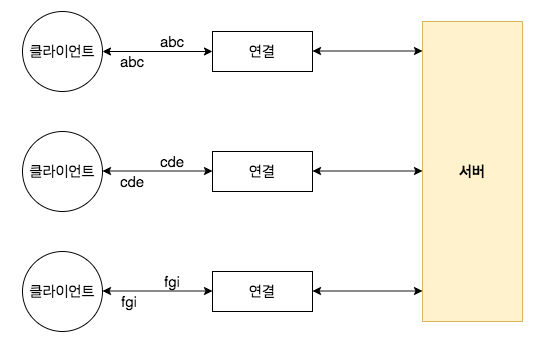

## 2장-첫 번째 네티 어플리케이션
- 개발 환경 설정
- Echo 서버와 클라이언트 만들기
- 애플리케이션 빌드의 테스트

이번 장에서는 클라이언트가 서버로 메시지를 전송하면 서버가 이 메시지를 반향 출력하는 간단한 예제이다 <br>

### 네티 클라이언트/서버 개요

Echo 클라이언트와 서버의 개략적인 구조가 나온다.물론 아직까지 초점은 브라우저에서 접근 가능한 웹 기반 애플리케이션을 작성하는것이지만 <br>
클라이언트와 서버를 모두 구현 해보면 네티 API 를 더 완전하게 이해할 수 있다<br>

그림을 보면 다수의 클라이언트가 1개의 서버에 동시에 서버로 연결하고 응답을 받는 것을 볼수 있다 <br>
지원되는 클라이언트의 수는 이론상으로 이용 가능한 시스템 리소스의 양과 JDK 버전에 따른 제약 조건에 의해서만 제한된다 <br>
Echo 클라이언트와 서버 간의 상호작용은 아주 간단하다 <br>
클라이언트가 서버로 연결하고 메시지를 하나 이상 서버로 전송하면 서버가 이 메시지를 다시 클라이언트로 반향 출력한다 <br>

### Echo 서버 만들기
모든 네티 서버에는 다음 항목이 필요하다
- 하나 이상의 ChannelHandler: 이 컴포넌트는 클라이언트로부터 받은 데이터를 서버측에서 처리하는 비즈니스 논리를 구현한다.
- 부트스트랩: 서버를 구성하는 시동 코드를 의미한다. 최소한 서버가 연결 요청을 수신하는 포트를 서버와 바인딩하는 코드가 있어야 한다

#### ChannelHandler 와 비즈니스 논리
이벤트 알림을 받고 반응하는 구현의 인터페이스의 부모에 해당하는 ChannelHandler 에 대해서도 알아봤다 <br>
Netty 애플리케이션에서 모든 데이터 처리 논리는 이러한 핵심 추상화의 구현에 포함된다 <br>

Echo 서버는 들어오는 메시지에 반응해야 하므로 인바운드 이벤트에 반응하는 메소드가 정의되 ChannelInboundHandler 인터페이스를 구현해야 한다 <br>
이 어플리케이션은 소수의 메소드를 이용하는 간단한 애플리케이션 이므로 ChannelInboundHandler 의 기본 구현을 제공하는 ChannelInboundHandlerAdapter 의 하위 클래스를 만드는 것으로 충분하다
- channelRead() : 메시지가 들어올 때마다 호출된다
- channelReadComplete() : channelRead()의 마지막 호출에서 현재 일괄 처리의 마지막 메시지를 처리했음을 핸들러에 통보한다.
- exceptionCaught() : 읽기 작업 중 예외가 발생하면 호출된다.

```java
@ChannelHandler.Sharable
public class EchoServerHandler extends ChannelHandlerAdapter {

	@Override
	public void channelRead (ChannelHandlerContext ctx, Object msg) throws Exception {
		ByteBuf in = (ByteBuf) msg;
		System.out.println("Server received: " + in.toString(CharsetUtil.UTF_8)); // 메시지를 콘솔에 로깅
		ctx.write(in);
	}

	@Override
	public void channelReadComplete (ChannelHandlerContext ctx) throws Exception {
		ctx.writeAndFlush(Unpooled.EMPTY_BUFFER) // 대기 중인 메시지를 원격 피어로 flush 하고 채널을 닫음
			.addListener(ChannelFutureListener.CLOSE);
	}

	@Override
	public void exceptionCaught (ChannelHandlerContext ctx, Throwable cause) throws Exception {
		cause.printStackTrace(); // 예외 스택 추적 출력
		ctx.close(); // 채녈 닫음
	}

}
```

ChannelHandlerAdapter API는 직관적이므로 손쉽게 각 메소드를 재정의해 이벤트 수명주기에서 원하는 시점을 후크할 수 있다<br>
여기서는 수신한 데이터를 모두 처리해야 하므로 channelRead() 를 재정의한다. 이 서버는 단순히 데이터를 원격 피어로 반향 출력하다 <br>

exceptionCaught() 을 재정의하면 모든 Throwable 하위 형식에 반응할 수 있는데, 여기서는 간단히 예외를 로깅하고 연결을 닫는다 <br>
정교한 애플리케이션이라면 예외로부터 복구하는 작업을 할 수 있지만, 원격 피어에 오류 발생을 알리는 데는 단순히 연결을 닫는 정도로 충분하다<br>

- ChannelHandler 는 4가지 이벤트 유형에 의해 호출된다 <br>
- 애플리케이션은 ChannelHandler 를 구현하거나 확장해 이벤트 수명주기를 후크하고 커스텀 애플리케이션 논리를 제공한다.
- 아키텍처 관점에서 ChannelHandler 는 비즈니스 논리를 네트워킹 코드로부터 분리하도록 도와준다.

#### 서버 부트스트랩
- 서버가 수신할 포트를 바인딩하고 들어오는 연결 요청을 수락한다.
- EchoServerHandler 인스턴스에 인바운드 메시지에 대해 알리도록 Channel 을 구성한다.

**전송**<br>
네트워킹 프로토콜의 표준 및 다중 레이어 관점에서 전송 레이어는 종단 간 또는 호스트 간 통신용 서비스를 제공하는 레이어다 <br>
인터넷 통신은 TCP 전송에 기반을 둔다. NIO 전송은 TCP 와 거이 동일하지만 자바 NIO 구현을 통해 서버 측 성능 향상을 제공한다는 점에 차이가 있다 <br>

```java
public class EchoServer {
	private final int port;

	public EchoServer (int port) {
		this.port = port;
	}

	public static void main (String[] args) {
		if(args.length != 1) {
			System.err.println("Usage: " +EchoServer.class.getSimpleName() + " <port>");
		}
		int port = Integer.parseInt(args[0]);
		new EchoServer(port).start();
	}
	
	private void start() throws Exception {
		final EchoServerHandler serverHandler = new EchoServerHandler();
		EventLoopGroup group = new NioEventLoopGroup(); // EventLoopGroup 을 생성한다.
		try {
			ServerBootstrap b = new ServerBootstrap(); // ServerBootstrap 생성
			b.group(group)
				.channel(NioServerSocketChannel.class) // NIO 전송 채널을 이용하도록 설정
				.localAddress(new InetSocketAddress(port)) // 지정된 포트를 이용해 소켓 주소를 설정
				.childHandler(new ChannelInitializer<SocketChannel>() { // EchoServerHandler 하나를 채널의 Channel Pipeline 으로 추가

					@Override
					protected void initChannel (SocketChannel ch) throws Exception {
						ch.pipeline().addLast(serverHandler); //@Sharable 이므로 동일한 항목을 이용할 수 있음
					}
				});
			ChannelFuture f = b.bind().sync(); // 서버를 비동기 식으로 바인딩, 바안딩이 완료되기 까지 대기
			f.channel().closeFuture().sync(); // 채널의 CloseFuture 를 얻고 완료될 때까지 현재 스레드를 블로킹
		} finally {
			group.shutdownGracefully().sync(); // EventLoopGroup 을 종료하고 모든 리소스를 해체 한다.
		}
		
	}

}

```

NIO 는 확장성을 갖추고 있지만, 특히 멀티스레딩 관련 사항을 올바르게 구성하기는 쉽지 않다. <br>
네티의 설계는 복잡한 부분을 거의 캡슐화한다 <br>

이 예제에 NIO 를 이용한 이유는 확장성과 완전 비동기성 덕분에 가장 널리 이용되는 전송이기 때문이다


### Echo 클라이언트 만들기
- 서버로 연결한다
- 메시지를 하나 이상 전송한다
- 메시지마다 대기하고 서버로부터 동일한 메시지를 수신한다
- 연결을 닫는다.

클라이언트를 작성하려면 앞서 서버에서 작성한 두 주요 코드(비즈니스 논리와 부트스트랩을) 다시 작성해야 한다<br>

#### ChannelHandler 를 이용한 클라이언트 논리 구현
서버와 비슷하게 클라이언트에도 데이터를 처리할 ChannelInboundHandler 가 있다.<br>
이번에는 SimpleChannelInboundHandler 클래스를 확장해 필요한 작업을 모두 처리한다, 이를 위해서 다음 메소드를 재정의 해야한다.
- channelActive(): 서버에 대한 연결이 만들어지면 호출된다.
- channelRead(): 서버로부터 메시지를 수신하면 호출된다.
- exceptionCaught(): 처리 중에 예외가 발생하면 호출된다. 

```java
@ChannelHandler.Sharable // 이 클래스의 인스턴스를 여러 채널에서 공유할 수 있음을 나타냄
public class EchoClientHandler extends SimpleChannelInboundHandler<ByteBuf> {
	@Override
	protected void messageReceived (ChannelHandlerContext ctx, ByteBuf msg) throws Exception {
		
	}

	//INFO: 채널 활성화 알림을 받으면 메시지를 전송
	@Override
	public void channelActive (ChannelHandlerContext ctx) throws Exception {
		ctx.writeAndFlush(Unpooled.copiedBuffer("Netty rocks!", CharsetUtil.UTF_8));
	}

	//INFO: 수신한 메시지의 덤프를 로깅
	public void channelRead (ChannelHandlerContext ctx, ByteBuf in) throws Exception {
		System.out.println("Client received: " + in.toString(CharsetUtil.UTF_8));
	}

	//INFO: 예외 시 오류를 로깅하고 채널을 닫음
	@Override
	public void exceptionCaught (ChannelHandlerContext ctx, Throwable cause) throws Exception {
		cause.printStackTrace();
		ctx.close();
	}

}
```

우선 연결이 만들어지면 호출되는 channelActive() 를 재정의한다 <br>
이것은 서버로 최대한 빨리 무언가를 전송하기 위해서인데, 여기서는 Netty rocks 라는 문자열을 인코딩한 바이트 버퍼를 전송한다<br>

데이터를 수신할 때 마다 호출되는 channelRead() 메소드를 재정의한다 <br>
주의할 점은 서버가 전송한 메세지가 여러 청크로 수신될 수 있다는 점이다 <br>
TCP 는 스트림 기반 프로토콜 이므로 서버가 보낸 순서대로 바이트를 수신할 수 있게 보장한다 <br>

exceptionCaught() 는 Throwable 을 로깅하고 채널을 닫으며 서버에 대한 연결을 종료한다

#### 클라이언트 부트스트랩
서버는 수신포트로 바인딩하는 대신 원격주소로 연결하기 위한 호스트와 포트 매개변수를 이용한다는 점이있다 <br>
```java
public class EchoClient {
	private final String host;
	private final int port;

	public EchoClient (String host, int port) {
		this.host = host;
		this.port = port;
	}
	
	public void start() throws InterruptedException {
		EventLoopGroup group = new NioEventLoopGroup();
		
		try {
			Bootstrap b = new Bootstrap(); //부트스트랩을 생성
			b.group(group) // 클라이언트 이벤트를 처리할 EventLoopGroup 지정, NIO 구현
				.channel(NioSocketChannel.class) // 채널 유형으로 NIO 전송 유형 중 하나를 지정
				.remoteAddress(new InetSocketAddress(host, port)) // 서버의 InetSocketAddress 설정
				.handler(new ChannelInitializer<SocketChannel>() { // 채널이 생성될 때 파이프라인에 EchoClientHandler 하나를 추가

					@Override
					protected void initChannel (SocketChannel ch) throws Exception {
						ch.pipeline().addLast(new EchoClientHandler());
					}
				});
			ChannelFuture f = b.connect().sync(); // 원격 피어로 ㅇ녀결하고 연결이 완료되기를 기다림
			f.channel().closeFuture().sync(); // 채널이 닫힐 때 까지 블로킹
		} finally {
			group.shutdownGracefully().sync(); // 스레드 풀을 종료하고 모든 리소스를 해체
		}
	}

	public static void main (String[] args) throws InterruptedException {
		if(args.length != 2) {
			System.err.println("Usage: " + EchoClient.class.getName() + " <host> <port>");
			return ;
		}
		String host = args[0];
		int port = Integer.parseInt(args[1]);
		new EchoClient(host,port).start();
	}

}
```

이전과 마찬가지로  이번에도 NIO 전송을 이용한다. 클라이언트와 서버에 각기 다른 전송을 이용해도 된다. <br>
예를들어 서버 측에는 NIO 전송을 이용하고 클라이언트 측에는 블록킹 전송을 이용할 수 있다<br>
각각 특정한 전송이 유리한 상황이 있다

- 클라이언트를 초기화하기 위한 BootStrap 인스턴스를 생성한다.
- 새로운 연결을 생성하고 인바운드와 아웃바운드 데이터를 처리하는 것을 포함하는 이벤트 처리를 제어할 NioEventLoopGroup 인스턴스를 만들고 할당한다. 


### Echo 서버와 클라이언트의 빌드와 실행
이 어플리케이션은 아주 단순하지만 수천개의 동시 연결을 지원할 수 있으며, 일반적인 소켓 기반 자바 어플리케이션보다 훨씬 많은 초당 메시지 수를 처리할 수 있다 <br>
네티는 비즈니스 논리를 네트워킹 논리로부터 분리하기 위한 적절한 추상화를 제공함으로써 시스템의 안정성을 저해하지 않고 빠르게 변하는 요건에 맞게 시스템을 개발할 수 있게 해준다 <br>