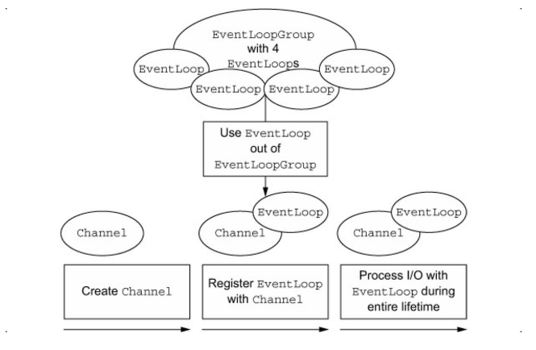
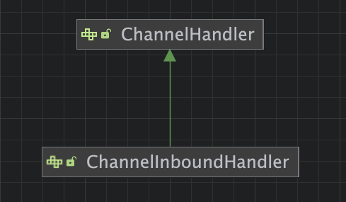
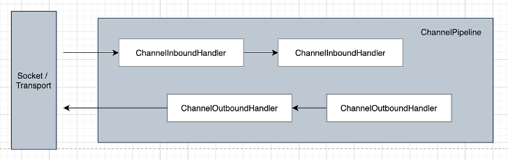

## 3장 - 네티 컴포넌트와 설계
- 네티의 기술 및 아키텍쳐 측면
- Channel, EventLoop, ChannelFuture
- ChannelHandler 와 ChannelPipeline
- BootStrap

넓게 보면, 네티는 우리가 기술과 아키텍쳐라고 광범위하게 이야기하는 두 관심 영역의 문제를 모두 해결한다 <br>
1) 자바 NIO 기반의 비동기식 이벤트 기반 구현을 이용해 고부하 조건에서도 애플리케이션 성능과 확장성을 최대한 보장한다.
2) 네티는 어플리케이션 논리를 네트워크 레이어로부터 분리하는 다양한 설계 패턴을 활용해 코드의 테스트 용이성, 모듈성, 재사용성을 극대화해 개발을 간소화 한다.


### Channel, EventLoop, ChannelFuture
- Channel: 소켓(Socket)
- EventLoop: 제어흐름,멀티스레딩,동시성 제어
- ChannelFuture: 비동기 알림

위 요소 들은 정말 중요하다. 네티의 네트워킹 추상화를 대표한다고 할 수 있다. 

#### Channel 인터페이스
소켓이라고 생각하면 되나? <br>
**기본 입출력 작업( bing(), connect(), read(), write() ) 은 기본 네트워크 전송에서 제공하는 기본형 파이프라인을 이용한다 <br>**
자바 기반 네트워크에서 기본 구조는 Socket 클래스다. <br>
네티의 Channel 인터페이스는 Socket 으로 직접 작업할 때의 복잡성을 크게 완하하는 API 를 제공한다<br>
또한 Channel 은 다수의 미리 정의된 특수한 구현을 포함하는 광범위한 클래스 계층의 루트이다

```java
import java.io.IOException;
import java.net.Socket;
import java.nio.channels.Channel;

Socket socket = new Socket(); // 이 방식은 별로다
Channel channel = new Channel(); // 네티의 채널==소켓 이므로 채널 방식을 이용하면 더 좋다.
```

- Embeddablechannel
- LocalServerChannel
- NioDatagramChannel
- NioSctpChannel
- NioSocketChannel

등이 있다.

#### EventLoop 인터페이스
**EventLoop 는 연결의 수명주기 중 발생하는** 이벤트를 처리**하는 네티의 핵심 추상화를 정의한다<br>**
EventLoop 에 대해서는 7장의 네티의 스레드 처리 모델을 설명하면서 더 자세하게 다룬다 <br>


- EventLoopGroup 안에는 한 개 이상의 EventLoop 를 포함한다.
- 한 EventLoop 는 수명주기 동안 한 Thread 로 바인딩 된다.
- 한 EventLoop 에서 처리되는 모든 입출력 이벤트는 해당 전용 Thread 로 처리된다.
- 한 Channel 은 수명주기 동안 한 EventLoop 에 등록할 수 있다.
- 한 EventLoop 를 하나 이상으 Channel 로 할당할 수 있다.

이 설계에서는 한 Channel 의 입출력이 동일한 Thread 에서 처리되므로 동기화가 사실상 필요 없다.

#### ChannelFuture 인터페이스
네티의 모든 입출력 작업은 비동기적이다. 즉 작업이 즉시 반환되지 않을 수 있으므로 나중에 결과를 반환하는 방법이 필요하다 <br>
이를 위해 네티는 ChanelFuture 를 제공하며, 이 인터페이스의 `addListener()` 메소드는 작업이 완료되면 (성공 여부와 관계없이) 알림을 받을 `ChannelFutureListener` 하나를 등록한다. <br>

ChannelFuture 는 미래에 실행될 작업의 결과를 위한 자리표시자라고 생각할 수 있다
실행되는 시점의 여러 요소에 의해 좌우되므로 정확한 시점을 예측하기는 불가능하지만 실행된다는 점은 확실하다 <br>

### ChannelHandler 와 ChannelPipeline
애플리케이션 개발자의 관점에서 네티의 핵심 컴포넌트는 인바운드와 아웃바운드 데이터의 처리에 적용되는 모든 애플리케이션 논리의 컨테이너 역할을 하는 ChannelHandler 다<br>
이것이 가능한 이유는 ChannelHandler 의 메소드가 네트워크 이벤트에 의해 트리거되기 때문이다 <br>
실제로 ChannelHandler 는 데이터를 포맷으로 변환하거나 작업 중 발생한 예외를 처리하는 등 거의 모든 종류의 작업에 활용할 수 있다 <br>

한 예로 우리가 자주 구현하는 하위 인터페이스인 ChannelInboundHandler 가 있다 <br>
이 형식은 어플리케이션의 비즈니스 논리에 의해 처리되는 데이터와 인바운드 이벤트를 수신한다 <br>
연결된 클라이언트로 응답을 전송할 때 ChannelInboundHandler 에서 데이터를 flush 할 수도 있다 <br>
애플리케이션 비즈니스 논리는 하나 이상의 ChannelInboundHandler 에 포함되는 경우가 많다 <br>

#### ChannelPipeline 인터페이스
ChannelPipeline 은 ChannelHandler 체인을 위한 컨테이너를 제공하며, 체인 상에서 인바운드와 아웃바운드 이벤트를 전파하는 API 를 정의한다 <br>
Channel 이 생성되면 여기에 자동으로 자체적인 ChannelPipeline 이 할당된다, 즉 ChannelHandler 는 ChannelPipeline 안에 설치가 된다 <br>

ChannelHandler 는 광범위한 용도를 지원할 수 있게 특별히 설계됐으며, ChannelPipeline 을 통해 오가는 이벤트(데이터 포함)을 처리하는 모든 코드를 위한 범용 컨테이너라고 할 수 있다<br>

ChannelHandler 로부터 파생된 ChannelInboundHandler, ChannelOutboundHandler 가 있다.

파이프라인을 통해 이벤트를 이동하는 역할은 애플리케이션의 부트스트랩 단계나 초기화 중에 설치된 ChannelHandler 가 담당한다 <br>
이들 객체는 이벤트를 수신하고, 구현된 처리 논리를 실행하며, 체인 상의 다음 핸들러로 데이터를 전달한다. 실행되는 순서는 추가된 순서에 의해 결정된다

클라이언트는 애플리케이션의 관점에서, 클라이언트에서 서버로 움직이는 이벤트는 아웃바운드이며, 그 반대는 인바운드다.<br>
위 사진을 보면 인바운드와 아웃바운드 핸들러를 동일한 파이프라인에서 설치했음을 체크할 수 있다<br>

아웃바운드와 인바운드 작업이 서로 다르다는 것을 감안할 때, 동일한 ChannelPipeline 안에 두 가지 핸들러 범주가 혼합돼 있으면 어떻게 되는지 궁금할 것이다 <br>
인바운드와 아웃바운드 핸들러는 모두 ChannelHandler 를 확장하지만, 네티는 ChannelInboundHandler, ChannelOutboundHandler 의 구현을 구분한다 <br>
그리고 핸들러 간의 데이터 전달이 동일한 방향으로 수행되도록 보장한다<br>

Netty 에서 메세지를 보내는 데는 Channel 에 직접 기록하거나 ChannelHandler 와 연결된 ChannelHandlerContext 객체에 기록하는 두 가지 방법이 있다 <br>

#### ChannelHandler 에 대한 고찰
ChannelHandler 에는 다양한 종류가 있고, 각 기능은 상위 클래스가 무엇인지에 따라 많이 결정된다 <br>
Netty 는 어플리케이션의 처리 논리를 쉽게 개발할 수 있게 어댑터 클래스 형태로 여러 기본 핸들러의 구현을 제공한다 <br>
파이프라인의 각 ChannelHandler 는 이벤트를 체인의 다음 핸들러로 전달해야 하는데, 이러한 어댑터 클래스(및 해당 상위 클래스)는 이 작업을 자동으로 해주므로 특수한 동작이 필요한 메소드와 이벤트만 재정의할 수 있다<br>

어댑터를 이용하는 이유? <br>
해당하는 인터페이스에 정의된 모든 메소드의 기본 구현을 제공하므로 최소한의 노력으로 ChannelHandler 를 작성할 수 있게 해주는 어댑터 클래스가 여러개 있다 <br>
커스텀 핸들러를 만들 때 자주 이용하는 어댑터
- ChannelHandlerAdapter
- ChannelInboundHandlerAdapter
- ChannelOutboundHandlerAdapter
- ChannelDupleHandlerAdapter

다음으로 ChannelHandler 의 하위 클래스인 인코더와 디코더, 그리고 ChannelInboundHandlerAdapter 를 알아본다

#### 인코더와 디코더
Netty 로 메시지를 전송하거나 수신할 때는 데이터를 변화해야 한다 <br>
인바운드 메시지는 byte 에서 다른 포맷으로 변환되는 **디코딩**을 거친다 <br>
아웃바운드 메시지는 반대로 현재 포맷에서 byte 로 **인코딩** 된다<br>
이러한 두 가지 변환이 필요한 이유는 네트워크 데이터는 반드시 연속된 바이트여야 하기 때문이다 <br>

그래서 원하는 기능에 따라 이용할 수 있는 다양한 인코더와 디코더의 추상 클래스가 제공된다 <br>
ex) 애플리케이션이 메세지를 즉시 바이트로 변환할 필요가 없는 중간 포맷을 사용하는 경우가 있다 <br>
인코더는 여전히 필요하지만 다른 상위 클래스에서 파생된다<br>
예를 들어 기본 클래스의 이름은 ByteToMessageDecoder, 또는 MessageToByteEncoder 와 비슷하게 지정할 수 있다 <br>
ex) 기본 클래스 이름 `ByteToMessageDecode`, `MessageToByteEncoder` 처럼 비슷하게 생성 <br>

엄밀히 말해 다른 해들러로 인코더와 디코더의 역할을 할 수도 있지만, 채널 핸들러를 쉽게 만들 수 있게 어댑터 클래스가 있는 것처럼, 네티가 제공하는 모든 인코더/디코더 어댑터 클래스는
ChannelInboundHandler 나 ChannelOutboundHandler 를 구현한다 <br>

인바운드 데이터의 경우 인바운드 Channel 에서 읽는 각 메시지에 대해 호출되는 ChannelRead 메소드/이벤트를 재정의한다 <br>
이 메소드는 제공된 디코더의 decode() 메소드를 호출하고, 디코딩 된 바이트를 파이프라인의 다음 ChannelInboundHandler 로 전달한다<br>
아웃바운드 메시지를 위한 패턴은 반대이며, 인코더가 메시지를 바이트로 변환한 후 다음 ChannelOutboundHandler 로 전달한다<br>

#### SimpleChannelInboundHandler 추상 클래스
애플리케이션에서는 디코딩된 메세지를 수신하고 데이터에 비즈니스 논리를 적용하는 핸들러를 많이 이용한다 <br>
이러한 ChannelHandler 를 만들려면 기본 클래스인 SimpleChannelInboundHandler<T> 를 확장하면 된다 <br>
이 핸들러에서 기본 클래스의 메소드를 하나이상 재정의하고 모든 핸들러 메소드에 입력 인수로 전달되는 ChannelHandlerContext에 대한 참조를 얻는다<br>

이 유형의 핸들러에서 가장 중요한 메소드는 channelRead(ChannelHandlerContext,T) 이며, 이 메소드는 개발자가 원하는 대로 구현할 수 있지만 <br>
현재 입출력 스레드를 블로킹하지 않아야 한다는 요건이 있다.

### 부트스트랩
Netty 의 부트스트랩 클래스는 프로세스를 지정된 포트로 바인딩하거나 프로세스를 지정된 호스트의 지정된 포트에서<br>
실행중인 다른 호스트로 연결하는 등의 일을 하는 애플리케이션의 네트워크 레이어를 구성하는 컨테이너를 제공한다 <br>

일반적으로, 전자의 사용 사례를 서버 부트스트랩 이라고 하며, 후자를 클라이언트 부트스트랩 이라고 한다 <br>
> 연결기반 프로토콜
> > 엄격하게 말해 연결이라는 용어는 연결된 엔드포인트 간에 정렬된 메시지 전달을 보장하는 TCP와 같은 연결 기반 프로토콜에만 적용할 수 있다는 것을 알아두자

따라서 부트스트랩에는 클라이언트용과 서버용의 두 가지 유형이 있다 <br>
애플리케이션이 사용하는 프로토콜이나 수행하는 데이터 처리의 유형과는 관계없이 클라이언트나 서버로서 수행하는 기능에 따라 어떤 부트스트랩 클래스를 사용할지 결정된다<br>

서버는 연결 요청을 수신해야 하므로 포트로 바인딩하는 ServerBootstrap 을 사용하지만, <br>
클라이언트는 원격 피어로 연결해야 하므로 Bootstrap 을 이용한다 <br>

클라이언트를 부트스트랩하는 데는 EventLoopGroup 하나가 필요하지만 서버를 부트스트랩할 때는 ServerBootstrap 두개가 필요하다 <br>
서버는 각기 다른 Channel 의 두 집합을 필요로 한다<br>
1) 로컬 포트로 바인딩된 서버 자체의 수신 소켓을 나타내는 ServerChannel
2) 서버가 수락한 연결마다 하나씩 들어오는 클라이언트 연결을 처리하기 위해 생성된 모든 Channel 을 포함한다.

ServerChannel 과 연결된 EventLoopGroup 은 들어오는 연결 요청에 대해 Channel 을 생성하는 역할을 EventLoop 하나에 할당한다 <br>
연결이 수락되면 두 번째 EventLoopGroup 이 해당 Channel 에 EventLoop 를 할당한다.<br>