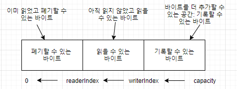

## 5장 - ByteBuf
- ByteBuf: 네티의 데이터 컨테이너
- API 세부사항
- 사용 사례
- 메모리 할당

네트워크 데이터의 기본 단위는 항상 **바이트** 이다 <br>
자바 NIO 는 ByteBuffer 라는 자체 바이트 컨테이너를 제공하지만 이 클래스는 사용법이 너무 복잡해 사용하기 부담스럽다 <br>

네티에는 ByteBuffer 를 대신해 JDK API 제약을 해결하고, 더 나은 API 를 제공하는 ByteBuf 가 있다 <br>

### ByteBuf API
네티는 데이터 처리를 위한 API 를 ByteBuf 추상 클래스와 ByteBufHolder 인터페이스라는 두 컴포넌트를 통해 노출한다 <br>
ByteBuf API의 장점
- 사용자 정의 버퍼 형식으로 확장할 수 있음
- 용량을 필요에 따라 확장할 수 있음(JDK StringBuilder 와 비슷)
- 읽기와 쓰기에 고유 인덱스를 적용함
- 메소드 체인이 지원됨
- 참조 카운팅이 지원됨

### ByteBuf 클래스: 네티의 데이터 컨테이너
모든 네트워크 통신은 직접 다루기 까다로운 바이트의 시퀀스를 주고받는 방식으로 이뤄지므로 효율적이고 사용하기 쉬운 데이터 구조가 반드시 필요하다 <br>
네티의 ByteBuf 구현을 이용하면 이러한 요건을 충족할 수 있다 <br>

#### 작동 방식
ByteBuf 는 읽기와 쓰기를 위한 고유한 두 인덱스를 유지한다 <br>
ByteBuf 에서 데이터를 읽으면 ByteBuf 의 readerIndex 가 읽은 바이트 수만큼 증가한다 <br>
비슷하게 ByteBuf 에 데이터를 기록하면 writeIndex 가 증가한다.

두 인덱스 간의 관계를 이해하려면 readerIndex 가 writeIndex 와 같은 값이 될 때 까지 바이트를 읽으면 어떻게 되는지 먼저 생각해봐야 한다 <br>
ByteBuf 메소드 중 이름이 read 나 write 로 시작하는 메소드는 해당 인덱스를 증가시킨다 <br>
set,get 으로 시작하는 메소드는 인덱스를 증가시키지 않고, 메소드의 인수로 전달한 상대 인덱스를 기준으로 작업한다 <br>

ByteBuf 의 최대 용량을 지정할 수 있지만 쓰기 인덱스를 용량보다 크게 지정하려고 하면 예외가 트리거 된다 <br>

#### ByteBuf 사용 페턴
네티를 이용하는 동안 ByteBuf 의 몇가지 공통적인 사용 패턴을 접하게 된다, 읽기 쓰기 접근을 제어하는 고유 인덱스가 포함된 바이트의 배열 구조를 기억하면 도움이 된다

#### 힙 버퍼 패턴
보조 배열 이라고 하는 가장 자주 이용되는 ByteBuf 패턴이며, JVM의 힙 공간에 데이터를 저장한다 <br>
이 패턴은 풀링이 사용되지 않는 경우 빠른 할당과 해제 속도를 보여준다 <br>
```java
Bytebuf heapBuf = null;
if(heapBuf.hasArray()) {
    byte[] array = heapBuf.array();
	
	int offset = heapBuf.arrayOffset() + heapBuf.readerIndex();
	int length = heapBuf.readableBytes();
	handlerArray(array, offset, length);
}
```

#### 다이렉트 버퍼 패턴
객체용으로 할당하는 메모리는 힙에서만 가져올 수 있다고 생각하지만, 반드시 그런 것은 아니다 <br>
JDK 1.4에서 NIO 와 함께 도입된 ByteBuffer 클래스는 JVM 구현이 네이티브 호출을 통해 메모리를 할당하도록 허용한다 <br>
이것은 네이티브 입출력 작업을 호출하기 전(또는 후)에 버퍼의 내용을 중간 버퍼로(도는 반대로) 복사하지 않게 하기 위한 것이다 <br>

다이렉트 버퍼의 내용은 일반적인 가비지 컬렉션이 적용되는 힙 바깥에 위치한다 <br>
다이렉트 버퍼가 네트워크 데이터 전송에 이상적이기 때문이다 <br>
데이터가 힙 할당 버퍼에 있는 경우, JVM 은 소켓을 통해 전송하기 전에 내부적으로 버퍼를 다이렉트 버퍼로 복사해야 한다<br>
다이렉트 버퍼의 주요 단점은 힙 기반 버퍼보다 할당과 해체의 비용 부담이 약간 더 크다는 것ㅇ디ㅏ

#### 복합 버퍼
이 패턴은 ByteBuf 인스턴스를 필요에 따라 추가 및 삭제할 수 있다, 네티에서는 ByteBuf 하위 클래스인 CompositeByteBuf 를 이용해 이 패턴을 구현한다 <br>
네티는 CompositeByteBuf 를 이용하는 소켓 입출력 작업을 최적화해 JDK 의 버퍼 구현이 이용될 때 발생하는 성능과 메모리 소비 페널티를 최소화 한다 <br>
이 최적화는 네티의 핵심 코드에서 수행되므로 드러나지 않지만 그 영향은 알고 있는 것이 좋다 <br>

### 바이트 수준 작업
ByteBuf 는 기본 읽기와 쓰기 작업 외에도 데이터를 수정하는 데 이용할 수 있는 다양한 메소드를 제공한다 <br>

#### 임의 접근 인덱싱
일반 자바 바이트 배열과 마찬가지로 ByteBuf 인덱싱도 0 기반이므로 첫 번째 바이트의 인덱스는 0이고, 마지막 바이트의 인덱스는 capacity() -1 이다 <br>
다음 코드는 저장 메커니즘의 캡슐화 덕분에 쉽게 ByteBuf 의 내용을 대상으로 순회할 수 있다
```java
ByteBuf buffer = null;
for (int i=0; i<buffer.capacity(); i++) {
    byte b = buffer.getByte(i);
	System.out.println((char)b);
}
```

인덱스 인수를 받아 데이터에 접근하는 메소드는 readerIndex, writerIndex 값의 변경하지 않는다 <br>

#### 순차 접근 인덱싱
ByteBuf 에는 읽기와 쓰기 인덱스가 모두 있지만 JDK ByteBuffer 에는 인덱스가 하나만 있으므로 읽기,쓰기 모드 전화하기 위해 flip() 을 호출해야 한다 <br>


#### 폐기할 수 있는 바이트 
폐기할 수 있는 바이트로 표시된 세그먼트는 이미 읽은 바이트를 포함한다<br>

#### 읽을 수 있는 바이트
ByteBuf 의 읽을 수 있는 바이트 세그먼트에는 실제 데이터가 저장된다 <br>
```java
// 모든 데이터 읽기
Bytebuf bytebuf = ...;
while(bytebuf.isReadable()) {
    System.out.println(bytebuf.readByte());	
}
```

#### 기록할 수 있는 바이트
기록할 수 있는 바이트 세그먼트는 정의되지 않은 내용이 들어 있고 기록할 수 있는 영역이다 <br>

#### 인덱스 관리
JDK 의 InputStream 은 mark(),rest() 메소드를 정의한다, 이 두 메소드는 각 스트림의 현재 위치를 지정한 값으로 표시하거나 스트림을 해당 위치로 재설정한다 <br>

이와 비슷하게 ByteBuf 의 readerIndex 와 writerIndex 를 설정 및 재설정하는 데는 markReaderIndex() 등 여러 메소드가 있다 <br>
이들 메소드는 InputStream 의 메소드와 비슷하지만 표시가 무효화되즌 ㄴ조건을 지정하는 readlimit 매개변수가 없다 <br>

인덱스를 지정한 위치로 이동하려면 readerIndex(int), writeIndex(int) 를 호출하면 된다 <br>
clear() 를 호출하려면 readerIndex,writeIndex 를 모두 0으로 설정할 수 있다. 다만 메모리의 내용은 지워지지 않는다. <br>

#### 검색 작업
ByteBuf 안에서 지정한 값의 인덱스를 알아내는 몇 가지 방법이 있다. 가장 간단한 방법은 indexOf() 메소드를 이용하는 것이고, ByteBufProcessor 인수를 받는 메소드를 이용하여 더 복잡한 검색을 할 수 있다. <br>
```java
boolean process(byte value);
```

이 메소드는 입력 값이 찾은 값인지 여부를 보고한다 <br>
```java
ByteBuf buffer = ...;
int index = buffer.forEachByte(ByteBufProcessor.FINC_CR);
```

위 로직은 캐리지 리턴 문자(\r) 를 검색하는 방법이 나온다.

#### 파생 버퍼
파생 버퍼는 ByteBuf 의 내용을 특수한 방법으로 나타내는 뷰를 제공한다. 여러 메소드로 뷰를 생성할 수 있다 <br>
각 메소드는 읽기,쓰기 그리고 표시 인덱스를 포함하는 새로운 ByteBuf 인스턴스를 반환한다 <br>
파생 버퍼의 내부 저장소는 JDK ByteBuffer 와 마찬가지로 공유된다 <br>

#### 읽기/쓰기 작업
- get(), set() 은 지정한 인덱스에서 시작하며 인덱스를 변경하지 않는다
- read(), write() 는 지정한 인덱스에서 시작하며 접근한 바이트 수만큼 인덱스를 증가시킨다.


### ByteBufHolder 인터페이스
실제 데이터 페이로드와 함께 다양한 속성 값을 저장해야 하는 경우가 많다 <br>
ex) http 응답의 경우 바이트로 나타낼 수 있는 실제 콘텐츠와 함께 상태코드, 쿠키 등도 저장해야 한다. <br>

네티는 이러한 공통적인 사용 사례를 지원하는 ByteBufHolder 를 제공한다 <br>
ByteBufHolder 는 ByteBuf 를 Pool 에서 가져오고 필요할 때 자동으로 해제할 수 있는 버퍼 풀링과 같은 네티의 고급 기능도 지원한다 <br>

ByteBufHolder 는 ByteBuf 안에 페이로드를 저장하는 메세지 객체를 구현하려고 할 때 좋은 선택이다.<br>

### ByteBuf 할당
#### 주문식 할당을 위한 ByteBufAllocator
네티는 메모리 할당과 해제 시 발생하는 오버헤드를 줄이기 위해 ByteBufAllocator 인터페이스를 통해 풀링을 구현한다 <br>
```java
Channel channel = null;
ByteBufAllocator allocator = channel.alloc();

ChannelHandlerContext ctx = null;
ByteBufAllocator allocator2 = ctx.alloc();
```

#### 풀링되지 않는 버퍼
ByteBufAllocator 의 참조가 없는 상황이 있을 수 있다 <br>
네티는 풀링되지 않는 ByteBuf 인스턴스를 생성하는 정적 도우미 메소드 Unpooled 유틸리티 클래스를 제공한다 <br>
Unpooled 는 다른 네티 컴포넌트가 필요 없는 네트워킹과 무관한 프로젝트에 ByteBuf 를 제공해 확장성 높은 고성능 버퍼 API 를 이용할 수 있게 해준다 <br>

#### ByteBufUtil 클래스
ByteBufUtil 은 ByteBuf 를 조작하기 위한 정적 클래스를 제공한다 <br>
이 API 는 범용이며 풀링과는 관계가 없다. <br>

### 참조 카운팅
다른 객체에서 더 이상 참조하지 않는 객체가 보유한 리소르를 해제해 메모리 사용량과 성능을 최적화하는 기법이다 <br>
네티는 ReferenceCounted 인터페이스를 구현하는 버전 4의 ByteBuf 와 ByteBufHolder 에서 참조 카운팅을 도입했다 <br>

참조 카운팅은 PooledByteBufAllocator 와 같은 풀링 구현에서 메모리 할당의 오버헤드를 줄이는 데 반드시 필요하다 <br>
```java
Channel channel = null;
ByteBufAllocator allocator = channel.alloc(); // channel 에서 ByteBufAllocator 를 얻음

ByteBuf buffer = allocator.directBuffer(); // ByteBufAllocator 로부터 ByteBuf 할당
assert buffer.refCnt() == 1; // 참조 카운트가 1인지 확인
// 1이면 객체가 해제되지 않지만, 0 이면 인스턴스 해제
```

만약 해제된 참조 카운팅 객체에 접근하려면 예외가 발생한다 <br>

### 용어 정리
- ByteBuf: 네티 프레임워크의 데이터 컨테이너 -> byte 데이터를 담는 자료구조라고 생각함.
- 버퍼: 데이터를 한 곳에서 다른 한 곳으로 전송하는 동안 일시적으로 그 데이터를 보관하는 메모리의 영역
- 페이로드: 페이로드는 전송의 근본적인 목적이 되는 데이터의 일부분 ex) json 기준 value 가 페이로드 이다.(key는 X)
- 풀링: 입력 데이터의 크기를 줄여 계산량을 줄이고 중요한 특징을 추출하는 역할을 합니다.

**ref: https://velog.io/@qkrqudcks7/%EB%84%A4%ED%8B%B0-%EC%9D%B8-%EC%95%A1%EC%85%98-5.-Bytebuf**