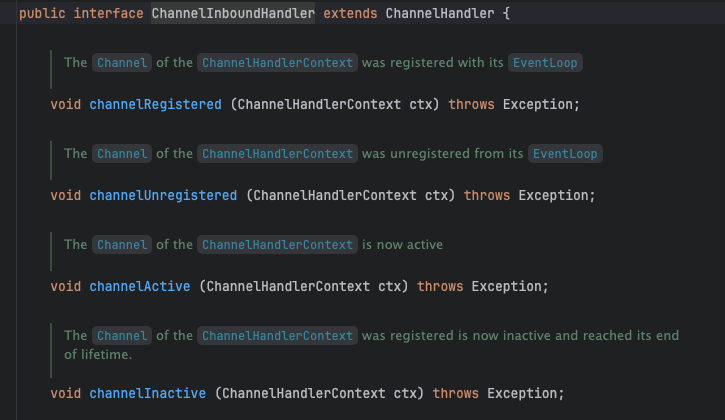
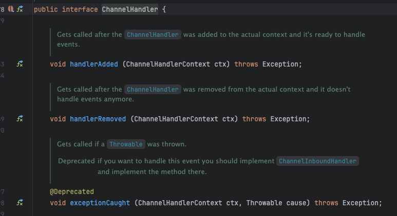

## 6장 - ChannelHandler & ChannelPipeline
- ChannelHandler & ChannelPipeline API
- 리소스 누출 감지
- 예외 처리

이 장은 주요한 장이라고 생각한다. 네티에서 가장 많이 쓰이는 인터페이스 들이라고 생각함 <br>
**네티의 데이터 흐름과 처리 컴포넌트를 배우며, 네티 프레임워크의 주요 요소가 서로 어떻게 연관되는지 알아보자** <br>

ChannelPipeline 안에 ChannelHandler 를 체인으로 연결해 처리 논리를 구성할 수 있다는 것을 배웠을 것이다 <br>
네티에서 재사용 가능한 모듈식 구현을 제작하려면 이러한 모든 컴포넌트의 상호작용을 제대로 이해해야 한다 <br>

### ChannelHandler 계층
#### Channel 생명주기
Channel 인터페이스는 ChannelInboundHandler API 와 밀접한 관계가 있다 <br>
 <br>
위 메소드 들이 일반적인 Channel 생명주기 이다 <br>
> channelRegistered -> channelActive -> channelInactive -> channelUnregistered

이러한 상태 변경이 수행될 때는 해당하는 이벤트가 생성되고, 이 이벤트는 적절하게 대응할 수 있게 ChannelPipeline 에 있는 ChannelHandler 로 전달 된다 <br>

#### ChannelHandler 생명주기
 <br>
위 메소드는 ChannelHandlerContext 를 파라미터로 받는다 <br>
- handlerAdded: ChannelHandler 가 ChannelPipeline 에 추가될때 호출됨
- handlerRemoved: ChannelHandler 가 ChannelPipeline 에서 제거될때 호출됨
- exceptionCaught:  @Deprecated되긴함. -> ChannelPipeline 에서 처리중에 오류가 발생하면 호출됨

네티는 ChannelHandler 의 가장 중요한 하위 인터페이스를 정의한다. 
- ChannelInboundHandler 모든 유형의 인바운드 데이터와 상태 변경을 처리한다.
- ChannelOutboundHandler 아웃바운드 데이터를 처리하고 모든 작업의 가로채기를 허용한다.

#### ChannelInboundHandler 인터페이스
위 인터페이스 메소드는 데이터가 수신되거나 연결된 Channel 의 상태가 변경될 때 호출된다 <br>
ChannelInboundHandler 구현이 channelRead() 를 재정의 하는 경우 풀링된 ByteBuf 인스턴스의 메모리를 명시적으로 해제하는 역할을 맡는다 <br>
네티의 다음 예제와 같이 메모리를 해체할 수 있는 ReferenceCountUtil.release() 메소드를 제공한다.
```java
public class Ex1 extends ChannelHandlerAdapter { // ChannelHandlerAdapter 로 확장
	// 수신한 메시지를 삭제
	@Override
	public void channelRead (ChannelHandlerContext ctx, Object msg) throws Exception {
		ReferenceCountUtil.release(msg);
	}

}
```

네티는 해제되지 않은 리소스를 WARN 수준 로그 메시지로 로깅하므로 코드에 문제가 되는 인스턴스가 있으면 쉽게 발견할 수 있다 <br>
그러나 매번 리소스를 관리하기는 귀찮으므로 **SimpleChannelInboundHandler** 를 이용해서 쉽게 리소스를 관리할 수 있다 <br>
```java
public class SimpleDiscardHandler extends SimpleChannelInboundHandler<Object> {

	@Override
	protected void messageReceived (ChannelHandlerContext ctx, Object msg) throws Exception {
	}

	@Override
	public void channelRead (ChannelHandlerContext ctx, Object msg) throws Exception {
		super.channelRead(ctx, msg);
		// 리소스를 명시적으로 해체할 필요가 없음.
	}

}
```

SimpleChannelInboundHandler 는 리소스를 자동으로 해체하므로 메시지의 참조도 무효화된다. <br>
즉 메시지의 참조를 저장해 나중에 이용하려고 하면 안된다. <br>

#### ChannelOutboundHandler 인터페이스
아웃바운드 작업과 데이터는 ChannelOutboundHandler 에 의해 처리되며, 여기에 포함된 메소드는 Channel, ChannelPipeline, ChannelHandlerContext 에서 이용된다 <br>
ChannelOutboundHandler 는 주문식으로 작업이나 이벤트를 지연하는 강력한 기능이 있어 정교하게 요청을 처리할 수 있다 <br>

#### ChannelHandler 어댑터
자신의 ChannelHandler 를 작성하는 시작점으로 ChannelInboundHandlerAdapter 와 ChannelOutboundHandlerAdapter 클래스를 이용할 수 있다 <br>
이들 어댑터는 ChannelInboundHandler, ChannelOutboundHandler 의 기본 구현을 제공하며, 추상 클래스 ChannelHandlerAdapter 를 확장해 공통 상위 인터페이인 ChannelHandler 의 메소드를 받는다 <br>

#### 리소스 관리
ChannelInboundHandler.channelRead() , ChannelOutboundHandler.write() 를 호출해 데이터를 대상으로 작업할 때는 리소스 누출이 발생하지 않게 주의해야 한다 <br>
5장에서 배운 것처럼 네티는 참조 카운팅을 이용해 풀링되는 ByteBuf 를 관리한다, 따라서 ByteBuf 이용이 끝난 후에는 참조 카운트를 조정하는 것이 중요하다 <br>
[네티 4가지 누출 감지 수준]
- DISABLED: 누출 감지를 비활성화
- SIMPLE: 기본 샘플링 비율 1% 를 이용해 발견된 누출을 보고한다.
- ADVANCED: 발견된 누출과 메시지에 접근한 위치를 보고한다.
- PARANOID: ADVANCED 와 비슷하지만 모든 접근을 샘플링한다 

```java
누출 감지 수준을 정의하려면 yml, properties 설정을 바꾸면 된다.
```

ChannelInboundHandler.channelRead() , ChannelOutboundHandler.write() 를 구현할 때 메모리 누출을 방지하려면 어떻게 해야 할까? 
```java
@ChannelHandler.Sharable
public class DiscardInboundHandler extends ChannelInboundHandlerAdapter {
	@Override
	public void channelRead (ChannelHandlerContext ctx, Object msg) throws Exception {
		ReferenceCountUtil.release(msg); // 리소스 해제
	}

}

public class DiscardOutHandler extends ChannelOutboundHandlerAdapter {
	@Override
	public void write (ChannelHandlerContext ctx, Object msg, ChannelPromise promise) throws Exception {
		ReferenceCountUtil.release(msg);
		promise.setSuccess();
	}

}

```

리소스를 해제하는 것 만이 아니라 ChannelPromise 에 알리는 것도 중요하다 <br>
그렇지 않으면 ChannelFutureListener 가 메시지가 처리된 것에 대한 알림을 받지 못하는 경우가 생길 수 있다 <br>

정리하면, 메세지가 소비 또는 폐기되어 ChannelPipeline 의 다음 ChannelOutboundHandler 로 전달되지 않는 경우 직접 ReferenceCountUtil.release(); 를 호출해야 한다 <br>
전송 레이어에 도달한 메시지는 기록될 때 또는 Channel 이 닫힐 때 자동으로 해체된다 <br>


### ChannelPipeline 인터페이스
ChannelPipeline 은 Channel 을 통해 인바운드,아웃바운드 이벤트를 가로채는 ChannelHandler 인터페이스의 체인이라고 생각하면 된다 <br>

새로운 Channel 이 생성될 때 마다 새로운 ChannelPipeline 이 할당된다 <br>
이 연결은 영구적이며 Channel 을 다른 ChannelPipeline 과 연결하거나 현재 연결을 해제할 수 없다, 이 과정은 네티 컴포넌트의 생명주기와 고정된 작업이므로 우리가 관여할 필요가 없다 <br>

이벤트는 전달되는 방향을 기준으로 ChannelInboundHandler 또는 ChannelOutboundHandler 에 의해 처리되며, <br>
ChannelHandlerContext 구현에 대한 호출에 의해 동일한 상위 형식의 다음 핸들러로 전달된다<br>

> ChannelHandlerContext
> > ChannelHandler 는 ChannelHandlerContext 를 이용해 해당 ChannelPipeline 및 다른 핸들러와 상호작용할 수 있다.
> >> ChannelPipeline 의 다음 ChannelHandler 에 알림을 전달하는 것은 물론, 속해 있는 ChannelPipeline 을 동적으로 수정할 수 있다.

ChannelPipeline 이 ChannelHandler 의 연속이다 <br>
파이프라인은 이벤트를 전파하는 동안 파이프라인의 다음 ChannelHandler 과 같은 이동 방향인지 확인한다 <br>
이동 방향이 다르면 ChannelPipeline 은 방향이 일치하는 항목이 나올 때까지 다음 ChannelHandler 를 건너뛴다

#### ChannelPipeline 수정
ChannelHandler 는 다른 ChannelHandler 를 추가, 제거 할 수 있고 <br>
제거하는 방법으로 ChannelPipeline 의 레이아웃을 실시간으로 수정할 수 있다(자신을 ChannelPipeline 에서 제거 가능) <br>

#### 이벤트 생성
ChannelPipeline API 에는 인바운드와 아웃바운드 작업을 호출하는 추가 메소드가 있다 <br.
아웃바운드 측에서는 이벤트를 처리하면 기반 소켓 상에서 일종의 조치가 이뤄진다
- ChannelPipeline 은 한 Channel 과 연결된 여러 ChannelHandler 를 포함한다
- 필요에 따라 동적으로 ChannelHandler 를 추가하고 제거해 동적으로 ChannelPipeline 을 수정할 수 있다.
- ChannelPipeline 에는 인바운드와 아웃바운드 이벤트에 반응해 작업을 호출하는 풍부한 API 가 있다.

### ChannelHandlerContext 인터페이스
ChannelHandlerContext 는 ChannelHandler 와 ChannelPipeline 간의 연결을 나타내며 ChannelHandler 를  ChannelPipeline 에 추가할 때마다 생성된다 <br>
ChannelHandlerContext 의 주된 기능은 연결된 ChannelHandler 와 동일한 ChannelPipeline 내의 다른 ChannelHandler 간의 상호작용을 관리하는 것이다 <br>

ChannelHandlerContext API 를 이용할 때는 다음 사항을 염두에 둬야 한다 <br>
- ChannelHandler 와 연결된 ChannelHandlerContext 는 절대 변경되지 않으므로 참조를 저장해도 괜찮다.
- ChannelHandlerContext 메소드는 다른 클래스에 있는 동일한 이름의 메소드에 비해 이벤트 흐름이 짧다. 이를 잘 활용하면 성능상 이득을 볼 수 있다.

#### ChannelHandlerContext 이용
ChannelPipeline 과 바인딩된 Channel, Channel 과 바인딩된 ChannelPipeline에 ChannelHandler 가 포함됨.<br>
아래 예제는 ChannelHandlerContext 에서 Channel 에 대한 참조를 얻은 다음, 해당 Channel 에서 write() 를 호출해 이벤트가 파이프라인 전체를 통과하게 한다
```java
ChannelHandlerContext ctx = null;
Channel channel = ctx.channel(); // ctx 와 연결된 Channel 에 대한 참조를 얻음
channel.write(Unpooled.copiedBuffer("Netty in Action", CharsetUtil.UTF8)); // Channel 을 통해 버퍼를 기록
```

다음 예제는 Channel 이 아닌 ChannelPipeline 을 통해 기록한다
```java
ChannelHandlerContext ctx = null;
ChannelPipeline pipeline = ctx.pipeline(); // ctx 와 연결된 ChannelPipeline 에 대한 참조를 얻음
pipeline.write(Unpooled.copiedBuffer("Netty in Action", CharsetUtil.UTF8)); // pipeline 을 통해 버퍼를 기록
```

위 두 코드는 흐름은 동일하고, write() 메소드를 통해 파이프라인을 통해 끝까지 전파되는 점은 같지만 <br>
한 핸들러에서 ChannelHandler 단계로 전파하는 일을 ChannelHandlerContext 가 한다는점이 다르다 <br>

ChannelPipeline 의 특정 지점에서 이벤트 전파를 시작하는 이유가 뭘까? <br>
- 관련이 없는 ChannelHandler 를 통과하면서 생기는 오버헤드를 줄일 수 있다.
- 이벤트와 관련된 핸들러에서 이벤트가 처리되는 것을 방지할 수 있다.

특정 ChannelHandler 에서 시작하는 처리를 호출하려면 한 단계전 ChannelHandler 와 연결된 ChannelHandlerContext 를 참조해야 한다 <br>
```java
ChannelHandlerContext ctx = null; // ctx 에 대한 참조를 얻음
ctx.write(Unpooled.copiedBuffer("Netty in Action", CharsetUtil.UTF_8)); // write() 버퍼를 다음 ChannelHandler 로 전송
```

#### ChannelHandler 와 ChannelHandlerContext 의 고급 활용
ChannelHandlerContext 의 pipeline() 메소드를 호출하면 바깥쪽 ChannelPipeline 에 대한 참조를 얻을 수 있다 <br>
이 방법을 사용하여 런타임에 파이프라인의 ChannelHandler 를 조작해 정교한 설계를 구현할 수 있다 <br>
ex) 파이프라인에 ChannelHandler 를 추가해 동적 프로토콜 변경을 지원할 수 있다.

ChannelHandlerContext 의 참조를 캐싱하면 ChannelHandler 메소드 외부나, 다른 스레드에서 다른 고급 기법을 실행하는데 이용할 수 있다 
```java
public class WriteHandler extends ChannelHandlerAdapter {
	// ctx 참조를 나중에 이용하기 위해 캐싱
	private ChannelHandlerContext ctx;

	@Override
	public void handlerAdded (ChannelHandlerContext ctx) throws Exception {
		this.ctx = ctx;
	}

	// 저장한 ctx 를 이용해 메시지를 전송
	public void send(String msg) {
		ctx.writeAndFlush(msg);
	}

}
```

ChannelHandler 는 둘 이상의 ChannelPipeline 에 속할 수 있으므로 여러 ChannelHandlerContext 인스턴스와 바인딩할 수 있다 <br>
ChannelHandler 를 이런 용도로 이용하려면 @Sharable 어노테이션을 지정해야 한다 <br>

여러 동시 채널(즉, 여러 연결) 에서 ChannelHandler 를 안전하게 이용하려면 ChannelHandler 가 스레드에 대해 안전해야 한다 <br>

```java
// INFO 공유 가능한 ChannelHandler
@ChannelHandler.Sharable
public class SharableHandler extends ChannelHandlerAdapter {
	@Override
	public void channelRead (ChannelHandlerContext ctx, Object msg) throws Exception {
		super.channelRead(ctx, msg);
		System.out.println("Channel read messagae: " + msg);
		ctx.fireChannelRead(msg); // 메소드 호출을 로깅하고 다음 ChannelHandler 로 전달
	}

}
```

@Sharable 은 스레드에 대해 확실히 안전한 경우에만 이용한다 <br>
ChannelHandler 를 공유하는 이유는, 여러 Channel 에서 통계 정보를 얻기 위해서 이다 <br>

### 예외 처리
#### 인바운드 예외 처리
인바운드 이벤트를 처리하는 동안 예외가 발생하면 트리거된 ChannelInboundHandler ~ ChannelPipeline 을 통과한다 <br>
이러한 인바운드 예외를 처리하려면
```java
@Override
public void exceptionCaught(ChannelHandlerContext ctx, Throwable cause) {
	cause.printStackTrace();
	ctx.close();
}
```

위 메소드를 재정의해야 한다. 
#### 아웃바운드 예외 처리

### 용어 정리
- 인바운드: 트래픽이 네트워크에 들어오는 정보 ex) 첨부파일을 서버에 저장할 때
- 아웃바운드: 트래픽이 네트워크에서 나가는 정보 ex) 첨부파일을 다운로드 할 때
- 이벤트: 어떤 일이 일어났음을 알리는 신호나 메시지를 의미합니다. 좀 더 정확하게 말하자면, 특정 시점에 발생하는 변화나 상태 변경을 나타내는 정보
- 파이프라인: 한 데이터 처리 단계의 출력이 다음 단계의 입력으로 이어지는 형태로 연결된 구조를 가리킨다. 이렇게 연결된 데이터 처리 단계는 한 여러 단계가 서로 동시에, 또는 병렬적으로 수행될 수 있어 효율성의 향상 시킬수 있다