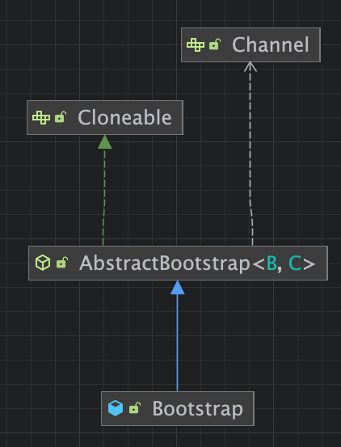

## 8장 부트스트랩
- 클라이언트와 서버 부트스트랩
- Channel 내에서 클라이언트 부트스트랩
- ChannelHandler 추가
- ChannelOption 과 특성 이용

ChannelPipeline, ChannelHandler, 코덱 클래스를 하나로 연결해 작동하는 애플리케이션으로 만드는 방법은 무엇일까? <br>

답은 바로 **부트스트랩** 이다.<br>

네티는 애플리케이션 아키텍쳐에 대한 접근 방식과 일관되게 애플리케이션이 클라이언트 또는 서버든 관계없이 네트워크 레이어로부터 격리하는 방식을 지원한다 <br>
모든 프레임워크 컴포넌트는 백그라운드에서 연결되고 활성화 된다.<br>
<br>

### 부트스트랩 클래스
네티의 부트스트랩 클래스는 추상 부모클래스 와 구상 부트스트랩 하위 클래스 두개로 구성된다(BootStrap, ServerBootStrap) <br>

ServerBootStrap 은 부모 채널을 위해 클라이언트로부터 연결을 수락하고 통신하기 위해 자식 채널을 생성 <br>
BootStrap 은 클라이언트에서 많이 이용 <br>

두 클래스의 공통된 부트스트랩 단계는 AbstractBootStrap 에 의해 처리되며, 클라이언트는 서버에 한정된 단계는 각 클래스에서 처리된다 <br>

#### 부트스트랩 클래스가 Cloneable 인 이유
여러 채널을 비슷하거나 동일한 설정으로 생성해야 하는 경우가 있다 <br>
채널별로 부트스트랩 인스턴스를 새로 만들지 않고도 이러한 패턴을 지원하기 위해 AbstractBootStrap 은 Cloneable 로 설정돼 있다 <br>
이미 구성된 부트스트랩 의 clone() 을 호출하면 즉시 이용 가능한 BootStrap 이 생긴다
```java
public abstract class AbstractBootStrap<B extends AbstractBootStrap<B,C>, C extends Channel>
```

이 시그니처에서 하위 클래스는 B 상위 클래스에 대한 형식 매개변수이며, 런타임 인스턴스의 참조를 반환해 메소드 체인을 지원하기 위한 것이다 <br>
```java
public class Bootstrap extends AbstractBootstrap<Bootstrap, Channel> {}
public class ServerBootstrap extends AbstractBootstrap<ServerBootstrap, ServerChannel> {}
```

### 비연결 프로토콜과 클라이언트 부트스트랩
BootStrap 은 비연결 프로토콜을 이용하는 애플리케이션이나 클라이언트에서 이용된다 <br>
BootStrap 은 AbstractBootStrap 추상 부모 클래스로부터 상속을 받아 여러 메소드를 구현한다 <br>

**비연결 프로토콜: UDP , 연결 프로토콜 : TCP**

#### 클라이언트 부트스트랩 <br>
그냥 부트스트랩은 비연결 프로토콜을 활용하는 애플리케이션과 클라이언트를 위해 채널을 생성하는 역할을 한다 <br>
- BootStrap 은 bind() 가 호출되면, 새로운 Channel 을 생성하며, connect() 가 호출돼 연결을 설정한다.
- BootStrap 은 connect() 가 호출되면 새로운 Channel 을 생성한다.

#### Channel 과 EventLoopGroup 호환성
io.netty.channel 패키지의 목록에 보면 NIO,OIO 전송에 대한 EventLoopGroup 과 Channel 구현이 모두 있는 것을 알 수 있다 <br>
이 호환성은 반드시 유지해야 하며, NioEventLoopGroup 및 OioSocketChannel 과 같이 서로 다른 접두사를 가진 컴포넌트를 혼합할 수 없다 <br>

부트스트랩 과정 중에는 bind() 또는 connect() 를 호출하기 전에 다음과 같은 메소드를 호출해 필수 컴포넌트를 설정해야 한다 
- group()
- channel() 또는 channelFactory()
- handler()

### 서버 부트스트랩
1) bind() 가 호출되면 ServerChannel 이 생성됨
2) 연결이 수락되면 ServerChannel 이 새로운 Channel 을 생성

### 채널에서 클라이언트 부트스트랩
서버가 다른 세 번째 시스템에 대해 클라이언트로 작동해야 하는 클라이언트 요청을 처리한다고 가정해보자 <br>
이러한 경우 ServerChannel 에서 클라이언트 Channel 을 부트스트랩 해야한다 <br>
- ServerBootStrap.bind() 가 호출되면 새로운 ServerChannel 을 생성한다.
- ServerChannel 은 새로운 연결을 수락하고 이를 지원하기 위해 자식 채널을 생성한다.
- 수락된 연결을 위해 Channel 생성
- Channel 이 생성한 BootStrap 은 connect() 가 호출되면 새로운 Channel 을 생성
- 새로운 Channel 이 원격 피어에 연결됨
- ServerChannel 이 생성한 Channel 과 connect() 로 생성된 Channel 간에 공유되는 EventLoop

EventLoop 를 구현하려면 group() 메소드를 호출해 EventLoop 를 설정해야 한다 <br>

### 부트스트랩 중 여러 ChannelHandler 추가
여러 프로토콜을 지원해야 하는 애플리케이션의 경우 여러 ChannelHandler 를 이용하는 것이 편리하며, 다른 방법을 이용하려면 클래스가 크고 복잡해진다 <br>

### 네티 ChannelOption 과 특성 이용
Channel 을 생성할 때 마다 수동으로 구성하는 과정은 지루하지만, option() 을 이용해 ChannelOption 을 부트스트랩 에 적용하는 방법이 있다. <br>
여기에 제공하는 값은 부트스트랩에서 생성하는 모든 Channel 에 자동으로 적용된다 <br>

#### DatagramChannel 부트스트랩
지금까지는 TCP 기반의 socketChannel 사용, DatagramChannel 은 비연결 프로토콜 UDP 부트스트랩을 이용한다 <br>

#### 종료
부트스트랩은 애플리케이션을 시작하는 과정이지만, 결국에는 애플리케이션을 정상적으로 종료해야 한다 <br>
물론 어플리케이션을 종료할 때 JVM 이 모든 작업을 대신 처리하게 해도 되지만 이 경우 리소스를 깔끔하게 정리하는 것을 의미하는 정상 종료가 아니다 <br>

무엇보다 EventLoopGroup 을 종료해 대기 중인 이벤트와 작업을 모두 처리한 다음 모든 활성 스레드를 해제해야 한다 <br>
```java
EventLoopGroup.shutdownGracefully() // 호출 -> 비동기식 작업
```

이 메소드가 종료가 완료되면 알림을 받을 Future 를 반환한다. 
```java
Future<?> future = group.shutdownGracefully();
```

위 메소드를 호출하기 전에 모든 활성 채널의 Channel.close() 를 명시적으로 호출해도 된다 <br>
그러나 항상 EventLoopGroup 자체를 종료해야 한다는 것을 기억해야 한다 <br>


### 용어 정리
- **부트스트랩**: 애플리케이션을 실행하도록 구성하는 과정
  - 사전적인 용어로는 : 현재 상황에서 어떻게든 한다
- **EventLoop**: 멀티플렉싱 방식을 사용하여 단일 쓰레드로 여러 채널의 I/O 이벤트를 반복적으로 확인하고 처리하는 요소
- **ChannelHandler** : 네트워크를 통해 주고받아지는 데이터를 처리하고, 변환하며, 목적지에 도달하도록 하는 역할 -> 네트워크 데이터를 처리를 담당
- **ChannelPipeline**: ChannelHandler 를 각 단계 별로 처리하는 역할을 함.
- **원격피어**: 클라이언트 - 서버 가 연결된 상태를 의미하며