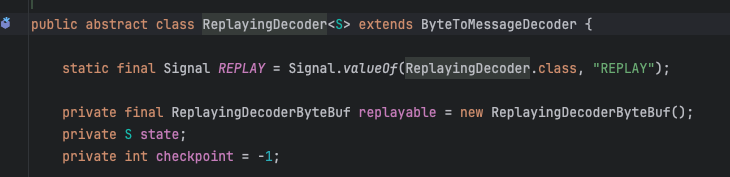

# 10장 - 코덱 프레임워크
네트워크에서는 데이터를 단순한 바이트 연속으로 취급하지만, 애플리케이션에서는 이러한 바이트를 의미가 있는 정보 구조로 만들어야 한다 <br>
데이터를 네트워크 바이트 스트림으로 변환하거나 그 반대로 변환하는 작업은 가장 일반적인 프로그래밍 작업이다 <br>

애플리케이션 데이터와 네트워크 포맷 간의 변환을 수행하는 컴포넌트를 각각 인코더 와 디코더 라고 하며, 두 기능을 모두 가진 단일 컴포넌트를 코덱 이라고 한다 <br>

네티에서 데이터를 변환하는 작업은 코덱 컴포넌트에 의해 처리된다 <br>

## 코덱이란?
코덱이 변환시키는 논리는 바이트의 스트림을 한 포맷에서 다른 포맷으로 변환하는 인코더와 디코더로 구성된 코덱에 의해 처리된다 <br>

인코더는 메시지를 전송하기에 적합한 형식(바이트 스트림) 으로 변환    ex) 문자열 -> byte 로 변환 시킨다. 약간 암호화 느낌이랑 비슷한 듯
디코더는 바이트 스트림(네트워크 스트림) 을 다시 프로그램의 메시지 포맷으로 변환한다 ex) byte -> 문자열로 변환. 약간 복호화 느낌이랑 비슷한 듯.

또한 인코더는 아웃바운드 데이터를 처리하며 디코더는 인바운드 데이터를 처리한다 <br>

### 디코더(Decoder)
- 바이트 스트림을 메시지로 디코딩 (ByteToMessageDecoder 및 ReplayingDecoder)
- 메시지를 다른 메시지 유형으로 디코딩 (MessageToMessageDecoder)

디코더는 인바운드 데이터(들어오는 데이터)를 다른 포맷으로 변환하는 일을 하므로, ChannelInboundHandler 를 구현한다 <br>

디코더는 인바운드 데이터를 ChannelPipeline 내의 다음 ChannelInboundHandler 를 위해 변환할 때 이용한다 <br>
또한 ChannelPipeline 설계 방식 덕분에 여러 디코더를 체인으로 연결하는 방법으로 복잡한 로직도 구현할 수 있다 <br>

#### ByteToMessageDecoder 추상 클래스
바이트 스트림을 메시지로 디코딩 하는 작업은 매우 일반적이므로 네티는 ByteToMessageDecoder 라는 추상 클래스를 제공한다 <br>
원격 피어가 완성된 메시지를 한 번에 보낼지는 알 수 없으므로 이 클래스는 인바운드 데이터가 처리할 만큼 모일 때까지 버퍼에 저장한다 <br>

#### ReplayingDecoder 추상 클래스
ReplayingDecoder 는 ByteToMessageDecoder 를 확장한다 <br>
 <br>

과도하게 복잡하지 않은 상황에는 ByteToMessageDecoder 를 사용하고 <br>
그렇지 않으면 ReplayingDecoder 를 이용한다 <br>

#### MessageToMessageDecoder 추상 클래스
추상 기본 클래스를 이용해 메시지 포맷을 변환하는 방법을 알아보자 <br>
```java
public abstract class MessageToMessageDecoder<I> extends ChannelInboundHandlerAdapter {
	// 구현 로직
}
```

매개변수 I 는 구현해야 하는 유일한 메소드인 decode() 에 입력 msg 인수 형식을 알려준다

### 인코더(Encoder)
디코더의 기능을 반대로 수행하는게 인코더 이다 <br>
- 메시지를 바이트로 인코딩
- 메시지를 다른 메시지로 인코딩

#### MessageToByteEncoder 추상 클래스
- encode(ChannelHandlerContext ctx, I msg, ByteBuf out) 

디코더에서는 메소드가 두개 있었지만, 이 클래스에는 메소드가 하나 뿐인 것을 알 수 있다 <br>

#### MessageToMessageEncoder 추상 클래스
이번에는 메시지를 아웃바운드 데이터로 인코딩하는 과정을 알아보자 <br>
```java
public class IntegerToStringEncoder extends MessageToMessageEncodr<Integer> {
	@Override
    public void encode(ChannelHandlerContext ctx, Integer msg, List<Object> out) throws Exception {
		out.add(String.valueOf(msg)); // Integer 를 String 으로 변환하고 List 에 추가
    }
}
```

## 추상 코덱 클래스
디코더와 인코더 클래스를 별개로 냅뒀지만, 인바운드/아웃바운드 데이터와 메시지 변환을 한 클래스에서 관리하는 것이 편할 수도 있다 <br>
네티의 추상 코덱 클래스는 디코더/인코더 를 한 쌍으로 묶어 지금까지 알아본 두 작업을 함께 처리하므로 이러한 용도에 편리하게 이용할 수 있다 <br>

위 클래스는 ChannelInboundHandler 와 ChannelOutboundHandler 를 모두 구현한다 <br>

#### ByteToMessageCodec 추상 클래스
위 클래스는 ByteToMessageDecoder 와 MessageToByteEncoder 를 결합한다 <br>

#### MessageToMessageCodec 추상 클래스
디코더와 인코더를 결합하면 재사용성이 저하되지만 디코더와 인코더를 단일 유닛으로 배포하는 편의성을 포기하지 않고 재사용성의 저하를 방지하는 방법이 있다 <br>
바로 CombinedChannelDuplexHandler 를 이용하면 된다 <br>

#### CombinedChannelDuplexHandler 클래스
이 클래스는 ChannelInboundHandler 와 ChannelOutboundHandler 의 컨테이너 역할을 한다 <br>
디코더 클래스와 인코더 클래스를 확장하는 형식을 제공함으로 써 추상 코덱 클래스를 직접 확장하지 않고도 코덱을 구현할 수 있다 <br>


### 용어 정리
- 코덱 : 인코더, 디코더 두 기능을 모두 가진 컴포넌트
- 메시지: 특정 어플리케이션에서 의미가 있는 바이트의 시퀀스 구조
- 스트림: 데이터가 순서대로 흐르는 것을 의미한다.
  - 바이트 스트림: 바이트 데이터가 순서대로 흘러가는 것을 의미한다.
- **부트스트랩**: 애플리케이션을 실행하도록 구성하는 과정
    - 사전적인 용어로는 : 현재 상황에서 어떻게든 한다
- **EventLoop**: 멀티플렉싱 방식을 사용하여 단일 쓰레드로 여러 채널의 I/O 이벤트를 반복적으로 확인하고 처리하는 요소
- **ChannelHandler** : 네트워크를 통해 주고받아지는 데이터를 처리하고, 변환하며, 목적지에 도달하도록 하는 역할 -> 네트워크 데이터를 처리를 담당
- **ChannelPipeline**: ChannelHandler 를 각 단계 별로 처리하는 역할을 함.
- **원격피어**: 클라이언트 - 서버 가 연결된 상태를 의미.