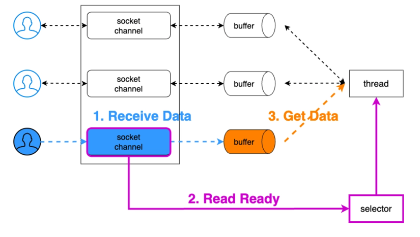
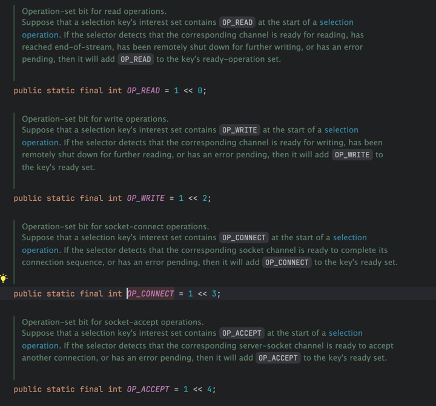

# 네트워크 NIO & Java NIO

### 위 글은 다른 글에 영감을 받고, 그 내용에다가 내가 생각한 내용만 조금 추가했습니다 <br>

네트워크 소켓은 동작 방식은 크게 Blocking, Non-Blocking 모드로 나뉜다 <br>
- Blocking 은 요청한 작업이 성공하거나 에러가 발생하기 전까지는 응답을 돌려주지 않는다.
- Non-Blocking 은 요청한 작업의 성공 여부와 상관없이 바로 결과를 돌려주는 것을 의미한다.

Non-Blocking 은 구현하는 방식이 다양하다. I/O 관점에서는 Multiplexing 방식이 가장 많이 사용된다 <br>

**Multiplexing I/O** <br>
- 멀티플렉싱 I/O는 여러 입출력 장치를 동시에 처리하여 프로그램 성능을 향상시키고 효율성을 높이는 중요한 기술입니다.
- 마치 여러 친구들과 내가 동시에 대화를 주고받는 것 처럼, 멀티플렉싱 I/O는 컴퓨터가 여러 작업을 더 빠르고 효율적으로 수행하도록 도와주는 기술이다.

이 글에서는 간단히 대문자 변환 서버를 직접 코드로 작성해보면서 네트워킹 블로킹 I/O 와 Multiplexing I/O 그리고 Java NIO 의 동작원리를 이해해보자 <br>

1) Blocking
- 간단한 Blocking 서버 -> 모든 요청을 메인 스레드에서 실행한다 -> 싱글 스레드 모델
- Thread 를 활용한 Blocking 서버 -> 모든 요청을 서로 다른 스레드에서처리 -> 멀티 스레드 모델
- Thread Pool 을 활용한 Blocking 서버 -> 모든 요청을 미리 생성해둔 스레드 풀내 스레드에서 처리한다 (멀티 스레드 모델)

2) Non-Blocking
- NIO Blocking 서버 - NIO 를 사용하지만 싱글 스레드 모델로 처리한다.
    - Java I/O 의 느린 첫번째 이유 와 그 해결책인 NIO 의 ByteBuffer 에 대해서 알아본다.
- NIO Non-Blocking Pool 서버 - NIO 사용하지만 Bad Practice 인 Polling 으로 처리.
- NIO selector 서버 - Non Blocking Best Practice

## 간단한 Blocking 서버
간단한 모든 요청을 메인 스레드에서 처리하는 Blocking 서버이다. JDK1.3 부터 ServerSocket 은 Socket 을 제공한다 <br>
```java
public class IoSimpleBlockingServer {
	public static void main (String[] args) throws IOException {
		ServerSocket serverSocket = new ServerSocket(8080);

		while(true) {
			Socket socket = serverSocket.accept();
			handleRequest(socket);
		}
	}

	private static void handleRequest (Socket socket) {
		try(InputStream in = socket.getInputStream();
		OutputStream out = socket.getOutputStream()) {
			int data;

			while((data = in.read()) != -1)  {
				data = Character.isLetter(data) ? toUpperCase(data):data;
			}
		} catch (IOException e) {
			throw new RuntimeException(e);
		}
	}

	private static int toUpperCase (int data) {
		return Character.toUpperCase(data);
	}

}

```

위 코드에서 알다시피 메인을 선언했으니 메인 스레드에서 다 실행이 된다 <br>
> telnet 127.0.01 8080
> > hi <br> HI <br> hello <br> HELLO

#### 간단한 Blocking 서버 구조의 문제점
요청하면 응답은 잘 온다, Blocking 소켓의 특성상 데이터 입출력에서 스레드의 블로킹이 발생하기 때문에 동시에 여러 클라이언트에 대한 처리가 불가능하다 <br>

즉 accept(), read(), write() 등을 호출하면 해당 호출 스레드는 소켓 연결이 열리거나 데이터 입출력이 완료될 때 까지 해당 스레드를 Blocking 한다 <br>

당연히 메인 스레드가 Blocking 되므로 다중 클라이언트 요청을 동시에 처리가 불가능하다 <br>
서버는 하나의 클라이언트가 아닌 다중 클라이언트 요청을 처리할 수 있어야 한다 <br>

위 코드는 메인 스레드에서만 동작하므로 동시에 하나의 클라이언트 요청만 처리가 가능하다 ,br>
서버의 소켓이 사용되지 않을 때만 새로운 클라이언트를 받아들일 수 있으므로 서버 구조로서 굉장히 BadPractice 이다 <br>

## Thread 를 활용한 Blocking 서버
모든 요청을 서로 다른 스레드에서 처리를 한다 (멀티 스레드 모델) <br>
Blocking 소켓에서 다중 클라이언트의 접속 처리를 하지 못하는 문제점을 해결하기 위해서 등장한 모델이 <br>
연결된 클라이언트별로 각각 스레드를 할당하는 방식이다 <br>

각 클라이언트마다 스레드를 할당한다? 만약 클라이언트 10000명 이라면?? <br>
10000개의 스레드가 생긴다. -> 하지만 스레드 생성 오버헤드가 발생해 성능 저하 가능<br>
각 스레드는 자신의 스택 공간을 필요로 하기 때문에 메모리 사용량 증가할수도 있음.<br>
여러 스레드가 CPU 코어 공유하기 때문에 컨텍스트 스위칭 오버헤드 발생할 수 있음 <br>


```java
public class IoThreadBlockingServer {
	public static void main (String[] args) throws IOException {
		ServerSocket serverSocket = new ServerSocket(8081);

		while(true) {
			// blocking call -> 새 클라이언트 접속 까지 blocking
			Socket socket = serverSocket.accept();
			// Socket 이 연결되면 스레드 생성됨
			new Thread( () -> handleRequest(socket)).start();
		}
	}

	private static void handleRequest (Socket socket) {
		try(InputStream in = socket.getInputStream();
			OutputStream out = socket.getOutputStream()) {

			int data;

			// read() 데이터를 읽을 때 까지 다른 요청 다 blocking 됨. 만약 소켓이 닫혀 있다면 -1
			while( (data = in.read()) != -1) {
				data = Character.isLetter(data) ? toUpperCase(data) :data;
				out.write(data);
			}

		} catch (IOException e) {
			throw new RuntimeException(e);
		} ;

	}

	private static int toUpperCase(int data) {
		return Character.toUpperCase(data);
	}

}
```

위 코드는 요청이 있을 때 마다 Thread 를 새로 생성한다, 즉 다중 요청을 동시에 처리 가능하다 <br>

 <br>
다중 커넥션을 동시에 맺어서 여러 요청을 동시에 처리할 수 있어 괜찮아 보이지만 아래와 같은 문제점이 있다. 
- 커넥션 수에 따른 무한 리소스 증가
  - 메모리 부족
- 컨텍스트 스위칭 비용 부족
- 매번 스레드 생성 비용 발생

다중 연결을 처리할 수 있는 가장 기본적인 서버 구조이나, 요청이 증가하면서 선형적으로 서버의 부하가 걸리는 구조라는 치명적인 문제가 있다 <br>

## Thread Pool 을 활용한 Blocking 서버
#### 일반적인 스프링부트 서버임 우리가 사용하는
애플리케이션의 리소스를 제한하고 빠른 속도를 위해 스레드를 재활용하기 위한 Thread Pool 방식이 탄생했다 (멀티 스레드 모델) <br>
ex) <br>
그럼 티켓팅 서버를 예시로 들었을 때 스레드 풀 개수는 2000개다 <br>
하지만 동시 접속자 수는 20000만 명이다, 그러면 최초접속자 2000명이 접속을 했다 <br>
그 뜻은 스레드 풀에서 2000명에게 스레드가 할당이 되었다 <br>
그리고 티켓팅이 끝난 사용자는 접속을 끊는다. 즉 스레드 사용이 끝나면 스레드 풀로 다시 스레드를 돌려준다 <br>
그리고 차례차례 대기순서가 빠른 사람부터 스레드를 할당해 티켓 예약을 한다 <br>

이런 상황이랑 비슷하다. 

더 자세하게 설명을 해보겠다.

Thread Pool은 애플리케이션의 리소스를 제한하고 빠른 속도를 위해 스레드를 재활용하는 멀티 스레드 모델입니다. <br>

티켓팅 서버 예시:<br>
티켓팅 서버 예시에서 스레드 풀 크기가 2000개이고 동시 접속자 수가 20000만 명이라는 상황을 살펴보면:<br>

최초 2000명 접속:<br>
최초 2000명의 접속자는 스레드 풀에서 각각 스레드를 할당받습니다.<br>
이는 2000개의 스레드가 사용 중이고, 18000만 명의 접속자는 대기 상태임을 의미합니다.<br>

티켓팅 완료 후 스레드 반납:<br>
티켓 예매를 완료하고 접속을 끊는 사용자는 사용 중인 스레드를 스레드 풀로 반납합니다.<br>
반납된 스레드는 대기 상태로 변경되어 다음 접속자를 기다립니다.<br>

다음 접속자 처리:<br>
대기 상태인 스레드가 있다면, 다음 순서의 접속자에게 스레드를 할당하여 티켓 예매를 진행합니다.<br>
이 과정을 통해 동시에 처리되는 접속자 수는 스레드 풀 크기와 동일하게 유지됩니다.<br>

Thread Pool의 장점:<br>
효율적인 자원 활용: 필요한 만큼만 스레드를 생성하여 시스템 자원을 효율적으로 활용할 수 있습니다.<br>
성능 향상: 스레드 생성 및 관리 오버헤드를 줄여 성능을 향상시킬 수 있습니다.<br>
스케일링 가능성: 동시 접속자 수가 증가해도 스레드 풀 크기를 조정하여 처리할 수 있습니다.<br>

Thread Pool의 단점:<br>
스레드 풀 크기 제한: 너무 작은 스레드 풀은 성능 저하를 초래할 수 있고, 너무 큰 스레드 풀은 자원 낭비를 유발할 수 있습니다.<br>
컨텍스트 스위칭 오버헤드: 여러 스레드가 CPU 코어를 공유하기 때문에 컨텍스트 스위칭 오버헤드가 발생할 수 있습니다.<br>

결론: <br>
Thread Pool을 활용한 Blocking 서버는 다중 클라이언트 요청을 처리하는 효과적인 방법이지만, 스레드 풀 크기 설정, 컨텍스트 스위칭 오버헤드 관리 등에 주의해야 합니다.<br>
시스템 환경, 응용 프로그램 특성, 동시 접속자 수 등을 고려하여 적절한 스레드 풀 크기를 설정하고 효율적으로 관리해야 합니다.<br>

참고:<br>
Thread Pool 구현 방식에 따라 다양한 알고리즘이 사용됩니다. 일반적인 방식으로는 FIFO(First In First Out), LIFO(Last In First Out), 워커 스틸링(Worker Stealing) 등이 있습니다.<br>
Thread Pool은 Java와 같은 프로그래밍 언어에서 기본적으로 제공되는 기능이 아닙니다. Apache Commons Pool과 같은 별도의 라이브러리를 사용해야 합니다.<br>

다시 말해서 특정 개수의 스레드를 미리 만들어두고 새로운 커넥션이 요청오면 미리 만들어준 스레드를 할당하는 방식이다 <br>
(여전히 커넥션 1:1 스레드 이지만, 스레드를 재활용한다. <br>

Thread Pool 사이즈를 초과하는 새로운 작업은 Thread Pool 내 idle Thread 가 나올 때까지 대기열에서 대기하고 자기 차례가 되면 처리되는 구조이다 <br>
웹 MVC 구조의 기초가 되는 모델이며 ex) 스프링 부트 <br>
내가 현재 공부하고 있는 스프링부트도 Thread Pool 방식의 Blocking 서버이다 <br>

```java
public class IoThreadPoolBlockingServer {
	public static void main (String[] args) throws IOException {
		ServerSocket serverSocket = new ServerSocket(8082);
		ExecutorService threadPool = Executors.newFixedThreadPool(3);
		
		while(true) {
			Socket socket = serverSocket.accept();
			threadPool.submit( () -> handleRequest(socket));
		}
	}

	private static void handleRequest (Socket socket) {
		try(InputStream inputStream = socket.getInputStream();
		OutputStream outputStream = socket.getOutputStream()) {
			
			int data;
			
			while( (data = inputStream.read()) != -1) {
				data = Character.isLetter(data) ? toUpperCase(data) : data;
			}
			
		} catch (IOException e) {
			throw new RuntimeException(e);
		}

	}

	private static int toUpperCase (int data) {
		return Character.toUpperCase(data);
	}

}

```

위 코드를 보면 java.util.concurrent 에 있는 ExecutorServices 를 가져와서 사용했다.<br>
<br>
위 구조는 다중 커넥션을 동시에 처리도 가능하거, 특정 시점에 특정 커넥션만 유지함으로써 리소스 (CPU, 메모리 등) 비용을 줄일 수 있다 <br>

하지만 여젼히 문제가 존재하긴한다 <br>
- 동시에 접속 가능한 사용자가 스레드 풀에 지정된 스레드 수에 의존하는 현상이 발생한다.
  - 리소스의 과사용은 방지되지만, ThreadPool 이 가득차면 idle Thread 가 나올 때까지 새 커넥션은 대기하거나 차단된다.. 대용량 트래픽 처리하기에 별로이다.
- 동시 접속수를 늘리기 위해 ThreadPool 크기를 자바 JVM Heap 이 허용하는 최대 한도에 도달할 때 까지 늘린다?
  - GC : Gc는 stop the world 가 발생하므로 모든 스레드가 잠시동안 멈추게 되는데, Heap 크기가 크면 클수록 GC에 소요되는 비용이 점차 커진다 -> CPU 사용량의 증가로 장애로 이어짐<br>
  - 컨텍스트 스위칭 
    - 수많은 스레드가 CPU 자원을 획득하기 위해서 경쟁한다 -> 레이스 컨디션 -> 동기화 문제를 해결해야 한다.
    - 프로세스 보단 컨텍스트 스위칭 비용 적긴한데, 대용량 트래픽 받기 위해서는 이 비용 무시할 수 없다.
- 가장 큰 문제는 Blocking 방식으로 동작함에 따른 컴퓨터 리소스(CPU,메모리)를 제대로 활용하지 못한다는 것이다.
  - 커넥션 하나당 Thread 하나가 할당되어 처리되면서 Blocking 된다 
    - 만약 서버가 아닌 DB 응답을 기다리거나 비즈니스가 오래걸린다면?
    - Thread 를 제대로 활용하지 못하고 필요이상의 Thread 를 만들고 사용함으로써, 높은 트래픽을 효율적으로 처리하지 못한다 


위 Blocking 을 사용했을 때 문제들을 처리하기 위해서는 Non-Blocking 을 사용하면 된다.

## NIO Blocking 서버(Bad Practice) 와 ByteBuffer
Blocking 방식의 멀티 스레드 모델 서버는 이해하기 쉽고 구현하기 용이하다는 장점이 있다 <br>
하지만 컴퓨터 리소스를 제대로 사용하지 못하는 문제가 있다 <br>

조금 일반화해서 말하면 I/O 작업을 요청함에 따라 Blocking 되면서 일을 하고있지 않고 있지만 Thread 를 점유함으로서 다른 작업 요청을 처리하지 못한다 <br>
즉 Blocking 될 때의 해당 Thread 의 기회 비용이 너무 크다는 의미이기도 하다 <br>

위 문제들을 해결하기 위해서는, I/O 작업을 Non-Blocking 으로 변경하여 적은 수의 Thread 로 여러개의 커넥션을 처리하도록 하는 것이다.
자바도 I/O 에 대한 Non-Blocking Multiplexing 처리를 위해 도입되었다.

> 대표적으로 Netty & Kafka

우선 NIO 가 느린 이유중 하나인 메모리 부분을 살펴보고, Non-Blocking 의 Bad-Practice 을 살펴본다. <br>

#### NIO 이전의 기존 Java I/O 가 느린 이유
Blocking 방식으로 처리되는 문제도 있었지만, 다른 이유는 Java 어플리케이션이 커널 버퍼를 직접 핸들링 할 수 없었기 때문이다 <br>
소켓이나 파일에서 Stream 이 들어오면 OS의 커널은 데이터를 커널 버퍼에 쓰게 되는데, Java 코드 상에서 이 커널 버퍼에 접근할 수가 없었다 <br>

처음엔 JVM 내부 메모리에 커널 버퍼 데이터를 복사해서 접근할 수 있도록 했다 <br>
즉 커널에서 JVM 내부 메모리(스택,힙) 에 복사하는 오버헤드가 존재했다 <br>

조금 더 구체적으로 살펴보면 아래와 내용과 같다 <br>
- JVM 이 file 이나 socket 으로부터 데이터를 읽기 위해 kernel 에 명령 전달
- kernel 은 시스템 콜 read() 를 사용하여 디스크 컨트롤러가 물리적 디스크나 소켓으로부터 데이터를 읽어온다.
- os 는 DMA 를 이용해 kernel 버퍼에 해당 데이터를 복사한다.
- 그리고 jvm 내부 버퍼로 복사하고, jvm 은 그제서야 해당 데이터를 사용한다.

위 과정은 단순해 보이지만 아래와 같은 문제를 야기한다.
- kernel 버퍼에서 jvm 내부 버퍼로 복사할때 cpu 소비
- 복사한 jvm 버퍼내 데이터 사용 후 GC 가 수거해야 함으로써 CPU 소비
- 복사가 진행되는 동안 I/O 요청한 JVM Thread 는 Blocking 상태.

데이터를 JVM 내부 버퍼로 복사함으로써 컴퓨터 리소스를 제대로 활용하지 못할뿐 만 아니라, 과사용할 수도 있다.

### Java I/O 느린점을 해결하는 방법
#### JVM 내부 버퍼에 데이터를 복사하지 않고 kernel 버퍼에 바로 접근한다.
Java I/O 문제점인 JVM 내부 버퍼에 데이터를 복사하는 문제를 해결하기 위해선 JVM 이 직접 kernel 버퍼에 접근해야한다 <br>

그 이유는 디스크 혹은 소켓에서 kernel 버퍼에 데이터를 가져오는 과정은 CPU 가 관여하지 않고 보통 DMA 가 해주기 때문이다. <br>
이렇게 하면 JVM 내부 버퍼로 데이터를 복사함으로써 발생하는 복사 및 GC 의 CPU 낭비를 없앨 수 있다 <br>
추가로 I/O로 인한 Thread 를 블락킹 하지 않아도 되기 때문에 Thread 의 낭비도 줄일 수 있다.

### ByteBuffer 를 사용하는 NIO
JDK1.4 부터 jvm 내부 버퍼에 복사하는 문제를 해결하기 위해 kernel 버퍼에 직접 접근할 수 있는 기능을 제공하기 시작했다 <br>
그 기능이 바로 ByteBuffer 클래스 이다 <br>

ByteBuffer 는 직접 kernel 버퍼를 참조하고 있으므로, 위에서 발생한 복사문제로 인해 CPU 자원의 비효율성과 I/O 요청 Thread 가 Blocking 되는 문제점 해결할 수 있다 <br>

ByteBuffer 는 말 그대로 내부에 Byte[] 배열로 구성되면서 버퍼형태의 4가지 포인터를 가진 클래스다<br>
<br>

#### position
- 읽기,쓰기 작업중인 위치를 나타냄
- 버퍼 생성시 0으로 초기화되며, 데이터를 입력 (put) 하거나 읽으면 (get) 자동으로 증가한다.
- limit 와 capacity 보다 작거나 같다.

#### limit
- 읽고 쓸 수 있는 버퍼 공간의 최대치를 나타낸다.
- 이 값은 capacity 보다 크게 설정할 수 없다.

#### capacity
- 버퍼에 저장할 수 있는 데이터의 최대 크기로 한 번 정하면 변경이 불가하다

#### mark
- 사용자가 편의상 마음대로 지정할 수 있는 포인터
- 특정 위치를 기억하고 있다가 다음에 되돌아가야할때 사용됨.

주의해야 할 점은 ByteBuffer 는 버퍼 하나만을 가지고 있으므로 읽기/쓰기 position 은 공유된다.
 <br>

NIO Blocking 서버 예시 코드 -> ByteBuffer 를 사용하여 NIO 서버 구현
```java
public class NioBlockingServer {
	public static void main (String[] args) throws IOException {
		// NIO 서버 소켓 생성 (NIO Channel)
		ServerSocketChannel serverSocketChannel = ServerSocketChannel.open();

		// NIO 서버를 8080 포트에 바인딩 시킨다
		serverSocketChannel.bind(new InetSocketAddress(8080));

		while (true) {
			// 블로킹은 일반 Socket 사용함
			SocketChannel socketChannel = serverSocketChannel.accept();
			handleRequest(socketChannel);
		}
	}

	private static void handleRequest (SocketChannel socketChannel) {
		// 용량 80으로 제한
		ByteBuffer byteBuffer = ByteBuffer.allocateDirect(80);

		try {
			while(socketChannel.read(byteBuffer) != -1) {
				// NIO 소켓으로부터 읽은 데이터를 쓰기 위해 flip()
				byteBuffer.flip();
				// position 을 0으로 세팅, limit 은 읽은 데이터 크기 만큼

				toUpperCase(byteBuffer);

				// 남아있는 NIO 소켓에 데이터를 쓴다.
				while(byteBuffer.hasRemaining()) {
					socketChannel.write(byteBuffer);
				}

				// 버퍼 position 0으로 세팅
				byteBuffer.compact();
			}
		} catch (IOException e) {
			throw new RuntimeException(e);
		}
	}

	private static void toUpperCase (final ByteBuffer byteBuffer) {
		// ByteBuffer 안에 데이터들을 모두 읽어 대문자로 변환한다.
		for (int x = 0; x <byteBuffer.limit() ; x++) {
			byteBuffer.put(x, (byte) toUpperCase(byteBuffer.get(x)));
		}
	}

	private static int toUpperCase (int data) {
		return Character.isLetter(data) ? Character.toUpperCase(data) : data;
	}

}
```

일반 IO 일 경우네는 Socket -> SocketChannel 등 여러 클래스들이 생겼다 <br>
헷갈리지 말자!! <br>

위 코드는 가장 처음 IO 서버와 동일하게 싱글 커넥셕만 받는 구조 이다. 모든 일이 메인 스레드에서만 발생한다 <br>

다른점은 ByteBuffer 를 사용했고, NIO 의 ServerSocketChannel 을 사용해 연결을 받는다는 것이다 <br>
당연히 OIO 일때와 같은 문제점이 생기며, 사용하면 안되는 구조이다

NIO 는 Non-Blocking 기반의 멀티플렉싱 I/O 를 목적으로 만들어진 것이기 때문에 위 방식은 Bad 이다.

### NIO Polling 서버
```java
ServerSocket(OIO) ->ServerSocketChannel(NIO)
Socket(OIO) ->SocketChannel(NIO)
```

변동된 이 클래스를 사용하여 NIO 를 쉽게 구현할 수 있다 <br>
```java
serverSocketChannel.configureBlocking(false);
```

를 통하여 NIO 를 쉽게 구현할 수 있다 <br>

기존에 OIO 방식은 언제 클라이언트가 연결 요청을 할지 모르기 때문에 accept() 에서 Blocking 되었다 <br>
심지어 read() 또한 언제 데이터를 전달 받을지 몰라 Blocking 되었다 <br>

이제 NIO SocketChannel 에서 설정을 해주면 connect(), accept(), read(), write() 모두에서 Blocking 이 없이 바로 return 된다 <br>
즉 NIO 로 동작한다는 의미이다 <br>

accept() 를 호출하면 연결된 Socket 이 없어도 null 로 바로 return 됨 <br>

이렇게 쉽게 설장하여 사용하면 좋겠지만, NIO 는 사용하는 패러다임 자체를 변경해줘야 한다 <br>
바로 Polling(변경사항조회) 방식이 아닌 이벤트 기반의 Push 방식으로 해줘야 한다 <br>

### NIO Polling 서버 예시 코드
아래는 모든 I/O 메소드가 NIO 무한루프를 돌게하면서 Polling 하는 예시다.
```java
public class NioNonBlockingServer {
	public static void main (String[] args) throws IOException {
		//서버 생성
		ServerSocketChannel serverSocketChannel = ServerSocketChannel.open();
		serverSocketChannel.bind(new InetSocketAddress(8080));
		
		//NIO 모드로 전환
		serverSocketChannel.configureBlocking(false);
		
		//SocketChannel 별로 하나의 ByteBuffer 사용
		Map<SocketChannel, ByteBuffer> sockets = new ConcurrentHashMap<>();
		
		while(true) {
			//accept() 는 들어오는 연결 요청 수락
			//NIO 모드이기에 accept() 는 blocking 되지 않고, null 리턴
			SocketChannel socketChannel = serverSocketChannel.accept();
			
			//새로운 소켓이 연결된 경우
			if(socketChannel != null) {
				//연결된 Socket 을 NIO 하게 처리
				socketChannel.configureBlocking(false);
				
				//매 Socket 마다 하나의 ByteBuffer 할당
				sockets.put(socketChannel, ByteBuffer.allocate(80));
			}
			
			// 연결된 SocketChannel 을 순회하면서, 연결이 끊기 SocketChannel 제거
			sockets.keySet().removeIf(it -> !it.isOpen());
			
			// 연결된 SocketChannel 을 순회하면서, 데이터를 읽고 작업을 수행한 다음 소켓에 다시 쓰기 작업 수행
			sockets.forEach( (socketCh, byteBuffer) -> {
				try {
					// NIO 모드이기에 Blocking 모드와 다르게 read() 메소드 호출시 blocking 되지 않는다.
					int data = socketCh.read(byteBuffer);
					
					//연결이 끊긴 경우
					if(data == -1) {
						closeSocket(socketCh);
					}
					// 데이터가 들어온 경우
					else if (data != 0) {
						byteBuffer.flip(); // position 0 으로 Read 모드로 전환
						// 작업 수행
						toUpperCase(byteBuffer);
						
						while(byteBuffer.hasRemaining()) {
							socketCh.write(byteBuffer);
						}
						byteBuffer.compact();
					}
				} catch (IOException e) {
					throw new RuntimeException(e);
				}
			});
		}
	}

	private static void closeSocket(SocketChannel socket) {
		try {
			socket.close();
		} catch (IOException e) {
			e.printStackTrace();
		}
	}
	private static void toUpperCase(final ByteBuffer byteBuffer) {
		// ByteBuffer내 모든 데이터를 읽어서 대문자로 변환한다.
		for (int x = 0; x < byteBuffer.limit(); x++) {
			byteBuffer.put(x, (byte) toUpperCase(byteBuffer.get(x)));
		}
	}

	private static int toUpperCase(int data) {
		return Character.isLetter(data) ? Character.toUpperCase(data) : data;
	}

}
```

코드가 조금 길다. NIO 하게 동작시키는데, 특정 이벤트가 발생하면 작업을 실행하는 게 아닌 메인 Thread 가 모든 소켓 채널을 반복하며 polling 해서 작업을 진행한다 <br>
<br>

위 구조가 non-blocking 이라고 볼 수 있다. 특정 Thread 가 Polling 방식으로 모든 소켓을 반복하며 작업을 할게 있는지 조회하고 작업 수행하는 방식이다 <br>

- 특정 스레드가 서버에 연결된 모든 소켓을 순회하며 읽어들일 내용이 있는지 확인한다.
- 특정 소켓에 읽어들일 내용이 있다면 로직을 수행 후 소켓에 쓰기 작업을 수행한다.

즉 특정 소켓에서 어떤 일이 발생했는지 계속 확인해야 하기 때문에 지속된 kernel 에 I/O 시스템 콜(read()) 를 호출하면서 cpu 낭비가 이어진다 <br>

구현방법에 따라 확인하는 과정이 Blocking 되어 처리가 계속 지연되어 더 큰 문제가 발생할 수도 있게 된다 <br>
소켓 수가 늘어나면 성능이 선형적으로 나빠지게 되는건 자연스럽다.

아직 까지 컴퓨터 리소스를 제대로 활용하지 못하는 문제는 지속된다

### NIO Non-Blocking Selector 서버 (멀티플렉싱 기반 다중 접속 서버)
앞서 NIO 방식을 한번 설명했다. 특정 Thread 가 순회하며 모든 소켓에 시스템 콜(read()) 을 호출한다 <br>
위 방식을 변경된 내용이 있는지 수시로 체크하는 Polling 이라고 한다 <br>

그렇다면 어떻게 해야 효율적으로 리소스를 사용할 수 있을까? <br>
바로 Polling 이 아닌 이벤트 기반의 Push 방식을 이용하는 것이다 <br>

#### 이벤트 기반 프로그래밍
전통적으로 사용자 인터페이스가 포함된 프로그래밍에선 이벤트 기반 프로그래밍이 많이 사용된다 <br>

예를 들어 마우스를 클릭해 반응하는 코드가 해당한다 <br>
이와 같이 각 이벤트를 먼저 정의해두고 발생한 이벤트에 따라서 코드가 실행되도록 프로그램을 작성하는 것이다 <br>

앞서 살펴본 Polling 처럼 특정 Thread 가 직접 Socket 을 순회하며 조회하는게 아닌 <br>
특정 Socket 이 변경되면 변경되었다고 이벤트를 만들어 알림을 주도록하면 컴퓨팅 자원을 호율적으로 사용할 수 있다 <br>

> 이러한 역할을 하는 것이 바로 Selector 이다.

그리고 이벤트가 발생했을 때만 Thread 에서 관련 동작을 하면 CPU 리소스를 효율적으로 사용할 수 있다 <br>
 <br>

위처럼 Socket 에서 변경이 감지되면 이벤트로 전송하고 처리할 수 있도록 역할로 Java NIO 에서 Selector 라는 클래스를 제공한다 <br>

Selector 가 있기에 하나의 스레드로 여러 채널을 모니터링하고 작업을 수행할 수 있는 것이다 <br>
> linux 에는 이미 데이터 수신, 새로운 커넥션 등 소켓에 이벤트가 있는지 확인하기 위해 select,poll,epoll 등 제공한다.


한번 음식점을 예시로 들어보자 <br>
OIO: 손님이 줄서서 자기 순번이 오면 음식을 시키고, 그 앞에서 가만히 서서 음식을 기다린다. <br>
NIO: 손님이 줄서서 음식을 시키고, 자기 할일을 한다. 음식이 나오면 음식점에서 음식이 나왔다고 알림을 준다. 그러면 손님이 알림을 받고 음식을 찾으러간다 <br>

즉 NIO 상황에선 가게는 여러 손님을 주문을 받을 수 있다 <br>
이론상 OIO 는 서브웨이 주문하고 앞에 서서 알바생들이 열심히 서브웨이 만드는거 지켜보고 있는거다, 내 뒤에 줄서있는 사람은 상관 안쓰고.... <br>

이해하는데 조금 도움이 됬나요? <br>

 <br>

Selector 는 시스템 이벤트 통지 API 를 사용하여 하나의 스레드로 동시에 많은 IO 를 담당할 수 있다 <br>

위 그림을 통해 알 수 있듯이, **Selector 는 이벤트 리스너 역할**을 하며, NIO SocketServerChannel 에 Selector 등록해 놓으면 <br>
클라이언트의 커넥션 요청이 오거나 read/write 작업이 필요한 경우 SocketServerChannel 이 Selector 에 이벤트를 통보한다 <br>

그럼 Selector 는 미리 등록해둔 Key 의 상태를 변경하여 특정 SocketServerChannel 에 대한 작업을 수행하도록 <br>
미리 등록된 콜백 메소드를 실행하면서 Thread 에 비즈니스 로직 처리를 위임한다 <br>

- Selector (멀티플렉서)
  - 자신에게 등록된 채널에 변경 사항이 발생했는지 검사하고, 변경 사항이 발생한 채널에 대한 접근을 가능하게 해준다.
  - Linux I/O 에 나오는 멀티플렉싱 I/O Select 와 같으며, 시스템 이벤트 리스너로서 준비된 I/O 채널을 선택하여 Thread 에 작업을 위임하는 역할 수행
  - 내부적으로 SelectorProvider 에서 운영체제와 버전에 따라 사용 가능한 멀티플렉싱 기술을 선택해 사용한다 (select,poll,epoll etc..)

- SocketChannel, ByteBuffer
  - Socket 의 Open 부터 connect 그리고 데이터 읽고 쓰기까지 모두 채널과 ByteBuffer 를 통해 이뤄진다.
  - 기존은 Stream 기반으로 단방향만 지원하였지만, SocketChannel 은 양방향 채널이 지원한다. 또한 Blocking 과 Non-blocking 모두 지원한다.

- Thread
  - 구현에 따라 다양한 Thread 가 존재할 수 있다.
  - 전반적인 NIO 의 처리를 권장하는 Thread, 비즈니스 처리 Thread 등등 여러 스레드가 있다. 

#### 🌟멀티플렉싱 I/O 기반 동작 과정 - 읽기,쓰기
NIO 에서의 중요한 개념인 Selector, Channel, ByteBuffer 가 무엇이며 어떤 역할인지 이제 알았다 <br>
이 개념들이 서로 어떻게 상호작용하며 동작하는지 이해해야한다. <br>

사용자 커넥션 요청이 오면 새로운 **ServerSocketChannel** 이 `open()` 되며 **ServerSocketChannel** 에 등록된 **Selector** 는 **ON_ACCEPT** 이벤트 키를 **Thread** 에 전달한다. <br>
해당 이벤트를 처리하는 Thread 를 받아 해당 SocketChannel 에 연결(`connect()`) 요청을 accept() 하고 채널에 ByteBuffer 를 생성하여 할당한다.  <br>

ServerSocketChannel - 서버 소켓 생성 및 다중 클라이언트 연결 처리 추상 클래스 ex) 아파트 앞에 있는 경비원 분이 방문객 확인하고 입장 허가 하는 느낌<br>
SocketChannel - 네트워크 연결 구축, 데이터 송수신 ex) 방문객이 아파트에 들어가는 것, 거주자가 다른 거주자와 편지를 주고받는 느낌?

아래 사진은 소켓으로부터 데이터를 **읽는 과정** 입니다 <br>
 <br>
비즈니스를 처리하는 Thread 에 데이터를 전부 다 읽으면 특정 비즈니스를 처리하고나서, Selector 에 **ON_WRITE** 이벤트를 던진다 <br>

모든 데이터를 읽고 비즈니스 처리를 하여 결과를 ByteBuffer 에 넣어뒀으니 소켓에 쓰기 작업을 하라고 이벤트를 보내는 것과 동일하다 <br>

Selector 는 해당 이벤트를 다시 Thread 에게 알림하게 되고 아래와 같은 **쓰기 과정**이 진행된다 <br>
 <br>

#### ✅ 전반적인 멀티플렉싱을 구성하는 코드

1) NIO 서버 소켓 채널 생성 및 설정.
```java
ServerSocketChannel serverSocketChannel = ServerSocketChannel.open();
serverSocketChannel.bind(new InetSocketAddress(8080));
serverSocketChannel.configureBlocking(false);
```

configureBlocking 설정을 통해 쉽게 서버 소켓을 Non-Blocking(비동기) 하게 동작하도록 할 수 있다 <br>
이후 서버 소켓에 연결된 Selector 에 등록할 채널을 Non-Blocking 하게 동작히시키기 위해선 위 설정이 필요하다 <br>

한가지 중요한점은 연결 요청 이벤트가 발생한 채널은 항상 ServerSocketChannel 이어야 한다 <br>
그리고 이를 활용해 클라이언트의 연결을 수락하고 연결된 SocketChannel 을 가져올 수 있다 <br>

즉 ServerSocketChannel 을 selector 에 등록함으로써, 새로운 연결에 대한 이벤트를 받을 수 있는 것이다 <br>

2) 셀렉터 생성

```java
import java.nio.channels.Selector;

Selector selector = Selector.open();
```

3) 채널 등록

```java
import java.nio.channels.SelectionKey;

SelectionKey register = serverSocketChannel.register(selector, SelectionKey.OP_ACCEPT);
```

서버 소켓이 요청 받는 I/O 채널 (SocketChannel) 에서 발생하는 이벤트를 리스너해줄 Selector 와 <br>
해당 채널에서 발생하는 이벤트 중 해당 Selector 를 통해 확인하고자 하는 이벤트 종류를 전달한다 <br>

이벤트는 4가지 종류가 있으며, SelectionKey 상수로 표현한다 <br>
<br>

그리고 serverSocketChannel 의 register 의 메소드 반환값으로 SelectionKey 객체가 반환된다. 해당 객체는 다음과 같은 속성을 가진다.
- Interest set
  - Selector 에 등록된 채널이 확인하고자 하는 이벤트들을 의미한다.(관심있는 이벤트)
- Ready set
  - Selector 에 등록된 채널에서 바로 처리할수 있도록 준비된 이벤트들을 의미한다.
  - int readySet = SelectionKey.readyOps() , 몇개의 이벤트가 준비되었는지 체크 할 수 있다
  - 보통은 isReadable(), isWriteable() 이랑 사용함
- Channel, Selector
  - SelectionKey 를 이용해 Channel, Selector 에 접근할 수 있다. 
- Attached Object
  - SelectedKey 에 객체를 첨부할 수 있다. 이를 통해 채널에 추가 정보나 채널에서 사용하는 버퍼 객체를 첨부할 수 있다.

4) 처리할 채널 선택 및 처리

```java
import java.nio.channels.SelectionKey;

// Selector 에 등록된 채널들의 이벤트를 감지한다. (이벤트 발생전까지는 blocking 된다)
selector.select (); // blocking -> 어떤 스레드를 선택하는거지? 어떤 이벤트를 선택하는거지?

// Selector 준비된 채널들의 이벤트를 반환한다.
Set<SelectionKey> selectionKeySet = selector.selectedKeys();
```

Selector 에 하나 이상의 채널을 등록하고, select() 메소드를 호출하면 등록된 채널에서 변경 사항이 발생했는지 검사한다 <br>
아무런 I/O 이벤트 가 발생하지 않았다면, 스레드는 이 부분에서 Blocking 이 된다.<br>

네트워크 작업을 처리할 준비가 된 채널이 존재한다면 Blocking 이 풀리고, selectedKeys() 메소드를 통해 해당 채널의 집합을 반환받는다
> 만약 I/O 이벤트가 발생하지 않았을 때 Blocking 을 피하고 싶다면 selectNow() 메소드를 사용하면 된다.

이벤트가 있는 채널을 순회하며 처리해야할 부분을 아래 코드와 같이 처리한다 <br>
```java
		Selector selector = Selector.open();
		Set<SelectionKey> selectionKeys = selector.selectedKeys();

		for(Iterator<SelectionKey> it = selectionKeys.iterator(); it.hasNext();) {
			SelectionKey key = it.next();

			try {
				if(key.isValid()) { // key 가 유효하고
					if(key.isAcceptable()) { // key 를 수용할 수 있다면
						handleAcceptEvent(key); // 연결이 들어온 경우
					}
					if(key.isReadable()) {
						handleReadEvent(key); // 읽기 이벤트가 발생한 경우
					}
					if(key.isWritable()) {
						handleWriteEvent(key); // 쓰기 이벤트가 발생한 경우
					}
				}
			} catch (ClosedChannelException e) {
				closeSocket( (SocketChannel) key.channel());
			} catch (IOException e) {
				throw new UncheckedIOException(e);
			}
			// 동일한 key 가 두번 이상 처리되지 않도록, 한번 처리한 key 는 Iterator 에서 제거한다.
			it.remove();
		}

```

위 코드를 작성하면 전반적인 구조는 아래와 같다<br>
 <br>

이제 NIO 멀티플렉싱 I/O 를 제대로 구성한 대문자 변환 서버 코드를 살펴보자.
```java
public class NioNonBlockingSelectorServer {
	private static final Map<SocketChannel, ByteBuffer> sockets = new ConcurrentHashMap<>();

	public static void main (String[] args) throws IOException {

		// 서버 생성
		ServerSocketChannel serverSocketChannel = ServerSocketChannel.open();

		// 서버 8080포트에 바인딩
		serverSocketChannel.bind(new InetSocketAddress(8080));

		// NIO 모드로 전환
		serverSocketChannel.configureBlocking(false);

		// Selector 생성
		try (Selector selector = Selector.open()) {
			// 채널 관리자(Selector) 에게 ServerSocketChannel 등록
			// Accept, connection 에만 관심이 있으므로 OP_ACCEPT 를 등록한다.
			serverSocketChannel.register(selector, SelectionKey.OP_ACCEPT);

			while(true) {
				// 채널관리자(Selector) 에 등록된 채널들의 이벤트를 감지한다. (이벤트 발생전까지는 Blocking)
				selector.select();

				// 채널관리자(Selector) 에 등록된 채널들의 이벤트를 순회한다.
				Set<SelectionKey> selectionKeys = selector.selectedKeys();

				for(Iterator<SelectionKey> it = selectionKeys.iterator(); it.hasNext(); ) {
					SelectionKey key = it.next();

					if(key.isValid()) {
						handleAcceptEvent(key); // 연결이 들어온 경우
					}
					if(key.isReadable()) {
						handleReadEvent(key); // 읽기 이벤트 발생한 경우
					}
					if(key.isWritable()) {
						handleWriteEvent(key); // 쓰기 이벤트 발생한 경우
					}
					it.remove();
				}

			}
		} catch (Exception e) {
			e.printStackTrace();
		}

	}


	// 수용하는 것이니 ServerSocketChannel 로부터 시작.
	private static void handleAcceptEvent (SelectionKey key) throws IOException {
		ServerSocketChannel serverSocketChannel = (ServerSocketChannel)key.channel();
		SocketChannel socketChannel = serverSocketChannel.accept();

		socketChannel.configureBlocking(false);

		socketChannel.register(key.selector(), SelectionKey.OP_READ);

		// 매 Socket 마다 하나의 ByteBuffer 를 할당한다. -> 용량 80으로 제한
		sockets.put(socketChannel, ByteBuffer.allocate(80));
	}

	// 이미 ServerSocketChannel 에서 수용된 후를 다룸으로 SocketChannel 부터 시작
	private static void handleReadEvent (SelectionKey key) throws IOException {
		SocketChannel socketChannel = (SocketChannel)key.channel();
		ByteBuffer byteBuffer = sockets.get(socketChannel);

		int data = socketChannel.read(byteBuffer);

		if(data==-1) {
			closeSocket(socketChannel);
			sockets.remove(socketChannel);
		}

		// position==0 으로 함으로써 읽기 모드로 전환한다.
		byteBuffer.flip();

		// 대문자 변환 작업 수행
		toUpperCase(byteBuffer);

		socketChannel.configureBlocking(false);
		key.interestOps(SelectionKey.OP_WRITE);

	}

	private static void handleWriteEvent (SelectionKey key) throws IOException {
		SocketChannel socketChannel = (SocketChannel)key.channel();
		ByteBuffer byteBuffer = sockets.get(socketChannel);

		socketChannel.write(byteBuffer);

		// 전부 다 write 한 경우
		while(!byteBuffer.hasRemaining()) {
			byteBuffer.compact();
			key.interestOps(SelectionKey.OP_READ);
		}
	}

	private static void closeSocket (SocketChannel channel) {
		try {
			channel.close();
		} catch (IOException e) {
			e.printStackTrace();
		}
	}

	private static void toUpperCase(final ByteBuffer byteBuffer) {
		// ByteBuffer내 모든 데이터를 읽어서 대문자로 변환한다.
		for (int x = 0; x < byteBuffer.limit(); x++) {
			byteBuffer.put(x, (byte) toUpperCase(byteBuffer.get(x)));
		}
	}

	private static int toUpperCase(int data) {
		return Character.isLetter(data) ? Character.toUpperCase(data) : data;
	}

}

```

바이트 버퍼에 read 를 통해서 저장해 두었다가, write 를 통해서 바이트버퍼 배열에 있는 데이터를 전송한다 <br>
코드다 좀 길다, 하지만 제일 좋은 방법인건 위 방법이랑 비교해보면 알것이다.<br>


### 용어 정리
- read: 데이터를 가쟈와 메모리에 저장하는 것 ex) 책 읽고 머릿속에 기억하는 것과 비슷
- write: 메모리에 있는 데이터를 저장 장치에 전송하고 저장 ex) 머리 속에 있는 기억을 글로 적는 것과 비슷
- ServerSocketChannel - 서버 소켓 생성 및 다중 클라이언트 연결 처리 추상 클래스 ex) 아파트 앞에 있는 경비원 분이 방문객 확인하고 입장 허가 하는 느낌 
- SocketChannel - 네트워크 연결 구축, 데이터 송수신 ex) 방문객이 아파트에 들어가는 것, 거주자가 다른 거주자와 편지를 주고받는 느낌?
- 시스템 콜: 내가 원하는 프로그램 또는 파일을 찾아 사용자에게 제공하는 것.
- 버퍼: 데이터를 일시적으로 저장하는 공간
- DMA: cpu 가 직접 개입하지 않고도 ram 과 입출력 장치간에 데이터를 전송하는 방식
- 오버헤드: 어떤 처리를 하기 위해 들어가는 간접적인 처리 시간 · 메모리
- Idle Thread: 현재 작업을 수행하거나 이벤트를 기다리지 않는 스레드. 
- 커널 버퍼: os 내부에서 데이터를 저장하고 가져오는데 사용되는 임시 저장 공간이다.

> Ref: https://mark-kim.blog/understanding-non-blocking-io-and-nio/