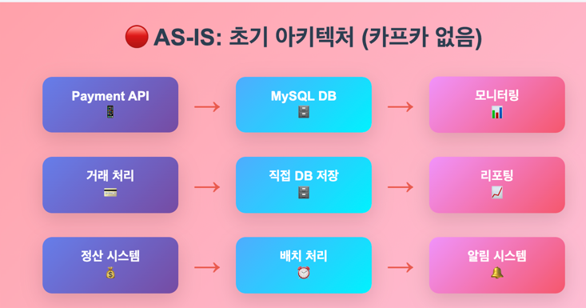
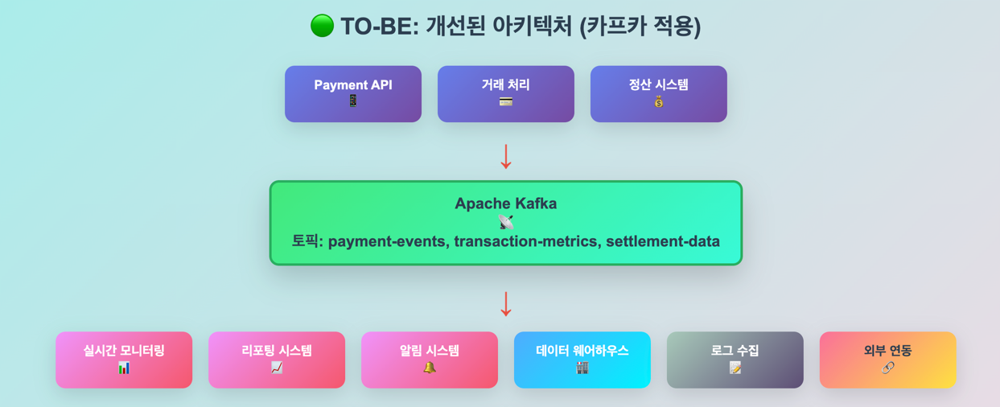

# 1장 카프카 시작하기
- 발행/구독 메시지 전달 패턴
  - 전송자가 수신자에게 직접 메시지를 전달하지 않는다.
  - 발행/구독 시스템은 대부분 발행된 메시지를 중계 해주는 중간 지점 역할을 하는 **브로커**가 존재한다

카프카는 복잡한 서버 아키텍쳐를 단순하게 만들어 줄 수 있는 장점이 있다  

아래 사진은 카프카를 사용하기 전 과 후를 비교한 아키텍쳐 이다  

카프카 사용전 아키텍쳐  

카프카 샤용 후 아키텍쳐  

as is 아키텍쳐ㅑ에서는 point-to-point 연결을 활용하고 있다  
나쁜 아키텍쳐는 아니지만 서비스가 확장 될 수록 유지보수 또는 확장성에 제약이 걸릴 것이다  

## 1.2 카프카 입문
분산 커밋 로그, 분산 스트리밍 플랫폼 이라고 불리기도 한다  
파일시스템이나 db 커밋 로그는 모든 트랜잭션 기록을 지속성 있게 보존함으로써 시스템의 상태를 일관성 있게 복구할 수 있도록 고안되었다  

이와 유사하게 카프카 또한 저장된 데이터는 순서를 유지한채 지속성 있게 보관되며 결정적으로 읽을 수 있다  
또한 확장시 성능을 향상시키고 실패가 발생하더라도 데이터 사용에는 문제가 없도록 시스템 안에서 데이터를 분산시켜 저장할 수 있다  

### 1.2.1 메시지와 배치
카프카에서 데이터의 기본 단위는 **메시지**다  
카프카 입장에서 메시지는 단순히 바이트의 배열일 뿐이기 때문에 여기에 포함된 데이터에는 특정한 형식이나 의미가 없다  
메시지에는 key, value, header 세부 항목이 존재하기는 한다  

key 는 메타데이터이자, 메시지를 저장할 파티션을 결정하기 위해 사용된다  
메시지를 저장할 파티션을 결정하는 가장 간단한 방법은 key 에서 일정한 해시값을 생성 후 이 값을 토픽의 파티션 수로 나눈 나머지의 파티션에 저장을 한다  
위 방법은 같은 키 값을 가진 메시지는 항상 같은 파티션에 저장되게 한다  

카프카는 효율성을 위해 메시지를 **배치** 단위로 저장한다  
배치는 그저 같은 토픽의 파티션에 쓰여지는 메시지들의 집합일 뿐이다  

메시지 발행 시 네트워크를 오가며 오버헤드가 발생할 수 있다, 이 것을 배치 를 통해서 줄일 수 있다  
하지만 이것은 지연과 처리량 사이에 트레이드 오프를 발생시킨다  

즉 배치가 커질수록 시간당 처리되는 메시지의 수는 늘지만, 메시지가 전달되고 처리되는데는 시간이 오래걸릴 수 있다  

### 1.2.2 스키마
카프카 입장에서는 메시지는 단순한 바이트 배열일 뿐이지만, 내용을 이해하기 쉽도록 일정한 구조를 부여하는 것을 권장한다  
Java/Spring 진영에서는 데이터 전달 형식을 Json 을 많이 활용하니, Json 을 활용하도록 하자  

아니면 apache avro 또한 많이 사용된다고 한다  

kafka 는 메시지 쓰기/읽기 작업을 분리하기 때문에 일관적인 데이터 형식이 중요하다  

### 1.2.3 토픽과 파티션
카프카에 저장되는 메시지는 토픽 단위로 분류된다  
토픽과 비슷한 예시로는 rdb 에 테이블이라고 생각하면 된다  

그리고 토픽은 다시 여러 개의 파티션으로 나뉘어 진다  

파티션에 메시지가 쓰여질 때는 추가만 가능한 형태로 쓰여지고, 읽을 때는 맨 앞 부터 제일 끝까지의 순서로 읽힌다  
대게 토픽에 여러 개의 파티션이 있는 만큼 토픽 안의 메시지 전체에 대해 순서는 보장되지 않고, 단일 파티션 안에서만 순서가 보장될 뿐이다  
파티션은 카프카가 데이터 중복과 확장성을 제공하는 방법이기도 하다  
각 파티션이 서로 다른 서버에 저장될 수 있기 때문에 하나의 토픽이 여러 개의 서버로 수평적으로 확장되어 하나의 서버의 용량을 넘어가는 성능을 보여줄 수있다  

그리고 파티션은 복제될 수 있으므로, 서로 다른 서버가 동일한 파티션의 복제본을 저장하고 있기에 서버 중 하나에 장애가 발생해도 그 파티션을 가진 다른 서버에서 처리를 할 수 있다  

카프카와 같은 시스템을 이야기 할 때는 '**스트림**' 이라는 용어가 자주 사용된다  
대부분의 경우 스트림은 하나의 토픽에 저장된 데이터로 간주되며, 프로듀서 ~ 컨슈머로의 하나의 데이터 흐름을 나타낸다  

### 1.2.4 프로듀서와 컨슈머
**프로듀서**는 새로운 메시지를 생성한다 (pub=발행자) 라고도 불린다.  
메시지는 특정 토픽에 쓰여진다  

**컨슈머**는  메시지를 읽는다 (sub=구독자) 라고도 불린다  
컨슈머는 1개 이상의 토픽을 구독하여 저장된 메시지들을 각 파티션에 쓰여진 순서대로 소비한다  

**컨슈머는 메시지의 오프셋을 기록함으로써 어느 메시지까지 읽었는지를 유지한다**.  
오프셋은 지속적으로 증가하는 정수값으로, 카프카가 메시지를 저장할 때 각각 부여해주는 메타데이터 이다  

기본적으로 각 메시지는 고유한 오프셋을 가지고, 뒤에 오는 메시지가 앞의 메시지 보다 더 큰 오프셋을 가진다  
위 오프셋을 기반으로 kafka 가 잠시 재기동 되어도 kafka 설정에 의하여 오프셋 제일 최신 것 부터 소비할지, 소비가 되지 않은 오프셋 기준 제일 전에것 부터 처리할지 설정을 할 수 있다  

**컨슈머는 컨슈머 그룹의 일원**으로서 동작한다  
컨슈머 그룹은 토픽에 저장된 데이터를 읽어오기 위해 협업하는 하나 이상의 컨슈머로 이루어진다  
위 컨슈머 그룹을 통하여 대량의 메시지를 갖는 토픽들을 읽기 위해 컨슈머들을 수평 확장할 수 있다  
또한 컨슈머 중 하나가 장애가 발생하여도, 그룹 안의 다른 컨슈머들이 장애가 발생한 컨슈머가 읽고 있던 파티션을 재할당받은 뒤 이어서 데이터를 읽어서 처리한다  
-> 자세한건 4장

### 1.2.5 브로커와 클러스터
하나의 카프카 서버를 '브로커' 라고 부른다  
브로커는 프로듀서로부터 메시지를 전달받아 오프셋을 할당한 뒤 디스크 저장소에 쓴다  

브로커는 컨슈머의 파티션 읽기 요청을 처리하고 발행된 메시지를 보내준다  
시스템 하드웨어의 성능에 따라 다르지만, 하나의 브로커는 초당 수천개의 파티션과 수백만개의 메시지를 쉽게 처리할 수 있다 

카프카 브로커는 클러스터의 일부로서 작동하도록 설계되었다  
하나의 클러스터 안에 여러 개의 브로커가 포함되며, 그 중 하나의 브로커가 클러스터 컨트롤 역할을 한다 
(컨트롤러는 클러스터 안의 작동중인 브로커 중 하나가 자동으로 선정된다) 

컨트롤러는 파티션을 브로커에 할당하고 장애가 발생한 브로커를 모니터링한다  
파티션은 클러스터 안의 브로커 중 하나가 담당하며, 그 브로커를 '파티션 리더' 라고 한다  

복제된 파티션이 여러 브로커에 할당할 수도 있는데 이것은 파티션의 '팔로워' 라고 한다  
복제 기능은 파티션의 메시지를 중복저장 함으로써 리더 브로커에 장애 발생 시 팔로워 중 하나가 리더 역할을 이어받을 수 있도록 한다. 

- 즉 여러개의 브로커가 존재하고, 그 중에서 컨트롤러 브로커(파티션 리더)가 존재한다.
- 브로커를 한개로 묶는 클러스터 기능이 존재한다.

### 1.2.6 다중 클러스터
- 카프카 프로젝트는 데이터를 다른 클러스터로 복제하는 '미러메이커' 라는 툴이 포함되어 있다.

## 1.3 why kafka?
- 다중 프로듀서
    - 일관성 있게 메시지를 전달하고 응답 받을 수 있다.
- 다중 컨슈머
    - 다수의 카프카 컨슈머는 컨슈머 그룹의 일원으로 작동함으로써 하나의 스트림을 여럿이 나누어서 사용 가능하다.
- 디스크 기반 보존
    - 토픽 설정 시 보관 기간 및 메시지 크기 등 지정을 할 수 있다.
    - 즉 데이터 유실을 최소화 할 수 있다.
- 확장성
    - 카프카는 작동중인 시스템에도 영향을 주지 않으면서 확장이 가능하다.
- 고성능
- 플랫폼 기능
- 데이터 생태계

## 1.4 이용 사례
- 활동 추적
- 메시지 교환
- 지표 및 로그 수집
    - metric, elk 로그 지표
- 커밋 로그
    - 실시간 업데이트를 확인할 수 있다.
- 스트림 처리
    - 실시간 데이터를 처리하기 적합하다.

카프카는 링크드인 내부 데이터 파이프라인 문제를 해결하기 위해 개발되었다  

