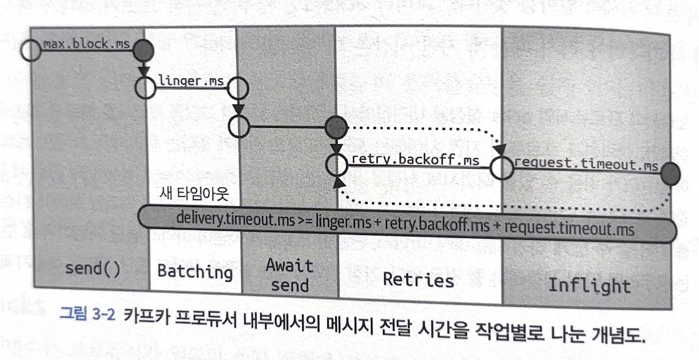

# 3장 카프카 프로듀서: 카프카에 메시지 쓰기
카프카를 큐로 사용하든, 메시지 버스나 데이터 저장 플랫폼으로 사용하든 간에 카프카를 사용할 때는 카프카에 데이터를 쓸 때 사용하는 프로듀서나 읽어올 때 사용하는 컨슈머, 혹은 두 가지 기능 모두를 수행하는 어플리케이션을 생성해야 한다 <br>
아파치 카프카는 개발자들이 카프카와 상호작용하는 애플리케이션을 개발할 때 사용할 수 있는 클라이언트 API와 함께 배포 된다 <br>

## 3.1 프로듀서 개요
애플리케이션이 카프카에 메시지를 써야 하는 상황에는 여러가지가 있다
- 감사, 분석 -> 사용자 패턴 기록, 성능, 메트릭 기록, 로그 메시지 저장, 비동기 통신 수행

카프카에 데이터를 전송할 때 수행되는 주요 단계는 아래와 같다
```text
프로듀서 send() -> 직렬화 -> 파티션 결졍 -> 토픽, 파티션에 저장
```

위 플로우가 기본 플로우며, 에러가 발생할 경우 재시도를 하거나 예외를 발생시키거나 할 수 있다 <br>

Kafka 에 메시지를 쓰는 작업은 ProducerRecord 객체를 생성함으로써 시작된다 <br>
위 레코드가 저장될 토픽과 밸류 지정은 필수 사항이지만, 키와 파티션 지정은 선택사항이다 <br>

첫번째로 ProducerRecord 를 전송하는 api 호출 발생 시 키와 값 객체가 네트워크 상에서 전송될 수 있도록 직렬화 하여 바이트 배열로 변환하는 과정이다 <br>
만약 파티션을 명시적으로 지정하지 않으면, 라운드 로빈 방식으로 데이터를 파티션에게 보낸다 <br>

파티션이 결정되어 메시지가 전송될 토픽과 파티션이 확장되면 프로듀서는 이 레코드를 같은 토픽과 파티션으로 전송될 레코드들은 모은 레코드 배치에 추가한다 <br>
그리고 별도의 스레드가 이 레코드 배치를 적절한 카프카 브로커에게 전송한다 <br>

브로커는 메시지를 받으면 응답을 돌려주게 되어있다 <br>
메시지가 성공적으로 저장 되었을 경우 브로커는 토픽, 파티션, 그리고 해당 파티션 안에서 레코드의 오프셋을 담은 RecordMetadata 객체를 리턴한다 <br>

## 3.2 카프카 프로듀서 생성하기
- bootstrap.servers
  - 카프카 브로커의 host:port 목록
  - **2개 이상 지정할 것 권장**
- key.serializer
- value.serializer

SpringBoot 환경에서는 application.yml 또는 config 클래스에서 설정을 지정할 수 있다 <br>

상황에 따라 다르겠지만 <String, String> 구조 또는 <String, Object> 구조를 많이사용한다 <br>
그러므로 key 는 StringSerializer, value 는 JsonSerializer 를 자주 사용한다 <br>

#### 예시
```java
@Configuration
public class KafkaProducerConfig {

    @Value(value="${spring.kafka.bootstrap-servers}")
    private String bootstrapAddress;

    @Bean
    public ProducerFactory<String, Object> producerFactory() {
        Map<String, Object> configProps = new HashMap<>();
        // Producer 가 처음으로 연결할 Kafka 브로커 host:port 설정
        configProps.put(ProducerConfig.BOOTSTRAP_SERVERS_CONFIG, bootstrapAddress);
        
        // 직렬화 메커니즘 설정
        configProps.put(ProducerConfig.KEY_SERIALIZER_CLASS_CONFIG, StringSerializer.class);
        configProps.put(ProducerConfig.VALUE_SERIALIZER_CLASS_CONFIG, JsonSerializer.class);

        return new DefaultKafkaProducerFactory<>(configProps);
    }

    @Bean
    public KafkaTemplate<String, Object> kafkaTemplate() {
        return new KafkaTemplate<>(producerFactory());
    }
}

```

위 보다 더 디테일한 설정들이 있지만, 그건 추후 다룰 예정 <br>

#### 메시지 전송 방식
- 파이언 앤 포켓
  - 메시지를 서버에 전송 후 성공, 실패 여부는 신경쓰지 않는다.
  - 에러 발생시 메시지가 유실될 수 있음
- 동기적 전송
  - 기본 카프카 프로듀서는 비동기적이다.
  - 메시지를 보낸 후 send() 메소든 Future 구현체 리턴 -> 다음 메시지 처리 전 get() 메소드를 호출해서 작업이 완료될 때 까지 기다렸다가 처리 가능
- 비동기적 전송
  -콜백 함수와 함께 send() 메소드를 호출하면 카프카 브로커로부터 응답을 받는 시점에 자동으로 콜백 함수가 호출된다.


## 3.3 카프카로 메시지 전달하기
### 3.3.0 파이언 앤 포켓
```java
ProducerRecord<String, String> record = new ProducerRecord<>("abcd","asd","dasd");
try {
    producer.send(record);
} catch(Exception e) {
    e.printStackTrace();    
}
```

가장 쉽게 사용하는 방법은 위 방법이고, 위 방법은 메시지 전송 후 성공, 실패에 전혀 관심이 없다 <br>
try ~ catch 를 통해서 메시지 send() 시에 발생하는 예외에만 관심이 있다 <br>

### 3.3.1 동기적 메시지 전송
결론부터 말하면 위 방법은 카프카의 장점을 조금 살리지 못한다, 즉 성능이 조금 딸린다 <br>
동기적 전송시 전송 스레드는 블로킹 되었기에 아무것도 못하면서 대기 해야 한다 <br>

동기적 메시지 전송 예시는 아래와 같다
```java
ProducerRecord<String, String> record = new ProducerRecord<>("abcd","asd","dasd");
try {
    producer.send(record).get();
} catch(Exception e) {
    e.printStackTrace();    
}
```

send() 후에 .get() 메소드를 사용한다 <br>
Future.get() 메소드를 사용하여 레코드가 카프카로 성공적으로 전송이 되고 프로듀서 메타데이터를 응답 받지 못하면 예외가 발생한다 <br>


### 3.3.2 비동기 메시지 전송
대부분의 경우 카프카를 사용한다면 메시지 보내고 응답은 필요없는 경우가 많다 <br>
카프카는 레코드를 쓴 뒤 레코드의 토픽, 파티션 그리고 오프셋을 리턴한다 <br>

비동기 처리시 에러를 처리를 위해서 callback 을 지정할 수 있다
```java
public class AsyncProducerCallback implements Callback {
    
    @Override
    public void onCompletion(RecordMetadata recordMetadata, Exception e) {
        if(e != null) 
            e.printStackTrace();
    }
}

// 카프카 메시지 전송 시
producer.send(record, new AsyncProducerCallback());
```

## 프로듀서 설정하기
카프카 프로듀서 기본 설정은 대부분 합리적인 값으로 기본값 설정이 되어 있다 <br>
하지만 몇몇 설정값은 메모리, 사용량, 성능 이슈로 인해 커스텀 할 필요가 있다 <br>

- client.id
  - 프로듀서와 컨슈머 어플리케이션을 구분하기 위한 논리적 식별자


- acks
  - 이 변수는 메시지가 유실될 가능성에 큰 영향을 미치는데, 구체적인 상황에 따라서 기본값이 최적의 선택이 아닐 수 있다
  - acks=0
    - 프로듀서는 메시지가 성공적으로 전달되었다고 간주하고 브로커의 응답을 기다리지 않는다.
    - 메시지 유실이 일어날 스 있다
    - 하지만 가장 빠르게 메시지를 보낼 수 있다 -> 매우 높은 처리량이 필요할 때 사용된다.
  - acks=1
    - 프로듀서는 리더 레플리카가 메시지를 받는 순간 브로커로부터 성공했다는 응답을 받는다.
    - 메시지 유실이 덜하지만, 메시지 유실이 일어날 수 있음
  - acks=all
    - 메세지가 모든 인-싱크 레플리카에 전달된 뒤에야 브로커로부터 성공했다는 응답을 받는다.
    - 가장 안전한 형태인데, 최소 2개 이상의 브로커가 해당 메시지를 가지고 있으며, 이는 메시지 유실에 걱정이 없다.



### 메시지 전달 시간
- max.block.ms
  - 프로듀서가 얼마나 오랫동안 블록되는지를 결정한다.
  - 프로듀서의 전송 버퍼가 가득 차거나 메타데이터가 아직 사용가능하지 않을 경우 블록된다.
  - 위 상황에서 max.block.ms 에 지정한 시간이 흐르면 예외가 발생한다.
- delivery.timeout.ms
  - send() 후 레코드가 배치에 저장된 시점부터 브로커가 응답을 받거나 전송을 포기하는 시점까지 제한시간이다.
  - 메시지는 보통 위 delivery.timeout.ms 보다 빠르게 전송된다
  - 프로듀서가 재시도를 하는 중 delivery.timeout.ms 시간이 어보되면 에러가 함께 콜백된다.
- request.timeout.ms
  - 프로듀서가 데이터 전송 시 서버로부터 응답을 받기 위해 얼마나 기다릴것인지 결정
  - 이 값은 각각의 쓰기 요청 후 전송을 포기하기까지 대기하는 시간이다.
  - 이 값은 재시도, 실제 전송 이전 작업 시간을 포함하지 않으므로 잘 고려해야 한다.
- retries, retry.backoff.ms
  - 프로듀서가 서버로부터 에러 메시지를 받았을 때 일시적인 에러가 있을 수 있다.
  - 이때 retries 매개변수는 프로듀서가 메시지 전송을 포기하고 에러를 발생시킬 때 까지 메시지를 재전송하는 횟수를 결정한다.
  - 위 옵션은 **재시도 간격을 조정**하는 옵션이다.
- linger.ms
  - 현재 배치를 전송하기 전까지 대기하는 시간을 결정한다.
  - 기본적으로 프로듀서는 메시지 전송에 사용할 스레드가 있을 경우 곧바로 전송한다.
  - 위 설정을 0보다 큰값으로 설정하면 메시지 전송 전 메시지를 몇개 추가할 수 있도록 몇ms 지연시킨다
  - 이것은 지연이 증가하지만, 처리량이 늘어난다.
- buffer.memory
  - 메시지 전송 전 메시지 대기시키는 버퍼의 크기를 결정한다.
- compression.type
  - 기본적으로 메시지는 압축되지 않고 전송된다.
  - 위 설정은 압축 성능 및 네트워크 대역폭 모두가 중요할 때 권장된다.
- batch.size
  - 같은 파티션에 다수의 레코드가 전송될 경우 프로듀서는 이것들을 배치 단위로 모아서 한꺼번에 전송한다.
  - 위 매개변수는 각 배치에 사용될 메모리의 양을 결정한다 -> 레코드 개수가 아닌 바이트 단위이다.
  - 이 설정은 각 배치 크기만큼 찰 때 까지 기다리는 것은 아니다. 
  - 즉 위 매개변수를 크게 잡아도, 메시지 전송에 지연이 발생하지 않는다.
  - 반면 위 값을 지나치게 작게 설정하면 프로듀서가 지나치게 자주 메시지를 전송하기 약간의 오버헤드가 발생한다.
- max.in.flight.requests.per.connection
  - 프로듀서가 서버로부터 응답을 받지 못한 상태에서 전송할 수 있는 최대 메시지의 수를 결정한다.
  - 위 값을 올려주면 메모리 사용량이 증가하지만, 처리량 역시 증가한다.
- max.request.size
  - 프로듀서가 전송하는 쓰기 요청의 크기를 결정한다. (기본값 1MB)
- receive.buffer.bytes, send.buffer.bytes
  - 데이터 읽기/쓰기 TCP 송수신 버퍼의 크기를 결정한다.
- enable.idempotence
  - 멱등적 프로듀서는 그중에서도 간단하면서도 매우 중요한 부분
  - 신뢰성을 최대한 보장하는 방법 -> acks=all, delivery.timeout.ms= 큰값 설정
  - max.in.flight.requests.per.connection= 5 이하 설정
  - retries= 1이상
  - acks=all 
  - 위 설정을 잡아주고 enable.idempotence=true 설정을 해야한다.

    
## 3.5.Serialize
프로듀서 및 컨슈머 설정시 반드시 직렬화 설정을 지정해주어야 한다 <br>

### 3.5.1 커스텀 시리얼라이저
카프카로 전송해야 하는 객체가 단순한 문자열이나 정숫값이 아닐 경우에는 두 가지 선택지가 있다
- 레코드 생성을 위한 에이브로, 스리프트, 프로토버프 같은 범용 직렬화 라이브러리 사용
- 커스텀 직렬화 로직

대부분은 라이브러리를 권장하지만, 동작 과정을 알기 위해서 커스텀을 해보자 <br>

프로듀서 생성시 CustomSerializer 를 사용해서 설정값을 잡아주면, ProducerRecord<String, Customer> 를 사용하여 Customer 객체를 바로 프로듀서에 전달할 수 있다 <br>
하지만 유지보수 차원에서 Json, apache avro, protobuf 같은 범용 라이브러리를 사용하는 것을 권장한다 <br>

### 3.5.2 아파치 에이브로
즉 스키마를 지정하고 사용을 하는 것이다 <br>
지정된 포맷되로 producer 가 되고 consumer 가 데이터를 가져가서 처리하는 것이다 <br>
- 스키마 레지스트리 패턴

## 3.6. 파티션
카프카 메시지는 key,value 한 쌍이라고 할 수 있다 <br>
key 의 기본값은 null 이므로 토픽과 밸류값만 있어도 ProducerRecord 생성이 가능하지만, 대부분 key 값이 지정된 레코드를 쓴다 <br>
key 의 역할은 메시지에 함께 저장되는 추가적인 정보이기도 하지만, 하나의 토픽에 속한 여러 개의 파티션 중 해당 메시지가 저장될 파티션을 결정짓는 기준점이기도 하다 <br> 
같은 키 값을 가진 모든 메시지는 같은 파티션에 저장되는 것이다 <br>

기본 파티션 중에 키값이 null 인 레코드가 주어질 경우, 레코드는 현재 사용 가능한 토픽의 파티션 중 하나에 랜덤하게 저장된다 <br>
각 파티션별로 저장되는 메시지 개수의 균형을 맞추기 위해 라운드 로빈 알고리즘이 사용된다 <br>

## 3.7 헤더
레코드는 키,밸류 외에 헤더를 포함할 수 있다 <br>
헤더는 키,밸류를 건들지 않고 추가 메타데이터를 심을 때 사용한다 <br>

헤더의 주된 용도 중 하나는 메시지의 전달 내역을 기록하는 것이다 -> 메시지 출처를 알기 쉽다. <br>

헤더는 순서가 있는 키/밸류 쌍의 집합으로 구현되어 있다 <br>
키 값은 언제나 String 타입이어야 하지만, 밸류값은 아무리 직렬화된 객체라도 상관없다 <br>

### 3.8 인터셉터
인터셉터의 일반적인 사용사례로는 모니터링, 정보 추적, 표준 헤더 삽입등이 있다 <br>

즉, producer 가 메시지를 보낼 때 중간에서 가로채서 어떠한 작업을 진행할 수 있다 <br>

### 3.9. 쿼터, 스로틀링
카프카, 브로커에는 쓰기/읽기 속도를 제한할 수 있는 기능이 있다 <br>
한도(쿼터) 를 설정해주면 된다 <br>
(쓰로틀링 -> 일시적으로 성능을 낮춘다) <br>

1. 쓰기 쿼터
2. 읽기 쿼터
3. 요청 쿼터

쓰기, 읽기는 클라이언트가 데이터를 전송하거나 받는 속도를 초당 바이트 수 단위로 제한한다 <br>
요청 쿼터의 경우 브로커가 요청을 처리하는 시간 비율 단위로 제한한다 <br>

위 설정을 교체하고 싶다면 kafka 설정 파일을 교체한 뒤 모든 브로커를 재시작 해야 한다 <br>


## 요약
kafka producer 전송방식 및 설정 매개변수에 대하여 자세하게 알아보았다 <br>
그리고 메시지 전송시 직렬화에 대한 내용도 같이 알아보았다 <br>


