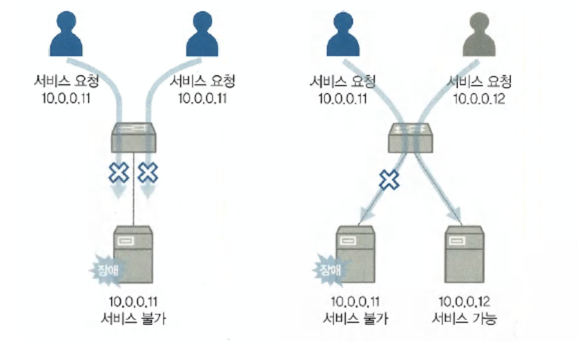
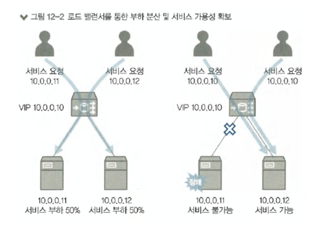
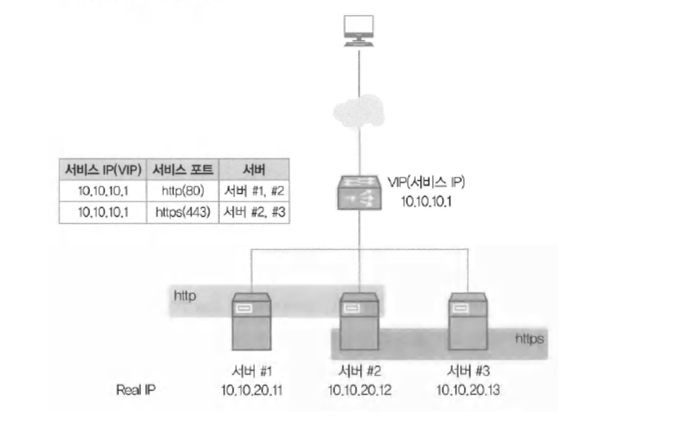
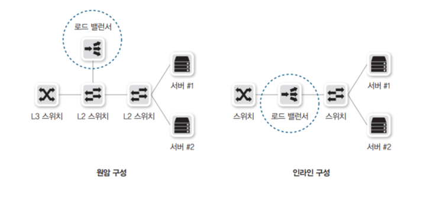
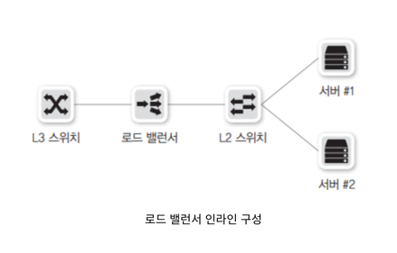

# 들어가며 

## 로드밸런서
서비스의 안정성이나 가용량을 높이기 위해 서비스를 이중화 할때 는 서비스 자체적으로 HA 클러스터를 구성하기도 한다  
하지만 복잡한 고려 없이 이중화를 손쉽게 구현하도록 로드밸런서가 많이 사용된다  

로드 밸런서는 다양한 구성 방식과 동작 모드가 있으며 각 방식과 모드에 따라 서비스 흐름이나 패킷 내용이 달라진다  
서비스에 따라 적용해야 하는 구성 방식과 동작 모드가 각각 다르고 고려해야 하는 지점도 다르다  

따라서 로드 밸런서의 구성과 동작 모드를 이해해야만 서비스에 필요한 구성을 할 수 있다  

로드밸런서는 여러 서버로 들어오는 트래픽을 분산시키는 장치, 소프트웨어이다  
로드 밸런서는 클라이언트 - [로드밸런서] - 서버 즉 클라,서버 사이에 위치하며  
사용자는 로드밸런서의 퍼블릭 IP 만 알게되고, 내부 Private IP 는 숨겨진다 

## 부하 분산이란?
서비스 규모가 커지면 물리나, 가상 서버 한대로는 모든 서비를 수용할 수 없다  
스케일업,ㄴ 스케일 아웃 등 여러 스킬이 있다  

한 대의 서버로 운영을 하다가 장애가 생기면 서비스가 다 죽어버린다  
서비스 가용성을 높이기 위해 하나의 서비스는 보통 2개 이상의 서버로 구성한다  

하지만 각 서버 IP 주소가 다르므로 사용자가 서비스를 호출할 때는 어떤 IP 로 서비스를 요청할지 결정해야 한다  
사용자에 따라 호출하는 서버의 IP 가 다르면 특정 서버에 장애가 발생했을 때, 전체 사용자에게 영향을 미치지 않아  
장애 범위는 줄어들겠지만, 여전히 부분적으로 서비스 장애가 발생한다  
 

이런 문제점을 해결하기 위해 L4 나 L7 스위치 라는 로드 밸런서를 사용해야 한다 

로드 밸런서에는 동일한 서비스를 하는 다수의 서버가 등록되고 사용자로부터 서비스 요청이 오면  
로드 밸런서가 받아 사용자별로 다수의 서버에 서비스 요청을 분산시켜 **부하를 분산**시킨다  

사용자가 많은 큰 서비스를 위해 로드 밸런서는 필수 서비스 이다  

로드 밸런서에서는 서비스를 위한 가상 IP 를 하나 제공하고, 사용자는 각 서버의 개별 IP 주소가 아닌 동일한 가상 IP 를 통해 각 서버로 접근한다  

이 외에도 로드밸런서는 각 서버의 서비스 상태를 체크해 서비스가 가능한 서버로만 사용자의 요청을 분산하므로  
서버에서 장애가 발생하더라도 기존 요청을 분산하여 다른 서버에서 서비스를 제공받을 수 있습니다.  
 

참고로 서버에 대한 부하 분산 뿐만 아니라 방화벽을 액티브-액티브 로 구성하기 위해 로드밸런서를 사용하기도 한다  
서버 부하 분산을 SLB, 방화벽 부하 분산을 FWLB 라고 한다  

### 부하 분산 방법
로드 밸런서는 부하를 다수의 장비로 어떻게 분산을 시키는 걸까?  
로드밸런서는 부하를 다수의 장비에 분산시키기 위해 가상 IP 주소를 가진다  

로드 밸런서의 가상 IP 에 실제 부하 분산이 필요한 서버 IP 들이 바인딩 된다  
 
위 사진을 보면 서버가 3대가 있다  
그리고 그 상위에 로드 밸런서가 있고, 그 위에는 실제 User 가 있다  

- 로드 밸런서 에 사용자의 서비스 요청이 들어올 때, 어느 서버로 요청을 전달할지 부하 분산 그룹을 설정한다
- 로드 밸런서에서 부하 분산을 위한 그룹을 만들 때는 위 사진처럼 OSI 3계층 정보인 IP 주소뿐 만 아니라 4계층 정보인 서비스 포트까지 지정해서 만든다.
  - 그래서 로드 밸런서를 L4 스위치라고도 한다.
  - 7계층 정보까지 확인해 처리하는 기능이 포함되는 경우도 있어 L7 스위치라고도 하지만 보통 L4 스위치 라고 한다.

즉 결론적으로 부하 분산 그룹을 지정해서 로드밸런서가 알아서 서버로 보내고 응답을 받아주는 것이다  

### [ 헬스 체크 ]
로드 밸런서를 통해 서비스하는 그룹의 서버에 장애가 발생하면 어떻게 할까? 
혹시 서비스가 정상적으로 되지않는 서버로 서비스를 분산해 일부 사용자에게 서비스되지 않는 경우가 발생하지 않나?  

물론 그런 경우는 발생하지 않을 것이다  
로드밸런서에서는 부하 분산을 하는 각 서버의 서비스를 주기적으로 **헬스 체크**해 정상적인 서비스 쪽으로만 부하를 분산하고 
비정상적인 서버는 서비스 그룹에서 제외해 트래픽을 보내지 않는다  

서비스 그룹에서 제외된 후에도 헬스 체크를 계속 수행해 다시 정상으로 확인되면 서비스 그룹에 해당 장비를 다시 넣어 트래픽이 서버 쪽으로 보내지게 한다  

#### 1) 헬스 체크 방식
로드 밸런서는 다양한 헬스 체크 방식으로 서버의 서비스 정상 여부를 판단할 수 있다  

- ICMP(ping) : 단순히 서버가 살아 있는지 여부만 체크한다.
- TCP 서비스 포트 : 가장 기본적인 방법으로, 로드 밸런서에 설정된 서버으 서비스 포트를 확인한다.
  - TCP 서비스 포트를 체크 할 때 syn/syn, ack/ack, syn/ack 정상적인 3way handshake 를 거친다
- HTTP 상태코드 : 3way handshake 를 거치고 http 요청시 200 응답이 오는지 체크한다.

이 외에도 여러가지 방법이 있다  

그럼 이 헬스체크를 언제 해야할까? 에 대한 고민도 필요하다  
- 주기
- 응답시간
- 시도 횟수
- 타임아웃
- 서비스 다운 시의 주기

위 조건을 고려하여 설정을 해야 한다

## 부하 분산 알고리즘
로드 밸런서가 실제 운영 서버로 부하를 분산할 때, 로드 밸런서에서는 사전에 설정한 분산 알고리즘을 통해 부하 분산이 이루어진다  
- 라운드 로빈
- 최소 접속 방식
- 가중치 기반 라운드 로빈
- 가중치 기반 최소 접속 방식
- 해시

이 외에도 다양한 부하 분산 알고리즘이 존재한다  
이 중에서 가장 자주 사용되는 알고리즘은 3가지 이다  

### [ 라운드 로빈]
현재 구성된 장비에 부하를 순차적으로 분산한다  
총 누적 세션 수는 동일하지만 활성화된 세션 수는 달라질 수 있다  

라운드 로빈은 특별한 규칙이 없다. 그냥 순차적으로 돌아가면서 트래픽을 분산한다  

### [최소 접속 방식]
현재 구성된 장비 중 가장 활성화된 세션 수가 적은 장비로 부하를 분산한다  

로드밸런서는 서비스 요청을 운영 서버로 보내줄 때 마다 세션 테이블이 생성이 된다  
그러므로 각 서버에 연결된 현재 세션 수를 알 수 있다  

즉, 세션테이블에서 가장 세션이 적게 연결된 서버로 서비스 요청을 보낸다  

### [ 해쉬 ]
해시 알고리즘을 이용한 부하 분산  

해시 방식은 서버의 부하를 고려하지 않고, 클라이언트가 같은 서버에 지속적으로 접속하도록 하기 위해 사용하는 부하 분산이다   

라운드로빈 이나 최소 접속 방식은 부하를 비교적 비슷한 비율로 분산시킬수가 있다  
하지만 동일한 출발지에서 로드밸런서를 거친 서비스 요청이 처음에 분산된 서버와 그 다음 요청이 분산된 서버가 달라질 수 있어  
각 서버에서 세션을 유지해야 하는 서비스는 정상적으로 서비스 되지 않습니다  

이와 반대로 해시는 항상 동일한 장비로 서비스가 분산되기에, 세션을 유지해야 하는 서비스에 적합하다  

## 로드 밸런서 구성 방식
- 원암 구성
- 인라인 구성

  

원암 구성은 로드 밸런서가 중간 스위치 옆에 연결되는 구성, 인라인 구성은 서버로 가는 경로에 로드 밸런서를 연결한다  

### [ 원암 구성]
위 사진에서는 로드밸런서가 스위치와 인터페이스 하나로 연결되어 있다 
그렇다고 해서 물리 인터페이스가 하나라는 뜻은 아니다  

이런 원암 구성에서는 서버로 들어가거나 나오는 트래픽이 로드 밸런서를 경유하거나 경유하지 않을 수 있다  
트래픽이 로드 밸런서를 경유하는지 여부는 부하 분산을 이용한 트래픽인지 여부로 구분할 수 있습니다  

원암 구성에서도 2가지로 나뉜다
1) 부하 분산을 이용하는 트래픽의 경우
2) 부하 분산을 이용하지 않는 트래픽의 경우

위 2가지 는 상황에 따라 로드 밸런서를 거칠지 안거칠지를 결정한다  

#### 부하 분산을 이용하는 트래픽의 경우
부하 분산에 사용되는 서비스 IP 정보를 로드 밸런서가 가지고 있어 서버로 유입되는 트래픽은 먼저 로드 밸런서를 거친다  
로드 밸런서에는 각 실제 서버로 트래픽을 분산하고 서버의 응답 트래픽은 다시 로드 밸런서를 거쳐 사용자에게 응답하게 된다  

부하 분산을 이용하지 않을 때는 로드밸런서를 경유하지 않고 네트워크 통신을 한다  

원암 구성시 로드밸런서를 경유하는 트래픽이 감소하여 로드 밸런서가 처리해야 하는 용량이 줄어든다  
하지만 로드 밸런서와 스위치 간에 연결된 인터페이스에서 인바운드 트래픽과 아웃바운드 트래픽을 모두 수용해야 하므로  
이를 고려해 로드 밸런서와 스위치 간 인터페이스의 대역폭을 산정해야 한다  

### [ 인라인 구성 ]
부하 분산을 포함한 모든 트래픽이 로드 밸런서를 경유하는 구성이다  
 

인라인 구성에서는 부하 분산 여부와 상관없이 모든 트래픽이 동일한 경로로 흐르므로 구성이 직관적이고 이해하기 쉽다  
단점으로는 모든 트래픽이 로드 밸런서를 경유하므로 로드 밸런서의 부하가 높아진다  

## 로드 밸런서 동작 모드
로드 밸런서 구성 방식에는 크게 2가지가 있었다  

로드 밸런서 동작 모드를 이해하기 위해서는 로드 밸런서 구성 방식에 대한 이해도가 조금 필요하다  

로드 밸런서 동작 모드에 따라 패킷 통신 방식도 달라지므로, 로드 밸런서 동작 모드의 이해는 로드 밸런서의 운용 및 장애조치를 위해서 매우 중요하다  

- 트랜스패런트 또는 브릿지
- 라우티드
- DSR

대표적으로 3가지가 있다  

### 트랜스패런트 모드
트랜스패런트 구성은 로드 밸런서가 OSI 2계층 스위치처럼 동작하는 구성이다  
즉 로드 밸런서에서 서비스하기 위해 사용하는 VIP 주소와 실제 서버가 동일한 네트워크를 사용하는 구성이다  

위 구성에서는 트래픽이 로드밸런서를 지나더라도 부하 분산 서비스를 받는 트래픽인 경우에만 4계층 이상의 기능을 수행하며  
부하 분산 서비스가 아닌 경우에는 기존 L2 스위치와 동일한 스위칭 기능만 수행한다  
이 구성을 L2 구조라고 부르기도 한다  

트랜스패런트 모드는 원암 과 인라인 구성에서 모두 사용할 수 있는 동작 모드 이다  

### 라우티드
로드밸런서가 라우팅 역할을 수행하는 모드이다  
즉 로드밸런서를 기준으로 사용자 방향과 서버 방향이 서로 다른 네트워크로 분리된 구성이다  

라우티드 모드는 원암 구성과 인라인 구성에서 모두 구성할 수 있다  

인라인 모드의 라우티드 구성에서 라우티드 모드의 로드 밸런서가 서버의 게이트웨이 역할을 하거나  
로드 밸런서와 서버 사이에 또 다른 L3 장비를 통하는 경우, 해당 L3 장비에서 게이트웨이 역할을 할 수 있다  

### DSR
Direct Server Return 의 약자로 , 사용자의 요청이 로드 밸런서를 통해 서버로 유입된 후에 다시 로드밸런서를 통하지 않고 서버가 사용자에게 직접 응답하는 모드이다  

로드 밸런서에는 응답 트래픽이 유입되지 않으므로, 사용자가 요청하는 패킷에 대해서만 관여한다  
DSR 모드는 응답할 때, 로드 밸런서를 경유하지 않으므로 원암 으로 구성을 한다  

DSR 모드는 L2 DSR 과 L3 DSR 로 구분된다
- L2 DSR 은 실제 서버의 네트워크를 로드 밸런서가 가진 경우
- L3 DSR 은 실제 서버의 네트워크 대역을 로드 밸런서가 가지지 않은 경우

DSR 모드에서는 요청 트래픽만 로드 밸런서를 통해 흐르므로 로드 밸런서 전체 트래픽이 감소해 로드 밸런서 부하가 감소한다  

## 기타
#### Q.로드밸런서에 부하가 심해 다운 된다면??
로드 밸런서에 부하가 심한 경우라 함은, 로드 밸런서 구성을 인라인으로 하여 무조건 로드 밸런서를 거치는 경우일 확률이 높다고 생각한다  

> 로드 밸런서가 터지는 경우가 자주 있나요?

> 로드 밸런서가 터지면 어떻게 해야하는지?

