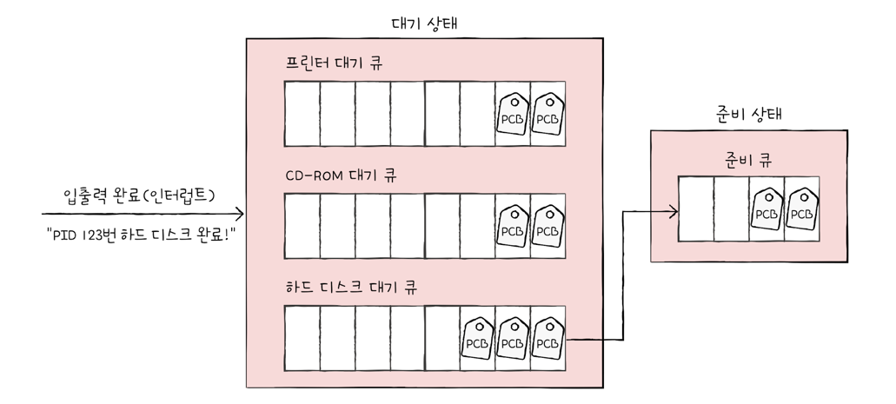
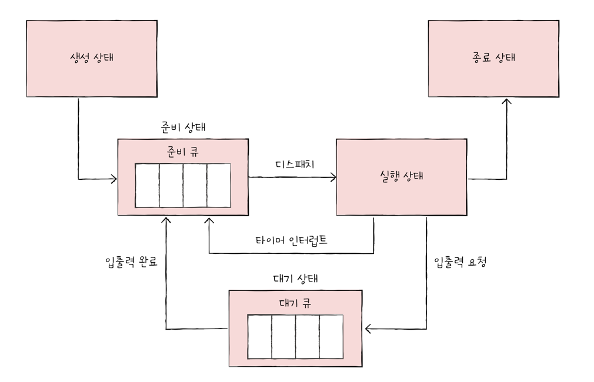

# CPU 스케줄링 개요
모든 프로세스는 CPU 를 필요로하고, 프로세스를 사용하기 위해 cpu 를 할당받아야 한다  
그리고 cpu 는 프로세스에게 어떤 방식으로 공정하고 합리적으로 cpu 를 할당할지 결정해야 한다  

os 가 프로세스들에게 cpu 자원을 배분하는 것을 **cpu 스케줄링** 이라고 한다  
cpu 스케줄링은 컴퓨터 성능과도 직결되기 때문에 중요한 문제입니다  
프로세스들에게 현명하게 CPU 를 배분하지 못하면 반드시 실행되어야 할 프로세스들이 실행되지 못하거나,  
당장 급하지 않은 프로세스들만 주로 실행되는 등 무질서한 상태가 발생할 수 있다   

### 프로세스 우선순위
어떻게 해야 프로세스들에게 공정하게 cpu 를 배분할 수 있을까?  

단순하게 생각해보면, 먼저 온 사람부터 쓰게 하는 거랑, 먼저 쓰고 싶은 사람 부터 쓰게 할 수가 있다  
하지만 위 방법은 CPU 에 대입했을 때는 좋은 방법은 아니다  

이유는 프로세스 마다 **우선순위** 가 다르기 때문이다   

CPU 스케줄링에서 우선순위가 높다? -> 빨리 처리해야 하는 프로세스 를 의미한다  
우선순위가 높은 프로세스들은 대표적으로 I/O 작업을 처리하는 프로세스 이다  

그럼 I/O 작업을 많이하는 프로세스들이 우선순위가 높을까?  
그리고 I/O 작업을 많이하는 프로세스를 먼저 실행하는 것이 왜 더 효율적일까?  

위 2개의 질문에 고민을 해볼 필요가 있습니다  

일반적인 프로세스가 어떤 과정을 거치며 실행되는지를 생각해 봐야 합니다  
- 대부분 프로세스들은 cpu 와 입출력장치를 모두 사용하며 실행된다.
  - 즉 프로세스는 실행, 대기 상태를 반복하며 실행된다

 

ex) 인텔리제이 프로세스는 CPU 에게 명령어를 전달(=실행) 요청하고, User 가 입력한 코드를 메모리에 저장하고  
CPU 는 명령어를 전달받아 실행을 시켜주고, 사용자가 입력한 코드(=내용)을 화면에 보여준다  

그러나 프로세스 종류마다 I/O 작업에 이용하는 CPU 시간과 양이 다를 것이다  
그래서 프로세스는 2개로 나뉜다.
- 입출력 집중 프로세스 ex) 비디오,디스크 백업
  - 실행 상태보다는 입출력을 위한 대기 상태에 프로세스가 더 많이 머무른다.
- CPU 집중 프로세스 ex) 수학 연산, 컴파일, 그래픽 처리 작업.
  - 대기 상태보다는 실행 상태에 더 많이 머무르는 것

즉 cpu 집중 프로세스는 cpu 를 많이 사용해야하고, 입출력 집중 프로세스는 그럴 필요는 없다  
하지만 많이 사용해야 하는 프로세스와 딱히 많이 사용할 필요 없는 프로세스를 둘이 동일 빈도로 공평하게 cpu 를 할당받는게 맞을까?  

그럼 CPU 집중 프로세스,입출력 집중 프로세스가 동시에 CPU 자원을 요구한다면??  
효율적인건 당연히 빈도 수가적은 입출력 집중 프로세스를 먼저 실행시키고,  
CPU 사용량이 많은 CPU 집중 프로세스를 자주 실행시키는 것이 효율적이라고 생각할 것 이다  

어차피 cpu 는 1개의 프로세스에게만 cpu 를 할당할 수 있기에, 입출력집중프로세스에 입출력 작업 끝나기 전까지는 나머지 프로세스들은 '대기상태' 로 있어야 한다  
 

이렇게 모든 프로세스가 CPU 를 차례대로 돌아가며 사용하는 것보다 각 상황에 맞게 유동적으로 CPU 를 배분하는 것이 더 효율적이다  

os 는 프로세스 마다 우선순위를 부여한다  
그리고 그 우선순위는 커널영역 메모리 -> PCB 에 명시해둔다  
PCB 에 적힌 우선순위를 기준으로 먼저 처리할 프로세스를 결정한다   

> $ ps -el
> >   UID   PID  PPID        F CPU PRI NI       SZ    RSS WCHAN     S             ADDR TTY           TIME CMD

위 명령어 입력후 PRI 가 우선순위 이고, NI 가 우선순위에 영향을 미치는 값이다  
NI 값이 높을 수록 프로세스 우선순위가 낮아진다.

### 스케줄링 큐
PCB 에 우선순위(=PRI) 가 있지만, CPU 를 사용할 다음 프로세스를 os 가 매번 직접 찾기 위해 모든 프로세스 PCB 를 체크하는 것은 비효율적이다  
cpu 를 원하는 프로세스들은 한 두개가 아니고, CPU 를 요구하는 새로운 프로세스는 언제든 생길 수 있다  

그래서 os 는 프로세스에게 줄을 서서 기다릴 것을 명령한다  
이 걸 '**스케줄링 큐**' 로 구현하고 관리한다  
(여기서 말하는 큐는 자료구조 Queue(FIFO) 랑은 비슷하지만, Os 큐는 꼭 FIFO 일 필요는 없다) 

즉, os 는 메모리로 적재되고 싶은 (새로 생성되는) 프로세스들을 큐에 삽입하여 줄을 세우고  
cpu 를 이용하고 싶은 프로레스들 또한 큐에 삽입하여 줄을 세우고, 특정 I/O 장치 이용하고 싶은 프로세스들 역시 큐에 삽입하여 줄을 세운다  

os 가 관리하는 대부분은 자원은 큐로 관리 된다  
대표적인 큐로는 준비 큐, 대기 큐 가 있다  
- 준비 큐: CPU 를 이용하고 싶은 프로세스들이 서는 줄 -> **준비 상태 줄**
- 대기 큐: 입출력 장치를 이용하기 위해 대기 상태에 접어든 프로세스들이 서는 줄 -> **대기 상태 줄**

준비 상태에 있는 프로세스들의 PCB 는 준비큐의 마지막에 삽입되어 cpu 할당 차례를 기다린다  
os 는 준비큐에서 프로세스 한개씩 꺼내어 실행하되, 우선 순위가 높은 프로세스를 먼저 실행한다  

우선순위가 낮은 프로세스들이 먼저 큐에 들어와도, 우선순위가 높은 뒤늦게 들어온 프로세스들이 먼저 실행될 수 있다  

대기 상태도 마찬가지로 위 내용과 같다  
같은 장치를 요구한 프로세스들은 같은 대기 큐에서 기다리다가, 앞에 프로세스가 cpu 할당이 끝나, 완료 인터럽트가 발생하면  
Os 는 대기 큐에서 작업이 완료된 PCB 를 찾고, 이 PCB 를 대기 -> 준비 상태로 변경하고 대기 큐에서 삭제한다  
 

프로세스 상태 다이어그램을 잘 알고 있다면 위 내용 또한 잘 이해가 갈 것이다. 
 

### 선점형과 비선점형 스케줄링
선점형 스케줄링은 프로세스가 CPU 를 비롯한 자원을 사용하고 있더라도 운영체제가 프로세스로 부터 자원을 강제로 빼앗아 다른 프로세스에 할당할 수 있는 스케줄링 방식이다  
어느 하나의 프로세스가 cpu 사용을 독점할 수 없는 스케줄링 방식이다  

비선점형 스케줄링은 하나의 프로세스가 CPU 를 할당 받을 때, 프로세스가 종료되거나 스스로 대기 상태에 접어들기 전까진 다른 프로세스가 끼어들 수 없는 스케줄링 방식이다  
즉 어느 하나의 프로세스가 cpu 사용을 독점할 수 있는 스케줄링 방식이다  

현재 대부분 os 는 선점형 스케줄링 방식을 사용하지만, 각각의 장단점이 있다. 

#### 선점형 스케줄링
- 급한 프로세스가 언제든 끼어들 수 있다.
- 자원 독점을 막고, 골고루 cpu 를 할당한다.
- 하지만 cpu 할당이 교체되고 프로세스가 PCB 에 기록하는, 문맥 교환 과정에서 오버헤드가 발생할 수 있다.

#### 비선점형 스케줄링
- 문맥교환의 수가 선점형 스케줄링 보다 적어 오버헤드가 적다.
- cpu 를 독점할 수 있다.
  - 즉, 다른 프로세스가 cpu 가 필요해도, 기존 프로세스가 cpu 할당이 끝날 때 까지 대기해야한다.

자세한건 나중에 위 주제를 가지고 다시 이야기를 해보겠습니다.