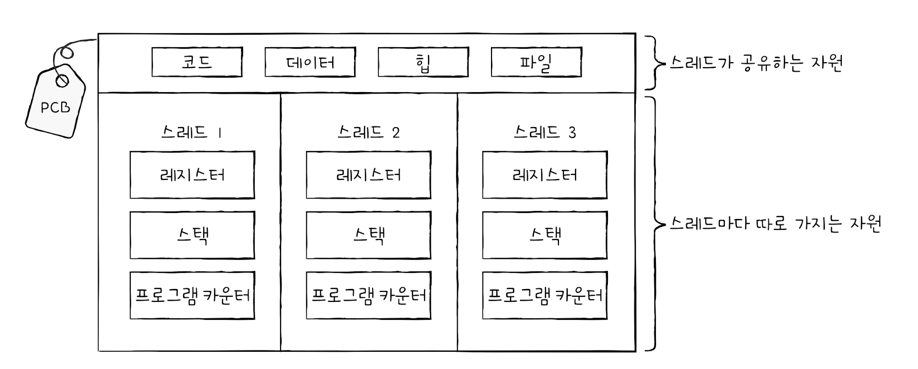

# 스레드
스레드를 간단하게 설명하자면, 프로세스를 구성하고 있는 실행 흐름 단위 이다  
즉 수 많은 스레드가 프로세스 안에서 활동하고 있다는 뜻이다  

1개의 프로세스는 여러 개의 스레드를 가질 수 있다  
스레드를 이용하면 하나의 프로세스에서 여러 부분을 동시에 실행할 수 있습니다  
(*스레드는 실행의 단위 이다)

개발을 하다보면 스레드라는 단어를 무조건적으로 듣게 된다  
 

### 프로세스와 스레드
예전에는 한 프로세스는 한 개의 일만 처리했다  
하지만 스레드 라는 개념이 도입되면서 하나의 프로세스가 한 번에 여러 일을 동시에 처리할 수 있게 되었다  

즉 한 프로세스 안에서 여러개의 명령어가 실행될 수 있다는 뜻이다  
위 관점에서 볼 때 스레드는 '프로세스를 구성하는 실행 단위' 라고 볼 수 있다  

스레드는 프로세스 내에서 각각 다른 스레드ID, 프로그램카운터, 레지스터 값, 스택,힙 으로 구성된다  
그러므로 각 스레드는 다른 코드를 실행할 수 있다          
여기서 중요한 점은 프로세스,스레드 들은 실행에 필요한 최소한의 정보(프로그램 카운터,레지스터,스택) 만을 
유지한채 프로세스 자원을 공유하며 실행된다는 점이다  

프로세스의 자원을 공유한다는 것이 스레드의 핵심이다  

즉 쉽게 말해서 스레드 들은 각자만의 공간인(프로그램 카운터,레지스터, 스택) 영역을 가지고 있지만  
나머지 힙,데이터,코드 영역은 다같이 공유하는 공간으로 쓴다는 말이다  

모든 프로그램에는 프로세스가 있고, 프로세스에는 스레드가 있다  
요즘 os 는 CPU 에 처리할 작업을 전달할 때 프로세스가 아닌 스레드 단위로 전달한다  

그리고 스레드는 프로세스 자원을 공유한 채 실행에 필요한 최소한의 정보만으로 실행됩니다  

> 리눅스 os 에서는 프로세스,스레드를 구분하지 않고 task 로 통일 한다.

### 멀티프로세스와 멀티스레드
우리들은 현재 멀티프로세스를 사용하고, 멀티 스레드를 사용하면서 PC를 이용하고 있다  

한 가지 궁금증이 생깁니다. 
동일한 작업을 수행하는 단일 스레드 프로세스 여러 개를 실행하는 것과 하나의 프로세스를 여러 스레드로 실행하는 것은 무엇이 다를까?  
결과는 같을 수도 있다, 하지만 내부적인 작업은 전혀 틀릴 것이다  

📌 프로세스는 기본적으로 자원을 공유하지 않지만, 스레드는 같은 프로세스 내의 자원을 공유한다  
프로세스로 똑같은 작업을 반복하면, 지속적인 fork 를 통하여 서로 다른 여러 프로세스가 메모리에 적재될 것이다. 이것은 메모리 낭비를 의미한다  
지속적인 fork 또한 시스템 콜을 하기 때문에 CPU 를 할당받기 때문에 비용이 들기 때문이다  

이에 반해 스레드들은 각 다른 스레드ID, 프로그램 카운터 등 다른 값을 가지지만, 나머지 동일한 주소 공간의 코드,데이터,힙,파일 자원을 공유한다  
즉 여러 프로세스를 병행 실행 보다는, 메모리를 더 효율적으로 사용할 수 있을 것이다  
 

프로세스의 자원을 공유한다는 특성은 때로는 단점이 될 수도 있다  
멀티프로세스 환경에서는 하나의 프로세스에 문제가 생겨도, 다른 프로세스에는 지장이 적거나 없지만  
멀티 스레드 환경에서는 하나의 스레드에 문제가 생기면 프로세스 전체에 문제가 생길 수 있다  

모든 스레드는 프로세스의 자원을 공유하고, 하나의 스레드에 문제가 생기면 다른 스레드도 영향을 받기 때문이다  

📌 프로세스간 자원 공유를 IPC 라고 한다  