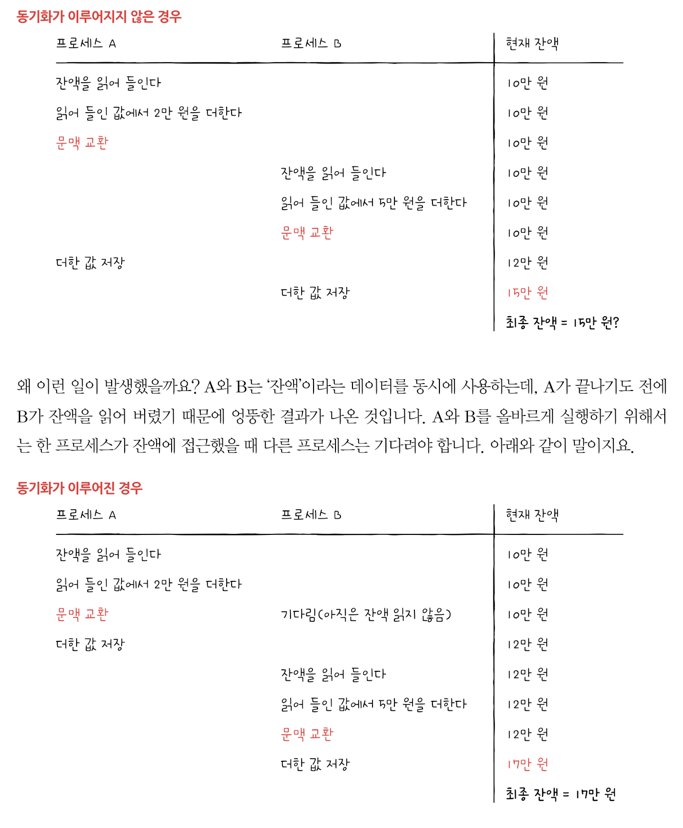
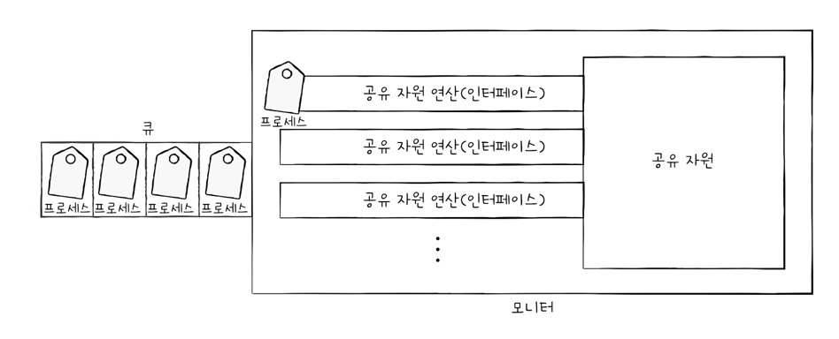
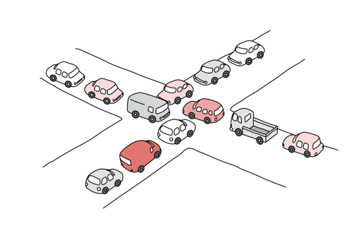

# 프로세스 동기화

> 이책은 혼자 공부하는 운영체제 - 강민철 님 책을 참고하여 작성한 글 입니다

## 1. 동기화란?

동시다발적으로 실행되는 프로세스들은 공동의 목적을 올바르게 수행하기 위해 서로 협력하며 영향을 주고 받기도 한다 <br>
이렇게 협력하여 실행되는 프로세스들은 실행 순서와 자원을 일관성을 보장해야 하기에 반드시 '동기화' 되어야 한다 <br>

### 동기화의 의미

동시다발적으로 실행되는 많은 프로세스는 서로 데이터를 주고받으며 협력하며 실행된다 <br>
즉 협력적으로 실행되는 프로세스들은 아무렇게나 마구 동시에 실행해서는 안된다. 올바른 실행을 위해서는 동기화가 필수적이다 <br>

프로세스 동기화란 무엇일까? <br>
단어 개념으로 보면 작업들 사이의 수행 시기를 맞추는 것을 의미한다 <br>

그럼 프로세스들 사이의 수행 시기를 맞추는 것은 무엇을 의미할까?

- 실행 순서 제어: 프로세스를 올바른 순서대로 실행하기
- 상호 배제: 동시에 접근해서는 안 되는 자원에 하나의 프로세스만 접근하게 하기

그리고 추가적으로 프로세스 뿐만 아니라 스레드도 동기화 대상 중 하나이다 <br>
엄밀히 말하면 실행의 흐름을 갖는 모든 것은 동기화의 대상이다 <br>

#### 1) 실행 순서 제어를 위한 동기화에 대해 알아보자

보통 I/O 작업에서 위 상황을 가정할 수 있다 <br>

- Write 프로세스, Reader 프로세스가 동시에 실행중이라고 생각해보자.
    - Writer 는 Book.txt 파일에 값을 저장한다.
    - Reader 는 Book.txt 파일에 저장된 값을 읽어온다.

두 프로세스는 아무 순서대로 실행되어서는 안 된다 <br>
Reader 는 Writer 가 실행된 후에 실행되야 정상적인 동작을 할 것이다<br>
저장된게 없는데 값을 읽어서는 의미가 없을 것으로 생각 된다 <br>

즉 Book.txt 안에 값이 존재한다는 조건이 만족되야 Reader 는 정상적인 실행을 할 수 있을 것이다 <br>
이렇게 동시에 실행되는 프로세스를 올바른 순서대로 실행하는 것이 첫 번째 프로세스 동기화 이다 <br>

#### 2) 상호 배제를 위한 동기화에 대해서도 알아보자

상호배제는 공유가 불가능한 자원의 동시 사용을 피하기 위해 사용하는 알고리즘이다 <br>
어떻게 보면 동시성 문제랑도 살짝 비슷한 감이 있다 <br>

[프로세스A]

1) 계좌의 잔액 조회한다.
2) 조회한 값에 2만원을 더한다.
3) 더한 값을 저장한다.

[프로세스B]

1) 계좌의 잔액을 조회한다.
2) 조회한 값에 5만원을 더한다.
3) 더한 값을 저장한다.

이제 프로세스 A,B 가 동시에 실행되었다고 생각해보자. 무슨일이 발생할까? <br>
동기화가 이루어지지 않는 경우는 15만원이 저장될 것이고, 동기화가 이루어진 경우는 17만원이 저장될 것이다 <br>
우리는 17만원을 기대하겠지만, 왜 15만원이라는 값이 나오는 경우가 있는 것일까? <br>

<br>
위 처럼 동시에 접근해서는 안 되는 자원에 동시에 접근하지 못하게 하는 것이 '상호 배제를 위한 동기화 ' 이다 <br>

#### 2-1) 생산자와 소비자 문제

상호 배제를 위한 동기화에 대해 조금만 더 알아보면 고전적이고 유명한 문제로 '생산자 소비자 문제' 가 있습니다 <br>
생산자와 소비자는 'total' 이라는 데이터를 공유한다 <br>
생산자는 버퍼에 물건을 넣은 후, 물건의 총합에 해당하는 변수를 1증가 시킨다. <br>
소비자는 버퍼에 물건을 뺴낸 후 물건의 총합에 해당하는 변수를 1감소 시킨다 <br>

```java
private static int total = 10;

public class Producer {
	public void add () {
		total += 1;
	}

}

public class Consumer {
	public void minus () {
		total -= 1;
	}

}
```

위 코드를 for 문을 통해 생산자 100,000번 소비자 100,000번 실행하면 어떻게 될까? <br>
이론상 10이 그대로 남아야 한다. 하지만 결과를 봐보자 <br>

```java

@Test
void 동시성_테스트 () {
	int total = 10;

	for (int i = 0; i < 100000; i++) {
		total += 1;
	}

	for (int i = 0; i < 100000; i++) {
		total -= 1;
	}

	System.out.println(total);
}
```

이런 코드 처럼 순차적인 흐름이 아니고 동시에 두 for 문이 실행된다는 뜻이다 (위 코드는 테스트에 적합하지 않다) <br>

동시에 실행시킨 결과를 보면 10이 아니라 다양한 값이 도출될 것이다. 어떨떄는 20313, 어떨때는 35214 실행시킬 때 마다 다를 것이다 <br>
이 문제는 프로세스가 제대로 동기화되지 않았기 때문에 발생한 문제이다 <br>
즉 동시에 접근해서는 안 되는 자원에 동시에 접근했기에 발생한 문제라고 볼 수 있다 <br>

그럼 위 문제를 어떻게 해결해야 할까? 

#### 공유 자원과 임계 구역
JPA 를 사용한다면 DB 에 낙관락, 비관락 등 락 기법을 생각해볼 수 있다 <br>
하지만 OS 레벨에서 또한 해결할 수 있는 방법이 있다 <br>

원초적으로 동시에 접근해서는 안 되는 자원이란 무엇일까? <br>
보통 전역변수 -> 공유자원이 해당하고, 파일이 될 수 있고, I/O 장치 Ram,SSD 등이 해당할 수도 있다 <br>

그리고 동시에 실행하면 문제가 발생하는 자원에 접근하는 코드 영역을 '**임계 구역**' 이라고 한다 <br>

두 개 이상의 프로세스가 임계 구역에 진입하고자 하면 둘 중 한개는 대기해야 한다 <br>
먼저 진입한 프로세스 작업이 마무리되면 다음 프로세스가 임계 구역에 진입해야 한다 <br>

임계 구역은 두 개 이상의 프로세스가 동시에 실행되면 안 되는 영역이지만, 잘못된 실행으로 인해 여러 프로세스가 실행될 수 있고, 이걸 '레이스 컨디션' 이라고 한다 <br>
레이스 컨디션이 발생하면 데이터의 일관성이 깨지는 문제가 발생한다 <br>

레이스 컨디션이 발생하는 근본적인 이유를 보면, 고급 언어는 저급 언어로 변환되어 실행된다 <br>
즉 증가,감소 로직은 짧지만, 위 로직을 컴퓨터가 이해할 수 있는 언어로 변환되어 실행이되면 이 코드는 길어진다 <br>
즉 고급 -> 저급 언어로 변환할 때 또한 CPU 할당이 필요하다 <br>

상호 배제를 위한 동기화는 이와 같은 일이 발생하지 않도록 두 개 이상의 프로세스가 임계 구역에 동시에 접근하지 못하도록 관리하는 것을 의미한다

운영체제는 이러한 임계구역 문제를 3가지 원칙 하에 해결한다
1) 상호 배제
2) 진행
3) 유한 대기

다음으로 동기화 기법에 대하여 자세히 알아보자


## 2. 동기화 기법
어떻게 해야 임계 구역에 한개의 프로세스만 진입하게 하여 올바른 실행 순서를 보장할 수 있을까? <br>
동기화를 위한 대표적인 도구인 뮤텍스 락, 세마포, 모니터 이 3가지가 있습니다 <br>

### 뮤텍스 락 
프로세스, 임계구역이 2개가 존재한다 <br>
임계구역은 프로세스가 CPU 에 할당받기 위한 구역이라고 생각하면 됩니다 <br>
즉 프로세스는 CPU 를 할당받기 위해 임계구역을 순서대로 통과해야 합니다 <br>

하지만 임계구역에 프로세스가 들어가 있는지 없는지 어떻게 알 수 있을까? <br>
여기서 뮤텍스 락은 자물쇠 기능을 통하여 임계구역에 '락' 을 걸어둔다 <br>
즉 임계구역 입구가 닫혀있으면 프로세스가 들어가 있는거고 락이 없으면 임계구역에 들어가도 된다 <br>

즉 뮤텍스락은 동시에 접근해서는 안되는 자원에 동시에 접근하지 않도록 만든느 도구이다 <br>
즉 '상호 배제를 위한 동기화' 도구 입니다 <br>

[뮤텍스락 플로우]
1) 임계구역에 들어가는 프로세스는 뮤텍스 락을 이용해 다른 프로세스가 못들어오게 락을 건다
2) 다른 프로세스는 임계 구역이 잠겨 있으므로 기다린다.
   - 임계 구역이 잠겨있는지는 반복적으로 계속 체크한다.
3) 임계 구역 문이 닫혀 있지 않다면 임계 구역에 진입한다.

### 세마포
뮤텍스 락과 비슷하지만, 조금 더 일반화된 방식의 동기화 도구이다 <br>
뮤텍스 락은 하나의 공유 자원에 접근하는 프로세스를 상정한 방식이다 <br>
- 뮤텍스 락은 임계 구역이 1개라는 가정하고 만든 동기화 도구이다.
- 그에 비해 세마포는 임계 구역이 있음

세마포는 임계 구역이 여러 개 있는 상황에서 적용 가능한 동기화 도구이다 <br>
당연하게도 뮤텍스 락 보다 많이 사용되고 있을 것이다 <br>

뮤텍스 락은 '락' 을 통해 임계구역에 진입할지 말지를 정했다 <br>
세마포는 '멈춤', '가' 신호를 사용하여 임계 구역을 관리한다 <br>
프로세스가 임계 구역 앞에서 멈춤 신호를 받으면 대기하고, 가 라는 신호를 받으면 임계 구역에 들어간다 <br>

- 상호 배제를 위한 동기화
- 실행 순서 제어를 위한 동기화

세마포는 2가지 동기화를 할 수 있다 <br>

### 모니터
세마포는 훌륭한 프로세스 동기화 도구이지만, 사용하기가 조금 불편하다 <br>
매번 임계 구역에 wait,go 함수를 명시해야해서 불편하다 <br>

모니터는 세마포에 비하면 사용자가 사용하기에 훨씬 편리한 도구이다 <br>
모니터는 공유자원과 공유 자원에 접근하기 위한 인터페이스를 묶어 관리한다 <br>
그리고 프로세스는 반드시 인터페이스를 통해서만 공유 자원에 접근하도록 한다 <br>

이를 위해 모니터를 통해 공유 자원에 접근하고자 하는 프로세스를 큐에 삽입하고, 큐에 삽입된 순서대로 하나씩 공유 자원을 이용하도록 한다 <br>
즉 공유 자원을 다루는 큐를 만들고, 모니터 안에 항상 하나의 프로세스만 들어오도록 하여 '상호 배제를 위한 동기화' 를 제공한다 <br>

 <br>

추가적으로 모니터는 '실행 순서 제어를 위한 동기화' 도 제공한다 <br>
특정 조건을 바탕으로 프로세스를 실행하고 일시 중단하기 위해 모니터는 '조건 변수' 를 사용한다

모니터 안에는 하나의 프로세스만 있을 수 있다 <br>

- 상호 배제를 위한 동기화
- 실행 순서 제어를 위한 동기화

즉 모니터는 2가지 동기화를 할 수 있다 <br>

<br>

## 3. 교착상태
> 동시에 실행되는 여러 프로세스는 각자가 필요한 자원을 할당받아 실행된다. 그 과정에서 가끔 프로세스들이 꼼짝도 못하고 정지해 버리는 '교착 상태' 가 발생할 수 있다
> > 교착상태란 무엇인지? <br>
> > os 는 교착 상태를 어떻게 해결하는지? 알아보자

교착상태를 해결하는 것 또한 os 의 중요한 역할이다. 아래 그림을 보자 <br>
<br>

예시를 들면 교통 체증을 볼 수 있고 교통 체증이 바로 '동기화 교착 상태' 와 같은 상황을 의미한다 <br>
추가적으로 '식사하는 철학자 문제' 또한 대표적이고 고전적인 교착 상태 예시 입니다 <br>

교착상태란 일어나지 않을 사건을 기다리며 진행이 멈춰 버리는 현상을 의미한다 <br>

교착 상태는 다양한 상황에서 발생한다 <br>
교착 상태는 자원 할당 그래프를 통해 단순하게 표현할 수 있다. <br>

말 그대로 어떤 프로세스가 어떤 자원을 사용하고 있고, 또 어떤 프로세스가 어떤 자원을 기다리고 있는지를 표현하는 간단한 그래프 이다 <br>
- 프로세스는 원으로, 자원의 종류는 사각형으로 표현한다.
- 사용할 수 있는 자원의 개수는 자원 사각형 내에 점으로 표현한다.
- 프로세스가 어떤 자원을 할당받아 사용 중이라면 자원에서 프로세스를 향해 화살표를 표시한다.
- 프로세스가 어떤 자원을 기다리고 있다면 프로세스에서 자원으로 화살표를 표시한다.

교착 상태가 일어나는 그래프의 특징은 자원 할당 그래프가 원의 형태를 띄고 있다 <br>

### 교착 상태 발생 조건
- 상호 배제
- 점유와 대기
- 비선점
- 원형 대기

총 4가지의 이유가 있다. 그리고 4가지 중 한개라도 만족하지 않는다면 교착 상태가 발생하지 않는다 <br>

#### 상호 배제
교착 상태가 발생한 근본적인 원인은 해당 자원을 한 번에 하나의 프로세스만 이용가능 하기 때문이다 <br>
즉 한 프로세스가 사용하는 자원을 다른 프로세스가 사용할 수 없을 때 상호 배제 상황에서 발생할 수 있다.

#### 점유와 대기
프로세스가 어떠한 자원을 할당 받은 상태로 다른 자원 할당을 기다렸기 때문에 문제가 발생한다 <br>

#### 비선점
근본적인 문제중 하나는 프로세스가 자원을 비선점 하고 있었기 때문이다 <br>
비선점 자원은 그 자원을 이용하는 프로세스의 작업이 끝나야만 비로소 이용할 수 있다 <br>
즉 어떠한 프로세스의 자원을 강제로 빼앗지 못했기 때문에 교착 상태가 발생했다고 볼 수 있다 <br>

#### 원형 대기
자원 할당 그래프가 원을 그리면 스프링에서 순환 참조가 일어나는 느낌으로 교착 상태가 발생한다  

## 그렇다면 어떻게 교착 상태를 해결할 수 있을까?
- 예방
- 회피 
- 검출 후 회복


## 교착 상태 해결 방법
os 는 교착 상태를 회피할수도, 예방할 수도, 검출 후 회복할 수도 있다 <br>

#### 교착 상태 예방
자원의 상호 배제 없애기? -> 모든 자원을 공유 가능하게 만든다는 것 <br>
    - 하지만 현실적으로 모든 자원의 공유가 가능하게 하는 것은 무리가 있다 <br>
점유와 대기 없애기? -> 특정 프로세스에 자원을 모두 할당하거나, 아예 할당하지 않는다 <br>
비선점 조건 없애기? -> 선점중인 cpu 를 빼앗는다? <br>
원형 대기 조건 없애기? -> 모든 자원에 번호를 붙인다(PID), 오름차순으로 자원을 할당하면 원형 대기는 발생하지 않는다 <br>

#### 교착 상태 회피
교착 상태가 발생하지 않을 정도로만 조심 조심 자원을 할당하는 방식이다 <br>

#### 교착 상태 검출 후 회복
교착 상태 발생을 인정하고 사후에 조치하는 방식이다 <br>

- 선점을 통한 회복
- 프로세스 강제 종료를 통한 회복
  - 가장 단순하면서 확실한 방법이다


교착 상태를 무시하는 방법 또한 있다 -> 타조 알고리즘을 사용한 방식이다 <br>