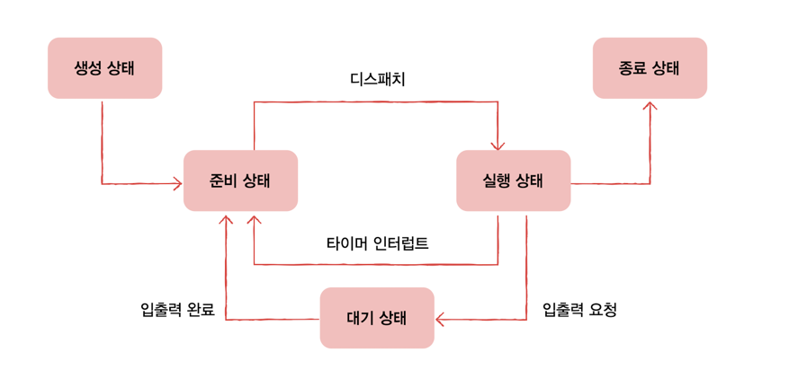

# 프로세스 상태와 계층 구조
프로세스들은 각자의 상태를 가지고 계층적인 구조를 이루고 있다  
os 는 커널영역에 이런 프로세스의 상태를 PCB 에 기록하여 관리한다  

그리고 Os 는 동시에 실행되는 수 많은 프로세스를 계층적으로 관리한다  

### 프로세스 상태
- 생성 상태: 프로세스를 생성 중인 상태
- 준비 상태: CPU 를 할당받아 실행할 수 있지만, 자신의 차례가 아니라 기다리고 있는 상태 (준비 -> 실행 (디스패치라고함)
- 실행 상태: CPU 를 할당받아 실행 중인 상태를 의미
  - cpu 할당 시간이 끝나면 인터럽트가 발생해 다시 준비 상태가 됨
- 대기 상태: I/O 작업은 cpu 에 비해 처리 속도가 느리기에, 입출력 작업 기다리는 상태
- 종료 상태: 프로세스가 종료된 상태
 

> 프로세스가 대시 상태가 되는 이유에 입출력 작업만 있는 것은 아니다
> > 특정 이벤트가 일어나길 기다릴 때 프로세스는 대기 상태가 된다.

 

### 프로세스 계층 구조
프로세스는 실행 도중 시스템 콜을 통해 다른 프로세스를 생성할 수 있다  
이때 새 프로세스를 생성한 프로세스를 **부모 프로세스**, 부모 프로세스에 의해 생성된 프로세스를 **자식 프로세스** 라고 한다  

부모 프로세스와 자식 프로세스는 엄연히 다른 프로세스 이기에 각기 다른 PID 를 가진다  

부모 프로세스로 부터 생성된 자식 프로세스는 또 다른 자식 프로세스를 생성할 수 있다  
즉 부모 -> 자식 -> 자식 -> 자식 이런식으로, 프로세스가 프로세스를 낳는 형식으로 여러 프로세스가 동시에 실행된다  
 

ex) 사용자가 컴퓨터를 키고 로그인 후 인텔리제이 를 키고 로컬 서버를 실행시킨다? 
- 로그인 프로세스(부모)
- 로그인 프로세스(부모) - 인텔리제이 프로세스(자식)
- 로그인 프로세스(부모) - 인텔리제이 프로세스(자식) - 로컬 서버 프로세스(자식)

이런 식으로 계층 구조를 가지게 된다는 의미이다  

> 모든 프로세스의 가장 상위 프로세스는 무엇일까?
> > Linux: systemd, macOS: launchd

### 프로세스 생성 기법
부모 프로세스는 fork 를 통해 자신의 복사본을 자식 프로세스로 생성한다. 
fork 에 의해 만들어진 자식 프로세스는 exec 를 통해 자신의 메모리 공간을 다른 프로그램으로 교체한다.  

Git 에서 레포지토리를 fork 할때 복사한다는 개념으로 알고 있었고, exec 는 Linux 를 다루며 알게 되었다  

fork,exec 는 시스템 콜 이다  
fork 를 통해 자신과 같은 프로세스를 만들었다. 자식 프로세스는 부모 프로세스의 복사본 이기 때문에  
부모 프로세스의 자원들, 이를테면 메모리 내의 내용, 파일 목록등 PCB 가 상속된다  
(* 하지만 PID 는 다르다) 

fork 가 된 후에 자식 프로세는 exec 라는 시스템 콜을 한다  
exec 를 통해 자신의 메모리 공간을 새로운 프로그램으로 덮어 쓴다  

즉, 부모가 자식 프로세스를 fork 하면, 자식 프로세스 가 생기고, 생긴 직후 exec 시스템 콜을 한다.  
이 활동이 우리 PC 에서 계속 반복되는 것이다  

fork 후 exec 가 실행되지 않는 경우는, 부모와 같은 코드를 병행하여 실행하는 경우일 때만 가능하다  

### 최종 정리
- 프로세스 상태: 생성,준비,실행,대기,종료
- 프로세스가 다른 프로세스를 생성한 경우 부모 프로세스, 생성된 프로세스 -> 자식 프로세스
  - fork -> exec
- 대부분 os 는 프로세스 계층 구조로 프로세스들을 관리한다.