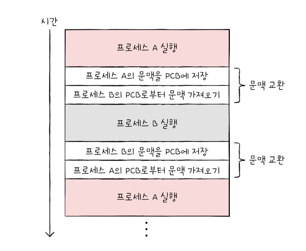

# 프로세스와 스레드
단순히 실행중인 프로그램을 '프로세스' 라고 한다 <br>

프로그램은 실행되기 전까지는 그저 보고기억장치에 있는 데이터 덩어리일 분이지만, 보조 기억장치에 저장된 프로그램을 메모리에 적재하고 실행하는 순간 그 프로그램은 프로세스가 된다 <br>
이 과정은 프로세스를 생성한다 라고 표현한다 <br>

mac 에서는 ps -ef 명령어를 통해 여러 프로세스들을 볼 수 있습니다 <br>
프로세스에는 우리 눈에보이는 포그라운드 프로세스, 우리 눈에 보이지 않는 백그라운드 프로세스가 있습니다 <br>

사용자와 사용하지 않는 백그라운드 프로세스를 '**데몬**' 이라고 한다 <br>

### 프로세스 제어 블록
모든 프로세스는 실행되기 위해선 CPU 를 할당받아야 하지만, CPU 자원은 한정되어 있습니다 <br>
즉 모든 프로세스가 CPU 를 동시에 사용할 수는 없다 <br>

그렇기에 프로세스들은 차례대로 돌아가며 한정된 시간만큼 CPU 를 이용한다 <br>
자신의 차례가 되면 정해진 시간만큼 CPU 를 이용하고, 시간이 끝났음을 알리는 인터럽트(타이머 인터럽트)가 발생하면 자신의 차례를 양보하고 다음 차례가 올 때까지 기다린다 <br>

운영체제는 빠르게 번갈아 수행되는 프로세스의 실행 순서를 관리하고, 프로세스에 CPU 를 비롯한 자원을 분배한다 <br>
이를 위해 os 는 프로세스 제어 블록(PCB) 를 이용한다 <br>

PCB 는 프로세스와 관련된 정보를 저장하는 자료구조 이다 <br>
이는 마치 상품에 달린 태그와도 같다, 해당 프로세스를 식별하기 위해 꼭 필요한 정보들이 저장이 된다 <br>

메모리는 커널,사용자 2개의 영역으로 나뉘는데, PCB 는 그중에서 커널 영역에 생성이 된다 <br>
그리고 PCB 는 프로세스 생성시 만들어지고, 실행이 끝나면 폐기가 된다 <br>

PCB 에는 운영체제에 따라 다르지만, 대표적으로 아래 정보를 가지고 있다.
- 프로세스 ID(PID)
- 레지스터 값
- 프로세스 상태: 기다리는 상태인지, 이용중인지, 이용이 끝났는지 이런 상태를 의미
- CPU 스케줄링 정보: 프로세스가 언제, 어떤 순서로 CPU 를 할당받을지에 대한 정보도 PCB 에 기록된다.
- 메모리 관리 정보: 프로세스마다 메모리에 저장된 위치가 다르다.

프로세스가 실행 과정에서 특정 입출력장치나 파일을 사용하면 PCB 에 해당 내용이 명시 된다 <br>
os 는 커널 영역에 적재된 PCB 를 보고 프로세스를 관리한다 <br>

### 문맥교환(Context Switching)
하나의 프로세스에서 다른 프로세스로 실행 순서가 넘어간다면? <br>
크롬 프로세스가 실행 중 cpu 할당 시간이 다 되에 인텔리제이 프로세스로 cpu 할당이 넘어간다면 어떻게 될까? <br>

이런 상황에서 크롬 프로세스는 직전까지 실행 중이던 정보들을 PCB 에 담아야한다. 그래야 다시 실행할 때 아까 작업했던 부분부터 진행할 수 있기 때문이다 <br>

이러한 중간 정보, 즉 하나의 프로세스 수행을 재개하기 위해 기억해야 할 정보를 '문맥' 이라고 한다 <br>
하나의 프로세스 문맥은 해당 프로세스의 PCB 에 표현되어 있다 <br>

사실 PCB 정보 = 문맥 이라고 봐도 무방하다 <br>
실행 문맥만 잘 기억하면 언제든 해당 프로세스의 실행을 재개할 수 있기 때문에, 프로세스가 CPU 를 사용할 수 있는 시간이 다 되거나 <br>
예기치 못한 상황이 발생하여 인터럽트가 발생해도, os 는 pcb 문맥을 통해 백업할 수 있다 <br>

이처럼 기존 프로세스의 문맥을 PCB 에 백업하고, 새로운 프로세스를 실행하기 위해 문맥을 PCB 로 부터 복구하여 <br>
새로운 프로세스를 실행하는 것을 문맥 교환 이라고 한다 <br>
<br>

문맥 교환은 여러 프로세스가 끊임없이 빠르게 번갈아 가며 실행되는 원리이다 <br>
문맥 교환이 자주 일어나면 프로세스는 그만큼 빨리 번갈아가며 수행되기 때문에 우리 눈에는 프로세스들이 동시에 실행되는 것처럼 보인다<br>
* 문맥 교환을 너무 자주하면 오버헤드가 발생할 수 있기에, 자주 일어나면 좋은건 아니다.

### 프로세스와 메모리 영역
프로세스가 실행되면 커널 영역에는 PCB 가 생기고, 사용자 영역에도 무언가가 생긴다.
- 코드 영역
- 데이터 영역
- 힙 영역
- 스택 영역

크게 보면 메모리는 커널 과 코드,데이터,힙,스택 으로 나뉜다고 봐도 된다 <br>

#### 코드 영역
텍스트 영역이라고도 불리며, 실행할 수 있는 코드, 즉 기계어로 이루어진 명령어가 저장된다<br>
cpu 가 실행할 명령어가 담겨 있기 때문에 write 는 금지다. only-read 이다 <br>

#### 데이터 영역
위 영역은 프로그램이 실행되는 동안 유지할 데이터가 저장되는 공간이다 <br>
ex) 전역 변수 <br>

코드,데이터 영역은 크기가 변하지 않는다<br>
그래서 크기가 고정된 영역 이라는 점에서, **정적 할당 영역** 이라고도 불린다. <br>

반대로 힙,스택 영역은 프로세스 실행 과정에서 크기가 변하므로 **동적 할당 영역** 이라고도 불린다.

#### 힙 영역
프로그램을 만드는 프로그래머가 직접 할당할 수 있는 공간이다 <br>
보통 객체를 위 공간에 할당한다. 그리고 Java 기준 GC 가 JVM 힙 영역을 정리한다 <br>

만약 위 부분이 정리가 되지 않으면 메모리 낭비를 초래해 Memory leak 이 발생한다 <br>

#### 스택 영역
데이터를 일시적으로 저장하는 공간이다 <br>
데이터 영역에 담기는 값과는 달리 잠깐 쓰다가 말 값들이 저장되는 공간이다 <br>
메소드 실행이 끝나면 사라지는 매개변수, 지역 변수가 대표적이다 <br>

일시적으로 저정할 데이터는 stack 에 Push 되고, 더이상 필요없으면 Pop 으로 제거된다 <br>
stack 은 LIFO 로 먼저들어온게 제일 늦게 나가는 구조를 가지고 있다 <br>

일반적으로 힙 영역은 메모리의 낮은 주소에서 높은 주소로 할당되고 <br>
스택은 메모리 높은 주소에서 낮은 주소로 할당된다 <br>

이렇게 해야 힙, 스택 메모리가 같은 주소를 참조하지 않기 때문이다 <br>

#### 정적 할당 영역 vs 동적 할당 영역


Q1. 그러면 여러 프로그램을 켜둔다, 크롬, 엣지, 인텔리제이, 도커 등 여러 프로그램을 켜두었을 때,<br> 
그럼 위 프로세스를 이용하기 위해서는 CPU 를 할당받아야 하는데, 그럼 크롬 사용중에는 크롬이 CPU 를 할당받고 <br>
크롬을 켜둔 상태에서 인텔리제이를 키면 인텔리제이가 CPU 를 할당받는건가요? <br>
아니면 프로세스를 실행시킬 때만 CPU 를 할당받고, 그 프로세스 내부적으로 무언가 작업을 하는 것에서 CPU 를 할당받지 않는건가요? 

만약 멀티코어 CPU 가 아닌 싱글 코어 CPU 일 경우, 한 CPU 에서 모든 프로세스에게 이용할 때 마다 CPU 를 할당하는 방식인가? <br>

답변
```java
1. CPU 할당 방식
프로세스가 실행될 때만 CPU가 할당됩니다. 즉, 크롬이나 인텔리제이 같은 프로그램을 실행하거나, 그 프로그램 내에서 무언가 작업을 할 때, 해당 작업을 수행하기 위해 CPU가 필요한 시점에서만 CPU가 할당됩니다.
프로세스가 CPU를 독점하지 않으며, 운영체제가 스케줄러를 통해 각 프로세스가 CPU를 사용할 수 있도록 할당합니다. 할당된 CPU 시간을 다 사용하면, 다른 프로세스가 CPU를 할당받아 실행됩니다.
2. 멀티태스킹
   여러 프로그램이 동시에 실행 중이라도, CPU는 순간적으로 한 번에 하나의 프로세스만 실행할 수 있습니다. 단, CPU가 매우 빠르게 스위칭을 하여 사용자 입장에서는 여러 프로그램이 동시에 실행되는 것처럼 보입니다. 이를 시분할 방식이라고 합니다.
3. 멀티코어와 싱글코어 CPU의 차이
   멀티코어 CPU는 각 코어가 독립적으로 여러 프로세스를 동시에 처리할 수 있습니다. 예를 들어, 코어 하나는 크롬을 처리하고, 다른 코어는 인텔리제이를 처리하는 식으로 병렬 처리가 가능합니다.
   싱글코어 CPU에서는 한 번에 하나의 프로세스만 처리할 수 있습니다. 여러 프로세스가 실행 중일 때는 CPU가 프로세스 간 빠르게 전환하면서 작업을 처리합니다.
4. 프로세스의 작업과 CPU 할당
   프로세스가 실행될 때 CPU가 할당되며, 해당 프로세스에서 수행해야 할 연산이 있을 때만 CPU를 사용합니다.
   프로세스가 CPU를 사용하지 않는 경우(예: 기다리는 중이거나 작업 대기 중일 때)에는 CPU가 다른 프로세스에 할당됩니다.
   따라서, 크롬과 인텔리제이를 동시에 실행해두었더라도, 실제로 CPU는 각 프로세스가 작업을 요청하는 순간에만 할당됩니다.
```

Q2. 프로세스 할당 시간이 얼마인지 어떻게 아나? 프로세스 할당 시간이 끝나면 그럼 어떻게 되나? 크롬으로 서칭 중에 cpu 할당 시간이 끝나면 프로세스가 종료되는건 <br>
아닌데, 그럼 우리가 모르는 사이에 refresh 가 되는건가??

A2
```java
프로세스 할당 시간과 그 동작 원리에 대해 알아보겠습니다.

1. 프로세스 할당 시간 (Time Slice, Quantum)
프로세스 할당 시간은 운영체제가 타임 슬라이스 (Time Slice) 또는 **퀀텀(Quantum)**이라고 부르는 단위 시간입니다. 운영체제의 스케줄러가 각 프로세스에 CPU를 일정 시간 동안 할당합니다. 이 시간은 일반적으로 매우 짧으며, 보통 몇 밀리초(ms) 단위로 설정됩니다.
프로세스는 이 할당 시간 동안 CPU를 사용해 작업을 수행합니다. 시간이 끝나면 운영체제는 다음 프로세스로 전환하며, 이전 프로세스는 작업이 끝나지 않았더라도 일시 중단됩니다.
2. 할당 시간이 끝나면 어떻게 되는가?
프로세스가 할당된 시간 동안 작업을 끝내지 못하면, CPU는 해당 프로세스의 상태를 저장하고(메모리나 레지스터 상태 등), 다른 프로세스에 CPU를 할당합니다.
CPU 할당 시간이 끝난다고 해서 프로세스가 종료되는 것은 아닙니다. 프로세스는 일시 중단된 상태로 남아 있다가, 다시 CPU가 할당되면 중단된 곳에서 작업을 재개합니다. 이것을 **문맥 전환 (Context Switching)**이라고 합니다.
3. 크롬에서 서칭 중에 할당 시간이 끝나면?
크롬에서 검색을 하고 있는 동안에도, 크롬이 한 번에 지속적으로 CPU를 점유하지 않습니다. 대신 운영체제가 정해진 시간 동안 크롬에 CPU를 할당한 후, 그 작업이 완료되지 않더라도 다른 프로세스(예: 인텔리제이, 엣지 등)에 CPU를 할당합니다.
사용자 입장에서는 CPU가 여러 프로세스를 동시에 처리하는 것처럼 보이지만, 실제로는 매우 짧은 시간 동안 여러 프로세스 간에 CPU가 빠르게 전환되는 것입니다. 이 과정에서 검색 페이지가 갑자기 종료되거나 리프레시되는 일은 없습니다.
4. 프로세스가 계속되는 이유
프로세스가 할당 시간을 다 써도, 프로세스는 종료되지 않고 다음 할당 시간에 재개됩니다. 사용자는 이런 전환을 거의 인식하지 못합니다. 프로세스가 할당 시간이 끝났을 때 메모리 상태, 작업 상태가 저장되기 때문에, 다시 CPU가 할당되면 중단된 부분부터 이어서 실행됩니다.
예를 들어, 크롬에서 페이지를 로드하는 중이라면, CPU가 다른 작업으로 전환되어도, 로드가 끝나지 않으면 크롬은 나중에 다시 CPU를 할당받아 계속 로드 작업을 합니다.
5. 우리가 모르는 사이에 리프레시되는가?
CPU 할당 시간의 종료가 크롬 페이지를 리프레시하는 것과는 무관합니다. 리프레시는 웹 페이지가 주기적으로 새로 고침되는 작업이며, 이는 크롬이 자체적으로 처리하는 작업입니다. CPU 스케줄링과는 별개의 과정입니다.
결론적으로, CPU 할당 시간이 끝나면 프로세스는 중단되었다가 다시 할당 시간을 받으면 이어서 실행됩니다. 이 과정에서 사용자는 별다른 변화나 리프레시를 느끼지 못하고, 모든 작업은 자연스럽게 계속 진행됩니다.
```