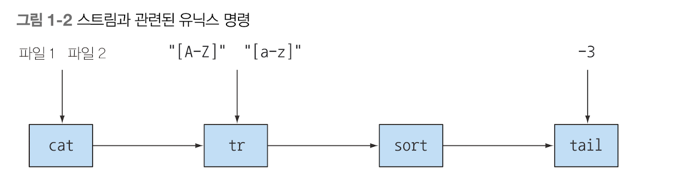
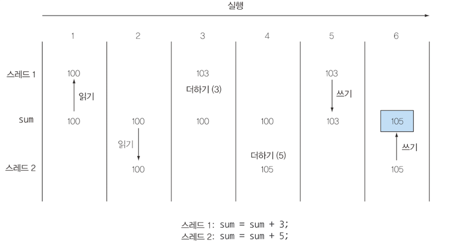

## 자바 8 이후 무슨일이 벌어지고 있는가?
자바 8에서는 역사를 통틀어 가장 큰 변화가 일어났다. <br>
지금까지 대부분 자바 프로그램은 코어 중 하나만을 사용했다<br>
자바8 이후는 간결한 코드, 멀티코어 프로세스의 쉬운 활용이라는 두 가지 요구사항이 있다<br>
- 스트림 API
- 메소드에 코드를 전달하는 기법
- 인터페이스의 디폴트 메소드

자바 8은 데이터베이스의 질의 언어에서 표현식을 처리하는 것처럼 병렬 연산을 지원하는 스트림 API 를 지원한다.<br>
스트림을 사용하면 에러를 자주 일으키며 멀티코어 CPU 를 이용하는 것보다 비용이 훨씬 비산 synchronized 를 사용하지 않아도 된다.<br>

자바는 처음부터 스레드와 락을 이용한 소소한 동시성도 지원했다<br>

이책은 병렬성을 활용하는 코드 및 간결한 코드를 구현할 수 있도록 도와준다.

#### 스트림 처리
스트림이란 한 번에 한 개씩 만들어지는 연속적인 데이터 항목들의 모임이다. <br>
유닉스에서는 여러 명령(cat, tr, sort, tail) 을 병렬로 실행한다<br>
즉 cat or tr 이 완료되지 않는 시점에서 sort 가 행을 처리하기 시작할 수 있다.<br>
ex) 자동차 생산 공장을 예시로 들 수 있다.<br>

자동차 생산 공장은 여러 자동차로 구성된 스트림을 처리하는데, 각각의 작업장에서는 자동차를 받아 수리하고,<br>
다음 작업장에서 다른 작업을 처리할 수 있도록 넘겨주며, 조립 라인은 자동차를 물리적인 순서로 한개씩 운반한다<br>
각각 작업장에서는 서로 다른일을 같은 시간대에 동시에 작업을 한다. 이게 바로 병렬성 이라는 것이다. 

기존의 스트림 API 는 한번에 한 항목을 처리했지만, 이제 자바8에서는 우리가 하려 는 작업을 고수준 처럼<br>
추상화해서 일련의 스트림으로 만들어 처리할 수 있다는 것이다. 


#### 동작 파라미터화로 메서드에 코드 전달하기
자바 8에 추가된 두 번째 프로그램 개념은 코드 일부를 API 로 전달하는 기능이다.<br>
스트림 API 는 연산의 동작을 파라미터화할 수 있는 코드를 전달한다는 사상에 기초하기 때문이다.
```java
public int compareUsingCustomerId (String inv1, String inv2) {
	
}
```

#### 병렬성과 공유 가변 데이터
병렬성을 공짜로 얻을 수 있다?? 이게 무슨 말일까<br>
스트림 메서드로 전달하는 코드는 다른 코드와 동시에 실행하더라도 안전하게 실행될 수 있어야한다<br>
보통 다른 코드와 동시에 실행하더라도 안전하게 실행 할 수 있는 코드를 만들려면 공유된 가변 데이터에 접근하면 안된다.<br>
이러한 함수를 순수함수, 부작용없는함수, 상태없는 함수라고도 부른다.<br>
일반적으로 synchronized 는 시스템 성능에 악영향을 미친다<br>
하지만 자바8 스트림을 이용하면 기존의 자바 스레드API 보다 쉽게 병렬성을 활용할 수 있다<br>
싱글 코어 멀티스레드를 사용하는 synchronized 를 다중 프로세싱 코어에서 사용하면 <br>
병렬이라는 목적을 무력화 시키면서, 값 비싼 대가를 치러야 할 수도 있다.<br>

#### 자바가 진화해야 하는 이유
언어는 하드웨어나 프로그래머 기대의 변화에 부응하는 방향으로 변화해야 한다는 것이다.<br>

#### 자바 함수
함수 ? 메소드 ? 특히 정적 메소드와 같은 의미로 사용된다<br>
자바의 함수는 수학적 함수처럼 사용되며 부작용을 일으키지 않는 함수를 의마한다<br>
함수를 값처럼 취급한다고 했는데 이 특징이 무슨 의미일까?<br>

객체 참조는 클래스의 인스턴스를 가리킨다. 심지어 배열도 객체이다. 근데 왜 함수가 필요할까?<br>
프로그래밍 언어의 핵심은 값을 바꾸는 것이다. <br>

1) 메소드 참조
디렉토리에서 모든 숨겨진 파일을 필터링한다고 가정하자. 우선 주어진 파일이 숨겨져 있는지 여부를 알려주는 메소드를 구현해야 한다.

```java
import java.io.FileFilter;

File[] hiddenFiles = new File(".").listFiles(new FileFilter() {
	public boolean accept(File file) {
		return file.isHideen(); // 숨겨진 파일 필터링
    }
});
```

위 코드를 자바8 로 구현하면

```java
import java.io.File;

File[] hiddenFiles = new File(".").listFiles(File::isHidden);
```

단 한줄의 코드로 완성할 수 있다. 

#### Lambda : 익명 함수
```java
(int x) -> x+1;
```

#### 메소드 전달에서 람다로
메소드를 값으로 전달하는 것은 분명 유용한 기능이다. <br>
```java
filterApples(inventory, (Apple a) -> a.getWeight() < 80 || RED.equals(a.getColor()) );
```

즉 한번만 사용할 메소드는 따로 정의를 구현할 필요가 없다.<br>
하지만 람다가 몇 줄 이상으로 길어진다면 익명 람다보다는 코드가 수행하는 일을 잘 설명하는 이름을 가진 메소드를 정의하고<br>
메소드 참조를 활용하는 것이 바람직하다. 즉 코드의 명확성이 우선시 되어야한다.<br>

#### 스트림
거의 모든 자바 어플리케이션은 컬렉션을 만들고 활용한다<br>
하지만 컬렉션으로 모든 문제가 해결되는 것은 아니다.<br>
스트림 API 를 이용하면 컬렉션 API 와는 상당히 다른 방식으로 데이터를 처리할 수 있다는 것<br>
컬렉션에서는 for-each 문으로 반복 과정을 직접 처리해야 했다. <br>
이런 작업을 외부 반복이라고 한다. <br>
반면 스트림 을 이용하면 루프를 신경 쓸 필요가 없다. 스트림 라이브러리 내부에서 모든 데이터가 처리된다<br>
이와 같은 반복을 내부 반복 이라고 한다.

#### 멀티 스레딩은 어렵다

두 스레드가 적절하게 제어되지 않은 상황에서 공유된 sum 변수에 숫자를 더하면 문제가 일어날 수 있음을 의미하는 그림 입니다.<br>
자바8 은 스트림 으로 컬렉션을 처리하면서 발생하는 모호함과 반복적인 코드 문제 그리고 멀티코어 활용 어려움 이라는 두 가지 문제를 해결했다 <br>
스트림에는 필터링, 추출, 그룹화 하는 등의 기능이 있다.<br>

컬렉션은 어떻게 데이터를 저장하고 접근할지에 중점을 두는 반면에, 스트림은 데이터에 어떤 계산을 할 것인지 묘사하는 것에 중점을 둔다는 점을 알아야 한다.<br>
스트림은 스트림 내의 요소를 쉽게 병렬로 처리 할 수 있는 환경을 제공한다는 것이 핵심이다 <br>
⭐️⭐️ 컬렉션을 필터링 할 수 있는 가장 빠른 방법은 컬렉션을 스트림으로 바꾸고, 병렬로 처리한 다음에, 리스트로 다시 복원하는 것이다 ⭐️⭐️<br>
스트림과 람다 표현식을 이용하면 '병렬성' 을 공짜로 얻을 수 있으므로, 리스트에서 객체를 순차적으로 또는 병렬로 필터링 할 수 있다.

```java
// 순차 처리 코드

List<Apple> heavyApples = inventory.stream().filter( (Apple a) -> a.getWeight() > 150)
    .collect(toList());


// 병렬 처리 코드
List<Apple> heavyApples = inventory.parallelStream().filter( (Apple a) -> a.getWeight() > 150)
    .collect(toList());
```

자바의 병렬성과 공유되지 않은 가변 상태<br>
흔히 사람들은 자바의 병렬성은 어렵고 synchronized 는 쉽게 에러를 일으킨다고 생각한다<br>

자바 8은 두 가지 요술 방망이를 제공한다 <br>
우선 라이브러리에서 분할을 처리한다. 즉 큰 스트림을 병렬로 처리할 수 있도록 작은 스트림으로 분할한다<br>
또한 filter 같은 라이브러리 메소드로 전달된 메소드가 상호작용을 하지 않는다면 가변 공유 객체를 통해 <br>
공짜로 병렬성을 누릴 수 있다 <br>

#### 디폴트 메소드와 자바 모듈
자바 8 이후로는 인터페이스를 쉽게 바꿀수 있도록, 디폴트 메소드를 지원합니다 <br>
디폴트 메소드는 프로그래머가 직접 구현할 상황은 흔치 않지만, 미래에 프로그램이 쉽게 <br>
변화 할 수있는 환경을 제공하는 기능이다.<br>

여러 인터페이스에 다중 디폴트 메소드가 존재할 수 있다는 것은 결국 다중 상속이 허용 된다는 의미이다 <br>

#### 함수형 프로그래밍에서 가져온 다른 유용한 아이디어
자바에 포함된 함수형 프로그래밍의 핵심적인 두 아이디어를 알아보자<br>
1) 메소드와 람다를 일급 값으로 사용하는 것
2) 가변 공유 상태가 없는 병렬 실행을 이용해서 효율적이고 안전하게 함수,메소드 호출하는 것

자바 8에서는 NPE 예외를 피할 수 있도록 도와주는 Optional<T> 클래스를 제공한다 <br>
함수는 일급 값이다. 메서드를 어떻게 함수형값으로 넘겨주는지, 익명 함수(람다)를 어떻게 구현하는지 기억하자<br>
자바 8 의 스트림 개념 중 일부는 컬렉션에서 가져온 것이다. <br>
스트림과 컬렉션을 적절하게 활용하면 스트림의 인수를 병렬로 처리할 수 있으며, 더 가독성이 좋은 코드를 구현할 수 있다<br>


