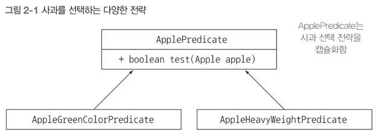
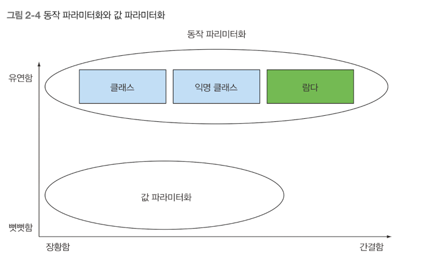

## 동작 파라미터 화 코드 전달하기

### 목차
- 변화하는 요구사항에 대응
- 동작 파라미터화
- 익명 클래스
- 람다 표현식 미리보기
- 실전 예제 : Comparator, Runnable, GUI

동적 파라미터화 를 이용하면 자주 바뀌는 요구사항에 효과적으로 대응할 수 있다. <br>
동작 파라미터화란 아직은 어떻게 실행할 것인지 결정하지 않은 코드 블록을 의미한다. <br>
이 코드 블록은 나중에 프로그램에서 호출한다. 즉 코드 블록의 실행은 나중으로 미뤄진다 <br>

### 변화하는 요구사항에 대응하기
1) 첫 번째 시도 : 녹색 사과 필터링
```java
Enum color {
	RED, GREEN
    }
	
	
public static List<Apple> filterGreenApples(List<Apple> inventory) {
	var result = new ArrayList<Apple>(); // 사과 리스트
	for (Apple apple : inventory) {
		if (GREEN.equals(apple.getColor())) { // 녹색 사과만 선택
			result.add(apple);
		}
	}
	return result;
}
```

이렇게 코드를 작성하면, 녹색 사과만 필터링을 할 수 있다. 그러나 나중에 빨간 사과도 필터링을 해야한다면? <br>
그러면 저 코드를 빨강으로해서 2번 작성해야할까? 아니면 조건문을 2번줘야할까? <br>
나중엔 색깔 별로 필터링을 하고싶다면? 모든 색깔을 필터링하는 메소드 여러개를 만들어야할까? 아닙니다 <br>

거의 비슷한 코드가 반복 존재한다면, 그 코드를 추상화 해야 합니다. <br>

2) 두 번째 시도 : 색을 파라미터화 
같은 메소드를 반복하지 않고, 어떻게 구현할 수 있을까? 바로 파라미터화 하여 메서드에 추가하는 것이다.<br>

```java
import java.util.ArrayList;

public static List<Apple> filterApplesByColor (List<Apple> inventory, Color color) {
	List<Apple> result = new ArrayList<>();
	for (Apple apple : inventory) {
		if ( apple.getColor().equals(color)) {
			result.add(apple);
		}
	}
	return result;
}
```

이렇게 파라미터로 객체를 받으면, 좀 더 유연한 코드가 될 수 있다. <br>
나중에 객체를 받을 때 
```java
List<Apple> greenApples = filterApplesByColor(inventory, GREEN);
List<Apple> greenApples = filterApplesByColor(inventory, RED);
```
이런식으로 원하는 값만 추출을 할 수 있습니다 <br>

갑자기 추가적인 요구사항이 발생했습니다. 색 을 필터링말고 무게도 필터링을 하고싶다네요? <br>
그럼 어떻게 해야할까요? <br>
방금 처럼 파라미터로 무게를 받아서 필터링을 하는 것 입니다. 
```java
public static List<Apple> filterApplesByWeight(List<Apple> inventory, int weight) {
	List<Apple> result = new ArrayList<>();
	for (Apple apple : inventory) {
		if ( apple.getWeight() > weight ) {
			result.add(apple);
		}
	}
	return result;
}
```

위 코드도 좋은 해결책일 수 있습니다. 하지만 구현 코드를 자세히 보면 목록을 검색하고, 각 사과에 필터링 조건을 적용하는 부분의 코드가 색 필터링 코드와 대부분 중복이 됩니다. <br>
탐색 과정을 고쳐서 성능을 개선하려면 무슨 일이 일어날까? <br>
한 줄이 아니라 메서드 전체 구현을 고쳐야 한다. 즉 엔지니어링 적으로 비싼 대가가 있다. <br>

3) 세 번째 시도 
별로 좋지 않은 코드긴 한데 설명한 코드 입니다.
```java
public static List<Apple> filterApples(List<Apple> inventory, int weight, Color color, boolean flag) {
	List<Apple> result = new ArrayList<>();
	for (Apple apple : inventory) {
		if ( (flag && apple.getColor().equals(color)) || (!flag && apple.getWeight() > weight)) {
			result.add(apple);
		}
	}
	return result;
}
```

위 메서드는 파라미터가 무려 4개나 된다. 정말 좋지 않은 코드 이다 <br>
위 코드를 고치기 위해서는 <b>동적 파라미터화</b> 를 이용해 볼 것이다. <br>
사과의 어떤 속성에 기초해서 Boolean 값을 반환 하는 방법이 있다. 참 또는 거짓을 반환하는 Predicate<> 함수를 정의하자
```java
public interface ApplePredicate {
	boolean test (Apple apple);
}
```

그리고 정의한 인터페이스를 구현한다.
```java
// 무거운 사과만 선택
public class AppleHeavyWeightPredicate implements ApplePredicate {
	@Override
	public boolean test(Apple apple) {
		return apple.getWeight() > 150;
    }
}

// 녹색 사과만 선택
public class AppleGreenColorPredicate implements ApplePredicate {
	@Override
	public boolean test(Apple apple) {
		return GREEN.equals(apple.getColor());
	}
}
```

<br>
위 조건에 따라 filter 메소드가 다르게 동작할 것 이라고 예상을 할 수 있습니다. <br>
위 패턴을 <b>전략 디자인 패턴 </b> 이라고 합니다 <br>
전략 패턴은 각 알고리즘을 캠슐화하는 기법 이라고 생각하면 된다 <br>
위 처럼 동작 파라미터화, 즉 메소드가 다양한 동작 을 받아서 내부적으로 다양한 동작을 수행하게 끔 하는 것이다 <br>
이제 filterApples 메소드를 ApplePredicate 객체를 파라미터로 받로고 고쳐보자, 이렇게 하면 <br>
filterApples 내부에서 컬렉션을 반복하는 로직과 컬렉션의 각 요소에 적용할 동작을 분리할 수 있다. 

4) 네 번째 시도 : 추상적 조건으로 필터링

```java
public static List<Apple> filterApples (List<Apple> inventory, ApplePredicate p) {
	List<Apple> result = new ArrayList<>();
	for (Apple apple : inventory) {
		if (p.test(apple)) {
			result.add(apple);
		}
	}
	return result;
}
```

#### 코드 동작 전달하기

#### 한 개의 파라미터, 다양한 동작
컬렉션 탐색 로직과 각 항목에 적용할 동작을 분리할 수 있다는 것이 <b>동작 파라미터화</b> 의 강점이다. <br>

### 쿠즈 2-1 유연한 prettyPrintApple 메서드 구현하기
```java
public interface AppleFormatter {
	public String accept(Apple apple);
}

public class AppleFancyFormatter implements AppleFormatter {
	@Override
    public String accept(Apple apple) {
		String chr = apple.getWeight() > 150 ? "heavy":"lignt";
		return "A" + chr + " " + apple.getColor() + " apple";
    }
}

public static void prettyPrintApple(List<Apple> inventory, AppleFormatter appleFormatter) {
	for (Apple apple : inventory) {
		String output = appleFormatter.accept(apple);
		System.out.println(output);
	}
}
```

### 복잡한 과정 간소화 하기
자바는 클래스의 선언과 인스턴스화를 동시에 수행할 수 있도록, <b>익명클래스</b> 라는 기법을 제공한다<br>

#### 익명 클래스
익명클래스를 이용하면 코드의 양을 줄일 수 있다. <br>
익명 클래스는 클래스 선언과 인스턴화를 동시에 할 수 있다. 즉 즉석에서 필요한 구현을 만들어서 사용할 수 있다<br>

5) 다섯 번째 시도 : 익명 클래스 사용
```java
List<Apple> redApples = filterApples(inventory, new ApplePredicate()) {
	public boolean test(Apple apple) {
		return RED.equals(apple.getColor());
    }
});
```

코드의 장황함은 나쁜 특성이다. 장황한 코드는 구현하고 유지보수 하는데 시간이 오래 걸릴 뿐 아니라, 읽는 즐거움을 빼앗는다<br>
한눈에 이해할 수 있어야 좋은 코드이다. 익명 클래스로 인터페이스를 구현하는 여러 클래스를 선언하는 과정을 조금 줄일 수 있지만, 여전히 만족스럽지 않다<br>

6) 여섯 번째 시도 : 람다 표현식 사용

```java
List<Apple> result = filterAppes(inventory, (Apple apple) -> RED.equals(apple.getColor)));
```

이전 코드보다 훨씬 간단해지지 않았는가?? 간결해지면서 문제를 깔끔하게 설명하여 복잡성 문제를 해결했다.<br>



7) 일곱번째 시도 : 리스트 형식으로 추상화
```java
public interface Predicate<T> {
	boolean test(T t);
}

public static<T> List<T> filter(List<T> list, Predicate<T> p) {
	List<T> result = new ArrayList<>();
	for(T e : list) {
		if(p.test(e)) {
			result.add(e);
		}
	}
	return result;
}
```

위 코드 처럼 코드를 작성하면, 파라미터 값으로 뭐가 들어오는 상관이 없다. 정해진 것 이 없기 때문이다. <br>
람다를 사용하면 유연성과 간결함이라는 두마리 토끼를 모두 잡을 수 있다.<br>

지금까지 동작 파라미터화가 변화하는 요구사항에 쉽게 적응하는 유용한 패턴임을 확인했다<br>
동작파라미터화 패턴은 동작을 캡슐화한 다음에 메소드로 전달해서 메소드의 동작을 파라미터화 한다<br>

데이터 타입, String, Integer 등을 제네릭으로 받을 때는 Object 로 추상화를 할 수 있다<br>
그러나 객체를 데이터 타입으로 받을 때는, Object 로 불가능하니, T 라는 아무 문자를 사용한다 <br>

### 실전 예제
컬렉션 정렬은 반복되는 프로그래밍 작업이다.
```java
public interface Comparator<T> {
	int compare(T o1, T o2);
}
```

Comparator 을 구현해서 sort 메소드의 동작을 다양화 해보자<br>
```java
// 익명 클래스 이용하여 정렬
inventory.sort(new Comparator<Apple>() {
	public int compare(Apple a1, Apple a2) {
	    return a1.getWeight().compareTo(a2.getWeight());	
	}
});

// 람다 표현식
inventory.sort( (Apple a1, Apple a2) -> a1.getWeight().compareTo(a2.getWeight()));
```

#### Runnable 로 코드 블록 실행하기
자바 스레드를 이용하면 병렬로 코드 블록을 실행할 수 있다 <br>
어떤 코드를 실행할 것인지를 스레드에게 알려줄 수 있을까? <br>
자바에서는 Runnable 인터페이스를 사용해서 실행할 코드 블록을 지정할 수 있다.<br>
아래 코드에서 볼 수 있는 것처럼 코드 블록을 실행한 결과는 void 이다
```java
public interface Runnable {
	void run();
}

// Runnable 을 사용하여 다양한 스레드 동작 시키기
Thread t = new Thread(new Runnable() {
	@Override
    public void run() {
		System.out.println("Hello Thread");
    }
});

// 위 코드를 람다식으로 바꾸면
Thread t = new Thread( () -> System.out.println("Hello Thread"));
```

#### Callable 을 결과로 반환하기
```java
public interface Callable<V> {
	V call();
}
```

```java
import java.util.concurrent.Callable;
import java.util.concurrent.ExecutorService;
import java.util.concurrent.Executors;
import java.util.concurrent.Future;

ExecutorService executorService = Executors.newCachedThreadPool();
Future<String> threadName = executorService.submit(new Callable<String>() {
	@Override
	public String call () throws Exception {
		return Thread.currentThread().getName();
	}
});

// 람다 이용
Futuer<String> threadName = executorService.submit(
	() -> Thread.currentThread().getName());
```

### 요약
- 동작 파라미터화에서는 메소드 내부적으로 다양한 동작을 수행할 수 있도록 코드를 메소드 인수로 전달한다. 
- 동작 파라미터화를 이용하면 변화하는 요구사항에 더 잘 대응할 수 있는 코드를 구현할 수 있으며, 나중에 엔지니어링 비용을 줄일 수 있다.
- 코드 전달 기법을 이용하면 동작을 메소드의 인수로 전달할 수 있다. 
- 자바 API의 많은 메소드느느 정렬, 스레드, GUI 처리 등을 포함한 다양한 동작과 파라미터화 할 수 있다.


