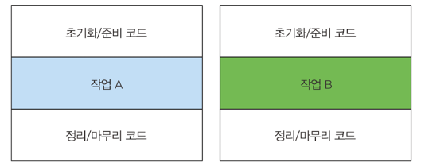

# 람다 표현식

### 목차
- 람다란 무엇인가?
- 어디에, 어떻게 람다를 사용하는가?
- 실행 어라운드 패턴
- 함수형 인터페이스, 형식 추론
- 메소드 참조
- 람다 만들기

동작 파라미터화를 이용해서 변화하는 요구사항에 효과적으로 대응하는 코드를 구현할 수 있다<br>
또한 정의한 코드 블록을 다른 메소드로 전달할 수 있다.<br>
즉 동작파라미터화를 이용하면 더 유연하고 재사용할 수 있는 코드를 만들 수 있다.<br>

익명클래스로 다양한 동작을 구현할 수 있지만 만족할 만큼 코드가 깔끔하지는 않았다. <br>
깔끔하지 않은 코드는 동작 파라미터를 실전에 적용하는 것을 막는 요소다.<br>

## 람다란 무엇인가?
<b>람다 표현식</b> 은 메소드로 전달할 수 있는 익명 함수를 단순화한 것이라고 할 수 있다.<br>
람다 표현식에는 이름은 없지만, 파라미터 리스트, 바디, 반환형식, 발생할 수 있는 예외 리스트는 가질 수 있다.
- 익명 => 메소드와 달리 이름이 없어서 익명이라 함
- 함수 => 클래스에 종속되지 않음.
- 전달 => 메소드 인수로 전달하거나 변수로 저장할 수 있다.
- 간결성 => 익명클래스 처럼 자질구레한 코드를 구현할 필요가 없다.

람다의 편의성을 보여주는 코드이다.

```java
import java.util.Comparator;// 기존코드
Comparator<Apple> byWeight = new Comparator<Apple>() {
	@Override
	public int compare (Apple o1, Apple o2) {
		return o1.getWeight().compareTo(a2.getWeight());
	}
};

// 람다
Comparator<Apple> byWeight = (Apple a1, Apple a2) -> a1.getWeight().compareTo(a2.getWeight());
```

코드가 훨씬 간단해졌다. 사과 두개의 무게를 비교하는데 필요한 코드가 훨씬 간단해졌다.

```java
(Apple a1, Apple a2) -> a1.getWeight().comapreTo(a2.getWeight());
//  [람다 파라미터]   [화살표]  [              람다 바디              ]       
```

- 파라미터 리스트 : Comparator 의 compare 메소드의 파라미터(사과 두개)
- 화살표 : 람다의 파라미터 리스트와 람다 바디를 구분한다.
- 람다 바디 : 두 사과의 무게를 비교하며, 람다의 반환 값에 해당하는 표현식이다.

```java
// 람다 표현식 예제
(String s) -> s.length();

(Apple a) -> a.getWeight() > 150;

(int x, int y) -> {
	System.out.println("Result : ");
	System.out.println("x+y);
    }

	() -> 42
```

람다의 기본적인 문법은 <br>
1) (parameters) -> expression <br>
2) (parameters) -> { statements; } <br>

람다 예제
```java
// 불리언 표현식
(List<String> list) -> list.isEmpty();

// 객체 생성 
() -> new Apple(10)

// 객체에서 소비
(Apple a) -> {
	    System.out.println(a.getWeight());
    }
	
// 객체에서 선택/추출
	(String s) -> s.length()

// 두 값을 조합
(int a, int b) -> a*b

// 두 객체 비교
(Apple a1, Apple a2) -> a1.getWeight().compareTo(a2.getWeight())
```

### 어디에, 어떻게 람다를 사용할까?
함수형 인터페이스 라는 문맥에서 람다 표현식을 사용할 수 있다. <br>
위 예제에서는 함수형 인터페이스 Predicate<T> 를 기대하는 filter 메소드의 두 번째 인수로 람다 표현식을 전달했다<br>

### 함수형 인터페이스
2장에서 만든 Predicate<T> 가 함수형 인터페이스 이다. Predicate<T>는 오직 하나의 추상 메소드만 저장하기 때문이다.
```java
public interface Predicate<T> {
	boolean test(T t);
}
```

함수형 인터페이스는 정확히 하나의 추상 메소드를 지정하는 인터페이스 이다<br>
```java
public interface Comparator<T> {
	int compare(T o1, T o2);
}

public interface Runnable {
	void run();
}
```
               
등등 여러 함수형 인터페이스들이 있다<br> 
즉 추상 메소드가 오직 하나이면 함수형 인터페이스이다<br>
또는 @FunctionalInterface 위 어노테이션이 있으면 함수형 인터페이스 이다<br>

함수형 인터페이스로 뭘 할 수 있을까?<br>
람다로 함수형 인터페이스의 추상 메소드 구현을 직접 전달할 수 있으므로, 전체 표현식을 함수형 인터페이스의 인스턴스로 취급할 수 있다.<br>
정확히는 함수형 인터페이스를 구현한 클래스의 인스턴스를 만든다

함수형 인터페이스 보다는 덜 깔끔하지만 익명 내부 클래스로도 같은 기능을 구현할 수 있다<br>
다음 예제를 보자

```java
Runnable r1 = () -> System.out.println("Hello world"); // 람다 사용

Runnable r2 = new Runnable() { // 익명 클래스 사용
	@Override
	public void run () {
		System.out.println("Hello world2");
	}
};

public static void process(Runnable r) {
	r.run();
}

process(r1);
process(r2);
process( () -> System.out.println("Hello world3"));
```

### 함수 디스크립터
() -> void 표기는 파라미터 리스트가 없으며 void 를 반환하는 함수를 의미합니다 <br>
(Apple, Apple) -> int 는 두개의 Apple 인자를 받아 int 를 반환하는 함수를 가리킵니다 <br>
람다 표현식의 형식을 어떻게 검사하는지 궁금한 독자도 있을 것입니다.<br>

### 람다 활용 : 실행 어라운드 패턴
실제 자원을 처리하는 코드를 설정과 정리 두 과정이 둘러싸는 형태를 갖는것<br>

```java
import java.io.BufferedReader;
import java.io.FileReader;
import java.io.IOException;

public String processFile () throws IOException {
	try (BufferedReader br = new BufferedReader(new FileReader("data.txt"))) {
        return br.readLine(); // 실제 필요한 작업을 하는 행
	}
}
```

위 코드는 중복되는 준비 코드와 정리 코드가 작업 A와 작업B 를 감싸고 있다.


#### 1단계 : 동작 파라미터화를 기억하라
위 코드는 파일에서 한 번에 한줄 만 읽을 수 있다. <br>
한 번에 두줄을 읽거나 가장 자주 사용되는 단어를 반환하려면 어떻게 해야할까? <br>
processFile 의 동작을 파라미터화 하는 것이다<br>

```java
import java.io.BufferedReader;

String result = processFile((BufferedReader br) -> br.readLine() + br.readLine());
```

#### 2단계 : 함수형 인터페이스를 이용해서 동작 전달
함수형 인터페이스 자리에 람다를 사용할 수 있다. 따라서 BufferedReader -> String 과 IOException 을 던지는 함수형 인터페이스를 만들어야 한다.

```java
import java.io.BufferedReader;
import java.io.IOException;

@FunctionalInterface
public interface BufferedReaderProcessor {
	String process (BufferedReader b) throws IOException;
}

// 정의한 인터페이스를 processFile 메소드의 파라미터로 전달할 수 있다.
public String processFile (BufferedReaderProcessor p) throws IOException {
}
```

#### 3단계 : 동작 실행

```java
import java.io.BufferedReader;
import java.io.FileReader;
import java.io.IOException;

public String processFile (BufferedReaderProcessor p) throws IOException {
	try (BufferedReader br = new BufferedReader(new FileReader("data.txt"))) {
		return p.process(br);
	}
}
```

#### 4단계 : 람다 전달
이제 람다를 이용해서 다양한 동작을 processFile 메소드로 전달할 수 있다.

```java
import java.io.BufferedReader;

// 한행을 처리
String oneLine = processFile((BufferedReader br) -> br.readLine());

// 두행을 처리
String twoLines = processFile ( (BufferedReader br) -> br.readLine() + br.readLine());

```

### 함수형 인터페이스 사용
함수형 인터페이스는 오직 하나의 추상 메소드를 지정한다<br>
함수형 인터페이스의 추상 메소드는 람다 표현식의 시그니처를 묘사한다<br>
함수형 인터페이스의 추상 메소드 시그니처를 함수 디스크립터 라고 한다.<br>
다양한 람다 표현식을 사용하려면 공통의 함수 디스클버터를 기술하는 함수형 인터페이스의 집합이 필요하다.


#### Predicate
T 형식의 객체를 사용하는 불리언 표현식이 필요한 상황에서 Predicate 인터페이스를 사용할 수 있다.<br>
아래 코드에선 String 객체를 인자로 받는 람다를 정의한다.

```java
import java.util.ArrayList;

@FunctionalInterface
public interface Predicate<T> {
	boolean test (T t);

}

public <T> List<T> filter (List<T> list, Predicate<T> p) {
	List<T> results = new ArrayList<>();
	for(T t : list) {
		if(p.test(t)) {
			results.add(t);
		}
 	}
	return results;
}
```

Predicate 인터페이스의 자바독 명세를 보면 and 나 or 같은 메소드도 있음을 알 수 있다.

#### Consumer 
```java
@FunctionalInterface
public interface Consumer<T> {
	void accept(T t);
}

public <T> void forEach(List<T> list, Consumer<T> c) {
	for(T t : list) {
		c.accept(t);
	}
}

forEach(Arrays.asList(1,2,3,4,5),
        (Integer i) -> System.out.println(i)
);
```

#### Function
java.util.function.Function<T,R> 인터페이스는 제네릭 형식을 T 를 받아서 제네릭 형식의 R 객체를 반환하는 추상 메소드 apply 를 정의한다.<br>
입력을 출력으로 매핑하는 람다를 정의할 때 Function 인터페이스를 활용할 수 있다<br>
아래 코드는 String 리스트를 인수로 받아 각 String 의 길이를 포함하는 Integer 리스트로 변환하는 map 메소드를 정의하는 에제이다.

```java
import java.util.ArrayList;
import java.util.Arrays;

@FunctionalInterface
public interface Function<T, R> {
	R apply (T t);

}

public <T, R> List<R> map (List<T> list, Function<T, R> f) {
	List<R> result = new ArrayList<>();
	for (T t : list) {
		result.add(f.apply(t));
	}
	return result;
}

List<Integer> l = map(Arrays.asList("lambdas","in","action"),
	(String s) -> s.length() // apply 메소드를 구현하는 람다
);   
```
### 기본형 특화
1) 박싱
2) 언박싱
3) 오토박싱
```java
List<Integer> list = new ArrayList<>();
for (int i=300; i<400; i++) {
	    list.add(i);
    }
```

위 변환 과정은 비용이 소모된다. 박싱한 값은 기본형을 감싸는 래퍼며, 힙에 저장된다<br>
따라서 박싱한 값은 메모리를 더 소비하며 기본형을 가져올 때도 메모리를 탐색하는 과정이 필요하다<br>
자바 8에서는 기본형을 입출력으로 사용하는 상황에서 오토박 동작을 피할 수 있도록 특별한 버전의 함수형 인터페이스를 제공한다<br>
```java
public interface IntPredicate {
    boolean test(int t);
}

IntPredicate evenNumbers = (int i) -> i%2==0;
evenNumbers.test(1000); // 박싱 없음 

Predicate<Integer> oddNumbers = (Integer i) -> i%2 !=0;
oddNumbers.test(1000); // 박싱 있음
```

일반적으로 특정 형식을 입력 받는 함수형 인터페이스의 이름 앞에는 DoublePredicate, IntConsumer 처럼 형식명이 붙는다<br>

예외, 람다, 함수형 인터페이스의 관계<br>
- 함수형 인터페이스는 확인된 예외를 던지는 동작을 허용하지 않는다
  - 즉 예외를 던지는 람다 표현식을 만들려면 확인된 예외를 선언하는 함수형 인터페이스를 직접 정의하거나 람다를 try/catch 블록으로 감싸야 한다.
- 예를 들어 IOException 을 명시적으로 선언하는 함수형 인터페이스 BufferedReaderProcessor 를 살펴보자
```java
@FunctionalInterface
public interface BufferedReaderProcessor {
	String process(BufferedReader b) throws IOException;
}

BufferedReaderProcessor p = (BufferedReader br) -> br.readLine();
```

그러나 우리는 Function<T, R> 형식의 함수형 인터페이스를 기대하는 API를 사용하고 있으며, 직접 함수형 인터페이스를 만들기 어려운 상황이다<br>
이런 상황에서는 다음 예제처럼 명시적으로 확인된 예외를 잡을 수 있다<
```java
Function<BufferedReader, String> f = (BufferedReader b) -> {
	try {
		return b.readLine();
	}
	catch(IOException e) {
	    throw new RuntimeException(e);	
	}
	
};
```

### 3.5 형식 검사, 형식 추론, 제약
람다로 함수형 인터페이스의 인스턴스를 만들 수 있다고 언급했다<br>

람다 표현식 자체에는 람다가 어떤 함수형 인터페이스를 구현하는지의 정보가 포함되어 있지 않다.<br>
따라서 람다 표현식을 더 제대로 이해하려면 람다의 실제 형식을 파악해야 한다<br>

#### 형식 검사
람다가 사용되는 콘텍스트를 이용해서 람다의 형식을 추론할 수 있다<br>
```java
List<Apple> heavierThan150g = filter(inventory, (Apple apple) -> apple.getWeight() > 150);
```

- filter 메소드의 선언 확인
- filter 메소드 두번째 파라미터로, Predicate<Apple> 형식을 기대한다
- Predicate<Apple>은 test 라는 한 개의 추상 메소드를 정의하는 함수형 인터페이스이다.
- test 메소드는 Apple 을 받아 boolean 을 반환하는 함수 디스크립터를 묘사한다.
- filter 메소드로 전달된 인수는 이와 같은 요구사항을 만족해야 한다. 

#### 같은 람다, 다른 함수형 인터페이스
그닌까, 객체를 생성과 동시에 초기화를 람다 식으로 하려면 함수형 인터페이스로 정의가 되어있어야한다<br>
ex) Predicate, Consumer 등등<br>

#### 형식 추론
우리 코드를 좀 더 단순화할 수 있는 방법이 있다.<br>
자바 컴파일러는 람다 표현식이 사용된 콘텍스트를 이용해서 람다 표현식과 관련된 함수형 인터페이스를 추론한다<br>
결과적으로 컴파일러는 람다 표현식의 파라미터 형식에 접근할 수 있으므로 람다 문법에서 이를 생략할 수 있다<br>
즉 자바 컴파일러는 람다 파라미터 형식을 추론할 수 있다.
```java
List<Apple> greenApples = filter(inventory, apple -> GREEN.equals(apple.getColor()));

Comparator<Apple> c = (Apple a1, Apple a2) -> a1.getWeight().compareTo(a2.getWeight()); // 형식 추론 않함
Comparator<Apple> c = (a1,a2) -> a1.getWeight().compareTo(a2.getWeight()); // 형식 추론함
```

상황에 따라 명시적으로 형식을 포함하는것이 좋을 수도 있고, 형식을 배제하는 것이 가독성을 향상 시킬 때도 있다<br>

#### 지역 변수 사용
지금까지 본 모든 람다 표현식은 인수를 자신의 바디 안에서만 사용했다.<br>
하지만 람다 표현식에서는 익명 함수가 하는 것처럼 자유 변수를 활용할 수 있다<br>
-> 람다 캡쳐링
```java
int portNumber = 1337;
Runnable r = () -> System.out.println(portNumber);
```

#### 지역 변수의 제약
즉 람다 표현식은 한 번만 할당할 수 있는 지역 변수를 캡쳐할 수 있다<br>

### 메소드 참조
메소드 참조를 이용하면 기존의 메소드를 정의를 재활용해서 람다처럼 전달할 수 있다<br>
떄로는 람다 표현식 보다 메소드 참조를 사용하는 것이 더 가독성이 좋으며 자연스러울 수 있다<br>
```java
inventory.sort( (Apple a1, Apple a2) -> a1.getWeight().comapareTo(a2.getWeight()));
```

위 코드는 우리가 사용했던 람다의 기존 코드이다. 이번에는 메소드 참조를 사용해보겠습니다.
```java
inventory.sort( comparing(Apple::getWeight));
```

메소드 참조를 사용하면 위처럼, 코드를 간단하게 만들 수 있다. 

### 요약
메소드 참조가 중요할까? 메소드 참조는 특정 메소드만을 호출하는 람다의 축약형 이라고 생각할 수 있다.<br>
예를 들어 람다가 '이 메소드 호출해' 라고 명령한다면 메소드를 어떻게 호출해야 하는지 설명을 참조하기 보다는 메소드명을 직접 참조하는 것이 편리하다<br>

메소드 참조를 이용하면 기존 메소드 구현으로 람다 표현식을 만들 수 있다 <br>
이 때 명시적으로 메소드명을 참조함으로 써 가독성을 높일 수 있다.<br>
메소드 참조는 (::) 를 붙이는 방식으로 메소드 참조를 활용한다<br>
실제로 메소드를 호출하는 것은 아니므로 괄호는 필요 없다 <br>
```java
(Apple apple) -> apple.getWeight() // Apple::getWeight 
(str, i) -> str.subString(i) // String::subString
(String s) -> System.out.println(s) // System.out::println
```

메소드 참조를 새로운 기능이 아니라 하나의 메소드를 참조하는 람다를 편리하게 표현할 수 있는 문법으로 간주한다<br>

#### 메소드 참조를 만드는 방법
1) 정적 메소드 참조
- Integer 의 parseInt 메소드는 Integer::parseInt 로 표현할 수 있다.
2) 다양한 형식의 인스턴스 메소드 참조
- String 의 length 메소드는 String::length 로 표현할 수 있다.
3) 기존 객체의 인스턴스 메소드 참조
- Transaction 객체를 할당받은 expensiveTransaction 지역 변수가 있고, Transaction 객체에는 getValue() 메소드가 있다.
- 이를 expensiveTransaction::getValue 라고 표현할 수 있다.

람다 표현식을 메소드 참조로 줄여서 표현하는 단축 규칙을 보여주는 예제
```java
private boolean isValidName(String string) {
	return Character.isUpperCase(string.charAt(0));
}
```

이제 Predicate<String> 을 필요로 하는 적당한 상황에서 메소드 참조를 사용할 수 있다<br>
filter(words, this::isValidName) 

생성자, 배열생성자, super 호출 등에 사용할 수 있는 특별한 형식의 메소드 참조도 있다 <br>
List 에 포함된 문자열을 대소문자를 구분하지 않고 정렬하는 프로그램을 구현하려 한다 <br>
List 의 sort 메소드는 인수로 Comparator 을 기대한다.
```java
List<String> str = Arrays.asList("a","b","c","d");
str.sort( (s1,s2) -> s1.compareToIgnoreCase(s2));
```
Comparator 함수 디스크립터와 호환되는 람다 표현식 시그니처도 있다 <br>
위 코드를 메소드 참조를 통해 리팩토링 해보겠다
```java
List<String> str = Arrays.asList("a","b","c","d");
str.sort(String::compareToIgnoreCase);
```

컴파일러는 람다 표현식의 형식을 검사하던 방식과 비슷한 과정으로 메소드 참조가 주어진 함수형 인터페이스와 호환되는지 확인한다.<br>
즉 메소드 참조는 콘텍스트 형식과 일치해야 한다.

#### 생성자 참조
ClassName::new 처럼 클래스명과 new 키워드를 이용해서 기존 생성자의 참조를 만들 수 있다.<br>
이것은 정적 메소드의 참조를 만드는 방법과 비슷하다 <br>
예를 들어 인수가 없는 생성자, 즉 Supplier 의 () -> Apple 과 같은 시그니처를 갖는 생성자가 있다.
```java
Supplier<Apple> c1 = Apple::new; // 람다 표현식을 통해 디폴트 생성자를 만든다.
Apple a1  = c1.get(); // Supplier 의 get 메소드를 호출해서 새로운 Apple 객체를 만들 수 있다.
```

```java
List<Integer> weights = Arrays.asList(7,3,4,10);
List<Apple> apples = map(weights, Apple::now);

public List<Apple> map(List<Integer> list, Function<Integer, Apple> f) {
	List<Apple> result = new ArrayList<>();
	for (Integer i : list) {
		result.add(f.apply(i));
    }
	return result;
}
```

Apple(String color, Integer weight) 처럼 두 인수를 갖는 생성자는 BiFunction 인터페이스 와 같은 시그니처를 가지므로 다음처럼 할 수 있다<br>
```java
BiFunction(Color, Integer, Apple) c3 = Apple::new;
Apple a3 = c3.apply(GREEN, 10);

// 위 코드는 아래 코드와 같다
BiFunction<String,Integer,Apple> c3 = (color,weight) -> new Apple(color,weight);
Apple a3 = c3.apply(GREEN,10);
```

인스턴스화하지 않고도 생성자에 접근할 수 있는 기능을 다양한 상황에 응용할 수 있다 <br>
예를 들어 Map 으로 생성자와 문자열값을 관련시킬 수 있다. 
```java
static Map<String, Function<Integer, Fruit>> map = new HashMap<>();
static {
	map.put("apple",Apple::new);
	map.put("orange",Orange::new)
}

public static Fruit giveMeFruit(String fruit, Integer weight) {
	return map.get(fruit.toLowerCase())
            .apply(weight);
}
```

생성자 참조 문법은 클래스이름::new 이다 <br>


#### 람다 메소드 참조 활용하기
지금까지 배운 동작 파라미터화, 익명 클래스, 람다 표현식, 메소드 참조등을 동원해서 코드를 짜보겠다

#### 1단계: 코드전달
```java
void sort(Comparator<? super E> c);
```
이 코드는 Comparator 객체를 인수로 받아 두 사과를 비교한다.<br>
객체 안에 동작을 포함시키는 방식으로 다양한 전략을 전달할 수 있다<br>
이제 'sort의 동작은 파라미터화' 되었다 라고 할 수 있다. 즉 sort 에 전달된 정렬 전략에 따라 sort 의 동작이 달라진다
```java
public class AppleComparator implements Comparator<Apple> {
	public int compare(Apple a1, Apple a2) {
		return a1.getWeight().compareTo(a2.getWeight());
    }
}
inventory.sort(new AppleComparator());
```

#### 2단계: 익명 클래스 사용
한 번만 사용할 Comparator을 위 코드처럼 구현하는 것보다는 익명클래스를 이용하는 것이 좋다<br>
한번만 메소드나 객체를 사용하는 경우는, 익명 클래스를 사용하는것이 좋다
```java
inventory.sort(new Comparator<Apple>() {
	public int compare(Apple a1, Apple a2) {
		return a1.getWeight().compareTo(a2.getWeight());
  }
});
```

#### 3단계: 람다 표현식 사용
함수형 인터페이스를 기대하는 곳 어디에서나 람다 표현식을 사용할 수 있다<br>
함수형 인터페이스는 오직 한개의 추상 메소드를 정의하는 인터페이스 이다<br>
추상 메소드의 시그니처는(함수 디스크립터라 불림)는 람다 표현식의 시그니처를 정의한다<br>
Comparator 의 함수 디스크립터는 (T,T) -> int 이다. <br>
우리는 사과를 사용할 것이므로 정확히는 (Apple, Apple) -> int 로 표현이 가능하다.
```java
inventory.sort( (Apple a1, Apple a2) -> a1.getWeight().compareTo(a2.getWeight()));
```

자바 컴파일러는 람다 표현식이 사용된 콘텍스트를 활용해서 람다의 파라미터 형식을 추론한다 <br>
따라서 코드를 다음처럼 더 줄일 수 있다.
```java
inventory.sort( (a1,a2) -> a1.getWeight().compareTo(a2.getWeight()));
```

음,, 위 코드의 가독성을 더 향상 시킬 수 없을까? Comparator 은 Comparable 키를 추출해서 Comparator 객체로 만드는<br>
Function 함수를 인수로 받는 정적 메소드 comparing 을 포함한다. 다음처럼 comparing 메소드를 사용할 수 있다<br>
Comparator<Apple> c = Comparator.comparing( (Apple a) -> a.getWeight()); <br>
위 코드를 다음처럼 간소화 할 수 있다.
```java
inventory.sort(comparing(apple -> apple.getWeight()));
```

#### 4단계: 메소드 참조 사용
```java
inventory.sort(comparing(Apple::getWeight());
```

### 람다 표현식을 조합할 수 있는 유용한 메소드
ex) Comparator, Function, Predicate 같은 함수형 인터페이스는 람다 표현식을 조합할 수 있도록 유틸리티 메소드를 제공한다<br>

#### Predicate 조합
Predicate 인터페이스는 복잡한 Predicate 를 만들 수 있도록 negate, and, or 세 가지 메소드를 제공한다.


### 정리
1) 람다 표현식은 익명 함수의 일종이다. 이름은 없지만 파라미터 리스트, 바디, 반환 형식 을 가지며 예외를 던질 수 있다.
2) 람다 표현식으로 간결한 코드를 구현할 수 있다.
3) 함수형 인터페이스는 하나의 추상 메소드만을 정의하는 인터페이스 이다.
4) 함수형 인터페이스를 기대하는 곳에서만 람다 표현식을 사용할 수 있다.
5) 람다 표현식을 이용해서 함수형 인터페이스의 추상 메소드를 즉석으로 제공할 수있으며, 람다 표현식 전체가 함수형 인터페이스의 인스턴스로 취급된다. 
6) Predicate<T>, Function<T,R>, Supplier<T>, Consumer<T>, BinaryOperator<T> 등을 포함해서 자주 사용하는 다양한 함수형 인터페이스를 제공한다
7) 메소드 참조를 이용하면 기존의 메소드 구현을 재사용하고 직접 전달할 수 있다 
8) Comparator, Predicate, Function 같은 함수형 인터페이스는 람다 표현식을 조합할 수 있는 다양한 디폴트 메소드를 제공한다


