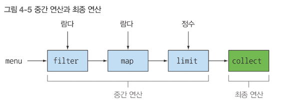

# 함수형 데이터 처리
## 스트림 소개
### 스트림이란 무엇인가?
### 컬렉션과 스트림
### 내부 반복과 외부 반복
### 중간 연산과 최종 연산

컬렉션이 없다면 무슨일이 벌어질까? 거의 모든 자바 어플리케이션은 컬렉션을 만들고 처리하는 과정을 포함한다<br>
즉 컬렉션으로 데이터를 그룹화하고 처리할 수 있다<br>
많은 요소를 포함하는 커다란 컬렉션은 어떻게 처리해야 할까? <br>
성능을 높이려면 멀티코어 아키텍쳐를 활용해서 병렬로 컬렉션의 요소를 처리해야 한다<br>
하지만 병렬 처리 코드를 구현하는 것은 단순 반복 처리 코드에 비해 복잡하고 어렵다 <br>
그래서 나온게 바로 스트림이다 

### 스트림이란 무엇인가?
스트림을 이용하면 선언형(즉, 데이터를 처리하는 임시구현 코드 대신 질의로 표현할 수 있다) 으로 컬렉션 데이터를 처리할 수 있다<br>
일단 스트림은 데이터 컬렉션 반복을 멋지게 처리하는 기능이라고 생각하자. 또한 스트림을 이용하면 멀티스레드 코드를 구현하지 않아도 데이터를 투명하게 병렬로 처리가 가능하다<br>
다음 예시를 봐보자
```java
List<Dish> lowCaloricDishes = new ArrayList<>();
for(Dish dish : menu) {
	if(dish.getCalories() < 400) {
		lowCaloricDishes.add(dish);
        }
    }

Collection.sort(lowCaloricDishes, new Comparator<Dish>() {
	public int compare(Dish dish1, Dish dish2) {
		return Integer.compare(dish1.getCalories(), dish2.getCalories());
	}
});

List<String> lowCaloricDishesName = new ArrayList<>();
for(Dish dish : lowCaloricDishes) {
	    lowCaloricDishesName.add(dish.getName()); // 정렬된 리스트를 처리하면서 요리 이름 선택
    }
```

위 코드를 스트림으로 바꾸어 보겠다.
```java
public class StreamEx {
	List<String> lowCaloricDishesName = menu.stream()
        .filter(d -> d.getCalories() < 400) // 400 칼로리 이하의 요리 선택
        .sorted(comparing(Dish::getCalories)) // 칼로리로 요리 정렬
        .map(Dish::getName) // 요리명 호출
        .collect(toList()); // 모든 요리명을 리스트에 저장
}
```

위 코드 stream() 을 parallelStream() 으로 바꾸면 이 코드를 멀티코어 아키텍처에서 병렬로 실행할 수 있다<br>
```java
List<String> lowCaloricDishesName = menu.parallelStream()
    .filter(d -> d.getCaloris() < 400)
	.sorted(comparing(Dish::getCalories)) // 칼로리로 요리 정렬
	.map(Dish::getName) // 요리명 호출
	.collect(toList()); // 모든 요리명을 리스트에 저장
```

parallelStream() 을 호출할 때 정확히 무슨일이 일어날까? 얼마나 많은 스레드가 사용되는 걸까? <br>
얼마나 성능이 좋은걸까? 라는 궁금증이 생길 수 있습니다 <br>
일단 스트림의 새로운 기능이 소프트웨어 공학적으로 다양한 이득을 준다는 것을 알면 된다
- 선언형으로 코드를 작성할 수 있다.if 조건문 등 제어 블록 필요 없이, 필요한 동작만 수행시킬 수 있다.
- filter,map.sorted,collect 같은 여러 빌딩 블록 연산을 연결해 데이터 처리 파이프라인을 만들 수 있다
- 즉 가독성과 명확성이 유지된다.

결과적으로 데이터 처리과정을 병렬화 하면서 스레드와 락을 걱정할 필요가 없다. 모두 스트림 API 덕분이다.


스트림 API는 매우 비싼 연산이다. 
```java
Map<Dish.Type, List<Dish>> dishesByType = menu.stream().collect(groupingBy(Dish::getType));
```

자바8 의 스트림 API 특징
1) 선언형 : 더 간결하고 가독성이 좋아진다.
2) 조립가능 : 유연성이 좋아진다.
3) 병렬화 : 성능이 좋아진다.


### 스트림 시작하기
스트림의 정의가 무엇일까? <br>
'데이터 처리 연산을 지원하도록 소스에서 추출된 연속된 요소로 정의할 수 있다.'

- 연속된 요소 : 컬렉션과 마찬가지로 스트림은 특정 요소 형식으로 이루어진 연속된 값 집합의 인터페이스를 제공한다 
컬렉션은 자료구조 이므로 컬렉션에서는 시간과 공간의 복잡성과 관련된 요소 저장 및 접근 연산이 주를 이룬다 
,반면 스트은 filter, sorted, map 처럼 표현 계산식이 주를 이룬다. 즉, 컬렉션의 주제는 데이터고 스트림의 주제는 계산이다<br>
- 소스 : 스트림은 컬렉션, 배열, I/O 자원 데이터 제공 소스로부터 데이터를 소비한다. 정렬된 컬렉션으로 스트림을 생성하면 정렬이 그대로 유지 된다
즉, 리스트로 스트림을 만들면 스트림의 요소는 리스트의 요소와 같은 순서를 유지한다.
- 데이터 처리 연산 : 스트림은 함수형 프로그래밍 언어에서 일반적으로 지원하는 연산과 데이터베이스와 비슷한 연산을 지원한다. 
  - 스트림 연산은 순차적으로 또는 병렬로 실행할 수 있다.

또한 스트림에는 다음과 같은 두 가지 중요 특징이 있다.
- 파이프라이닝 : 대부분의 스트림 연산은 스트림 연산끼리 연결해서 커다란 파이프라인을 구성할 수 있도록 스트림 자신을 반환한다.
- 내부 반복 : 반복자를 이용해서 명시적으로 반복하는 컬렉션과 달리 스트림은 내부 반복을 지원한다.


1) filter -> 람다를 인수로 받아 스트림에서 특정 요소를 제외시킨다. // 조건 걸기 
2) map -> 람다를 이용해서 한 요소를 다른 요소로 변환하거나, 정보를 추출한다.  // 데이터 변환 및 추출
3) limit -> 정해진 개수 이상으 요소가 스트림에 저장되지 못하게 제한한다.
4) collect -> 스트림을 Array 든, list 로든 변환한다. 


#### 4.3 스트림과 컬렉션
자바의 기존 컬렉션과 새로운 스트림 모두 연속된 요소 형식의 값을 저장하는 자료구조의 인터페이스를 제공한다 <br>
여기서 '연속된' 이라는 표현은 순서와 상관없이 아무 값에나 접속하는 것이 아닌, 순차적으로 값에 접근한다는 것을 의미한다 <br>

이제 컬렉션과 스트림의 차이를 알아보자.<br>
데이터를 언제 계산하느냐가 컬렉션과 스트림의 가장 큰 차이이다<br>
컬렉션은 현재 자료구조가 포함하는 모든 값을 메모리에 저장하는 자료구조 이다<br>
즉 컬렉션의 모든 요소는 컬렉션에 추가하기 전에 계산되어야 한다. 
- 연산을 수행할 때 마다 컬렉션의 모든 요소를 메모리에 저장해야 하며, 컬렉션에 추가하려는 요소는 미리 계산되어야 한다.

반면 스트림은 이론적으로 요청할 때만 요소를 계산하는 고정된 자료구조 이다(스트림에 요소를 추가하거나 스트림에서 요소를 제거할 수 없다)<br>
즉 사용자가 요청하는 값만 스트림에서 추출한다는 것이 핵심이다.<br>
결과적으로 스트림은 생산자와 소비자 관계를 형성한다. 즉 사용자가 데이터를 요청할 때만 값을 계산한다.

반면 컬렉션은 적극적으로 생성된다. (생산자 중심 : 팔기도 전에 창고를 가득 채움) <br>
살짝 비교를 하자면, 스트림 : 병렬성, 컬렉션 : 동시성 이다.

#### 딱 한 번만 탐색할 수 있다.
반복자와 마찬가지로 스트림도 한 번만 탐색할 수 있다. 즉 탐색된 스트림의 요소는 소비된다.<br>
반복자와 마찬가지로 한 번 탐색한 요소를 다시 탐색하려면 초기 데이터 소스에서 새로운 스트림을 만들어야 한다 <br>
그러러면 컬렉션처럼 반복 사용할 수 있는 데이터 소스여야 한다.
```java
List<String> title = Arrays.asList("Java8","in","action");
Stream<String> s = title.stream();
s.forEach(System.out::println); // title 출력
s.forEach(System.out::println); // 이미 스트림이 소비되었기 때문에, 컴파일 에러
```

스트림은 단 한번만 소비할 수 있다는 점을 꼭 기억하자!

컬렉션과 스트림의 또 다른 차이점은 데이터 반복 처리 방법이다. 

#### 외부 반복과 내부 반복
컬렉션 인터페이스를 사용하려면 사용자가 직접 요소를 반복해야 한다 ex) for-each 문 <br>
이를 <b>외부 반복</b> 이라고 한다 .<br>
반면 스트림은 (반복을 알아서 처리하고 결과 스트림값을 어딘가에 저장해주는)<b>내부 반복</b>을 사용한다.<br>
함수에 어떤 작업을 수행할지만 지정하면 모든 것이 알아서 처리된다 
```java
List<String> names = new ArrayList<>();
for(Dish dish : menu) {
	names.add(dish.getName());
}
```

for-each 를 사용하면 Iterator 객체를 이용하는 것보다 더 쉽게 컬렉션을 반복할 수 있다 <br>
```java
List<String> names = new ArrayList<>();
Iterator<String> iterator = menu.iterator();
while(iterator.hasNext()) {
	Dish dish = iterator.next();
	names.add(dish.getName());
}
```

위 코드와 같이 forEach 문이면 간단하게 끝날 것을 장황하게 코드를 작성해야 한다. <br>

그리고 위 코드를 for-each, Iterator 가 아닌 스트림을 사용한다면
```java
List<String> names = menu.stream()
                    .map(Dish::getName()
                    .collect(toList());   
```

위 코드들이 제일 짧고 간결하게 정리가 되었다 <br>
이게 바로 스트림의 능력이다

내부 반복을 이용하면 작업을 병렬로 처리하거나, 더 최적화된 다양한 순서로 처리할 수 있다 <br>
기존 자바 컬렉션을 외부 반복으로 처리한다면 이와 같은 최적화를 달성하기 어렵다. <br>
하지만 내부 반복은 데이터 표현과 하드웨어를 활용한 병렬성 구현을 자동으로 선택한다<br>
반면 for-each 를 이용하는 외부 반복에서느 병렬성을 스스로 관리해야 한다 <br>
병렬성을 스스로 관리한다는 것은 병렬성을 포기하든지 아니면 synchronized 로 시작하는 힘든 일을 해야 한다.


즉 컬렉션은 for-each 를 통해 뽑을 수도 있지만, 스트림으로 병렬로 처리하는게 효율이 좋다. (스트림 내부 반복 , 컬렉션 외부 반복) 이다. <br>

특히 스트림은 내부 반복을 사용하므로, 반복 과정을 우리가 신경 쓰지 않아도 된다. <br>
(위 이점을 누리려면, filter, map 등 반복 과정을 숨겨주는 연산 리스트가 미리 정의되어 있어야 한다.)<br>

반복을 숨겨주는 대부분의 연산은 람다 표현식을 인수로 받으므로 3장에서 배운 동작 파라미터화를 활용할 수 있다 <br>
```java
// 외부 반복 코드
List<String> highCaloricDishes = new ArrayList<>();
Iterator<String> iterator = menu.iterator();
while(iterator.hasNex()) {
	Dish dish = iterator.next();
	if(dish.getCalories() > 300) {
    highCaloricDishes.add(dish.getName())''
	}
}

// 내부 반복 코드
List<String> highCaloricDish = menu.stream()
        .filter(dish -> dish.getCalories() > 300)
        .map(Dish::getName)
        .collect(toList());
```

#### 스트림 연산
스트림 연산은 연결할 수 있는 중간연산, 스트림을 닫는 최종연산 두 그룹으로 나뉜다. 


#### 중간 연산
ex) filter, sorted, map 이 대표적인 중간연산이다. -> 다른 스트림을 반환한다. <br>
따라서 여러 중간 연산을 연결해서 질의를 만들 수 있다. 중간 연산의 중요한 특징은 단말 연산을 스트림 파이프라인에 실행하기 전까지는 아무 연산도 안한다 <br>
즉 게으른(Lazy) 연산이다. 중간 연산을 합친 다음에 합쳐진 중간 연산을 최종 연산으로 한 번에 처리하기 때문이다<br>

스트림 파이프라인에서 어떤 일이 일어나는지 쉽게 확인할 수 있도록 람다가 현재 처리 중인 요리를 출력하자
```java
List<String> names = menu.stream()
        .filter(dish -> {
          System.out.println("filtering : " + dish.getName());
		  return dish.getCaloires() > 300;
        }) // 필터링한 요리명을 출력한다.
        .map(dish -> {
          System.out.println("mapping : " + dish.getName());
		  return dish.getName();
        }) // 추출한 요리명을 출력한다
        .limit(3)
        .collect(toList());
sout(names);
```

- limit 으로 딱 3가지 씩만 뽑아 온다. 
- filter 와 map 은 다른 연산이지만 한 과정으로 병합되었다 (루프 퓨전)

#### 최종 연산
최종 연산은 스트림 파이프라인에서 결과를 도출한다. 보통 최종 연산에 의해 List, Integer, void 등 스트림 이외의 결과가 반환된다 <br>
```java
menu.stream().forEach(System.out::println);
```

반환타입이 stream 이면 중간연산이고, 아니면 최종 연산이다.

#### 스트림 이용하기
- 질의를 수행할 (컬렉션 같은) 데이터 소스
- 스트림 파이프라인을 구성할 중간 연산 연결
- 스트림 파이프라인을 실행하고 결과를 만들 최종 연산

스트림 파이프라인의 개념은 빌더 패턴과 비슷하다 <br>
빌더 패턴에서는 호출을 연결해서 설정을 만든다 (스트림에서 중간 연산을 연결하는 것과 같다) <br>
그리고 준비된 설정에 build 메소드를 호출한다 (스트림에서는 최종 연산에 해당한다) <br>


### 최종 정리
- 스트림은 소스에서 추출된 연속 요소로 데이터 처리 연산을 지원한다.
- 스트림은 내부 반복을 지원한다. 내부 반복은 filter, map, sorted 연산으로 반복을 추상화 한다.
- 스트림에는 중간연산과 최종 연산이 있다.
- 중간 연산은 filter 와 map 처럼 스트림을 반환하면서 다른 연산과 연결되는 연산이다. 중간 연산을 이용해서 파이프라인을 구성할 수 있지만, 중간 연산으로는 어떤 결과도 생성할 수 없다.
- forEach 나 count 처럼 스트림 파이프라인을 처리해서 스트림이 아닌 결과를 반환하는 연산을 최종 연산이라고 한다.
- 스트림의 요소는 요청시 LAZY 하게 계산된다.


