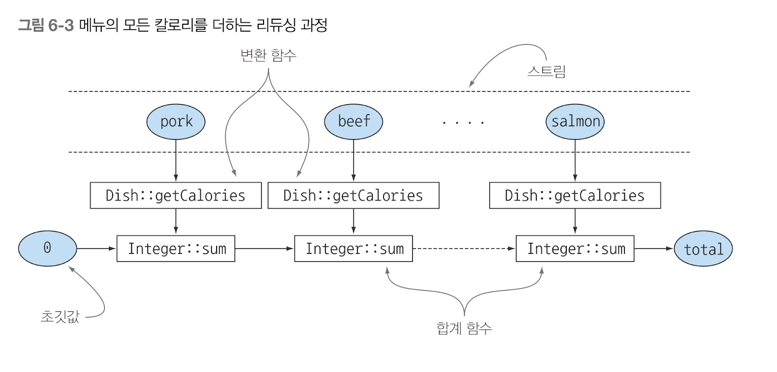
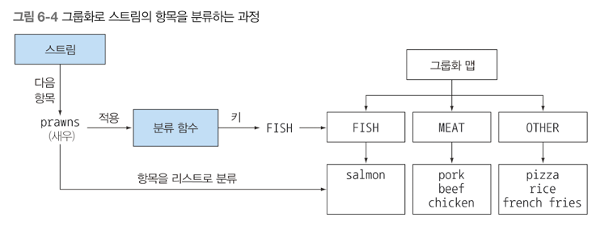
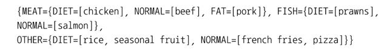
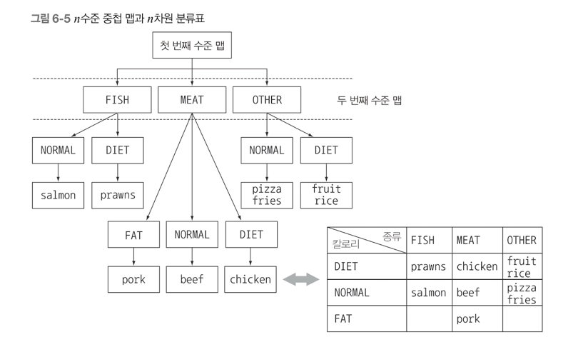
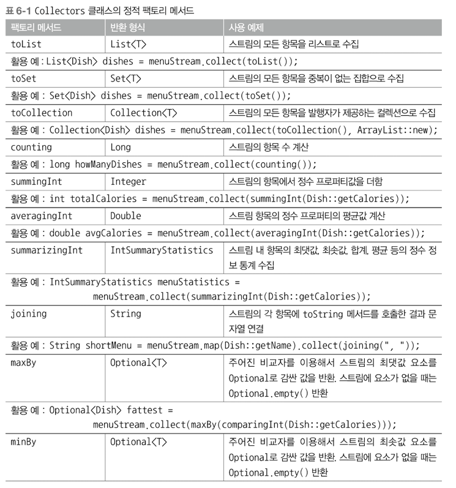
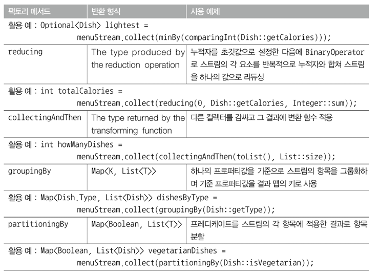

# 스트림으로 데이터 수집

### 이장의 내용
- Collectors 클래스로 컬렉션을 만들고 사용하기 
- 하나의 값으로 데이터 스트림 리듀스 하기
- 특별한 리듀싱 요약 연산
- 데이터 그룹화와 분할
- 자신만의 커스텀 컬렉터 개발

전 챕터에서는 스트림을 이용해서 데이터베이스 연산을 수행할 수 있음을 배웠다 <br>
스트림의 연산은 filter 또는 map 같은 중간 연사과 count, findFirst, forEach, reduce 등의 최종 연산으로 구분할 수 있다 <br>
중간 연산은 한 스트림을 다른 스트림으로 변환하는 연산으로서, 여러 연산을 연결할 수 있다 <br>
중간 연산은 스트림 파이프라인을 구성하며, 스트림의 요소를 소비 하지 않는다 <br>
반면 최종 연산은 스트림의 요소를 소비해서 최종결과를 도출한다 <br>
ex) 스트림의 가장 큰 값 반환, 작은 값 반환 <br>
최종 연산은 스트림 파이프라인을 최적화하면서 계산 과정을 짧게 생략하기도 한다 <br>

지금부터 Collection, Collector, collect 를 헷갈리지 않도록 연습을 해보자 <br>

collect 와 Collector 로 구현할 수 있는 질의 예제이다
```java
// 통화별로 트랜잭션을 그룹화한 코드
Map<Currency, List<Transaction>> transactionsByCurrencies = 
    transactions.stream().collect(groupingBy(Transaction::getCurrency));
```

### 컬렉터란 무엇인가? 
함수형 프로그래밍에서는 '무엇'을 원하는지 직접 명시할 수 있어서 어떤 방법으로 이를 얻을지는 신경 쓸 필요가 없다 <br>
이전 예제에서 collect 메소드로 Collector 인터페이스 구현을 전달했다. <br>
각 요소를 List 로 만드는 -> toList 를 인터페이스의 구현으로 사용했다 <br>
다수준으로 그룹화를 수행할 때 명령형 프로그래밍과 함수형 프로그래밍의 차이점이 더욱 두드러진다 <br>
명령형 코드에서는 문제를 해결하는 과정에서 다중 루프와 조건문을 추가하며 가독성과 유지보수성이 크게 떨어진다 <br>

#### 고급 리듀싱 기능을 수행하는 Collector 
잘 설계된 함수형 API 의 또 다른 장점으로 높은 수준의 조합성과 재사용성을 꼽을 수 있다 <br>
collect 로 결과를 수집하는 과정을 간단하면서도 유연한 방식으로 정의를 할 수 있다는 점이 컬렉터의 최대 강점이다 <br>
스트림에 collect 를 호출하면 스트림의 요소에 리듀싱 연산이 수행된다. 내부적으로 리듀싱 연산이 일어나는 모습을 보여준다 <br>
보통 함수를 요소로 변환(toList 처럼 데이터 자체를 변환하는 것 보다는 데이터 저장 구조를 변환할 때가 많다) <br>
컬렉터를 적용하며 최종 결과를 저장하는 자료구조에 값을 누적한다 <br>
```java
List<Transaction> transactionList = transactionStream.collect(Collectors.toList());
```

#### 미리 정의된 컬렉터
미리 정의된 컬렉터 : groupingBy 같이 Collectors 클래스에서 제공하는 팩토리 메소드의 기능을 설명한다 <br>
Collectors 에서 제공하는 메소드의 기능은 크게 세 가지로 구분할 수 있습니다. <br>
1) 스트림 요소를 하나의 값으로 리듀스하고 요약
2) 요소 그룹화
3) 요소 분할

먼저 리듀싱과 요약 관련 기능을 수행하는 컬렉션부터 살펴보자 <br>

#### 리듀싱과 요약
Collector 로 Stream 의 모든 항목을 하나의 결과로 합칠 수 있다 <br>
좀 더 일반적으로 말해 컬렉터로 스트림의 모든 항목을 하나의 결과로 합칠 수 있다.
```java
// counting() 이라는 팩토리 메소드가 반환하는 컬렉터로 메뉴에서 요리 수를 계산한다.
long howManyDishes = menu.stream().collect(Collectors.counting());

// Refactor
long getHowManyDishes = menu.stream().count();
```

counting 컬렉터는 다른 컬렉터와 함께 사용할 때 유용하다 <br>

#### 스트림 값에서 최댓값과 최솟값 검색
Collectors.maxBy , Collectors.minBy 두 메소드를 이용해서 최댓값과 최솟값을 계산할 수 있다 <br>
```java
Comparator<Dish> dishCaloriesComparator = 
    Comparator.comparingInt(Dish::getCaloris);

Optional<Dish> mostCalorieDish = menu.stream()
    .collect(maxBy(dishCaloriesComparator));
```

Optional<Dish> 는 무슨 역할을 수행하는 것 일까? <br>
menu 가 비어있다면 그 어떤 요리도 반환되지 않는다.<br>
즉 있을수도 있고, 없을 수도 있는 컨테이너 Optional 을 제공한다. 그러면 Null 안정성이 더 높아진다 <br>

#### 요약 연산
Collectors 클래스는 Collectors.summingInt 라는 특별한 요약 팩토리 메소드를 제공한다 <br>
summingInt 는 객체를 int로 매핑하는 함수를 인수로 바든다 <br>
summingInt 의 인수로 전달된 함수는 객체를 int 로 매핑한 컬렉터를 반환한다. 그리고 summingInt 가 collect 메소드로 전달되면 요약 작업을 수행한다
```java
int totalCalories = menu.stream().collect(summingInt(Dish::getCalories));
```

합계 연산 말고 평균 연산 또한 가능하다
```java
double avgCalories = menu.stream().collect(averagingInt(Dish::getCalories));
```

다음은 하나의 요약 연산으로 메뉴에 있는 요소 수, 요리의 칼로리 합계, 평균, 최댓값, 최솟값 등을 계산하는 코드이다 <br>
```java
IntSummaryStatistics menuStatistics = menu.stream().collect(summarizingInt(Dish::getCalories));
```

위 코드 실행시 IntSummaryStatistics 클래스로 모든 정보가 수집된다. 

#### 문자열 연결
컬렉터에 joining 팩토리 메소드를 이용하면 스트림의 각 객체에 toString 메소드를 호출해서 추출한 모든 문자열을 하나의 문자열로 연결해서 반환한다 <br>
즉 다음은 메뉴의 모든 요리명을 연결하는 코드이다 <br>
```java
String shortMenu = menu.stream().map(Dish::getName).collect(joining());
```

joining 메소드는 내부적으로 StringBuilder 를 이용해서 문자열을 하나로 만든다. <br>
Dish 클래스가 요리명을 반환하는 toString 메소드를 포함하고 있다면 다음 코드에서 보여주는 것처럼 map 으로 각 요리의 이름을 추출하는 과정을 생략한다 
```java
String shortMenu = menu.stream().collect(joining());
```

하지만 이렇게 문자열을 다 합쳐버리면, 결과를 봐도 알아보기가 힘들다 그러므로 split 해줄수 있는 것을 추가한다.
```java
String shortMenu = menu.stream().map(Dish::getName).collect(joining(", "));
```

위 코드가 정석 코드라고 생각합니다.

#### 범용 리듀싱 요약 연산
지금까지 살펴본 모든 Collector 는 reducing 팩토리 메소드로도 정의할 수 있다, <br>
Collectors.reducing 으로도 구현이 가능하다 <br>
그럼에도 범용 팩토리 메소드 대신 특화된 컬렉션을 사용하는 이유는 프로그래밍적 편의성 때문이다 <br>
```java
int totalCalories = menu.stream().collect(reducing(0, Dish::getCalories, (i,j) -> i+j));
```

위 코드에서 reducing 은 인수 3개를 받는다 <br>
- 첫 번째 인수는 리듀싱 연산의 시작값이거나 스트림에 인수가 없을 때는 반환값이다(인수가 없을때 반환값은 0 이다.)
- 두 번째 인수는 요리중에서 칼로리정수를 변환시키고 가져오는 함수
- 세 번째 인수는 같은 종류의 두 항목을 하나의 값으러 더하는 BinaryOperator 이다. 

아래 코드는 다른 방법이다
```java
Optional<Dish> mostCalorieDish = menu.stream().collect(reducing(
	(d1,d2) -> d1.getCaloris() > d2.getCalories() ? d1:d2
));
```

### 컬렉션 프레임워크 유연성 : 같은 연산도 다양한 방식으로 수행할 수 있다.
reducing 컬렉터를 사용한 이전 예제에서 람다 표현식 대신 Integer 클래스의 sum 메소드 참조를 이용하면 코드를 좀 더 단순화 할 수 있다 <br>
```java
int totalCalories = menu.stream().collect(reducing(
	0, // 초기값 
    Dish::getCaloris, // 변환 함수 
    Integer::sum)); // 합계 함수
```

1) 누적자를 초기값으로 초기화하고
2) 합계 함수를 이용해서 각 요소에 변환함수를 적용하고
3) 결과 숫자를 반복적으로 조합한다.



counting 컬렉터도 세 개의 인수를 갖는 reducing 팩토리 메소드를 이용해서 구현할 수 있다 
```java
public static <T> Collector<T, ?, Long> counting() {
	return reducing(0L, e-> 1L, Long::sum);
}
```

#### 제네릭 와일드카드 ' ? ' 사용법
? 는 컬렉터의 누적자 형식이 알려지지 않았음을, 즉 누적자의 형식이 자유로움을 의미한다 <br>
위 예제에서는 Collectors 클래스에서 원래 정의된 메소드 시그니처를 그대로 사용했을 뿐이다 <br>
하지만 오해의 소지가 생길 수 있으므로 막 사용하지 않고, 상황을 봐가면서 사용해야 한다 

컬렉터를 이용하지 않고도 다른 방법으로 연산을 수행할 수 있다.
```java
int totalCalories = menu.stream().map(Dish::getCalories).reduce(Integer::sum).get
```

한 개의 인수를 갖는 reduce 를 스트림에 적용한 결과는 빈 스트림과 관련한 Null 문제를 피할 수 있도록 int 가 아닌 Optional<Integer> 를 반환한다 <br>
스트림은 비어있지 않다는 사실을 알고 있으므로 get 을 자유롭게 사용할 수 있다 <br>
일반적으로 Optional 을 사용할 경우는 orElse, orElseGet 등을 이용해서 값을 얻어오는 것이 좋다<br>
마지막으로 스트림을 IntStream 으로 매핑한 다음에 sum 메소드를 호출하는 방법으로도 결과를 얻을 수 있다.
```java
int totalCalories = menu.stream().mapToInt(Dish::getCalories).sum();
```

스트림 인터페이스에서 직접 제공하는 메소드를 이용하는 것에 비해 컬렉터를 이용하는 코드가 더 복잡하다는 사실을 보여준다 <br>
코드가 좀 더 복잡한 대신 재사용성과 커스터마이즈 가능성을 제공하는 높은 수준의 추상화와 일반화를 얻을 수 있다

String 값 합칠 땐 -> joining()

### 그룹화
데이터 집합을 하나 이상의 특성으로 분류해서 그룹화하는 연산도 데이터베이스에서 많이 수행되는 작업이다 <br>
트랜잭션 통화 그룹화 예제에서 확인했듯이 명령형으로 그룹화를 구현하려면 까다롭고, 할일이 많으며, 에러도 많이 발생한다 <br>
하지만 자바 8의 함수형을 이용하면 가독성 있는 한 줄의 코드로 구룹화를 구현할 수 있다 <br>
이번에는 메뉴를 그룹화 한다고 해보자. Collectors.groupingBy 를 이용해서 쉽게 메뉴를 그룹화 해보자
```java
Map<Dish.Type, List<Dish>> dishesByType = menu.stream().collect(gropingBy(Dish::getType));
```

-> Dish.Type 과 일치하는 모든 요리를 추출하는 함수를 groupingBy 메소드로 전달을 했다. <br>
이 함수를 기준으로 스트림이 그룹화 되므로 이를 분류 함수 라고 한다.<br>
각 키에 대응하는 스트림의 모든 항목리스트를 값으로 갖는 맵이 반환이 된다.


```java
public enum CaloricLevel { DIET, NORMAL, FAT}

Map<CalroicLevel, List<Dish>> dishesByCaloricLevel = menu.stream().collect(
	groupingBy(dish -> {
		if (dish.getCalories() <= 400) {
			return CaloricLevel.DIET;
		}
		else if (dish.getCalories () <= 700) {
			return CaloricLevel.NORMAL;
		}
		else {
			return CaloricLevel.FAT;
		}
    })
);
```

위 코드를 통해서 그룹화 할 때 더 자세한 조건을 주어서 그룹핑을 할 수가 있다.

#### 그룹화된 요소 조작
요소를 그룹화 한 다음에는 각 결과 그룹의 요소를 조작하는 연산이 필요하다<br>
예를 들어 500 칼로리가 넘는 요리만 필터링 한다고 가정하자 <br>
아래 코드는 그룹화 하기전에 Predicate 필터를 통해서 문제를 해결할 수 있다고 생각할 것이다.
```java
Map<Dish.Type, List<Dish>> caloricDishesByType = menu.stream()
    .filter(dish -> dish.getCalories() > 500)
    .collect(groupingBy(Dish::getType));
```

위 코드로도 해결할 수 있지만, 단점이 존재한다. Map 형태로 반환을 하기 때문에 맵 코드가 필요하다.<br>
위 코드에는 FISH 종류 요리는 없으므로 결과 맵에서 해당 키 자체가 사라진다. 
```java
Map<Dish.Type, List<Dish>> caloricDishesByType = menu.stream()
    .collect(groupingBy(Dish::getType, 
        filtering(dish -> dish.getCalories() > 500 , toList())));
```

filtering 메소드는 Collectors 클래스의 또 다른 정적 팩토리 메소드로 Predicate 를 인수로 받는다.

#### 다수준 그룹화
두 인수를 받는 팩토리 메소드 Collectors.groupingBy 를 이용해서 항목을 다수준으로 그룹화 할 수 있다 <br>
Collectors.groupingBy 는 일반적인 분류 함수와 컬렉터를 인수로 받는다 <br>
즉, 바깥쪽 gropingBy 메소드에 스트림의 항목을 분류할 두 번째 기준을 정의하는 내부 gropingBy 를 전달해서 두 수준으로 스트림의 항목을 그룹화 할 수 있다
```java
Map<Dish.Type, Map<CaloricLevel, List<Dish>>> dishedByTypeCaloricLevel = 
menu.stream.collect(
	groupingBy(Dish::getType, // 첫 번째 수준의 분류 함수
        groupingBy(dish -> {  // 두 번째 수준의 분류 함수 
		if (dish.getCalories () <= 400) {
			return CaloriceLevel.DIET;
		}
		else if (dish.getCalories() <= 700) {
			return CaloriceLevel.NORMAL;
		}
		else {
			return CaloricLevel.FAT;
		}
    }))
);
```

그룹화 의 결과로 다음과 같은 두 수준의 맵이 만들어진다. 


외부 맵은 첫번째 수준으 분류 함수에서 분류한 키값 'fish, meat, other' 을 갖는다. <br>
그리고 외부 맵의 값은 두 번째 수준의 분류 함수의 기준 'normal, diet, fat' 을 키 값으로 갖는다. <br>
즉 n 수준 그룹화의 결과는 n수준 트리 구조로 표현되는 n수준 맵이 된다. 


보통 groupingBy 의 연산을 버킷(양동이) 개념으로 생각하면 쉽다 <br>
첫 번째 groupingBy 는 각 키의 버킷을 만들고, 준비된 각각의 버킷을 서브스트림 컬렉터가 채워가면서 n 수준 그룹화를 달성한다. <br>

#### 서브그룹으로 데이터 수집
위에는 두 번째 gropingBy 컬렉터를 외부 컬렉터로 전달해서 다수준 그룹화 연산을 구현했다. <br>
첫 번째 gropingBy 로 넘겨주는 컬렉터의 형식은 제한이 없다 <br>
예를 들어 다음 코드처럼 groupingBy 컬렉터에 두 번째 인수로 counting 컬렉터를 전달해서 메뉴에서 요리의 수를 종류별로 계산할 수 있다 <br>
```java
Map<Dish.Type, Long> typesCount = menu.stream().collect(
	groupingBy(Dish::getType, counting())
);
```

결과
> {MEAT=3, FISH=2, OTHER=4} 

위 처럼 몇개 씩 집계가 되었는지 나온다. <br>
분류 함수 한 개의 인수를 갖는 gropingBy(f) 는 사실 groupingBy(f, toList()) 의 축약형이다 <br>
```java
Map<Dish.Type, Optional<Dish>> mostCaloricByType = menu.stream()
    .collect(gropingBy(Dish::getType, maxBy(comparingInt(Dish::getCalories)))
    );
```

그룹화의 결과로 요리의 종류를 Key, Optional<Dish> 를 값으로 갖는 맵이 반환된다. <br>

#### 컬렉터의 결과를 다른 형식에 적용하기
마지막 그룹화 연산에서 맵의 모든 값을 Optional 로 감쌀 필요가 없으므로 Optional 을 삭제할 수 있다 <br>
즉, 다음처럼 팩토리 메소드 Collectors.collectingAndThen 으로 컬렉터가 반환한 결과를 다른형식으로 활용할 수 있다 <br>
```java
Map<Dish.Type, Dish> mostCaloricByType = menu.stream()
    .collect(groupingBy(Dish::getType, // 분류 함수
        collectingAndThen(
		maxBy(comparingInt(Dish::getCalories)), // 감싸인 컬렉터
        Optional::get // 변환 함수
    )));
```

#### groupingBy 와 함께 사용하는 다른 컬렉터 예제
일반적으로 스트림에서 같은 그룹으로 분류된 모든 요소에 리듀싱 작업을 수행할 때는 팩토리 메소드 groupingBy에 두번째 인수로 전달한 컬렉터를 사용한다 <br>
예를 들어 메뉴에 있는 모든 요리의 칼로리 합게를 구하려고 만든 컬렉터를 재사용할 수 있다. 물론 여기서는 각 그룹으로 분류된 요리에 이 컬렉터를 활용한다. 
```java
Map<Dish.Type, Integer> totalCaloriesByType = menu.stream()
    .collect(groupingBy(Dish::getType, summingInt(Dish::getCalories))
    );
```

이 외에도 mapping 메소드로 만들어진 컬렉터도 groupingBy 와 자주 사용된다. <br>
mapping 메소드는 스트림의 인수를 변환하는 함수와 변화함수의 결과 객체를 누적하는 컬렉터를 인수로 받는다 <br>

#### 분할
분할은 분할 함수라 불리는 Predicate 를 분류 함수로 사용하는 특수한 그룹화 기능이다. <br>
분할 함수는 boolean 을 반환하며, 맵의 키 형식은 Boolean 이다 <br>
결과적으로 그룹화 맵의 최대 두개의 그룹으로 분류된다 <br>
예를 들어 채식주의자 친구를 저녁에 초대했다고 가정하자, 그러면 이제 모든 요리를 채식 요리와 채식이 아닌 요리로 분류 해야한다
```java
Map<Boolean, List<Dish>> partitionedMenu = 
    menu.stream()
        .collect(partitioningBy(Dish::isVegetarian)); // 분할 함수

// 위 코드를 바탕으로 채식 요리만 List 에 담을 수 있다.
List<Dish> getVegetarian = partitionedMenu.get(true);

List<Dish> getIsVegetarian = menu.stream().filter(Dish::isVegetarian).collect(toList());
```

#### 분할의 장점
분할 함수가 반환하는 참, 거짓 두 가지 요소의 스트림 리스트를 모두 유지한다는 것이 분할의 장점이다 <br>
이전 예제에서 partitionedMenu 맵에 거짓 키를 이용해서( 즉, Predicate 와 그 결과를 반전시키는 두 가지 필터링 연산을 적용해서) 채식이 아닌 모든 요리 리스트를 얻는다 <br>
또한 다음 코드에서 보여주는 것처럼 컬렉터를 두 번째 인수로 전달할 수 있는 오버로드 된 버전으 partitioningBy 메소드도 있다
```java
Map<Boolean, Map<Dish.TYpe, List<Dish>>> vegetarianDishedByType = menu.stream()
    .collect(
		partitionBy(Dish::isVegetarian, // 분할 함수
            groupingBy(Dish::getType)) // 두 번째 컬렉터
    );
```

#### 숫자를 소수와 비소수로 분할하기
주어진 수가 소수인지 아닌지 판별하는 Predicate 로직
```java
public boolean isPrime (int candidate) {
	return IntStream.range(2, candidate) // 2부터 candidate 미만 사이의 자연수를 생성한다.
        .noneMatch(i -> candidate % i ==0); // 스트림의 모든 정수로 candidate 를 나눌 수 없으면 참을 반환한다.
}
```

다음처럼 소소의 대상을 주어진 수의 제곱근 이하의 수로 제한할 수 있다.
```java
public boolean isPrime(int candidate) {
	int candidateRoot = (int)Math.sqrt((double)candidate);
	return IntStream.rangeClosed(2, candidateRoot)
        .noneMatch(i -> candidate % i ==0);
}
```

이제 소수와 비소수를 분류 할 수 있다.
```java
public Map<Boolean, List<Integer>> partitionPrimes(int n) {
	return Intstream.rangeClosed( (2,n).boxed()
        .collect(
			partitioningBy(candidate -> isPrime(candidate))
        );
}
```




모든 Collector 인터페이스의 메소드들이다.


### Collector 인터페이스 
Collector 인터페이스는 리듀싱 연산 (즉, 컬렉터)를 어떻게 구현할지 제공하는 메소드 집합으로 구성된다. <br>
지금까지 toList , groupingBy 등 Collector 인터페이스를 구현하는 많은 컬렉터들을 봤습니다.<br>
toList(스트림의 요소를 리스트로 수집)을 잘 알아야 한다 <br>
```java
public interface Collector<T, A, R> {
	
}
```

- T 는 수집될 스트림 항목의 제네릭 형식이다
- A 는 누적자, 즉 수집과정에서 중간 결과를 누적하는 객체의 형식 ex) List<T>
- R 은 수집 연산 결과 객체의 형식이다 (다 그런건 아니지만 보통 그렇다)

보통 Collector<T, List<T>, List<T>> 로 반환함

#### Collector 인터페이스의 메소드 살펴보기
1) Supplier 메소드 : 새로운 결과 컨테이너 만들기
supplier 메소드는 빈 결과로 이루어진 Supplier 를 반환해야 한다. <br>
예를 들어 ToListCollector 처럼 누적자를 반환하는 컬렉터에서는 빈 누적자가 비어있는 스트림의 수집 과정의 결과가 된다.
```java
Supplier<A> supplier();

public Supplier<List<T>> supplier() {
	return () -> new ArrayList<T>();
	// return ArrayList::new;
}
```

2) accumulator 메소드 : 결과 컨테이너에 요소 추가하기
accumulator 는 리듀싱 연산을 수행하는 함수를 반환한다.<br>
ToListCollector 에서 accumulator 가 반환하는 함수는 이미 탐색한 항목을 포함하는 리스트에 현재 항목을 추가하는 연산을 수행한다
```java
public BiConsumer<List<T>, T> accumulator() {
	return (list, item) -> list.add(item);
	//return List::add;
} 
```

3) finisher 메소드 : 최종 변환값을 결과 컨테이너로 적용하기
스트림 탐색을 끝내고, 누적자 객체를 최종 결과로 변화하면서 누적 과정을 끝낼 때 호출할 함수를 반환해야 한다 <br>
```java
public Function<List<T>, List<T>> finisher() {
	return Function.identity();
}
```


4) combiner 메소드 : 두 결과 컨테이너 병합
스트림의 서로 다른 서브파트를 병렬로 처리할 때 누적자가 이 결과를 어떻게 처리할지 정의한다 <br>
toList 의 combiner 는 비교적 쉽게 구현할 수 있다
```java
public BinaryOperator<List<T>> combiner() {
	return (list1, list2) -> {
		list1.addAll(list2);
		return list1;
    }
}
```

5) characteristics 메소드
컬렉터의 연산을 정의하는 characteristics 형식의 불변 집합을 반환한다 <br>
스트림을 병렬로 처리할 것인지 그리고 병렬로 리듀스 한다면 어떤 최적화를 선택해야 할지 힌트를 제공한다

#### 컬렉터 구현을 만들지 않고도, 커스텀 수집 수행하기
Stream 은 세 함수(발행,누적,합침) 을 인수로 받는 collect 메소드를 오버로딩 하면 각각의 메소드는 Collector 인터페이스의 메소드가 반환하는 함수와 같은 기능을 수행한다 <br>
```java
List<Dish> dishes = menuStream.collect(
	ArrayList::new, // 발행
    List::add, // 누적
    List::addAll // 합침
);
```

#### 커스텀 컬렉터를 구현해서 성능 개선하기
ex) n 이하의 자연수를 소수와 비소수로 분류하기
```java
public Map<Boolean, List<Integer>> partitionPrimes(int n) {
	return Intstream().rangClosed(2,n).boxed()
        .collect(partitioningBy(candidate -> isPrime(candidate));
}

public boolean isPrime(int candidate) {
	int candidateRoot = (int)Math.sqrt((double)candidate);
	return Intstream.rangeClosed(2, candidateRoot)
        .noneMatch(i -> candidate % i==0);
}
```

위 코드의 성능을 더 개선할 수 있을까? 커스텀 컬렉터를 이용하면 성능을 더 개선할 수 있다. 
```java
public static boolean isPrime(List<Integer> primes, int candidate) {
	int candidateRoot = (int)Math.sqrt((double)candidate);
	return primes.stream()
        .takeWhile(i -> i <= candidateRoot)
        .noneMatch(i -> candidate % i==0);
}
```


#### 요약 
- collect 는 스트림의 요소를 요약 결과로 누적하는 다양한 방법(컬렉터라 불리는)을 인수로 갖는 최종 연산이다.
- 스트림의 요소를 하나의 값으로 리듀스하고 요약하는 컬렉터 뿐 아니라, 최솟값, 최댓값, 평균 값을 계산하는 컬렉터 등이 미리 정의되어 있다.
- 미리 정의된 컬렉터인 gropingBy로 스트림의 요소를 그룹화하거나, partitioningBy 로 스트림의 요소를 분할할 수 있다.
- 컬렉터는 다수준의 그릅화, 분할, 리듀싱 연산에 적합하게 설계되어 있다.
- Collector 인터페이스에 정의된 메소드를 구현해서 커스텀 컬렉터를 개발할 수 있다.


