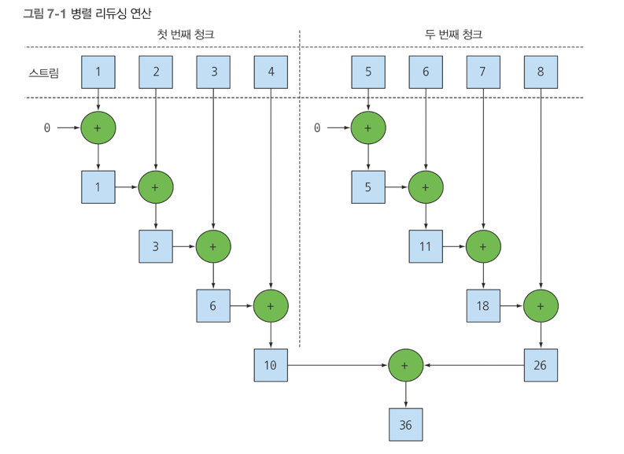
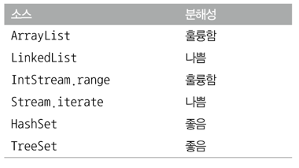

## 병렬 데이터 처리와 성능
- 병렬 스트림으로 데이터를 병렬 처리하기
- 병렬 스트림의 성능 분석
- 포크/조인 프레임워크
- Spliterator 로 스트림 데이터 쪼개기

자바7 이후에서는 더 쉽게 병렬화를 수행하면서 에러를 최소화 할 수 있도록 포크/조인 프레임워크 기능을 제공한다 <br>
스트림을 이용하면 순차 스트림을 병렬 스트림으로 자연스럽게 바꿀 수 있다. <br>

### 병렬 스트림
컬렉션에 parallelStream 을 호출하면 병렬 스트림이 생성된다. <br>
병렬 스트림이란 각각의 스레드에서 처리할 수 있도록 스트림 요소를 여러 청크로 분할한 스트림 입니다 <br>
따라서 병렬 스트림을 이용하면 모든 멀티코어 프로세서가 각각의 청크를 처리하도록 할당할 수 있다 <br>

숫자 n 을 인수로 받아 1 ~ n 까지 모든 숫자의 합계를 반환하는 메소드를 구현해보자
```java
public Long sequentialSum(long n) {
	return Stream.iterater(1L, i -> i+1) // 무한 자연수 스트림 생성
        .limit(n) // n개 이하로 결과값 제한
        .reduce(0L, Long::sum); // 모든 숫자를 더하는 스트림 리듀싱 연산
}

// 전통적인 자바 방식
public long iterativeSum(long n) {
	long result = 0;
	for (long i = 1L; i <= n ; i++) {
        result += i;
	}
	return result;
}
```

n이 작다면 문제가 없지만, n이 커진다면 이 연산을 병렬로 처리하는 것이 좋을 것이다. 

그럼 어떻게 병렬로 처리하나요? <br>
간단합니다. 스트림 중간 연산에 parallel() 메소드를 껴 넣어두면 됩니다.

#### 순차 스트림을 병렬 스트림으로 변환하기
순차 스트림에 parallel 메소드를 호출하면 기존으 함수형 리듀싱 연산(숫자 합계 연산)이 병렬로 처리가 된다.
```java
public long parallelSum(long n) {
	return Stream.iterate(1L, i -> i+1)
        .limit(n)
        .parallel() // 순차적 -> 병렬 로 변환
        .reduce(0L, Long::sum);
}
```

청크 : 데이터 자체를 의미하는 덩어리 (=데이터가 차지하는 메모리 공간) <br>
parallel() 을 사용하면 , 리듀싱 연산을 여러 청크에 병렬로 수행할 수 있다.


사실 순차 스트림에 parallel 을 호출해도 스트림 자체에는 아무 변화도 일어나지 않는다 <br>
내부적으로는 parallel 을 호출하면 이후 연산이 병렬로 수행해야 함을 의미하는 boolean 플래그가 설정된다 <br>
반대로 sequential 로 병렬 스트림을 순차 스트림으로 바꿀 수 있다. <br>
이 두 메서드를 이용해서 병렬 -> 순차 , 순차 -> 병렬 로 제어할 수 있다 .<br>
```java
stream.parallel()
.filter()
.sequential()
.map()
.parallel()
.reduce();
```

parallel 이 선언되고, sequential 이 선언되고, 최종적으로 parallel 이 선언되었다. <br>
⭐️Stream 에서는 전체 파이프라인에서 최종적으로 선언되는 메소드가 전체 파이프라인에 영향을 끼친다 <br>

#### 병렬 스트림에서 사용하는 스레드 풀 설정
스트림은 parallel 메소드에서 병렬로 작업을 수행하는 스레드는 어디서 생성되는 것이며, 몇개나 생성되는지, 그리고 그 과정을 어떻게 커스터마이징 할까? <br>
병렬 스트림은 내부적으로 ForkJoinPool 을 사용한다.<br>
기본적으로 ForkJoinPool 은 프로세스 수, 즉 Runtime.getRuntime(),availableProcessors() 가 반환하는 값에 상응하는 스레드를 갖는다 <br>

#### 스트림 성능 측정
병렬화를 이용하면 순차나 반복 형식에 비해 성능이 더 좋아질 것이라 추측했다. <br>
소프트웨어 공학에서 추측은 위험한 방법입니다 <br>
그래서 JMH 라이브러리를 이용해 성능을 측정 해볼 것입니다.

```java
@BenchmarkMode(Mode.AverageTime)
@OutputTimeUnit(TimeUnit.MILLISECONDS)
@Fork(value = 2, jvmArgs = {"-Xms4G", "-Xms4G"})
public class 

ParallelStreamBenchMark {
	private static final long N = 10_000_000L;

	@Benchmark
	public long sequentialSum() {
		return Stream.iterate(1L, i -> i+1)
			.limit(N)
			.reduce(0L, Long::sum);
	}

	@Benchmark
	public long iterativeSum() {
		long result = 0;
		for (long i = 1L; i <N ; i++) {
			result += i;
		}
		return result;
	}

	@TearDown(Level.Invocation)
	public void reset() {
		System.gc(); // 벤치 마크 실행 후 가바지 컬렉터 동작 시키기
	}


}
```

내가 코드 작성한 경로에서 ./gradlew jmh 를 통해서 실행시킬수 있다 <br>

위 코드를 보면 순차적 스트림보다, for loop 가 거의 4배가 빠른 것을 확인할 수 있었습니다 <br>

병렬 버젼이 쿼드 코어 CPU를 활용하지 못하고 순차 버전에 비해 다섯배나 느린 실망스러운 결과가 나왔다
- 반복 결과로 박싱된 객체가 만들어지므로 숫자를 더하려면 언박싱을 해야한다.
- 반복 작업은 병렬로 수행할 수 이는 독립 단위로 나누기가 어렵다.

iterate 는 본질적으로 순차적이다.

상황에 따라서는 어떤 알고리즘을 병렬화 하는 것보다 적절한 자료구조를 선택하는 것이 더 중요하다.

```java
	@Benchmark
	public long parallelRangedSum() {
		return LongStream.rangeClosed(1,N)
			.parallel()
			.reduce(0L, Long::sum);
	}
```

위 코드를 사용하면 드디어, 순차 실행보다 빠른 성능을 갖는 병렬 리듀싱을 만들었다 <br>
즉 자료구조를 잘 선택하는 것이 참 중요하다, 오토박싱 을 해주는 덕에 추상적으로 할 수 있지만, 명확한 자료구조를 정해주면 더 빠른 성능을 보여준다 <br>

즉 함수형 프로그래밍을 올바르게 사용하면 반복적으로 코드를 실행하는 방법에 비해 최신 멀티 코어 CPU 가 제공하는 병렬 실행의 힘을 단순하게 얻을 수 있다. <br>

하지만 병렬화가 완전 공짜는 아니라는 사실을 알아야한다. 병렬화를 이용하려면 스트림을 재귀적으로 분할해야하고, 각 서브스트림을 서로 다른 스레드의 리듀싱 연산으로 할당하고, 결과를 합쳐야 한다 <br>
멀티코어 간의 데이터 이동은 우리 생각보다 비싸다.

#### 병렬 스트림의 올바른 사용법
병렬 스트림을 잘못 사용하면서 발생하는 많은 문제는 공유된 상태를 바꾸는 알고리즘을 사용하기 때문에 일어난다. <br>
다음 예시는 n 까지의 자연수를 더하면서 공유된 누적자를 바꾸는 프로그램을 구현한 코드이다.
```java
public long sideEffectSum (long n) {
	Accumulator accumulator = new Accumulator();
	LongStream.ranceClosed(1, n).forEach(accumulator::add);
	return accumulator.total;
}

public class Accumulator {
	public long total = 0;
	public void add (long value) {
		total += value;
	}

}
```

명령형 프로그래밍 패러다임에 익숙한 개발자라면 위와 같은 코드를 자주 구현할 것이다 <br>
리스트의 숫자를 반복할 때의 코드와 비슷하다. 즉 누적자를 초기화하고, 리스트의 각 요소를 하나씩 탐색하면서 누적자에 숫자를 추가한다

위 코드는 본질적으로 순차 실행할 수 있도록 구현이 되어 있으므로, 병렬로 실행하면 참사가 일어난다. 

```java
public long sideEffectParallelSum(long n) {
	Accumulator accumulator = new Accumulator();
	LongStream.rangeClosed(1,n).parallel().forEach(accumulator::add);
	return accumulator.total;
}
```

위 코드를 실행시키면 알맞은 결과값이 나오지 않는다. <br>
그 이유는 여러 스레드에서 동시에 누적자. 즉 total += value 를 실행시키면서 문제가 발생한다 <br>
즉 여러 스레드에서 공유하는 객체의 상태를 바꾸는 forEach 블록 내부에서 add 메소드를 호출하면서 이 같은 문제가 발생한다 <br>
위 예제처럼 병렬 스트림을 사용했을 때 이상한 결과에 당황하지 않으려면 상태 공유에 따른 부작용을 피해야 한다 <br>

즉 병렬스트림과 병렬 계산에서는 공유된 가변 상태(=전역변수) 를 피해야 한다는 사실을 꼭 알아야 한다 <br>

### 병렬 스트림 효과적으로 사용하기.
1) 확신이 서지 않으면 직접 측정하라 ( -> 벤치마크)
2) 박싱을 주의하라 - 자동박싱과, 언박싱은 성능을 크게 저하시킬 수 있는 요소이다. (특화 스트림을 적절하게 사용을 해라)
3) 순차 스트림보다 병렬 스트림에서 성능이 떨어지는 연산이 있다. 
- 특히 limit 나 findFirst 처럼 요소의 순서에 의존하는 연산을 병렬 스트림에서 수행하려면 비싼 비용을 치뤄야 한다.
4) 스트림에서 수행하는 전체 파이프라인 연산 비용을 고려하라
5) 소량의 데이터에서는 병렬 스트림이 도움 되지 않는다. - 소량의 경우 병렬화 과정에서 생기는 부가비용이 더 크다.
6) 스트림을 구성하는 자료구조가 적절한지 확인하라
7) 스트림의 특성과 파이프라인의 중간 연산이 스트림의 특성을 어떻게 바꾸는지에 따라 분해 과정의 성능이 달라질 수 있다.
8) 최종 연산의 병합과정 비용을 살펴봐라

다양한 스트림 소스의 병렬화 친밀도 요약


즉 순서가 없는 경우에서 병렬화는 좋지 않다는 것을 보여준다. 

마지막으로 병렬 스트림이 수행되는 내부 인프라 구조도 알아야 한다. <br>
자바 7에서 추가된 포크/조인 프레임워크로 병렬 스트림이 처리된다. 

### 포크/조인 프레임워크
포크/조인 프레임워크는 병렬화할 수 있는 작업을 재귀적으로 작은 작업으로 분할한 다음에 서브태스트 각각의 결과를 합쳐서 전체 결과를 만들도록 설계되었다<br>

#### Recursive Task 활용
스레드 풀을 이용하려면 RecursiveTask<R> 의 서브 클래스를 만들어야 한다 <br>
RecursiveTask 를 정의하려면 추상 메소드 compute 를 구현해야 한다 <br>
```java
protected abstract R compute();
```

compute 메소드는 태스크를 서브태스크로 분할하는 로직과 더 이상 분할할 수 없을 때 개별 서브태스크의 결과를 생산할 알고리즘을 정의한다 <br>
-> TODO : 포크 조인 부분은 다시 보기 (p263 까지)

#### Spliterator 인터페이스
Spliterator 는 분할할 수있는 반복자 라는 의미이다.<br>
Iterator 처럼 Spliterator 는 소스의 요소 탐색 기능을 제공하는 점은 같지만 <br>
Spliterator 는 병렬작업에 특화되어 있다 <br>
커스텀 Spliterator 가 어떻게 동작하는지 이해한다면 병렬 스트림 동작 관련한 통찰력을 얻을 수 있다 <br>
자바 8은 컬렉션 프레임워크에 포함된 모든 자료구조에서 사용할 수 있는 디폴트 Spliterator 구현을 제공합니다 <br>
```java
public interface Spliterator<T> {
	boolean tryAdvance(Consumer<? super T> action);
	Spliterator<T> trySplit();
	long estimateSize();
	int characteristics();
}
```

여기서 T 는 Spliterator 에서 탐색하는 요소의 형식을 가리킵니다 <br>

#### 분할 과정
스트림을 여러 스트림으로 분할하는 과정은 재귀적으로 일어난다.

#### Spliterator 특성
문자열의 단어 수를 계산하는 단순한 메소드 입니다.
```java
public int countWordsIteratively(String s) {
	int counter = 0;
	boolean lastSpace = true;
	for (char c : s.toCharArray()) {
		if(Character.isWhiteSpace(c)) {
			lastSpace = true;
		}
		else {
			if (lastSpace) {
				counter++;
				lastSpace = false;
			}
		}
	}
	return counter;
}
```

#### 함수형으로 단어 수를 세는 메소드 재구현하기
우선 String 을 Stream 으로 변환해야한다. 특화 스트림은, int,long,double 만 있으므로 기본 스트림을 사용한다
```java
Stream<Character> stream = IntStream.range(0, SENTENCE.length)
    .mapToObj(SENTENCE::charAt);
```

#### 최종 정리
- 내부 반복을 이용하면 명시적으로 다른 스레드를 사용하지 않고도 스트림을 병렬로 처리 할 수 있다.
- 간단하게 스트림을 병렬로 처리할 수 있지만 항상 병렬처리가 빠른 것은 아니다.
- 병렬 스트림으로 데이터 집합을 병렬 실행할 때 특히 처리해야 할 데이터가 아주 많거나 각 요소를 처리하는 데 오랜 시간이 걸릴 때 성능을 높인다.
- 가능하면 기본형 특화 스트림을 사용하는 등 올바른 자료구조 선택이 어떤 연산을 병렬로 처리하는 것 보다 성능적으로 더 큰 영향을 끼친다.
- 포크/조인 프레임워크에서는 병렬화 할 수 있는 태스크를 작은 태스크로 분할한 다음에 분할된 태스크를 각각의 스레드로 실행하며 서브태스크 각각의 결과를 합쳐서 최종 결과를 생상한다.
- Spliterator 는 탐색하려는 데이터를 포함하는 스트림을 어떻게 병렬화 할 것인지 정의한다.