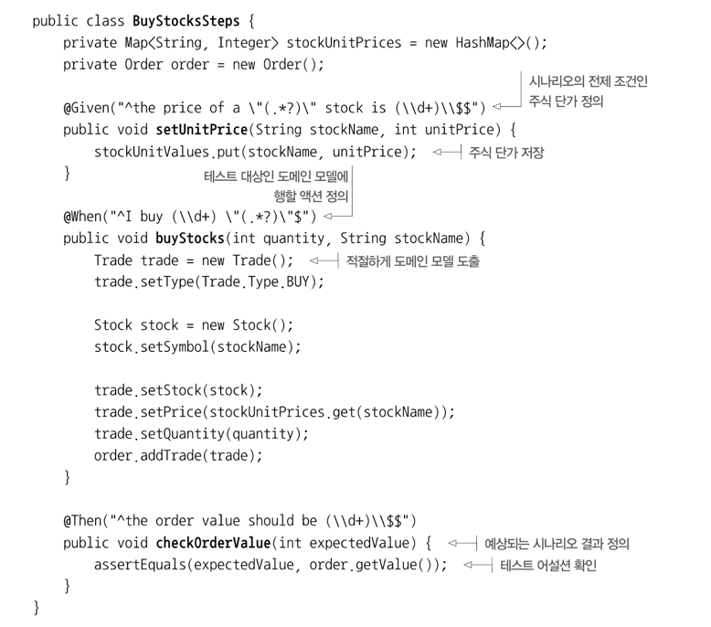

## 람다를 이요한 도메인 전용 언어
- 도메인 전용 언어(DSL) 이란 무엇이며, 어떤 형식으로 구성되는가?
- DSL 을 API 에 추가할 때의 장단점.
- JVM 에서 활용할 수 있는 자바 기반 DSL 을 깔끔하게 만드는 대안
- 최신 자바 인터페이스와 클래스에 적용된 DSL 에서 배움
- 효과적인 자바 기반 DSL 을 구현하는 패턴과 기법
- 이들 패턴을 자바 라이브러리와 도구에서 얼마나 흔히 사용하는가? 

프로그래밍 언어도 결국 언어이다, 메시지를 명확하고 안정적으로 전달하는. <br>
도메인 전용언어로 어플리케이션의 비즈니스 로직을 표현함으로 이 문제를 해결할 수 있다. <br>

### 도메인 전용 언어
예를 들어 결제 어플리케이션을 만든다고 가정을 해보자. <br>
이 상황에서 비즈니스 도메인에는 통장 입출금, 결제 등 개념이 포함된다. <br>
이런 문제를 표현할 수 있는 DSL 을 만들 수 있다. <br>
자바에서는 도메인을 표현할 수 있는 클래스와 메소드 집합이 필요하다 <br>
DSL 이란 특정 비즈니스 도메인을 인터페이스로 만든 API 라고 생각할 수 있다.<br>
- 의사 소통의 왕: 우리의 코드의 의도가 명확히 전달되어야 하며 프로그래머가 아닌 사람도 이해할 수 있어야 한다.
- 한 번 코드를 구현하지만 여러 번 읽는다 : 가독성은 유지보수의 핵심이다. 즉 항상 우리의 동료가 쉽게 이해할 수 있도록 코드를 구현해야 한다.

#### DSL 의 장점과 단점
DSL 은 코드의 비즈니스 의도를 명확하게 하고 가독성을 높인다는 점에서 약이 된다. 반면 DSL 구현은 코드이므로 올바르게 검증하고 유지보수 해야한다.
장점
- 간결함
- 가독성
- 유지보수
- 높은 수준의 추상화
- 집중
- 관심사 분리
단점
- DSL 설계의 어려움
- 개발 비용
- 추가 우회 계층
- 새로 배워야 하는 언어
- 호스팅 언어 한계

#### JVM 에서 이용할 수 있는 다른 DSL 해결책
내부 DSL 과 외부 DSL 로 나눈다. 

#### 내부 DSL
내부 DSL 은 자바로 구현한 DSL 을 의미한다. <br>
```java
List<String> numbers = Arrays.asList("one","two","three");
numbers.forEach( new Consumer<String>() {
	@Override
        public void accept(String s) {
		System.out.println(s);
	}
})

// 위코드를 람다식을 활용하면 더 간단하게 바꾼다.
number.forEach(s -> Sytem.out.println(s));

// 람다식을 메소드 참조로 바꾸면 더 간단해진다.
number.forEach(System.out::println);
```

#### 다중 DSL
JVM 에서 실행되는 언어는 100개가 넘는다. ex) 자바,코틀린,스칼라,루비 등등 <br>

#### 외부 DSL
외부 DSL 을 개발하는 가장 큰 장점은 외부 DSL 이 제공하는 무한한 유연성이다 <br>

#### 스트림 API는 컬렉션을 조작하는 DSL 
ex) 로그 파일을 읽어서 "ERROR" 라는 단어로 시작하는 파일의 첫 40행을 수집하는 작업을 해보자
```java
List<String> errors = new ArrayList<>();
int errorCount = 0;
BufferedReader bufferedReader = new BufferedReader(new FileReader(fileName));
String line = bufferedReader.readLine();

while(errorCount < 40 && line != null) {
	if(line.startsWith("ERROR")) {
		    errors.add(line);
        }
	    errorCount++;
    }
    line = bufferedReader.readLine();
}
```

위 코드를 스트림을 이용해 더 간결하게 만들 수 있다.
```java
List<String> errors = Files.lines(Paths.get(fileName))
    .filter(line -> line.startsWith("ERROR"))
    .limit(40)
    .toList();
```

#### 데이터를 수집하는 DSL 인 Collectors
즉 그룹화는 DB 에 있는 Column 별로 그룹핑을 한다는 뜻? 으로 이해를 했다
```java
Map<String,Map<Color, List<Car>>> carsByBrandAndColor = 
cars.stream().collect(groupingBy(Car::getBrand, groupingBy(Car::getColor)));
```

두 Comparators 를 연결하는 것과 비교할 때 무엇이 다른가?
```java
Comparator<Person> comparator = comparing(Person::getAge).thenComparing(Person::getName);
```

#### 자바로 DSL 을 만드는 패턴과 기법
DSL 은 특정 도메인 모델에 적용할 친화적이고, 가독성 높는 API 를 제공한다. 예제를 보자
```java
@Getter
@Setter
public class Stock {
	private String symbol;
	private String market;
}

@Getter
@Setter
public class Trade {
	public enum Type {
		BUY,SELL
    }
	private Type type;
	private Stock stock;
	private int quantity;
	private double price;
    
}

// 고객이 요청한 한 개 이상의 거래의 주문
@Getter
public class Order {
	private String customer;
	private List<Trade> trades = new ArrayList<>();
	
	public void addTrade(Trade trade) {
		trades.add(trade);
    }
	
	public double getValue() {
		return trades.stream().mapToDouble(Trade::getValue).sum();
    }
}

// BigBank 고객이 요청한 거래를 포함하는 주문을 만들어보자
Order order = new Order();
Order.setCustomer("BigBank");

Trade trade1 = new Trade();
trade1.setType(Trade.Type.Buy);

Stock stock1 = new Stock();
stock1.setSymbol("IBM");
stock1.setMarket("NYSE");

trade1.setStock(stock1);
trade1.setPrices(125.00);
trade1.setQuantity(100);
order.addTrade(trade1);
```

위 코드는 장황하다.

#### 메소드 체인
DSL 에서 가장 흔한 방식 중 하나를 살펴보자
```java
Order order = forCustomer("BigBank")
    .buy(80)
    .stock("IBM")
    .on("NYSE")
    .at(125.00)
    .sell(50)
    .stock("GOOGLE")
    .on("NASDAQ")
    .at(375.00)
    .end();
```

최상위 수준 빌더를 만들고 주문을 감싼 다음 한 개 이상의 거래를 주문에 추가해야한다.
```java
public class MethodChainOrderBuilder {
	public final Order order = new Order(); // 빌더로 감싼 주문
    
    private MethodChainOrderBuilder(String customer) {
		order.setCustomer(customer);
    }
	
	// forCustomer 로직
    // sell()
    // buy()
    // sell()
    // addTrade()
    // end()
}
```

#### 중첩된 함수 이용 
중첩된 함수 DSL 패턴은 이름에서 알 수 있듯이 다른 함수 안에 함수를 이용해 도메인 모델을 만든다. <br>

#### 람다 표현식을 이용한 함수 시퀀싱

### 실생활의 자바8 DSL
DSL 패턴의 장점과 단점
1) 메소드 체인
2) 중첩 함수
3) 람다를 이용한 시퀀싱

#### JOOQ
SQL 은 DSL 이 가장 흔히 사용하는 분야 이다 <br>
JOOQ 는 SQL 을 구현하는 내부적 DSL 로 자바에 직접 내장된 형식 안전 언어이다 <br>
```sql
select * from Book
WHERE book.publised_in = 2016
order by book.title;
```

jooq 를 이용하면 위 질의를 다음처럼 구현할 수 있다.
```sql
create.selectFrom(Book)
      .where(Book.Published_in.eq(2016)
      .orderBy(Book.TITLE)
```

스트림 API 와 조합해 사용할 수 있다는 것이 jooq dsl 의 또 다른 장점이다 <br>

#### 큐컴버
동작 주도 개발 (BDD) 은 테스트 주도 개발의 확장으로 다양한 비즈니스 시나리오를 구조적으로 서술하는 언어를 사용한다 <br>
큐컴버는 세 가지로 구분되는 개념을 사용한다, Given(전체조건정의), When(시험하려는 도메인 객체의 실질 호출), then(테스트 케이스결과 확인) <br>


#### 스프링 통합
스프링 통합의 핵심 목표는 복잡한 엔터프라이즈 통합 솔루션을 구현하는 단순한 모델을 제공하고 비동기, 메시지 주도 아키텍쳐를 쉽게 적용하도록 돕는 것이다 <br>

### 총 정리
- DSL 의 주요 기능은 개발자와 도메인 전문가 사이의 간격을 좁히는 것이다.
- DSL 은 크게 내부, 외부 로 분류한다.
- JVM 에서 동작하는 다른 언어들에서도 DSL 을 사용가능하다.
- 자바는 DSL 이 적합하지 않았지만, 람다와 스트림이 나오면서 많이 개선되었다.