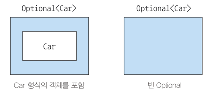
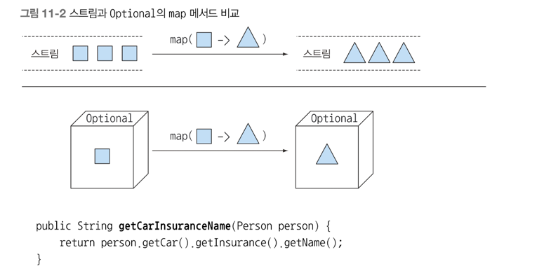
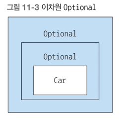

## null 대신 Optional 클래스
- null 참조의 문제점과 null 을 멀리해야 하는 이유
- null 대신 Optional: null 로부터 안전한 도메인 모델 재구현하기
- Optional 활용: null 확인 코드 제거하기
- Optional 에 저장된 값을 확인하는 방법
- 값이 없을 수도 있는 상황을 고려하는 프로그래밍

Java 로 개발을 하다보면 NullPointException 은 무조건 한 번씩은 보게 된다. <br>
 
### 값이 없는 상황을 어떻게 처리할까?
예시에서는 자동차와 자동차 보험을 가지고 있는 사람 객체를 중첩 구조로 구현했다고 하자

```java
public class Person {
	private Car car;
	public Car getCar () {
		return car;
	}

}

public class Car {
	private Insurance insurance;
	public Insurance getInsurance () {
		return insurance;
	}
}

public class Insurance {
	private String name;
	public String getName() {
		return name;
    }
}

// 문제 상황
public String getCarInsuranceName(Person person) {
	return person.getCar().getInsurance().getName();
}
```

겉으러 보면 위 코드는 문제가 없다, 하지만 차가 없거나 보험이 없는 사람이라면? <br>
이런 경우에는 NullPointException 이 터질 것이다.

#### 보수적인 자세로 NPE 줄이기
NPE 를 피하려면 어떻게 할까? 보통 프로그래머들은 Null 확인 코드를 추가해서 예외 문제를 해결한다 <br>
```java
public String getCarInsuranceName(Person person) {
	if(person != null) {
		Car car = person.getCar();
		if(car != null) {
			Insurance insurance = car.getInsurance();
			if(insurance != null) {
				return insurance.getName();
			}
		}
	}
}
```

위 코드처럼 모든 객체를 참조할때 마다 null 체크를 하는 상황이 발생한다. 얼마나 귀찮을까..<br>
이 문제를 해결하는 코드를 보자
```java
public String getCarInsuranceName(Person person) {
	if(person==null) {
		return "Unknown person";
	}
	Car car = person.getCar();
	if(car==null) {
		return "Unknown car";
	}
	Insurance insurance = car.getInsurance();
	if(insurance==null) {
		return "Unknown insurance";
	}
	return insurance.getName();
}
```

위 코드도 개선을 하기는 했지만, 조금 더 개선을 할 필요가 있다. 

#### Null 때문에 발생하는 문제
- 에러의 근원이다: NPE 는 자바에서 가장 흔히 발생하는 에러이다.
- 코드를 어지럽힌다: 때로는 중첩된 null 확인 코드를 추가해야 하므로 null 때문에 코드 가독성이 떨어진다
- 아무 의미가 없다: null 은 아무 의미도 표현하지 않는다. 특히 정적 형식 언어에서 값이 없음을 표현하는 방법으로 적절하지 않다.
- 자바 철학에 위배: 자바는 개발자로부터 모든 포인터를 숨겼다. 하지만 예외가 있는 데 그것이 바로 npe 이다.
- 형식 시스템에 구멍을 만든다: null 은 형식이 없고 정보를 포함하지 않아 모든 랩퍼 형식에 null 할당이 가능하다. 
  - 이런식으로 null 이 할당되면서 시스템의 다른 부분으로 null 이 퍼질 때 null 이 어떤 의미로 사용되었는지 알 수 없다.

### Optional 클래스 소개
Optional 은 선택형 값을 캡슐화하는 클래스다. <br>
Optional 을 이용하여 null 을 할당하는 것이 아닌 빈값을 의미시킨다. 

값이 있으면 Optional 클래스는 값을 감싼다. <br>
값이 없으면 Optional.empty 메소드로 Optional 을 반환한다 <br>
Optional.empty 는 Optional 의 특별한 싱글턴 인스턴스를 반환하는 정적 팩토리 메소드다 <br>
null 참조 Optional.empty() 는 서로 무엇이 다를까?, 의미상은 비슷하지만 실제로는 차이점이 많다 <br>
null 을 참조하면 NPE 가 발생하지만, Optional.empty 는 Optional 객체 이므로 다양한 방식으로 활용한다 <br>
즉 Optional 로 객체를 감싸면, 값이 없을 수도 있음을 명시적으로 보여준다는 것이다. <br>
```java
public class Person {
	private Optioanl<Car> car;
	public Optional<Car> getCar() {
		return car;
    }
}

public class Car {
	private Optional<Insurance> insurance;
	public Optional<Insuarance> getInsurance() {
		return insurance;
    }
}

public class Insurance {
	private String name;
	public String getName() {
		return name;
    }
}
```

#### Optional 적용 패턴
#### Optional 객체 만들기
빈 Optional
```java
Optioanl<Car> optCar = Optional.empty();
```

정적 팩토리 메소드 Optional.empty() 로 빈 Optional 객체를 얻는다.

null 이 아닌 값으로 Optional 만들기<br>
또한 정적 팩토리 메소드 Optional.of 로 Null 이 아닌 값을 포함하는 Optional 을 만들 수 있다.
```java
Optioanl<Car> optCar = Optional.of(car);
```

이제 car 가 null 이라면, NPE 가 발생한다. 

null 값으로 Optional 만들기 <br>
정적 팩토리 메소드 Optional.ofNullable 로 null 값을 저장할 수 있는 Optional 을 만들 수 있다.
```java
Optional<Car> optCar = Optional.ofNullable(car);
```

car 가 null 이면 빈 Optional 객체를 반환한다 <br>

#### map 으로 optional 값을 추출하고 변환하기
```java
// 기존 코드
String name = null;
if(insurance != null) {
	name = insurance.getName();
}

// 변경 코드
Optional<Insurance> optInsurance = Optional.ofNullable(insurance);
Optioanl<String> name = optInsurance.map(Insurance::getName);
```

optional 의 map 은 스트림의 map 과 개념적으로 비슷하다. <br>
스트림의 map 은 스트림의 각 요소에 제공된 함수를 적용하는 연산이다 <br>
여기서 optional 객체를 최대 요소의 개수가 한 개 이하인 데이터 컬렉션으로 생각할 수 있다.<br>
Optional 이 값을 포함하면 map 의 인수로 제공된 함수가 값을 바꾼다 <br>
Optional 이 비어있으면 아무일도 일어나지 않는다. <br>


#### flatMap 으로 Optional 객체 연결
```java
Optional<Person> optPerson = Optonal.of(person);
Optional<String> name = optPerson.map(Person::getCar)
        .map(Car::getInsurance)
        .map(Insurance::getName);
```

위 코드는 컴파일 되지않는다. 위 코드를 컴파일 시키려면 flatMap 을 사용해야 한다 <br>

1) Optional 로 자동차의 보험회사 이름 찾기
```java
public String getCarInsuranceName(Optional<Person> person) {
	return person.flatMap(Person::getCar)
            .flatMap(Car::getInsurance)
            .map(Insurance::getName)
            .orElse("Unknown"); // Optional 이 빈값이면 반환
}
```

#### Optional 스트림 조작
자바 9에서는 Optional 을 포함하는 스트림을 쉽게 처리할수 있도록 Optional 에 stream() 메소드를 추가했다 <br>

Person/car/Insurance 에는 도메인 모델을 사용하고 있다.
```java
private Car car;
public Optional<Car> getCarAsOptional() {
	return Optional.ofNullable(car);
}

public Set<String> getCarInsuranceNames(List<Person> personList) {
	return personList.stream()
            .map(Person::getCar)
            .map(optCar -> optCar.flatMap(Car::getInsurance))
            .map(optIns -> optIns.map(Insurance::getName))
            .flatMap(Optional::stream)
            .collect(toSet());
}
```

#### 디폴트 액션과 Optional 언랩
- get() 은 값을 읽는 가장 단순한 메소드이면서 가장 안전하지 않은 메소드이다.
  - 만약 값이 없으면 NoSuchElementException 이 발생하고, Optional 값이 무조건 있는 상황 아니면 사용하는것은 바람직하지 않다.
- orElse() 는 Optional 이 값을 포함하지 않을 때 기본값을 제공할 수 있다. 
- orElseGet() 는 orElse() 와 대응되는 게으른 버전의ㅏ 메소드 이다. Optional 에 값이 없을 때만 Supplier 가 실행이 된다.
- orElseThrow() 는 Optional 이 비어있을 때 예외를 발생시킨다는 점에서 get 메소드와 비슷하다. 하지만 이 메소드는 발생시킬 예외를 선택할 수 있다.
- ifPresent() 를 이용하면 값이 존재할 때 인수로 넘겨준 동작을 실행할 수 있다. 값이 없으면 아무 일도 일어나지 않는다. 
- ifPresentOrElse() 는 Optional 이 비었을 때 실행할 수 있는 Runnable 을 인수로 받는다는 점만 ifPresent() 와 다르다.

#### 두 Optional 합치기
```java
// 가장 저렴한 보험료를 제공하는 보험회사를 찾는 로직
public Insurance findCheapestInsurance(Person person, Car car) {
	// 다양한 보험회사가 제공하는 서비스 조회
    // 모든 결과 데이터 비교
   return chepeastCompany;
}
```

두개의 파라미터 중에서, 하나라도 null 값이 있어서는 안된다. 
```java
public Optional<Insurance> nullSafeFindCheapestInsurance(Optional<Person> person, Optional<Car> car) {
	if(person.isPresent() && car.isPresent() ) {
		return Optional.of(findcheapestInsurance(person.get(), car.get()));
    } else {
		return Optional.empty();
    }
}
// 개선
public Optional<Insurance> nullSafeFindCheapestInsurance(Optional<Person> person, Optional<Car> car) {
    return person.flatMap(p -> car.map(c -> findCheapestInsurance(p,c)));
}
```

### Optional 을 사용한 실용 예제
#### 잠재적으로 Null 이 될 수 있는 대상을 Optional 로 감싸기
```java
Obejct value = map.get("key");

Optioanl<Object> value = Optional.ofNullable(map.get("key"));
```

#### 예외와 Optional 클래스
```java
public static Optional<Integer> stringToInt(String s) {
	try {
		return Optional.of(Integer.parseInt(s));
    } catch (NumberFormatException e) {
		return Optional.empty();
    }
}
```

OptionalUtility 를 만들어서 사용해보길 권장한다.

#### 기본형 특화 Optional 을 사용하면 안돼는 이유
스트림 처럼, Optional 또한, OptionalInt, OptionalLong, OptionalDouble 클래스가 있다 <br>
하지만 스트림처럼 특화 스트림을 써서 성능을 개선할 수 없다. 왜냐? Optional 은 최대 요소 수는 한개 이기 때문이다 <br>
기본형 특화 Optional 은 map,flatMap,filter 등을 지원하지 않으므로 기본형 특화 옵셔널을 권장하지 않는다.

#### 응용
Optional 클래스 를 활용해보자
```java
		Properties props = new Properties();
		props.setProperty("a","5");
		props.setProperty("b","true");
		props.setProperty("c","-3");
```

위 프로그램에서는 Properties 를 읽어서 값을 초 단위의 지속 시간으로 해석한다 
```java
public int readDuration(Properties props, String name) { 
	String value = props.getProperty(name);
	if(value != null) {
		try {
			int i = Integer.parseInt(value);
			if(i>0) {
				return i;
            }
        } catch(NumverFormatException nfe) {
			
      }
		return 0;
    }
}
```

try/catch 블록이 중첩되면서 구현 코드가 복잡해졌고, 가독성이 나빠졌다.
```java
public int readDuration(Properties props, String name) {
	return Optional.ofNullable(props.getProperty(name))
            .flatMap(OptionalUtility::stringToInt)
            .filter(i -> i > 0)
            .orElse(0);
}
```

### 최종 정리
- 역사적으로 프로그래밍 언어에서는 null 참조로 값이 없는 상황을 표현했다.
- 자바8 에서는 Optional 클래스를 제공한다
- 팩토리 메소드, empty, of, Nullable 등을 이용해 Optional 객체를 만들 수 있다.
- Optional 클래스는 스트림과 비슷한 연산을 수행하는 map,flatMap, filter 등 메소드를 제공한다.
- Optional 로 값이 없는 상황을 적절하게 처리하도록 강제할 수 있다. Optional 로 예상치 못한 null 예외를 방지할 수 있다.
- Optional 을 활용하면 더 좋은 API 를 설계할 수 있다