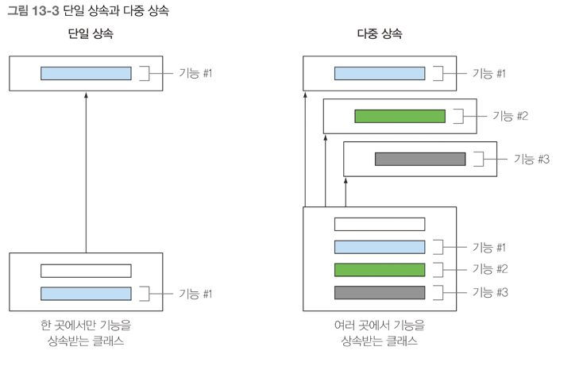

## 디폴트 메소드
- 디폴트 메소드란 무엇인가?
- 진화하는 API 가 호환성을 유지하는 방법
- 디폴트 메소드의 활용 패턴
- 해결 규칙

전통적인 자바에서 인터페이스와 관련 메소드는 한 몸처럼 구성된다 <br>
인터페이스를 구현하는 클래스는 인터페이스에서 정의하는 모든 메소드 구현을 제공하거나, 슈퍼클래스의 구현을 상속받아야한다 <br>

```java
default void sort(Comparator<? super E> c) {
	Collections.sort(this,c);
}
```

반환 타입 앞에 default 라는 새로운 키워드가 등장했다. default 키워드는 해당 메소드가 디폴트 메소드임을 가리킨다 <br>
여기서 sort 메소드는 Collections.sort 메소드를 호출한다. <br>
이 새로운 디폴트 메소드 덕분에 리스트에 직접 sort 를 호출할 수 있게 되었다 <br>
```java
List<Integer> numbers = Arrays.asList(3,5,1,2,6);
numbers.sort(Comparator.naturalOrder());
```

```java
defualt Stream<E> stream() {
	return StreamSupport.stream(spliterator(), false);
}
```

stream 메소드는 내부적으로 StreamSupport.stream 메소드를 호출해서 스트림을 반환한다 <br>
stream 메소드의 내부에서는 Collections 인터페이스의 다른 디폴트 메소드 spliterator 도 호출한다.<br>
결국 인터페이스가 아닌 추상 클래스 아닌가? 인터페이스와 추상 클래스는 비슷해보이지만 다르다 <br>

디폴트 메소드가 없던 시절에는 인터페이스에 메소드를 추가하면서 여러 문제가 발생했다 <br>
디폴트 메소드를 이용하면 인터페이스의 기본 구현을 그대로 상속하므로, 인터페이스에 자유롭게 새로운 메소드를 추가할 수 있게 된다 <br>

### 변화하는 API
#### API 버전1
Resizable 인터페이스 초기 버전 이다.
```java
public interface Resizable extends Drawable {
	int getWidth();
	int getHeight();
	void setWidth(int width);
	void setHeight(int height);
	void setAbsoluteSize(int width, int height);
}
```

사용자 구현
```java
public class Ellipse implements Resizable {
    // 구현 로직
}
```
```java
public class Game {
	public static void main (String[] args) {	
	    List<Resizable> resizableList = 
            Arrays.asList(new Square(), new Rectange(), new Ellipse());
		Utils.paint(resizableList);
    }
}

public class Utils {
	public static void paint(List<Resizable> l) {
		l.forEach(r -> {
			r.setAbsoulteSize(42,42);
			r.draw();
        })
    }
}
```

#### API 버전2
```java
public interface Resizable {
	int getWidth();
	int getHeight();
	void setWidth(int width);
	void setHeight(int height);
	void setAbsoluteSize(int width, int height);
	void setRelativeSize(int wFactor, int hFactor); // 추가된 새로운 메소드
}
```

Resizable 을 고치면, 위 인터페이스를 구현하는 모든 클래스에서 재구현 해야 한다. <br>
인터페이스에 새로운 메소드를 추가하면 **바이너리 호환성**은 유지된다.<br>
바이너리 호환성이란 새로 추가된 메소드를 호출하지만 않으면 새로운 메소드 구현 없이도 기존 클래스 파일 구현이 잘 동작한다는 의미이다 <br>
공개된 API 를 고치면 기존 버전과의 호환성 문제가 발생한다 <br>
프로젝트에서 로딩해야 할 클래스 파일이 많아지면 메모리 사용과 로딩 시간 문제가 발생한다 <br>

위 문제를 디폴트 메소드를 통해서 문제를 해결할 수 있다 <br>
디폴트 메소드를 이용해서 API 를 바꾸면 새롭게 바뀐 인터페이스에서 자동으로 기본 구현을 제공하므로 기존 코드를 고치지 않아도 된다.

### 디폴트 메소드란 무엇인가?
공개된 API 에 새로운 메소드를 추가하면 기존 구현에 어떤 문제가 생기는지 살펴봤다 <br>
자바8 에서는 호환성을 유지하면서 API 를 바꿀 수 있도록 디폴트 메소드를 제공한다 <br>
이제 인터페이스는 자신을 구현하는 클래스에서 메소드를 구현하지 않을 수 있는 새로운 메소드 시그니처를 제공한다. <br>
디폴트 메소드는 인터페이스 자체에서 기본으로 제공한다 <br>
디폴트 메소드는 default 키워드로 시작하고, 선언된 메소드로 메소드 바디를 포함한다. <br>
```java
public interface Sized {
	int size();
	defualt boolean isEmpty() { // 디폴트 메소드
		return size() == 0;
    }
}
```

Sized 인터페이스를 구현하는 모든 클래스는 isEmpty 의 구현도 상속받는다. <br>
즉 인터페이스에 디폴트 메소드를 추가하면 소스 호환성이 유지가 된다 <br>

인터페이스가 구현을 가질 수 있고 클래스는 여러 인터페이스를 동시에 구현할 수 있으므로 결국 자바도 다중 상속을 지원하는 걸까? <br>
(참고로 디폴트 메소드는 추상 메소드에 해당하지 않는다는 점을 기억하자) <br>

#### 추상 클래스와 자바 8의 인터페이스 
1) 둘 다 추상 메소드와 바디를 포함하는 메소드를 정의할 수 있다.
2) 클래스는 하나의 추상 클래스만 상속받을 수 있지만, 인터페이스를 여러개 구현할 수 있다.
3) 추상 클래스는 인스턴스 변수(필드)로 공통 상태를 가질 수 있다. 하지만 인터페이스는 인스턴스 변수를 가질 수 없다. 

#### 간단한 퀴즈
모든 컬렉션에서 사용할 수 있는 removeIf 메소드를 추가해보자 <br>
removeIf 는 주어진 프레디케이트와 일치하는 모든 요소를 컬렉션에서 제거하는 기능을 수행한다
```java
	default boolean removeIf(Predicate<? super E> filter) {
		boolean removed = false;
		Iterator<E> each = iterator();
		while(each.hasNext()) {
			if(filter.test(each.next())) {
				each.remove();
				removed = true;
			}
		}
		return removed;
	}
```

### 디폴트 메소드 활용 패턴
디폴트 메소드를 이용하면 라이브러리를 바꿔도 호환성을 유지할 수 있음을 확인 했다. <br>
디폴트 메소드를 이용하여, 선택형 메소드 및 동작 다중 상속을 설명해보겠다.

#### 선택형 메소드
인터페이스를 구현하는 클래스에서 메소드의 내용이 비어있는 상황을 본적이 있을 것이다. <br>
Iterator 인터페이스를 보자, Iterator 는 기본으로 hasNext, next 그리고 디폴트로 remove, forEachRemaining 을 제공한다 <br>
디폴트 메소드를 이용하면 remove 같은 메소드에 기본 구현을 제공할 수 있으므로 인터페이스를 구현하는 클래스에서 빈 구현을 제공할 필요가 없다 <br>

#### 동작 다중 상속
디폴트 메소드를 이용하면 기존에는 불가능 했던 동작 다중 상속 기능도 구현할 수 있다 <br>

자바에서 클래스는 한 개의 다른 클래스만 상속할 수 있지만 인터페이스는 여러 개 구현할 수 있다. ArrayList 클래스를 보자
```java
public class ArrayList<E> extends AbstractList<E> // 한 개의 클래스를 상속받는다
	implements List<E>, RandomAccess, Cloneable, java.io.Serializable // 4개의 인터페이스를 구현한다.
{
```

#### 다중 상속 형식
ArrayList 는 한 개의 클래스를 상속받고, 여섯 개의 인터페이스를 구현한다. <br>
결과적으로 ArrayList 는 AbstractList,List,RandomAccess, Cloneable, java.io.Serializable, Iterable, Collection 의 서브 형식이 된다 <br>
따라서 디폴트 메소드를 사용하지 않아도 다중 상속을 활용할 수 있다.<br>
중복되지 않는 최소한의 인터페이스를 유지한다면 우리 코드에서 동작을 쉽게 재사용하고 조합할 수 있다 <br>

#### 기능이 중복되지 않는 최소의 인터페이스
예시를 들어보자. 우리가 만드는 게임에 다양한 특성을 갖는 여러 모양을 정의한다고 가정하자 <br>
어떤 모양은 회전할 수 없지만, 크기는 조절할 수 있다 <br> 어떤 모양은 회전할 수 있으며 움직일 수 없지만 크기는 조절할 수 있다 <br>
```java
public interface Rotatable {
	void setRotationAngle(int angleInDegrees);
	int getRotationAngle();
	default void rotateBy(int angleInDegrees) {
		setRotationAngle((getRotationAngle() + angleInDegrees));
    }
}
```

위 인터페이스는 구현해야 할 다른 메소드에 따라 뼈대 알고리즘이 결정되는 **템플릿 디자인 패턴**과 비슷해 보인다.<br>
Rotatable 을 구현하는 모든 클래스는 위 default 메소드 말고는 모드 구현되어야 한다 <br>
하지만 디폴트 메소드는 기본 구현이 제공되므로 따로 구현을 하지 않아도 된다. <br>

#### 인터페이스 조합
이제 인터페이스를 조합해서 게임에 필요한 다양한 클래스를 구현할 수 있다 <br>
ex) 움직이고, 회전하고, 크기를 조절하는 괴물 클래스를 구현할 수 있다
```java
public class Monster implements Rotatable, Moveable, Resizable {
	// 모든 추상 메소드의 구현은 제공해야 하지만
    // 디폴트 메소드의 구현은 제공할 필요가 없다.
}
```

인터페이스 디폴트 구현을 포함시키면 또 다른 장점이 생긴다. <br>

#### 옳지 못한 상속
상속으로 코드 재사용 문제를 모두 해결할 수 있는 것은 아니다. <br>
예를 들어 한 개의 메소드를 재사용하려고 100개의 메소드와 필드가 정의되어 있는 클래스를 상속받는 것은 좋은 생각이 아니다 <br>
이럴 때는 멤버 변수를 이용해서 클래스에서 필요한 메소드를 직접 호출하는 메소드를 작성해야 한다 <br>
종종 final 로 선언된 클래스를 볼 수 있다. <br>
다른 클래스가 이 클래스를 상속받지 못하게 함으로써 원래 동작이 바뀌지 않길 원하기 때문이다 <br>
ex) String 클래스도 final 로 선언되어 있다. 누군가 핵심 기능을 바꾸지 못하게 하도록 하기 위함이다 <br>

#### 해석 규칙
자바의 클래스는 하나의 부모 클래스만 상속 받을 수 있지만, 여러 인터페이스를 동시에 구현할 수 있다 <br>
다음 예제에서 클래스 C 는 누구의 Hello 를 호출할까? 
```java
public interface A {
	default void hello() {
		System.out.println("Hello from A");
    }
}

public interface B extends A {
	default void hello() {
		System.out.println("Hello from B");
	}
}

public class C implements B,A {
	public static void main (String[] args) {
        new C().hello(); // 뭐가 출력이 될까?
	}
}
```

### 세 가지 해결 규칙
다른 클래스나 인터페이스로 부터 같은 시그니처를 갖는 메소드를 상속받을 때는 세 가지 규칙이 있다.
1) 클래스가 항상 이긴다. 메소드,디폴트 메소드는 클래스를 이기지 못한다.
2) 클래스 이외의 상황에서는 서브인터페이스가 이긴다. 
3) 여전히 디폴트 메소드의 우선순위가 결정되지 않았다면 여러 인터페이스를 상속받는 클래스가 명시적으로 디폴트 메소드를 오버라이딩 받는다.

#### 디폴트 메소드를 제공하는 서브인터페이스가 이긴다. 
컴파일러는 B 가 A를 상속받았으므로 B의 Hello 를 선택한다. <br>

### 최종 정리
- 새로운 API 를 적용해야 할 때 디폴트 메소드를 사용하면 여러 문제를 해결할 수 있다.
- 자바 8의 인터페이스는 구현 코드를 포함하는 디폴트 메소드, 정적 메소드를 정의할 수 있다.
- 디폴트 메소드의 정의는 default 키워드로 시작하며 일반 클래스 메소드처럼 바디를 갖는다. 
- 공개된 인터페이스에 추상 메소드를 추가하면 소스 호환성이 깨진다.
- 디폴트 메소드 덕분에 라이브러리 설계자가 API 를 바꿔도 기존 버전과 호환성을 유지할 수 있다.
- 선택형 메소드와 동작 다중 상속에도 디폴트 메소드를 사용할 수 있다.