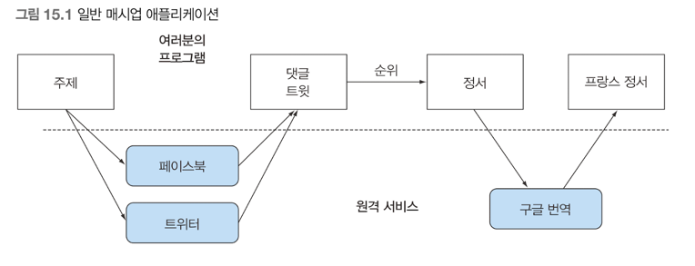
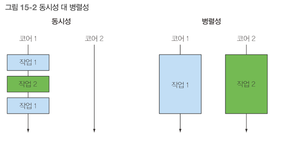
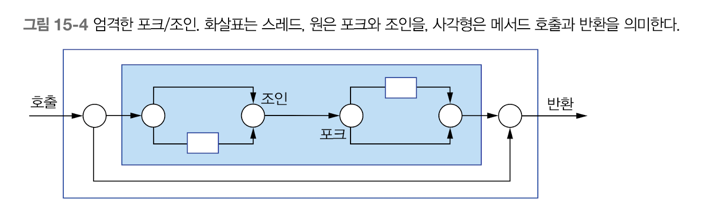
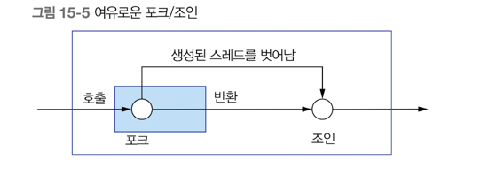
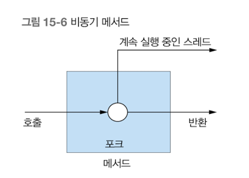
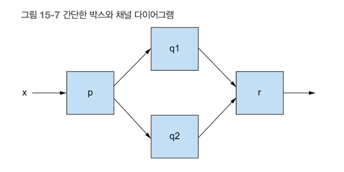
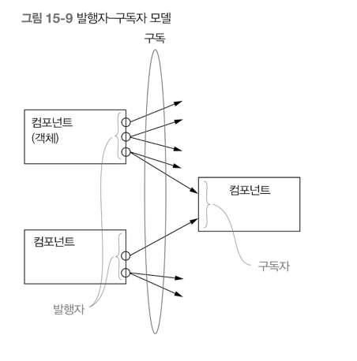

## 15장 - CompletableFuture 와 리액티브 프로그래밍 컨셉의 기초
### 다룰 내용
- Thread, Future 자바가 풍부한 동시성 API 를 제공하도록 강요하는 진화의 힘
- 비동기 API
- 동시 컴퓨팅의 박스와 채널 뷰
- CompletableFuture 콤비네이터로 박스를 동적으로 연결
- 리액티브 프로그래밍용 자바 9 플로 API 의 기초를 이루는 발행 구독 프로토콜
- 리액티브 프로그래밍과 리액티브 시스템

멀티코어 프로세스가 발전하면서 애플리케이션의 속도는 멀티코어 프로세서를 얼마나 잘 활용할 수 있도록 소프트웨어를 개발하는가에 따라 달라질 수 있다 <br>
한 개의 큰 태스크를 병렬로 실행할 수 있는 개별 하위 태스크로 분리할 수 있다는 사실을 살펴봤다 <br>
자바7 부터 포크/조인 프레임워크도 배웠으며 자바8 에 추가된 병렬 스트림으로 스레드에 비해 단순하고 효과적인 방법으로 병렬 실행을 달성할 수 있다 <br>
MSA 선택이 지난 몇년간 증가했다, 하나의 거대한 어플리케이션을 작은 서비스 어플리케이션으로 나누는 것이다 <br>
서비스가 작아진 대신 네트워크 통신이 증가한다 <br>
작은 서비스들을 여러개 합쳐, 매시업 형태가 될 가능성이 크다 <br>

이런 어플리케이션을 구현하려면 인터넷으로 여러 웹 서비스에 접근해야 한다 <br>
하지만 이들 서비스의 응답을 기다리는 동안 연산이 블록되거나, CPU 사이클 자원을 낭비하고 싶지는 않다 <br>
예를들어 페이스북 데이터를 기다리는 동안, 트위터 데이터를 처리하지 말란 법은 없다 <br>
이 상황은 멀티태스크 프로그래밍의 양면성을 보여준다. <br>
즉 포크/조인 프레임워크와 병렬 스트림은 병렬성의 귀중한 도구이다 <br>
한 태스크를 여러 하위 태스크로 나눠서 CPU 의 다른 코어 또는 다른 머신에서 이들 하위 태스크를 병렬로 실행한다 <br>
반면 병렬성이 아니라, 동시성을 필요로 하는 상황 즉 조금씩 연관된 작업을 같은 CPU 에서 동작하는 것 또는 어플리케이션을 생산성을 극대화 할 수 있도록 코어를 <br>
바쁘게 유지하는 것이 목표라면, 원격 서비스나 데이터베이스 결과를 기다리는 스레드 블록함으로 연산 자원을 낭비하는 일은 피해야 한다 <br>
자바에서는 이런 환경에서 사용할 수 있도록 Future, CompletableFuture 인터페이스를 제공하여 간단하고 효율적으로 프로그래밍을 하게 도운다 <br>
최근 자바9에 추가된 발행.구독 프로토콜에 기반한 리액티브 프로그래밍 개념을 따르는 플로 API(17장) 은 조금 더 정교한 프로그래밍 접근 방법을 제공한다 <br>

동시성은 단일 코어 머신에서 발생할 수 있는 프로그래밍 속성으로 실행이 서로 겹칠 수 있는 반면 <br>
병렬성은 병렬 실행을 하드웨어 수준에서 지원한다

요번 장에서는 자바의 새로운 기능 CompletableFuture 와 플로 API 의 기초를 구성하는 내용을 설명한다

#### 동시성을 구현하는 자바 지원의 진화
처음에 자바는 Runnable, Thread 를 동기화된 클래스와 메소드를 이용해 잠갔다 <br>
자바5 는 Runnable, Thread 변형을 반환하는 Callable<T> and Future<T>, 제네릭 등을 지원했다 <br>
ExecutorServices 는 Runnable, Callable 둘 다 실행할 수 있다 <br>
이 기능덕분에 멀티코어 CPU 에서 쉽게 병렬 프로그래밍을 구현할 수 있게 되었다 <br>

자바는 Future 를 조합하는 기능을 추가하면서 동시성을 강화했고, 자바 9에서는 분산 비동기 프로그래밍을 명시적으로 지원한다 <br>
CompletableFuture 와 java.util.concurrent.Flow 의 궁극적인 목표는 가능한한 동시에 실행할 수 있는 독립적인 태스크를 가능하게 만들고, 병렬성을 이용하게 한다 <br>

#### 스레드와 높은 수준의 추상화
단일 CPU 컴퓨터도 여러 사용자를 지원할 수 있는데, 이는 운영체제가 각 사용자에 프로세스 하나를 할당하기 때문이다 <br>
운영체제는 두 사용자가 각각 자신만의 공간에 있다고 생각할 수 있도록 가상 주소 공간을 각각의 프로세스에 제공한다 <br>
운영체제는 주기적으로 번갈아가며 각 프로세스에 CPU 를 할당함으로 실제로 마술 같은 일이 일어난다 <br>
프로세스는 다시 운영체제에 한 개 이상의 스레드, 즉 본인이 가진 프로세스와 같은 주소 공간을 공유하는 프로세스를 요청함으로 태스크를 동시에 또는 협렵적으로 실행할 수 있다 <br>
각 코어는 한개 이상의 프로세스나 스레드에 할당될 수 있지만 프로그램이 스레드를 사용하지 않는다면 효율성을 고려해 여러 프로세스 코어 중 한 개만을 사용할 것이다 <br>

실제로 4개의 코어를 가진 CPU 에서 이러ㅗㄴ적으로 프로그램을 네 개의 코어에서 병렬로 실행함으로 실행 속도를 4배 향상시킬 수 있다 <br>
(물론 오버헤드로 인해 실제 4배가 되기는 어렵다..)
```java
long sum = 0;
for(int i=0; i<1_000_000; i++) {
	sum += stats[i];
}
```

위 코드는 한 개의 코어로 며칠 동안 작업을 수행한다 <br>
반면 아래 코드는 첫 스레드를 다음 처럼 실행한다
```java
long sum = 0;
for(int i=0; i<250_000; i++) {
	sum += stats[i];
}

~~

long sum = 0;
for(int i=750_000; i<1_000_000; i++) {
    sum += stats[i];
}
```

메인 프로그램은 네 개의 스레드를 완성하고 자바의. start() 로 실행 후 .join() 으로 완료 될 때까지 기다렸다가 다음을 계산한다. <br>
이를 각 루프로 처리하는 것은 쉽게 에러가 발생할 수 있는 구조이다.
```java
sum = Arrays.stream(stats).parallel().sum();
```

스트림을 사용하면 명시적으로 스레드를 사용하는 것에 비해 높은 수준의 개념을 사용할 수 있다 <br>
즉 스트림을 이용해 스레드 사용 패턴을 추상화 할 수 있다 <br>
추가적인 스레드 추상화를 살펴보기에 앞서 추상화의 기반 개념에 해당하는 ExecutorService 개념과 스레드 풀을 알아보자 <br>

#### Executor 과 ThreadPool
자바 5는 Executor 프레임워크와 스레드 풀을 이용해 스레드의 힘을 높은 수준으로 끌어 올리는 즉 자바 프로그래머가 태스트 제출과 실행을 분리할 수 있는 기능을 제공했다 <br>

#### 스레드의 문제
자바 스레드는 직접 운영체제 스레드에 접근한다. 운영체제 스레드를 만들고 종료하려면 비싼 비용(페이지 테이블과 관련한 상호작용)을 치러야 하며 <br>
더욱이 운영체제 스레드의 숫자는 제한되어 있는 것이 문제이다 <br>
운영체제가 지원하는 스레드 수를 초과해 사용하면 자바 어플리케이션이 예상치 못한 방식으로 crash 될 수 있으므로 <br>
기존 스레드가 실행되는 상태에서 계속 새로운 스레드를 만드는 상황이 일어나지 않도록 주의해야 한다 <br>

보통 운영체제와 자바의 스레드 개수가 하드웨어 스레드 개수보다 많으므로 일부 운영체제 스레드가 블록되거나 자고 있는 상황에서 <br>
모든 하드웨어 스레드가 코드를 실행하도록 할당된 상황에 놓을 수 있다 <br>
한편 주어진 프로그램에서 사용할 최적의 자바 스레드 개수는 사용할 수 있는 하드웨어 코어의 개수에 따라 달라진다 <br>

#### 스레드 풀 그리고 스레드 풀이 더 좋은 이유
자바 ExecutorService 는 Task 를 제출하고 나중에 결과를 수집할 수 있는 인터페이스를 제공한다 <br>
> ExecutorService newFixedThreadPool(int nThreads);

이 메소드는 워커 스레드라 불리는 nThreads 를 포함하는 ExecutorService 를 만들고 이들을 스레드 풀에 저장한다 <br>
스레드 풀에서 사용하지 않은 스레드로 제출된 태스크를 먼저 온 순서대로 실행한다 <br>
이들 태스크 실행이 종료되면 이들 스레드를 풀로 반환한다 <br>
이 방식의 장점은 하드웨어에 맞는 수의 태스크를 유지함과 동시에 수 천재의 태스크를 스레드 풀에 아무 오버헤드 없이 제출할 수 있다 <br>
프로그래머는 태스크(Runnable, Callable) 을 제공하면 스레드가 이를 실행한다.

#### 스레드 풀 그리고 스레드 풀이 나쁜 이유
거의 모든 관점에서 스레드를 직접 사용하는 것보다 스레드 풀을 이용하는 것이 바람직하지만 두가지 사항을 주의해야 한다. <br>
1) n 스레드를 가진 스레드 풀은 오직 n 만큼의 스레드를 동시에 실행할 수 있다. 
- 초과로 제출된 태스크는 큐에 저장되며 이전에 태스크 중 하나가 종료되기 전까지는 스레드에 할당하지 않는다.
2) 중요한 코드를 실행하는 스레드가 죽는 일이 발생하지 않도록 보통 자바 프로그램은 main 이 반환하기 전에 모든 스레드의 작업이 끝나길 기다린다 
- 즉 프로그램을 종료하기 전에 모든 스레드 풀을 종료하는 습관을 갖는 것이 중요하다 

#### 스레드의 다른 추상화: 중첩되지 않은 메소드 호출
병렬 스트림 처리와 포크/조인 프레임워크 에서 설명한 동시성과 지금 설명하는 동시성이 어떻게 다른지 명확하게 알 수 있도록 <br>
7장에서 사용한 동시성에서는 한 개의 특별한 속성 즉, 태스크나 스레드가 메소드 호출 안에서 시작되면 그 메소드 호출은 반환하지 않고 작업이 끝나기를 기다렸다 <br>
다시 말해 스레드 생성과 join() 이 한쌍 처럼 중첩된 메소드 호출 내에 추가 되었다<br>

위 사진을 엄격한 포크/조인 이라고 부른다.<br>

시작된 태스크를 내부 호출이 아니라 외부 호출에서 종료하도록 기다리는 좀 더 여유로운 방식의 포크/조인 을 사용해도 비교적 안전하다 <br>

이번 장에서는 위 사진의 메소드 호출에 의해 스레드가 생성되고, 메소드를 벗어나 계속 실행되는 동시성 형태에 초점을 둔다 <br>
특히 메소드 호출자에 기능을 제공하도록 메소드가 반환된 후에도 만들어진 태스크 실행이 계속되는 메소드를 비동기 메소드라 한다. <br>
1) 스레드 실행은 메소드를 호출한 다음의 코드와 동시에 실행되므로 데이터 경쟁 문제를 일으키지 않도록 주의해야 한다. -> 데드락(교착상태) 조심
2) 기존 실행 중이던 스레드가 종료되지 않은 상황에서 자바의 main() 메소드가 반환하면 어떻게 될까? 
- 어플리케이션을 종료하지 못하고 모든 스레드가 실행을 끝날 때까지 기다린다.
- 어플리케이션 종료를 방해하는 스레드를 강제종료시키고 어플리케이션 종료

두 방법 다 안전하지 못하긴하다 <br>
자바 스레드는 setDaemon() 메소드를 이요해 데몬 또는 비데몬으로 구분시킬 수 있다 <br>

#### 스레드에 무엇을 바라는가?
일반적으로 모든 하드웨어 스레드를 활용해 병렬성의 장점을 극대화하도록 프로그램 구조를 만드는 것 <br>
즉, 프로그램을 작은 태스크 단위로 구조화하는 것이 목표이다 <br>

### 동기 API 와 비동기 API
7장에서는 자바8 스트림을 이용해 명시적으로 병렬 하드웨어를 이용할 수 있음을 설명했다 <br>
1) 외부 반복(명시적 for 루프) 를 내부 반복(stream)으로 바꿔야 한다, 그리고 스트림에 parallel() 메소드를 이용해 병렬로 처리되게 한다.

루프 기반의 계산을 제외한 다른 상황에서도 병렬성이 유용할 수 있다 -> 비동기 API <br>
```java
int f(int x);
int g(int x);
```

이 메소드는 물리적 결과를 반환하므로 동기 API 라고 부른다.
```java
int y = f(x);
int z = g(x);
System.out.println(y+z);
```

위 코드를 별도의 스레드로 f와g 를 실행해 이를 구현할 수 있다.
```java
public class ThreadExample {
	public static void main (String[] args) throws InterruptedException {
		int x = 1337;
		Result result = new Result();

		Thread t1 = new Thread(() -> {result.left = f(x); });
		Thread t2 = new Thread(() -> { result.right = g(x); });

		t1.start();
		t2.start();
		t1.join();
		t2.join();
		System.out.println(result.left + result.right);

	}

	static int f (int x) {
		return x * x;
	}

	static int g(int x) {
		return x * x;
	}

	private static class Result {
		private int left;
		private int right;
	}
}
```

Runnable 대신에 Future API 인터페이스를 이용해 코드를 더 단순화 할 수 있다. <br>
이미 ExecutorService 로 스레드 풀을 설정했다고 가정하면 다음처럼 코드를 구현할 수 있다.
```java
public class ExecutorServiceExample {
	public static void main (String[] args) throws InterruptedException, ExecutionException {
		
		int x = 1337;
		
		ExecutorService executorService = Executors.newFixedThreadPool(2);
		Future<Integer> y = executorService.submit( () -> f(x));
		Future<Integer> z = executorService.submit( () -> g(x));
		System.out.println(y.get() + z.get());
		
		executorService.shutdown();
		
	}

}
```

아직 이 코드도 명시적인 submit 메소드 호출 같은 불필요한 코드로 오염되었다. <br>
명시적 반복으로 병렬화를 수행하던 코드를 스트림을 이용해 내부 반복으로 바꾼것 처럼 비슷한 방법으로 이 문제를 해결해야 한다 <br>
문제의 해결은 <b style="color:red">비동기 API</b> 라는 기능으로 API 를 바꿔서 해결할 수 있다.<br>
첫 번째 방법인 자바의 Future 를 이용하면 이 문제를 조금 개선할 수 있다. <br>
Future 는 자바 8의 CompletableFuture 로 이들을 조합할 수 있게 되면서 더욱 기능이 풍부해졌다 <br>
두 번째 방법은 발행-구독 프로토콜에 기반한 자바9의 concurrent.Flow 인터페이스를 이용하는 방법이다.

#### Future 형식 API
대안을 이용하면 f,g 의 시그니처가 다음처럼 바뀐다.
```java
Future<Integer> f(int x);
Future<Integer> g(int x);

// 다음처럼 호출이 바뀐다.
Future<Integer> y = f(x);
Future<Integer> z = g(x);
System.out.println(y.get() + z.get());
```

메소드 f는 호출 즉시 자신의 원래 바디를 평가하는 태스크를 포함하는 Future 를 반환한다 <br>
마찬가지로 메소드 g도 Future 를 반환하며 세 번째 코드는 get() 메소드를 이용해 두 Future 가 완료되어 결과가 합쳐지기를 기다린다 <br>
예제에서는 API 는 그대로 유지하고 g를 그대로 호출하면서 f에만 Future 를 적용할 수 있었다 <br>
하지만 조금 더 큰 프로그램에서는 두 가지 이유로 이런 방식을 사용하지 않는다
- 다른 상황에서는 g에도 Future 형식이 필요하므로 API 형식을 통일하는 것이 바람직하다
- 병렬 하드웨어로 프로그램 실행 속도를 극대화 하려면 여러 작은 하지만 합리적인 크기의 태스크로 나누는 것이 좋다.

> 동기 API 는 보통 결과가 나올 때까지 물리적인 반환을 지연시킴으로 블로킹API 로 알려져있다.(I/O 작업)
> > 반면 비동기 API 는 블록하지 않는다 I/O 를 구현한다(비동기는 결과를 기다리지 않고 I/O 작업을 시작시킨다)
> >> ex) 블록하지 않는 I/O 작업을 제공하는 Netty 같은 라이브러리가 있다.

#### 리액티브 형식 API
두 번째 대안에서 핵심은 f,g 의 시그니처를 바꿔서 콜백 형식의 프로그래밍을 이용하는 것이다.
```java
void f(int x, IntConsumer dealWithResult);
```

처음에는 두 번째 대안이 이상해 보일 수 있다. f가 값을 반환하지 않는데 어떻게 프로그램이 동작할까? <br>
f는 바디를 실행하면서 태스크를 만든 다음 즉시 반환하므로 코드 형식이 다음처럼 바뀐다.
```java
public class CallBackStyleExample {
	public static void main (String[] args) throws InterruptedException, ExecutionException {

		int x = 1337;

		Result result = new Result();
		
		f(x, (int y) -> {
			result.left = y;
			System.out.println(result.left + result.right);
		});
		
		g(x, (int z)-> {
			result.right = z;
			System.out.println(result.left + result.right);
		});

	}

}
```

f 와 g 의 호출 합계를 정확하게 출력하지 않고 상황에 따라 먼저 계산된 결과를 호출한다 <br>
락을 사용하지 않으므로 값을 두 번 출력할 수 있을 뿐 더러 때로는 +에 제공된 두 피연산자가 println 이 호출되기 전에 업데이트 될 수도 있다 <br>
1) if-then-else 를 이용해 적절한 락을 이용해 두 콜백이 모두 호출되었는지 체크
2) 리액티브 형식의 API 는 보통 한 결과가 아니라 일련의 이벤트에 반응하도록 설계되었으므로 Future 를 이용하는 것이 더 적절하다.

리액티브 형식의 프로그래밍으로 메소드 f와 g 는 dealWithResult 콜백을 여러 번 호출할 수 있다 <br>
리액티브 형식의 비동기 API 는 자연스럽게 일련의 값(나중에 스트림 연결), Future API 는 일회성 값을 처리하는데 적합하다 <br>

#### 잠자기(그리고 기타 블로킹 동작)은 해로운 것으로 간주
사람과 상호작용하거나 어떤 일이 일정 속도로 제한되어 일어나는 상황의 어플리케이션을 만들 때 자연스럽게 sleep() 메소드를 사용할 수 있다. <br>
하지만 스레드는 잠들어도 여전히 시스템 자원을 점유한다. 스레드를 단지 몇개 사용하는 상황에서는 큰 문제가 아니지만, 스레드가 많아지고 그 중 대부분이 잠을 잔다면? <br>
스레드 풀에서 잠을 자는 태스크는 다른 태스크가 시작되지 못하게 막으므로 자원을 소비한다는 사실을 기억하자.<br>
(운영 체제가 이들 태스크를 관리하므로 일단 스레드로 할당된 태스크는 중지시키지 못한다) <br>
물론 스레드 풀에서 잠자는 스레드만 실행을 막는 것은 아니다. 모든 블록 동작도 마찬가지다. <br>

```java
work1();
Thread.sleep(10000); // 10초 동안 쓰레드 잠
work2();
```

위 코드는 work1() 이 자는 동안 귀중한 스레드 자원을 점유하고 있다 <br>
태스크를 만들 때는 이런 특징을 잘 활용해야 한다 <br>
태스크가 실행되면 귀중한 자원을 점유하므로 태스크가 끝나서 자원을 해제하기 전까지 태스크를 계속 실행해야 한다 <br>
태스크를 블록하는 것보다는 다음 작업을 태스크로 제출하고 현재 태스크는 종료하는 것이 바람직하다 <br>
가능하다면 I/O 작업에도 이 원칙을 사용하는 것이 좋다. 

#### 현실성 확인
시스템을 많은 작은 동시 실행되는 태스크로 설계해서 블록할 수 있는 모든 동작을 비동기 호출로 구현한다면 병렬 하드웨어를 최대한 활용할 수 있다 <br>
하지만 현실적으로는 '모든 것은 비동기' 라는 설계 원칙을 지킬수 없다. <br>
모든 API 를 비동기로 만드는 것이 아닌, 개선된 동시성 API 를 잘 사용해보길 권장한다 <br>
ex) 네트워크 서버의 IO/NIO API 를 제공하는 Netty 같은 라이브러리 또한 도움이 된다.

#### 비동기 API 에서 예외는 어떻게 처리할까?
Future 나 리액티브 형식의 비동기 API 에서 호출된 메소드의 실제 바디는 <br>
별도의 스레드에서 호출되며 이때 발생하는 어떤 에러는 이미 호출자의 실행 범위와는 관계가 없는 상황이 된다 <br>

리액티브 형식의 비동기 API 에서는 return 대신 기존 콜백이 호출되므로 예외가 발생했을 때 실행될 추가 콜백을 만들어 인터페이스를 바꿔야 한다 <br>
```java
void f(int x, Consumer<Integer> dealWithResult, Consumer<Throwable> dealWithException);
```

f의 바디는 다음을 수행할 수 있다.
```java
dealWithExcetpion(e);
```

콜백이 여러개면 이를 따로 제공하는 것 보다는 한 객체로 이 메소드를 감싸는 것이 좋다<br>
```java
void onComplete(); // 더 이상 처리할 데이터 없을 때
void onError(Throwable throwable); // 에러 발생했을 때
void onNext(T item); // 값이 있을 때

void f(int x, Subscriber<Integer> s);

// f 의 바디는 다음처럼 Throwable 을 가리키는 t 로 예외가 일어났음을 가리킨다.
s.onError(t);

```

보통 이런 종류의 호출을 메시지 또는 이벤테 라고 부른다 <br>

#### 박스와 채널 모델
동시성 모델을 가장 잘 설계하고 개념화하려면 그림이 필요하다, 이 기법의 **박스와 채널 모델** 이라고 한다 <br>

위 그림을 자바로 구현해보자
```java
int  t = p(x);
System.out.println( r(q1(t), q2(t) ));
```

겉보기엔 깔끔해 보이지만, 자바가 q1,q2 를 차례로 호출하는데 이는 하드웨어 병렬성의 활용과 거리가 멀다 <br>
Future 를 이용해 f,g 를 병렬로 평가하는 방법도 있다.
```java
int t = p(x);
Future<Integer> a1 = executorService.submit( () -> q1(t) );
Future<Integer> a2 = executorService.submit( () -> q2(t) );
System.out.println( r(a1.get(), a2.get()));
```

이 예제에서는 박스와 채널 다이어그램의 모양상 p와 r을 Future 로 감싸지 않았다 <br>
결과적으로 하드웨어의 병렬성을 제대로 활용하지 못하거나 심지어 데드락에 걸릴 수 있다 <br>

### CompletableFuture 와 콤비네이터를 이용한 동시성
동시 코딩 작업을 Future 인터페이스로 생각하도록 유도한다는 점이 Future 인터페이스의 문제다 <br>
자바8 에서는 Future 인터페이스의 구현인 CompletableFuture 를 이용해 Future 를 조합할 수 있는 기능을 추가했다 <br>
일반적으로 Future 는 실행에서 get() 으로 결과를 얻을 수 있는 Callable 로 만들어진다 <br>
하지만 CompletableFuture 는 실행할 코드 없이, Future 를 만들 수 있도록 허용하며 complete() 메소드를 이용해 나중에 어떤 값을 이용해 <br>
다른 스레드가 이를 완료할 수 있고 get() 으로 값을 얻을 수 있도록 허용한다 <br>
```java
public class CFComplete {
	public static void main (String[] args) throws ExecutionException, InterruptedException{
		ExecutorService executorService = Executors.newCachedThreadPool(10);
		int x = 1337;

		CompletableFuture<Integer> a = new CompletableFuture<>();
		executorService.submit( () -> a.complete(f(x)));
		int b = g(x);
		System.out.println(a.get() + b);

		executorService.shutdown();
	}
}
```

위 코드는 f(x) 의 실행이 끝나지 않거나 아니면 g(x) 의 실행이 끝나지 않는 상황에서 get() 을 기다려야 하므로 자원을 낭비할 수 있다 <br>

#### 발행-구독 & 리액티브 프로그래밍
Future & CompletableFuture 는 독립적 실행과 병렬성이라는 정식적 모델에 기반한다 <br>
연산이 끝나면 get() 으로 Future 의 결과를 얻을 수 있다. 따라서 Future 는 한 번만 실행해 결과를 제공한다 <br>

반면 리액티브 프로그래밍은 시간이 흐르면서 여러 Future 같은 객체를 통해 여러 결과를 제공한다 <br>
하지만 보통 리액티브 프로그래밍 패러다임은 비싼 편이다. 주어진 자바 스트림은 한 번의 단말 동작으로 소비될 수 있다 <br>


#### 두 플로를 합치는 예제
두 정보 소스로부터 발생하는 이벤트를 합쳐서 다른 구독자가 볼 수 있도록 발행하는 예를 통해 발행-구독의 특징을 확인한다 <br>
스프레드시트 셀 C3 = c1+c2 를 구현해보자
```java
public class SimpleCell {
	private int value = 0;
	private String name;
	public SimpleCell(String name) {
		this.name = name;
    }
	SimpleCell simpleCell = new SimpleCell("c2");
	SimpleCell simpleCell2 = new SimpleCell("c1");
}

// 만약 c1,c2 값이 바뀌었다면 어떻게할까? -> 인터페이스를 만든다.
interface Publisher<T> {
	void subscribe(Subscriber<? super T> subscriber);
}
// 위 인터페이스는 통신할 구독자를 인수로 받는다.
interface Subscriber<T> {
	void onNext(T t);
}

// 이 두개념을 어떻게 합칠 수 있을까? 
public class SimpleCell2 implements Publisher<Integer>, Subscriber<Integer> {
	private int value = 0;
	private String name;
	private List<Subscriber> subscriberList = new ArrayList<>();
	
	public SimpleCell2(String name) {
		this.name = name;
    }
	
	private void notifyAllSubscribers() {
		subscriberList.forEach(sub -> subscriberList.onNext(this.value));
    }
	
	@Override
    // 메소드 구현 2가지
}
```

#### 리액티브 시스템 vs 리액티브 프로그래밍
이 둘은 비슷해 보이지만, 상당히 다른 의미를 가지고 있음을 이해해야 한다 <br>
리액티브 프로그래밍은 메시지 주도 속성을 포함한다 <br>
메시지 주도 시스템은 박스와 채널 모델에 기반한 내부 API 를 갖고 있는데 여기서 컴포넌트는 처리할 입력을 기다리고 결과를 다른 컴포넌트로 보내면서 시스템이 반응한다. <br>