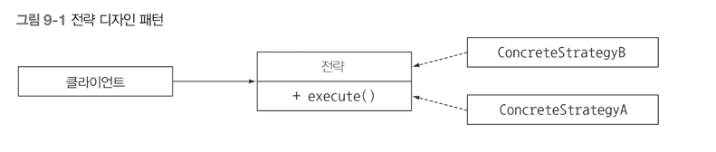
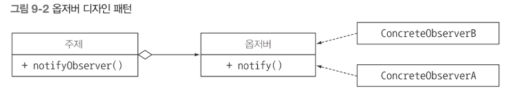
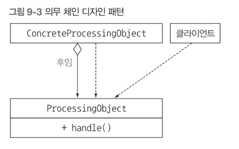
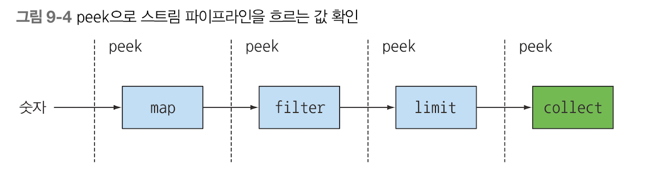

## 리팩토링, 테스팅, 디버깅
- 람다 표현식으로 코드 리팩토링 하기
- 람다 표현식이 객체지향 설계 패턴에 미치는 영향
- 람다 표현식 테스팅
- 람다 표현식과 스트림 API 사용 코드 디버깅

새 프로젝트는 모든 것을 처음부터 시작하는 것이 아닌, 많은 새 프로젝트는 예전 자바로 구현된 기존 코드를 기반으로 시작한다 <br>
람다 표현식, 스트림을 이용해 가독성과 유연성을 높이려면 기존 코드를 어떻게 리팩토링 해야하는지에 대해서 설명해볼 것이다. <br>
그리고 람다 표현식을 이용해, 전략, 템플릿 메소드, 옵저버, 의무 체인, 팩토리 등 객체지향 디자인 패턴을 어떻게 간소화 할 수 있는지도 살펴보자 <br>
그리고 마지막에는 람다 표현식과 스트림 API 를 사용하는 코드를 테스트하고 디버깅 하는 방법을 설명한다 

### 가독성과 유연성을 개선하는 리팩토링 
람다 표현식은 익명 클래스보다 코드를 좀 더 간결하게 만든다.<br>
메소드가 있을 때는 메소드 참조를 이용해서 람다보다 더 간결한 코드를 구현할 수도 있다 <br>
그 뿐만 아니라 람다 표현식은 동작 파라미터화의 형식을 지원하므로 람다 표현식을 이용한 코드는 더 큰 유연성을 갖출 수 있다. <br>
즉 람다 표현식을 이용한 코드는 다양한 요구사항 변화에 대응할 수 있도록 동작을 파라미터화 한다.<br>

#### 코드 가독성 개선
코드 가독성을 개선한다는 것은 우리가 구현한 코드를 다른 사람이 쉽게 이해하고 유지보수 할 수 있게 만드는 것을 의미한다 <br>
아래서 리팩토링 예제를 보며 이해를 도울 예정이다.
- 익명 클래스를 람다 표현식으로 리팩토링 하기
- 람다 표현식을 메소드 참조로 리팩토링하기
- 명령형 데이터 처리를 스트림으로 리팩토링 하기.

#### 익명 클래스를 람다 표현식으로 리팩토링 하기
하나의 추상 메소드르 구현하는 익명 클래스는 람다 표현식으로 리팩토링 할 수 있다.<br>
```java
	Runnable r1 = new Runnable() {
		@Override
		public void run () {
			System.out.println("hello");
		}
	};
	Runnable r2 = () -> System.out.println("hello");
```

위 처럼 람다를 이용해, 익명 클래스를 가독성 있게 바꿀수 있다 <br>
하지만 모든 익명클래스를 람다 표현식으로 변환할 수 있는 것은 아니다.
1) 익명클래스에서 사용한 this 와 super 는 람다 표현식에서 다른 의미를 갖는다. 
- 익명 클래스에서 this 는 익명 클래스 자신을 가리키지만, 람다에서 this 는 람다를 감싸는 클래스를 가리킨다.
2) 익명 클래스는 감싸고 있는 클래스의 변수를 가릴수 있다(shadow variable) 하지만, 람다는 변수를 가릴 수 없다.
```java
	int a = 10;
	Runnable r1 = () -> {
		int a = 2; // 컴파이 ㄹ에러
		System.out.println(a);
	};
	Runnable r2 = () -> {
		int a = 10; // 잘 작동함
		System.out.println(a);
	};
```

3) 익명 클래스를 람다 표현식으로 바꾸면 컨텐스트 오버로딩에 따른 모호함이 초래 될 수 있다.
- 익명클래스는 인스턴스화 할 때 명시적으로 형식이 정해지는 반면 람다의 형식은 컨텐스트에 따라 달라진다. 

#### 람다 표현식을 메소드 참조로 리팩토링 하기
람다 표현식은 쉽게 전달할 수 있는 짧은 코드이다. <br>
하지만 람다 표현식 대신 **메소드 참조**를 이용하면 가독성을 높일 수 있다.
메소드 참조의 메소드명으로 코드의 의도를 명확하게 알릴 수 있기 때문이다. 아래 예제를 비교해보자.
```java
	Map<CaloricLevel, List<Dish>> dishesByCaloricLevel = 
		menu.stream()
			.collect(
				groupingBy(dish -> {
					if(dish.getCalories() <= 400) {
						return CaloricLevel.DIET:
					}
					else if(dish.getCalroies() <= 700) {
						return CaloricLevel.NORMAL;
					}
					else {
						return CaloricLevel.FAT;
					}
				})
			);
```

위 로직을 람다 표현식을 별도의 메소드로 추출한 다음에 groupingBy 인수로 전달할 수 있다.
```java
Map<CaloricLevel, List<Dish>> dishesByCaloricLevel = 
        menu.stream()
            .collect(groupingBy(Dish::getCaloricLevel));
```

위 처럼하려면 Dish 클래스에 getCaloricLevel 로직을 추가해야한다.<br>
또한 comparing 과 maxBy 같은 정적 헬퍼 메소드를 활용하는 것도 좋다, 이들은 메소드 참조와 조화를 이루도록 설계 되었다. 
```java
inventory.sort( (Apple a1, Apple a2) -> a1.getWeight().compareTo(a2.getWeight()));
inventory.sort(comparing(Apple::getWeight));
```

sum, maximum 등 자주 사용하는 리듀싱 연산은 메소드 참조와 함께 사용할 수 있는 내장 헬퍼 메소드를 제공한다. <br>
최댓값이나 합계를 계산할 때 람다 표현식 과 저수준 리듀싱 연산을 조합하는 것 보다 Collectors API 를 사용하면 코드의 의도가 더 명확해진다.
```java
int totalCalories = menu.stream().map(Dish::getCalories)
                                .reduce(0, (c1,c2) -> c1 + c2);

int getTotalCalories = menu.stream().collect(summingInt(Dish::getCalories));
```

#### 명령형 데이터 처리를 스트림으로 리팩토링하기.
이론적으로는 반복자를 이용한 기존의 모든 컬렉션 처리 코드를 스트림 API 로 바꿔야 한다. <br>
스트림 API 는 데이터 처리 파이프라인의 의도를 더 명확하게 보여준다 <br>
스트림은 쇼트서킷과 Lazy 라는 최적화 뿐 아니라 멀티코어 아키텍쳐를 활용할 수 있는 지름길을 제공한다.

다음 명령형 코드를 봐보자
```java
List<String> dishNames = new ArrayList<>();
for(Dish dish : menu) {
	if(dish.getCalories() > 300) {
		dishNames.add(dish.getName());
    }
}
```

위 코드를 스트림 API 로 바꾸면 가독성이 좋고, 쉽게 병렬화를 할 수 있다.
```java
menu.parallelStream()
    .filter(d -> d.getCalories() > 300) // if 문 하고 같은 역할
    .map(Dish::getName) // add 와 같은 역할, 객체 추출 변환
    .collect(toList()); // Stream -> List 로 변환시킨다.
```

만약 명령형 코드의 break, continue, return 등의 제어 문이 있는 코드를 스트림 API 로 바꾸는 것은 쉽지 않다 <br>
그래도 명령형 코드를 스트림 API 로 바꾸도록 도움을 주는 라이브러리가 있다.

#### 코드 유연성 개선 
다양한 람다를 전달해서 다양한 동작을 표현할 수 있다. 따라서 변화하는 요구사항에 대응할 수 있는 코드를 구현할 수 있다<br>
ex) Predicate 로 다양한 필터링 기능 및 비교자로 다양한 비교 기능을 만들 수 있다.

#### 함수형 인터페이스 적용
람다 표현식을 이용하려면 함수형 인터페이스가 필요하다 <br>
조건부 연기 실행, 실행 어라운드 패턴으로 람다 표현식을 리팩토링 해보겠다.

1) 조건부 연기 실행

2) 실행 어라운드 패턴
- 매번 같은 준비, 종료 과정을 반복적으로 수행하는 코드가 있다면, 이를 람다로 변환할 수 있다. 

#### 람다로 객체지향 디자인 패턴 리팩토링 하기
디자인 패턴은 공통적인 소프트웨어 문제를 설계할 때 재사용할 수 있는, 검증된 청사진을 제공한다.<br>
디자인 패턴에 람다 표현식이 더해지면 색다른 기능을 발휘할 수 있다.
- 전략
- 템플릿 메소드
- 옵저버
- 의무 체인
- 팩토리

#### 전략 패턴
한 유형의 **알고리즘** 을 보유한 상태에서 런타임에 적절한 알고리즘을 선택했는가 찾는 기법이다 <br>
전략 패턴은 세 부분으로 구성된다.


- 알고리즘을 나타내는 인터페이스(Strategy 인터페이스)
- 다양한 알고리즘을 나타내는 한 개 이상의 인터페이스 구현 (같은 구체적인 구현 클래스)
- 전략 객체를 사용하는 한 개 이상의 클라이언트

ex) 오직 소문자 또는 숫자로 이루어져야하는 텍스트 입력이 다양한 조건에 맞게 포맷 되어 있는지 검증한다고 가정하자 
```java
public interface ValidationStrategy {
	boolean execute(String s);
}
```

이번에는 위 인터페아스를 구현하는 클래스를 하나 이상 정의한다
```java
public class isAllLowerCase implements ValidationStrategy {
	@Override
	public boolean execute(String s) {
		return s.matches("[a-z]+");
    }
}

public class isNumeric implements ValidationStrategy {
	@Override
	public boolean execute(String s) {
		return s.matches("\\d");
	}
}

```

지금 까지 구현한 클래스를 다양한 검증 전략으로 활용할 수 있다.
```java
public class Validator {
	private final ValidationStrategy strategy;
	public Validator(ValidationStrategy v) {
		this.strategy = v;
    }
	
	public boolean validate(String s) {
		return strategy.execute(s);
    }
}

Validator numericValidator = new Validator(new isNumeric());
boolea b1 = numericValidator.validate("aaaa"); // false

Validator lowerCaseValidator = new Validator(new isAllLowerCase());
boolean b2 = lowerCaseValidator.validate("bbbb"); // true
```

위 검증 로직에 람다표현식을 사용해서 가독성을 올려보겠다.
```java
Valdiator numericValidator = new Validator((String s) -> s.matches("[a-z]+")); // 람다를 직접 전달
boolea b1 = numericValidator.validate("aaaa"); // false

Valdiator lowerCaseValidator = new Validator((String s) -> s.matches("\\d+")); // 람다를 직접 전달
boolean b2 = lowerCaseValidator.validate("bbbb"); // true
```

람다 표현식은 코드 를 캡술화 한다. 람다 표현식으로 전략 디자인 패턴을 대신할 수 있다.

#### 템플릿 메소드
알고리즘의 개요를 제시한 다음에 알고리즘 일부를 고칠 수 있는 유연함을 제공해야 할 때 템플릿 메소드 디자인 패턴을 사용한다.<br>
예시를 보자
```java
public abstract class OnlineBanking {
	public void processCustomer(int id) {
		Customer c = Database.getCustomerwithId(id);
		makeCustomerHappy(c);
    }
	abstract void makeCustomerHappy(Customer c);
}
```

processCustomer 메소드는 온라인 뱅킹 알고리즘이 해야 할 일을 보여준다. 

1) 람다 표현식 사용
```java
public void processCustomer(int id, Consumer<Customer> makeCustomerHappy) {
	Cusotmer c = Database.getCustomerWithId(id);
	makeCustomerHappy.accept(c);
}
```

이제 onlineBanking 클래스를 상속받지 않고 직접 람다 표현식을 전달해서 다양한 동작을 추가할 수 있다.
```java
new OnlineBankingLambda().processCustomer(1337, (Customer c) -> System.out.println("Hello " + c.getName()));
```

#### 옵저버 패턴
어떤 이벤트가 발생했을 때 한 객체가 다른 객체에 자동으로 알림을 보내야 하는 상황에서 옵저버 디자인 패턴을 사용한다 <br>


ex) 특정 키워드를 포함하는 트윗이 등록되면 알림을 받는 로직
```java
interface Observer {
	void notify(String tweet);
}

class NYTimes implements Observer {
	
	@Override
    public void notify(String tweet) {
		if(tweet != null && tweet.contains("money")) {
			System.out.println("Breaking new in NY!" + tweet);
		}
    }
}

class Guardian implements Observer {
	public void notify(String tweet) {
		if(tweet != null && tweet.contains("queen")) {
			System.out.println("Yet more news from London..." + tweet);
		}
    }
}

class LeMonde implements Observer {
	public void notify(String tweet) {
		if(tweet != null && tweet.contains("wine")) {
			System.out.println("My favorite Wine is " + tweet);
		}
	}
}

// 주제 구현
interface Subject {
	void registerObserver(Observer o);
	void notifyObserver(String tweet);
}

// 새로운 옵저버 등록 후 notifyObservers 메소드로 트윗의 옵저버에 알린다.
class Feed implements Subject {
	private final List<Observer> observerList = new ArrayList<>();
	public void registerObserver(Observer o) {
		 this.observerList.add(o);
    }
	public void notifyObservers(String tweet) {
		observerList.forEach(o -> o.notify(tweet));
    }
}
```

#### 의무 체인
작업 처리 객체의 체인을 만들 때는 의무 체인 패턴을 사용한다.<br>
한 객체가 어떤 작업을 처리한 다음에 다른 객체로 결과를 전달하고, 다른 객체도 해야 할 작업을 처리한 다음에 또 다른 객체로 전달하는 식이다. <br>
```java
public abstract class ProcessingObject<T> {
	protected ProcessingObject<T> successor;
	public void setSuccessor(ProcessingObject<T> successor) {
		this.successor = successor;
    }
	public T handle(T input) {
		T r = handleWork(input);
		if(successor != null) {
			return successor.handle(r);
		}
		return r;
    }
	abstract protected T handleWork(T input);
}
```

handle 메소드는 일부 작업을 어떻게 처리해야 할지 전체적으로 기술한다. <br>
ProcessingObject 클래스를 상속받아 handleWork 메소드를 구현하여 다양한 종류의 작업 처리 객체를 만들 수 있다 <br>
한번 텍스트를 처리하는 에제를 봐보자
```java
public class HeaderTextProcessing extends ProcessingObject<String> {
	public String handleWork(String text) {
		return "From Raoul, Mario and Alan: " + text;
    }
}

public class SpellCheckerProcessing extends ProcessingObject<String> {
	public String handleWork(String text) {
		return text.replaceAll("labda", "lambda");
    }
}

// 작업 체인 만들기
ProcessingObject<String> p1 = new HeaderTextProcessing();
ProcessingObject<String> p2 = new SpellCheckerProcessing();
p1.setSuccessor(p2); // 작업 객체 연결
String result = p1.handle("Aren't labdas really?");
System.out.println(result);
```

1) 람다 표현식 사용
```java
UnaryOperator<String> headerProcessing = (String text) -> "From Raoul, Mario and Alan:" + text;
```

#### 팩토리 패턴
인스턴스화 로직을 클라이언트에 노출하지 않고 객체를 만들 때 팩토리 디자인 패턴을 사용한다. 
```java
public class ProductFactory {
	public static Product createProduct(String name) {
		switch (name) {
            case "loan" : return new Loan();
            case "stock" : return new Stock();
            case "bond" : return new Bond();
            default: throw new RuntimeException("No such product : " + name);
		}
    }
}
```

Loan, Stock, Bond 는 모두 Product 의 서브 형식이다. 

1) 람다 표현식 사용
생성자도 메소드 참조처럼 접근할 수 있다. 
```java
Supplier<Product> loanSupplier = Loan::new , Loan loan = loanSupplier.get();
```

다음 코드처럼 상품명을 생성자로 연결하는 Map 을 만들어서 코드를 재구현할 수 있다.
```java
final static Map<String, Supplier<Product>> map = new HashMap<>();
static {
	map.put("loan",Loan::new);
	map.put("stock",Stock::new);
	map.put("bond",Bond::new);
}
```

이제 Map 을 이용해서 팩토리 디자인 패턴에서 했던 것처럼 다양한 상품을 인스턴스 화 할 수 있다.

### 람다 테스팅
우리는 깔끔한 코드도 중요하지만, 원하는 동작을 하는 코드가 제일 중요하다 <br>
의도대로 동작하는지 확인할 수 있는 **단위 테스트** 를 진행한다.

람다는 익명 함수 이므로 테스트 코드 이름을 호출 할 수 없다.

### 디버깅
문제가 발생한 코드를 디버깅 할 때 개발자는 두 가지를 먼저 체크해야한다
- Stack Trace
- Logging

하지만, 람다 표현식과 스트림은 기존의 디버깅 기법을 무력화한다.

#### Stack Trace 확인.
예외 발생으로 프로그램 실행이 갑자기 중단되었다면 먼저 어디에서 멈췄고, 어떻게 멈췄는지를 살펴봐야 한다 <br>
프로그램 호출위치, 호출할 때 인수값, 호출된 메소드, 지역변수 등등 "스택 프레임" 에 저장이 된다 <br>
따라서 프로그램이 멈췄다면 프로그램이 어떻게 멈추게 되었는지 프레임별로 보여주는 **스택 트레이스** 를 얻을 수 있다.

#### 람다와 스택 트레이스
람다 표현식은 익명객체인 만큼 이름이 없기 때문에 조금 복잡한 스택 트레이스가 생성된다 <br>
```java
public class Debugging {
	public static void main (String[] args) {
        List<Point> points = Arrays.asList(new Point(12,2), null);
		points.stream().map(p -> p.getX()).forEach(System.out::println);
	}
}
```

위 프로그램을 실행시키면 NullPointException 이 발생한다. <br>
람다로 인한 오류는  $O 이런 메시지가 적힌 오류 메시지를 반환한다 <br>
이 뜻은 람다 표현식 내부에서 에러가 발생했음을 가리킨다. <br>
람다가 아닌 메소드 참조를 사용해야지 정상적인 에러 메시지가 출력이 된다. 

#### 정보 로깅
스트림의 파이프라인 연산을 디버깅해보자.
```java
List<Integer> numbers = Arrays.asList(2,3,4,5);
numbers.stream()
    .map(x -> x+17)
    .filter(x -> x%2 == 0)
    .limit(3)
    .forEach(System.out::println)
```

스트림 파이프라인에 적용된 각각의 연산이 어떤 결과를 도출하는지 확인할 수 없을까? <br>
바로 **peek** 스트림 연산을 활용할 수 있다. 


```java
numbers.stream()
    .peek(x -> System.out.println("from stream: " + x)) // 처음 스트림으로 소비한 요소 출력
    .map(x -> x+17)
    .peek(x -> System.out.println("after map: " + x)) // map 이후 결과 출력
    .filter(x -> x%2 ==0)
    .peek(x -> System.out.println("after filter: " + x)) // filter 동작 후 출력 
```

이런 식으로 단계별 상태를 체크할 수 있다. 

### 최종 정리
- 람다 표현식으로 가독성이 좋고 더 유연한 코드를 만들 수 있다.
- 익명 클래스 -> 람다 표현식으로 바꾸는 것이 좋다. 하지만 이때 this, 변수 등 미묘하게 다른 내용이 있음을 주의하자. 
- 메소드 참조로 람다 표현식보다 더 가독성이 좋은 코드를 구현할 수 있다.
- 반복적으로 컬렉션을 처리하는 루틴은 스트림 API 로 대체할 수 있을지 고려를 하자.
- 람다 표현식으로 다양한 객체지향 디자인 패턴을 활용해 불필요한 코드를 제거할 수 있다.
- 람다 표현식도 단위 테스트를 수행할 수 있다. 하지만 람다 표현식 자체를 테스트 하는 것 보다는 람다 표현식이 사용되는 메소드의 동작을 테스트 하는것이 옳다.
- 복잡한 람다 표현식은 일반 메소드로 재구현할 수 있다.
- 람다 표현식을 사용하면 스택 트레이스를 이해하기 어려워진다.
- 스트림 파이프라인에서 요소를 처리할 때 peek 메소드로 중간 값을 확인할 수 있습니다.


