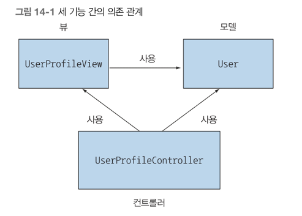

## 자바 모듈 시스템
- 자바가 진화해야 한다는 여론으로 자바가 모듈 시스템을 지원하기 시작함
- 주요구조 : 모듈 declarations, requires, exports 지시어
- 기존 자바 아카이브(JAR)에 적용되는 자동 모듈
- 모듈화와 JDK 라이브러리
- 모듈과 메이븐빌드
- 기본적인 requires, exports 외의 모듈 지시어 간단 요약

자바 9에서 가장 많이 거론되는 새로운 기능은 바로 모듈 시스템이다  
자바 모듈 시스템은 한 권의 책으로 써야 할만큼 복잡한 주제이다  
관련 내용을 자세하게 보고싶다면 'The Java Module System' 책을 살펴보길 권장함  
요번 챕터에서는 모듈을 사용하는 주요 동기를 이해하고 자바 모듈을 어떻게 사용할 수 있는지 빠르게 살펴볼 수 있도록 넓게 이 내용을 다룬다  

### 압력 : 소프트웨어 유추
모듈화란 무엇인가?  
모듈 시스템은 어떤 문제를 해결할 수 있는가?  
추론하기 쉬운 소프트웨어를 만드는데 도움을 주는 관심사 분리와 정보 은닉을 살펴보자  

#### 관심사 분리(SOC)
컴퓨터 프로그램을 고유의 기능으로 나누는 동작을 권장하는 원칙이다  
즉 클래스르르 그룹화한 모듈을 이용해 어플리케이션의 클래스 간의 관계를 시작적으로 보여줄 수 있다  
자바 패키지는 모듈성을 지원하지 않는다  
SoC 원칙은 MVC 아키텍쳐 관점, 그리고 복구 기법을 비즈니스 로직과 분리 하는 등의 하위 수준 접근 등의 상황에 유용하다  
1) 개별 기능을 따로 작업할 수 있으므로 팀이 쉽게 협업할 수 있다.
2) 개별 부분을 재사용하기 쉽다.
3) 전체 시스템을 쉽게 유지보수 할 수 있다.

#### 정보 은닉
정보은닉은 세부 구현을 숨기도록 장려하는 원칙이다.  
세부 구현을 숨김으로 프로그램의 어떤 부분을 바꿨을 때 다른 부분까지 영향을 미칠 가능성을 줄일 수 있다.  
코드를 관리하고 보호하는 데 유용한 원칙이다. -> **캡슐화**  
private 키워드를 사용했는지를 기준으로 컴파일러를 이용해 캡슐화를 체크할 수 있다  

#### 자바 소프트웨어
UML 다이어그램 같은 도구를 이용하면 그룹 코드 간의 의존성을 시각적으로 보여줄 수 있으므로 소프트웨어를 추론하는데 도움이 된다  

### 자바 모듈 시스템을 설계한 이유
#### 모듈화의 한계
자바9 이전까지는 모듈화된 소프트웨어 프로젝트를 만드는 데 한계가 있었다  
자바는 클래스, 패키지, JAR 세 가지 수준의 코드 그룹화를 제공한다  
클래스와 관련해 자바는 접근 제한자와 캡슐화를 지원했다. 하지만 패키지와 JAR 수준에서는 캡슐화를 거의 지원하지 않았다

#### 제한된 가시성 제어
1) 클래스 경로에는 같은 클래스를 구분하는 버전 개념이 없다.
- 위 문제는 Maven, Gradle 빌드 도구들이 해결해 줄 수 있다.

#### 거대한 JDK
JDK 는 자바 프로그램을 만들고, 실행하는 데 도움을 주는 도구의 집합이다  
가장 익숙한 도구로 자바 프로그램을 컴파일하는 javac, 자바 어플리케이션을 로드하고 실행하는 java  
입출력을 포함해 런타임 지원을 제공하는 JDK 라이브러리, 컬렉션, 스트림 등이 있다.  

#### 자바 모듈 시스템으로 애플리케이션 개발하기
#### 세부적인 모듈화와 거친 모듈화
시스템을 모듈화할 때 모듈 크기를 결정해야 한다  

#### 여러 모듈 활용하기

### 최종 정리
- 관심사 분리와 정보 은닉은 추론하기 쉬운 소프트웨어를 만드는 중요한 두 가지 원칙이다.
- 자바 9 이전에는 각각의 기능을 담당하는 패키지,클래스, 인터페이스로 모듈화를 구현했는데 효과적인 캡슐화를 달성하기에는 역부족이었다.
- 자바 9에서는 새로운 모듈 시스템을 제공하는데 module-info.java 파일은 모듈의 이름을 지정하며 필요한 의존성과 공개 API 를 정의한다. 

