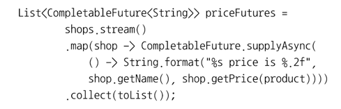
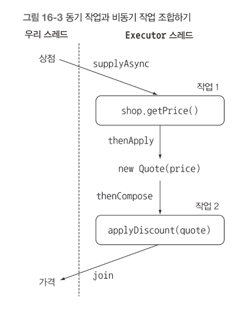

## 16장 CompletableFuture: 안정적 비동기 프로그래밍
- 비동기 작업을 만들고 결과 얻기
- 비블록 동작으로 생산성 높이기
- 비동기 API 설계와 구현
- 동기 API 를 비동기적으로 소비하기
- 두 개 이상의 비동기 연산을 파이프라인으로 만들고 합치기
- 비동기 작업 완료에 대응하기

병렬 스트림과 포크/조인 기법을 이용해 컬렉션을 반복하거나 분할 그리고 정복 알고리즘을 활용하는 병렬이 존재했다 <br>
이에 더해 이들 기법을 이용하면 코드를 병렬로 실행할 수 있는 가능성이 열린다 <br>
CompletableFuture 와 리액티브 프로그래밍 패러다임 두 가지 API 를 제공한다 <br>
CompletableFuture 가 비동기 프로그래밍에 얼마나 큰 도움을 주는지 알아보자 <br>

### Future 의 단순 활용
자바5 부터는 미래의 어느시점에 결과를 얻는 모델에 활용할 수 있도록 Future 인터페이스를 제공하고 있다 <br>
비동기 계산을 모델링하는데 Future 를 이용할 수 있으며, Future 는 계산이 끝났을 때 결과에 접근할 수 있는 참조를 제공한다 <br>
시간이 걸릴 수 있는 작업을 Future 내부로 설정하면 호출자 스레드가 결과를 기다리는 동안 다른 유용한 작업을 수행할 수 있다 <br>
Future 는 저수준의 스레드에 비해 직관적으로 이해하기 쉽다는 장점이 있다 <br>
Future 를 이용하려면 시간이 오래 걸리는 작업을 Callable 객체 내부로 감싼 다음에 ExecutorService 에 제출해야 한다 

#### Future 제한 
Future 인터페이스가 비동기 계산이 끝났는지 확인할 수 있는 isDone 메소드, 계산이 끝나길 기다리는 메소드, 결과 회수 메소드 등을 제공한다 <br>
Future 인터페이스를 구현한 CompletableFuture 클래스를 봐보자, Stream 과 비슷한 패턴, 즉 람다 표현식과 파이프라이닝을 활용 한다. <br>
따라서 Future 와 CompletableFuture 의 관계를 Collection 과 Stream 의 관계에 비유할 수 있다.

#### CompletableFuture 로 비동기 어플리케이션 만들기
어떤 제품이나 서비스를 이용해야 하는 상황이라고 가정하자. 예산을 줄일 수 있도록 온라인상점 중 가장 저렴한 가격을 제시하는 상점을 찾는 애플리케이션을<br>
완성해가는 에제를 이용해서 CompletableFuture 기능을 살펴보자 <br>
1) 고객에게 비동기 API 를 제공하는 방법을 배운다.
2) 동기 API 를 사용해야 할 때 코드를 비블록으로 만드는 방법을 배운다.
3) 비동기 동작의 완료에 대응하는 방법을 배운다.

동기 API 와 비동기 API <br>
전통적인 동기 API 에서는 메소드를 호출한 다음에 메소드가 계산을 완료할 때까지 기다렸다가 메소드가 반환되면 <br>
호출자는 반환된 값으로 계속 다른 동작을 수행한다 <br>
호출자와 피호출자가 각각 다른 스레드에서 실행되는 상황이었더라도 호출자는 피호출자의 동작 완료를 기다렸을 것이다. <br>
이처럼 동기 API 를 사용하는 상황을 블록 호출 이라고 한다.<br>
반면 비동기 API 에서는 메소드가 즉시 반환되며 끝내지 못한 나머지 작업을 호출자 스레드와 동기적으로 실행될 수 있도록 다른 스레드에 할당한다 <br>
이와 같은 비동기 API 를 사용하는 상황을 비블록 호출 이라고 한다 <br>
다른 스레드에 할당된 나머지 계산 결과는 콜백 메소드를 호출해서 전달하거나 호출자가 계산 결과가 끝날 때 까지 기다림 메소드를 추가로 호출하면서 전달된다 <br>
주로 I/O 시스템 프로그래밍에서 이와 같은 방식으로 동작을 수행한다. <br>
즉 계산 동작을 수행하는 동안 비동기적으로 디스크 접근을 수행한다 <br>
그리고 더 이상 수행할 동작이 없으면 디스크 블록이 메모리로 로딩될 때 까지 기다린다.

### 비동기 API 구현
최저가격 검색 어플리케이션을 구현하기 위해 먼저 각각의 상점에서 제공해야 하는 API 부터 정의해보자
```java
public class Shop {
	public double getPrice(String product) {
		// 구현
    }
	
	// 지연시키는 메소드를 만듬
	public static void delay() {
		try {
			Thread.sleep(1000L);
		} catch (InterruptedException e) {
			throw new RuntimeException(e);
		}
    }
}
```

위에서 구현한 delay 를 이용해서 지연을 흉내 낸 다음에 임의의 계산값을 반환하도록 getPrice 를 구현할 수 있다 <br>
```java
public double getPrice(String product) {
	return calculatePrice(product);
}

private double calculatePrice(String product) {
	delay();
	return random.nextDouble() * product.charAt(0) + product.charAt(1);
}
```

사용자가 이 API(최저가격 검색 어플리케이션) 을 호출하면 비동기 동작이 완료될 때 까지 1초동안 블록된다 <br>
최저가격 검색 어플리케이션위에서 위 메소드를 사용해서 네트워크 상의 모든 온라인상점의 가격을 검색해야 하므로 블록 동작은 바람직하지 않다 <br>
뒤에서는 동기 API 를 비동기적으로 소비하는 방법도 알아볼 것이다. <br>

#### 동기 메소드를 비동기 메소드로 변환
```java
public Future<Double> getPriceAsync(String product) { //로직}
```

Future 인터페이스를 사용하면 호출자 스레드가 블록되지 않고 다른 작업을 실행할 수 있다 <br>
Future 는 결과값의 핸들일 뿐이며 계산이 완료되면 get 메소드 로 결과를 얻을 수 있다 <br>
getPriceAsync 메소드는 즉시 반환되므로 호출자 스레드는 다른 작업을 수행할 수 있다 <br>
자바 8의 새로운 CompletableFuture 클래스는 getPriceAsync 를 쉽게 구현하는데 도움이 되는 기능을 제공한다
```java
public Future<Double> getPriceAsync(String product) {
	CompletableFuture<Double> futurePrice = new CompletableFuture<>(); // 계산 결과를 포함할 객체 생성
	new Thread( () -> {
		double price = calculatePrice(product); // 다른 스레드에서 비동기적으로 계산 수행
		futurePrice.complete(price); // 오랜 시간이 걸리는 계산이 완료되면 Future 에 값 생성
    }).start();
	return futurePrice; // 계산 결과가 완료되길 기다리지 않고 Future 를 반환한다.
}
```

위 코드에서 비동기 계산과 완료 결과를 포함하는 CompletableFuture 인스턴스를 만들었다 <br>
실제 가격을 계산할 다른 스레드를 만든 다음에 오래 걸리는 계산 결과를 기다리지 않고 결과를 포함할 Future 인스턴스를 바로 반환했다 <br>
요청한 제품의 가격 정보가 도착하면 complete 메소드를 이용해서 CompletableFuture 를 종료할 수 있다
```java
public static void main (String[] args) {
	Shop shop = new Shop("BestShop");
	long start = System.nanoTime();
	Future<Double> futurePrice = shop.getPriceAsync("my favorite product");
	long invocationTime = ((System.nanoTime() - start) / 1_000_000);
	System.out.println("Invocation returned after " + invocationTime + "msecs");

	// 제품 가격을 계산하는 동안
	doSomethingElse();

	try {
		double price = futurePrice.get();
	} catch (Exception e) {
		throw new RuntimeException(e);
	}
	long retrievalTime = ((System.nanoTime() - start) / 1_000_000);
	System.out.println("Invocation returned after " + invocationTime + "msecs");
}
```

Shop 은 비동기 API 를 제공하므로 즉시 Future 를 반환한다. 클라이언트는 반환된 Future 를 이용해서 나중에 결과를 얻는다 <br>
그 사이 클라이언트는 다른 상점에 가격 정보를 요청하는 등 첫 번째 상점의 결과를 기다리면서 대기하지 않고 다른 작업을 처리할 수 있다 <br>
나중에 클라이언트가 특별히 할일이 없으면 Future 의 get 메소드를 호출한다 <br>
이 때 Future 가 결과값을 가지고 있다면 Future 에 포함된 값을 읽거나 아니면 값이 계산될 때까지 블록한다 <br>

#### 에러 처리 방법
예외가 발생하면 해당 스레드에만 영향을 미친다, 즉 에러가 발생해도 가격 계산은 계속 진행되며 일의 순서가 꼬인다. <br>
결과적으로 클라이언트는 get 메소드가 반환될 때까지 영원히 기다리게 될 수도 있다 <br>

클라이언트는 타임아웃값을 받는 get 메소드의 오버로드 버전을 만들어 이 문제를 해결할 수 있다 <br>
이처럼 블록 문제가 발생할 수 있는 상황에서는 타임아웃을 활용하는 것이 좋다.<br>
그래야 문제가 발생했을 때 클라이언트가 영원히 블록되지 않고 타임아웃 시간이 지나면 TimeoutException 을 받을 수 있다.<br>
따라서 completeExceptionally 메소드를 이용해서 CompletableFuture 내부에서 발생한 예외를 클라이언트로 전달해야 한다 <br>
```java
	public Future<Double> getPriceAsync(String product) {
	CompletableFuture<Double> futurePrice = new CompletableFuture<>();
	new Thread( () -> {
		try {
			double price = calculatePrice(product);
			futurePrice.complete(price);
		} catch (Exception ex) {
			futurePrice.completeExceptionally(ex);
		}
	}).start();
	return futurePrice;
}
```

이제 클라이언트는 가격 계산 메소드에서 발생한 예외 파라미터를 포함하는 예외를 받게된다 <br>

#### 팩토리 메소드 supplyAsync 로 CompletableFuture 만들기
좀 더 간결하게 CompletableFuture 를 만들어 보겠다.
```java
public Future<Double> getPriceAsync(String product) {
	return CompletableFuture.supplyAsync( () -> calculatePrice(product));
}
```

supplyAsync 메소드는 Supplier 를 인수로 받아서 CompletableFuture 를 반환한다 <br>
CompletableFuture 는 Supplier 를 실행해서 비동기적으로 결과를 생성한다 <br>

#### 비블록 코드 만들기
```java
List<Shop> shops = Arrays.asList(
	        new Shop("BestPrice"),
            new Shop("LetsSaveBig"),
            new Shop("MyFavoriteShop"));
```

그리고 다음처럼 제품명을 입력하면 상점 이름과 제품 가격 문자열 정보를 포함하는 List 를 반환하는 메소드를 구현한다.
```java
public List<String> findPrices(String product);
        // output                 input
// input 이 들어와서 Output 으로 나간다.
```

```java
public List<String> findPrices(String product) {
	return shops.stream()
        .map(shop -> String.format("%s price is %.2f", shop.getName(), shop.getPrice(product)))
        .collect(toList());
}
```

간단한 코드이다. 이제 findPrices 메소드로 원하는 제품의 가격을 검색할 수 있다. 
```java
long start = System.nanoTime();
System.out.println(findPrices("myPhone27S"));
long duration = (System.nanoTime() - start) / 1_000_000;
System.out.println("Done in" + duration + " msecs");
```

위 코드를 통해 결과를 받을 수 있다, 이제 어떻게 성능을 개선할 수 있을까?

#### 병렬 스트림으로 요청 병렬화 하기
병렬 스트림을 이용해서 순차 계산을 병렬로 처리해서 성능을 개선할 수 있다.
```java
public List<String> findPrices(String product) {
	return shops.parallelStream()
		.map(shop -> String.format("%s price is %.2f", shop.getName(), shop.getPrice(product)))
		.collect(toList());
}
```

이렇게 하면 간단하게 성능을 개선했다, 3개의 상점에서 병렬로 검색이 진행되므로 1초 안에 검색이 완료된다 <br>
이를 더 개선하기 위해서 CompletableFuture 기능을 활용해서 findPrices 메소드의 동기 호출을 비동기로 바꿔보자

#### CompletableFuture 로 비동기 호출 구현하기

```java
public List<String> findPrices(String product) {
	List<CompletableFuture<String>> priceFutures = 
        shops.stream()
            .map(shop -> CompletableFuture.supplyAsync(
				() -> shop.getName() + " price is " + shop.getPrice(product)
            )).collect(Collectors.toList());
	
	return priceFutures.stream()
        .map(CompletableFuture::join) // 모든 비동기 동작이 끝나길 기다린다.
        .toList();
}
```

두 map 연산을 하나의 스트림 처리 파이프라인으로 처리하지 않고 두 개의 스트림 파이프라인으로 처리했다.<br>
스트림 연산은 게으른 특성이 있으므로 하나의 파이프라인으로 연산을 처리했다면 모든 가격 정보 요청 동작이 동기적,순차적으로 이루어진다 <br>
CompletableFuture 버전이 병렬 스트림 버전보다 아주 조금 빠르다 <br>
두 가지 버전 모두 내부적으로 Runtime.getRuntime().availableProcessors() 가 반환하는 스레드 수를 사용하면서 비슷한 결과가 된다 <br>
Executor 로 스레드 풀의 크기를 조절하는 등 애플리케이션에 맞는 최적화된 설정을 만들 수 있다

### 커스텀 Executor 사용하기
우리 어플리케이션이 실제로 필요한 작업량을 고려한 풀에서 관리하는 스레드 수에 맞게 Executor 를 만들 수 있으면 좋을 것이다 <br>
스레드 풀이 너무 크면 CPU 와 메모리 자원을 서로 경쟁하느라 시간을 낭비할 수 있다 <br>
반면 스레드 풀이 너무 작으면 CPU 의 일부 코어는 활용되지 않을 수 있다 <br>
```java
private final Executor executor = Executors.newFixedThreadPool(Math.min(shops.size(), 100)
    ,new ThreadFactory() {
	    public Thread newThread(Runnable r) {
			Thread t = new Thread(r);
			t.setDaemon(true); // 프로그램 종료를 방해하지 않는 데몬 스레드를 사용한다.
			return t;
        }
    });
```

우리가 만드는 풀은 데몬 스레드를 포함한다 <br>
자바에서 일반 스레드가 실행중이면 자바 프로그램은 종료되지 않는다. <br>
따라서 어떤 이벤트를 한없이 기다리면서 종료되지 않는 일반 스레드가 있으면 문제가 될 수 있다 <br>
반면 데몬 스레드는 자바 프로그램이 종료될 때 강제로 실행이 종료될 수 있다. 두 스레드의 성능은 같다 <br>
```java
CompletableFuture.supplyAsync( () -> shop.getName() + " price is " + shop.getPrice(product), executor);
```

결국 어플리케이션 특성에 맞는 Executor 를 만들어 CompletableFuture 를 활용하는 것이 바람직하다는 사실을 확인할 수 있다 <br>

<b> 스트림 병렬화와 CompletableFuture 병렬화 </b> <br>
1) 병렬 스트림으로 변환해서 컬렉션 처리 <br>
2) 컬렉션을 반복하면서 CompletableFuture 내부의 연산으로 만드는 것.<br>

CompletableFuture 를 이용하면 전체적인 계산이 블록되지 않도록 스레드 풀의 크기를 조절할 수 있다 <br>
- I/O 가 포함되지 않은 계산 중심의 동작을 실행할 때는 스트림 인터페이스가 가장 구현하기 간단하며 효율적일 수 있다.
- 작업이 I/O 를 기다리는 작업을 병렬로 실행할 때는 CompletableFuture 가 더많은 유연성을 제공한다. 
  - 특히 스트림의 게으른 특성 때문에 스트림에서 I/O 를 실제로 언제 처리할지 예측하기 어려운 문제도 있다

#### 비동기 작업 파이프라인 만들기
우리와 계약을 맺은 모든 상점이 하나의 할인 서비스를 사용하기로 했다고 가정하자, 예시를 보자
```java
public class Discount {
	public enum Code {
		NONE(0) , SILVER(5), GOLD(10), PLATINUM(15), DIAMOND(20);
		private final int percentage;
		
		Code(int percentage) {
			this.percentage = percentage;
		}
	}
	// 나머지 구현
}
```
```java
public class Quote {
	private final String shopName;
	private final double price;
	private final Discount.Code discountCode;

	public Quote (String shopName, double price, Discount.Code discountCode) {
		this.shopName = shopName;
		this.price = price;
		this.discountCode = discountCode;
	}

	public static Quote parse(String s) {
		String[] split = s.split(":");
		String shopName = split[0];
		double price = Double.parseDouble(split[1]);
		Discount.Code discountCode = Discount.Code.valueOf(split[2]);
		return new Quote(shopName, price, discountCode);
	}

	public String getShopName () {
		return shopName;
	}

	public double getPrice () {
		return price;
	}

	public Discount.Code getDiscountCode () {
		return discountCode;
	}

}
```

상점에서 얻은 문자열을 정적 팩토리 메소드 parse 로 넘겨주면 이름,가격,정보 를 포함하는 Quote 인스턴스가 생성된다 <br>

```java
	public static String applyDiscount(Quote quote) {
		return quote.getShopName() + " price is " + 
			Discount.apply(quote.getPrice(), quote.getDiscountCode()); // 기존에 가격에 할인코드를 적용
	}
	
	private static double apply(double price, Code discountCode) {
		dealy(); // 응답을 1초 지연 시킴
		return String.format(price * (100- discountCode.percentage)/100);
	}
```

동기방식으로 Discount 서비스 얻기
```java
public List<String> findPrices(String product) {
	return shops.stream()
        .map(shop -> shop.getPrice(product)) // 요청한 제품의 가격과 할인코드로 변환
        .map(Quote::parse) // 문자열 파싱해서 Quote 객체를 만든다
        .map(Discount::applyDiscount) // Discount 서비스에 접근해서 최종 할인가격을 계산하고 문자열 반환
        .toList();
}
```

위 구현은 성능 최적화 와는 거리가 멀다 <br>
순차적으로 여러 상점에 가격 정보를 요청하느라 시간이 소요되었다. <br>
위 구현을 성능을 최적화 하기위해선 병렬 스트림을 이용하면 되지만, 스레드 풀의 크기가 고정되어 있어서 상점 수가 늘어났을때 유연하게 대응할 수 없다 <br>
따라서 CompletableFuture 에서 수행할 수 있는 태스크를 설정할 수 있는 커스텀 Executor 를 정의함으로 써 우리의 CPU 사용을 극대화 할 수 있다 <br>

#### 동기작업과 비동기 작업 조합하기
```java
	public List<String> findPrices(String product) {
		List<CompletableFuture<String>> priceFutures = 
			shops.stream()
				.map(s -> CompletableFuture.supplyAsync( () -> s.getPrice(product), executor))
				.map(future -> future.thenApply(Quote::parse))
				.map(future -> future.thenCompose(quote -> 
					CompletableFuture.supplyAsync( () -> Discount.applyDiscount(quote),executor)))
				.toList();
		
		return priceFutures.stream()
			.map(CompletableFuture::join)
			.toList();
	}
```

위 코드는 많이 복잡해졌다. 위 코드에서는 map 을 통해 세 가지 변환을 한다 <br>


#### Future 의 리플렉션과 CompletableFuture 의 리플렉션
CompletableFuture 는 람다 표현식을 사용한다, 람다 덕분에 복잡한 연산 수행방법을 효과적으로 정의하는 선언형 API 를 만들 수 있다 