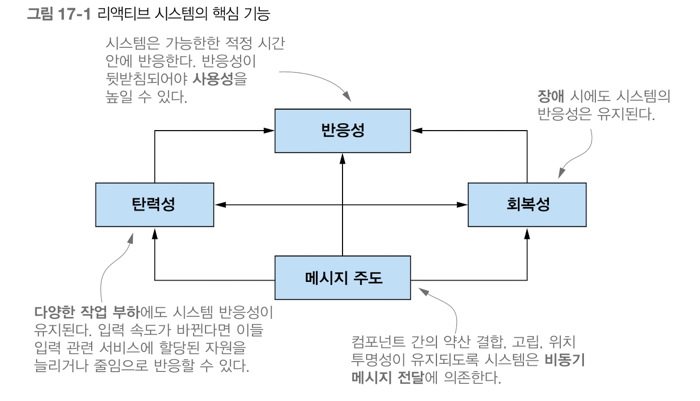

## 17장 리액티브 프로그래밍
- 리액티브 프로그래밍을 정의하고, 리액티브 매니패스토를 확인함
- 애플리케이션 수준, 시스템 수준의 리액티브 프로그래밍
- 리액티브 스트림, 자바9 플로 API 를 사용한 예제코드
- 널리 사용되는 리액티브 라이브러리 RxJava 소개
- 여러 리액티브 스트림을 변환하고 합치는 RxJava 동작 살펴보기
- 리액티브 스트림의 동작을 시각적으로 문서화하는 마블 다이어그램

리액티브 프로그래밍이란 무엇이고 어떻게 동작하는지 확인하기 앞서, 새로운 리액티브 프로그래밍 패러다임의 중요성이 증가하는 이유를 알 필요가 있다 <br>
1) 빅데이터: 빅데이터는 페타바이트 단위로 구성되며 매일 증가한다.
2) 다양한 환경: 멀티 코어 프로세서로 실행되는 클라우드 기반 클러스터에 이르기까지 다양한 환경에 어플리케이션이 배포된다.
3) 사용 패턴: 사용자는 1년 내내 항상 서비스를 이용할 수 있으며 밀리초 단위의 응답 시간을 기대한다.

예전 소프트웨어 아키텍쳐 로는 오늘날의 이런 요구사항을 만족시킬 수 없다 <br>
리액티브 프로그래밍에서는 다양한 시스템과 소스에서 들어오는 데이터 항목 스트림을 비동기적으로 처리하고 합쳐서 이런 문제를 해결한다 <br>

### 리액티브 매니페스토
리액티브 애플리케이션과 시스템 개발의 핵심 원칙을 공식적으로 정의한다.
1) 반응성
2) 회복성
3) 탄력성: 리액티브 시스템에서는 무서운 작업 부하가 발생하면 자동으로 관련 컴포넌트에 할당된 자원 수를 늘린다.
4) 메시지 주도: 비동기 메시지를 전달해 컴포넌트 끼리의 통신이 이루어진다. 회복성과 탄력성을 얻을 수 있다.



#### 애플리케이션 수준의 리액티브
애플리케이션 수준 컴포턴트의 리액티브 프로그래밍의 주요 기능은 비동기로 작업을 수행할 수 있다는 점이다 <br>
나중에는 이벤트 스트림을 블록하지 않고 비동기로 처리하는 것이 최신 멀티코어 CPU 사용률을 극대화(내부적으로 경쟁하는 CPU 의 스레드 사용률) 할 수 있는 방법이다 <br>
리액티브 기술을 이용함으로서 동시,비동기 어플리케이션 구현의 추상 수준을 높일 수 있으므로 동기 블록, 경쟁 조건, 데드락 같은 저 수준의 <br>
멀티 스레드 문제를 직접 처리할 필요가 없어지면서 비즈니스 요구사항을 구현하는데 더 집중 할 수 있다 <br>
스레드를 다시 쪼개는 종류의 기술을 이용할 때는 메인 이벤트 루프 안에서는 절대 동작을 블록하지 않아야 한다는 중요한 전제 조건이 항상 따른다 <br>
DB, 파일 시스템 접근, 작업 완료까지 얼마나 걸릴지 예측이 힘든 원격 서비스 호출 등 모든 I/O 관련 동작이 블록 동작에 속한다 <br>
두 스레드를 포함하는 풀이 있고 이벤트 스트림 세 개를 처리하는 상황을 가정하자 <br>
한 번에 오직 2개의 스트림을 처리할 수 있는 상황이므로 가능하면 이들 스트림은 두 스레드를 효율적이고 공정하게 공유해야 한다. <br>

#### 시스템 수준의 리액티브
고립과 비결합이 회복성의 핵심이라면 탄련성의 핵심은 위치 투명성이다 <br>
리액티브 프로그래밍은 리액티브 스트림을 사용하는 프로그래밍이다 <br>
리액티브 스트림은 잠재적으로 무한의 비동기 데이터를 순서대로 그리고 블록하지 않는 역압력을 전제해 처리하는 표준 기술이다 <br>
역압력은 발행-구독 프로토콜에서 이벤트 스트림의 구독자가 발행자 이벤트를 제공하는 속보보다 느린 속도로 이벤트를 소비하면서 <br>
문제가 발생하지 않도록 보장하는 장치다 <br>
이런 상황이 발생했을 때 부하가 발생한 컴포넌트가 완전 불능이 되거나 예기치 않는 방식으로 이벤트를 잃어버리는 등의 문제가 발생하지 않는다 <br>
스트림 처리의 비동기적인 특성상 역압력 기능의 내장은 필수라는 사실을 알 수 있다 <br>

#### Flow 클래스 소개
자바 9에서는 리액티브 프로그래밍을 제공하는 클래스인 java.util.concurrent.Flow 를 추가했다 <br>
이 클래스는 정적 컴포넌트 하나를 포함하고 있으며 인스턴스화 할 수 없다 <br>
리액티브 스트림 프로젝트의 표준에 따라 프로그래밍 발행-구독 모델을 지원할 수 있도록 Flow 클래스는 중첩된 인터페이스 네 개를 포함한다 <br>
- Publisher
- Subscriber
- Subscription
- Processor

Publisher 가 항목을 발행하면 Subscriber 가 한 개씩 또는 한번에 여러 항모을 소비하는데 Subscription 이 이 과정을 <br>
관리할 수 있도록 Flow 클래스는 관련된 인터페이스와 정적 메소드 를 제공한다 <br>

```java
public final class Flow {

    private Flow() {} // uninstantiable
    
    @FunctionalInterface
    public static interface Publisher<T> {

        public void subscribe(Subscriber<? super T> subscriber);
    }
	
    public static interface Subscriber<T> {

        public void onSubscribe(Subscription subscription);
		
        public void onNext(T item);
		
        public void onError(Throwable throwable);
		
        public void onComplete();
    }
	
    public static interface Subscription {


        public void request(long n);
		
        public void cancel();
    }
	
    public static interface Processor<T,R> extends Subscriber<T>, Publisher<R> {
    }

    static final int DEFAULT_BUFFER_SIZE = 256;


    public static int defaultBufferSize() {
        return DEFAULT_BUFFER_SIZE;
    }

}
```

- Publisher 는 반드시 Subscription 의 request 메소드에 정의된 개수 이하의 요소만 Subscriber 에 전달해야 한다

// 나중에 다시보기


