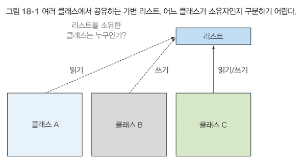
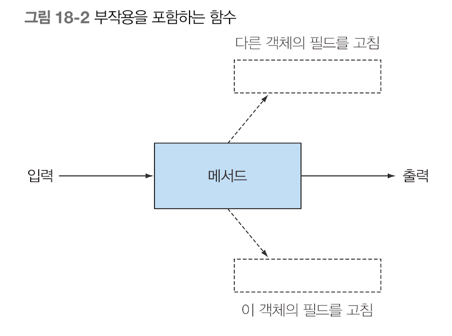
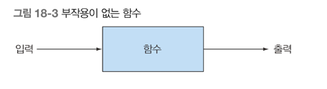
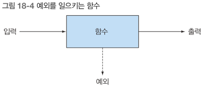
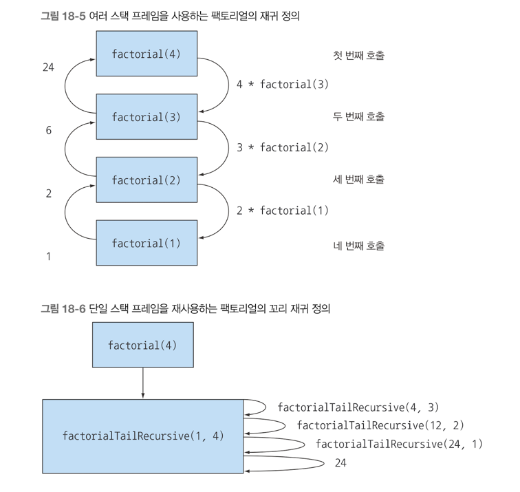

## 18장 함수형 관점으로 생각하기
- 왜 함수형 프로그래밍을 사용하는가?
- 함수형 프로그래밍은 어떻게 정의하는가?
- 선언형 프로그래밍과 참조 투명성
- 함수형 스타일의 자바 구현 가이드라인
- 반복과 재귀

이 책에서 함수형 이라는 용어를 자주 언급했다 <br>

### 시스템 구현과 유지보수
프로그램 내에 synchronized 라는 키워드가 발견된다면 제안을 거절하라 는 말이 있다 <br>
자바 8의 스트림을 이용하면 잠금 문제를 신경 쓰지 않을 수 있었다 <br>
단 자바8 스트림을 이용하려면 상태 없는 동작이어야 한다는 조건을 만족해야 한다 <br>
프로그램이 시스템의 구조를 이해하기 쉽게 클래스 계층으로 반영한다면 좋을 것이다 <br>
시스템의 각 부분의 상호 의존성을 가리키는 결합성과 시스템의 다양한 부분이 서로 어떤 관계를 갖는지 가리키는 응집성 이라는 <br>
소프트웨어 엔지니어링 도구로 프로그램 구조를 평가할 수 있다 <br>
유지보수 중 코드 크래시 디버깅 문제를 가장 많이 겪게 된다 <br>
함수형 프로그래밍이 제공하는 부작용 없음 과 불변성 이라는 개념이 문제를 해결하는데 도움을 준다 <br>

#### 공유된 가변 데이터
변수가 예상하지 못한 값을 갖는 이유는 결국 우리가 유지보수하는 시스템의 여러 메소드에서 공유된 가변 데이터 구조를 읽고 갱신하기 때문이다 <br>
공유 가변 데이터 구조를 사용하면 프로그램 전체에서 데이터 갱신 사실을 추적하기가 어려워진다.
 
부작용 없는 시스템 컴포넌트에서는 메소드가 서로 간섭하는 일이 없으므로 잠금을 사용하지 않고도 멀티코어 병렬성을 사용할 수 있다 <br>

#### 선언형 프로그래밍
'어떻게' 에 집중하는 프로그래밍 형식은 고전의 객체지향 프로그래밍에서 이용하는 방식이다 <br>
```java
Transaction mostExpensive = transactions.get(0);
if(mostExpensive == null)
	throw new IllegalArgumentException("Empty list of transactions")

for(Transaction t: transactions.subList(1, transactions.size())) {
    if(t.getValue() > mostExpensive.getValue()) {
		mostExpensive = t;
    }	
}
```

어떻게 가 아닌 무엇을 에 집중하는 방식도 있다. 즉 스트림 API 로 다음과 같은 질의를 만든다.<br>
```java
Optional<Transaction> mostExpensive = transactions.stream()
    .max(comparing(Transaction::getValue));
```

질의문 구현 방법은 라이브러리가 결정한다. 위 방식을 내부 반복 이라고 한다 <br>
질의문 자체로 문제를 어떻게 푸는지 명확하게 보여준다는 것이 내부 반복 프로그래밍의 큰 장점이다 <br>
위 처럼 **'무엇을'** 에 집중하는 방식을 선언형 프로그래밍 이라고 부른다 <br>
선언형 프로그래밍에서는 우리가 원하는 것이 무엇이고 시스템이 어떻게 그 목표를 달성할 것인지 등의 규칙을 정한다 <br>
문제 자체가 코드로 명확하게 드러난다는 점이 선언형 프로그래밍의 강점이다 <br>

#### 왜 함수형 프로그래밍인가?
함수형 프로그래밍은 선언형 프로그래밍을 따르는 대표적인 방식이며, 이전에 설명한 것 처럼 부작용이 없는 계산을 지향한다 <br>
람다 표현식과 스트림으로 여러 연산을 연결해서 복잡한 질의를 표현할 수 있었다. <br>

### 함수형 프로그래밍이란 무엇인가?
함수형 프로그래밍에서 **함수**란 수학적인 함수와 같다 <br>
즉, 함수는 0개 이상의 인수를 가지며, 한 개 이상의 결과를 반환하지만 부작용이 없어야 한다 <br>


자바 언어에서는 바로 수학적인 함수냐 아니냐가 메소드와 함수를 구분하는 핵심이다 <br>

#### 함수형 자바
실질적으로 자바로는 완벽한 순수 함수형 프로그래밍을 구현하기 어렵다 <br>
함수나 메소드는 지역변수만을 변경해야 함수형 이라고 할 수 있다 <br>
그리고 함수나 메소드에서 참조하는 객체가 있다면 극 객체는 불변 객체여야 한다. 즉 객체의 모든 필드가 final 이여야 하고 모든 참조 필드는 불변 객체를 직접 참조 해야함 <br>
함수형이라면 함수나 메소드가 어떤 예외도 일으키지 않아야 한다 <br>

예외를 사용하지 않고 표현하려면 Optional<T> 를 사용할 수 있다.  

#### 참조 투명성
'부작용을 감춰야 한다' 는 제약은 참조 투명성 개념으로 귀결된다 <br>
함수는 어떤 입력이 주어졌을 때 언제,어디서 호출하든 같은 결과를 생성해야 한다. <br>
참조 투명성은 비싸거나 오랜 시간이 걸리는 연산을 기억화 또는 캐싱을 통해 다시 계산하지 않고 저장하는 최적화 기능도 제공한다 <br>

### 재귀와 반복
순수 함수형 프로그래밍 언어에서는 while,for 같은 반복문을 포함하지 않는다. <br>
다음은 자바의 Iterator 로 for(Apple a : apples) {} 라는 for-each 루프를 표현한 코드이다 <br>
```java
Iterator<Apple> it = apples.iterator();
while(it.hasNext()) {
    Apple apple = it.next();	
	// 로직
}
```

다음은 for-each 루프를 사용한 로직이다.
```java
public void searchForGold(List<String> l, Stats stats) {
	for(String s : l) {
		if("gold".equals(s)) {
			stats.incrementFor("Gold");
		}
	}
}
```

루프의 바디에서 함수형과 상충하는 부작용이 발생한다 <br>
즉 루프 내부에서 프로그램의 다른 부분과 공유되는 stats 객체의 상태를 변화시킨다 <br>

그럼 변화를 시키지 않기 위해서 어떻게 구현을 해야할까 ? <br>
재귀를 이용하면 변화가 일어나지 않는다.
```java
// 반복 방식의 팩토리얼
static int factorialIterative(int n) {
	int r = 1;
	for (int i = 1; i <= n; i++) {
        r *=i;
	}
	return r;
}

// 재귀 방식의 팩토리얼
static long factorialRecursive(long n) {
	return n==1 ? 1:n*factorialRecursive(n-1);
}

// 스트림 팩토리얼
static long factorialStreams(long n) {
	return LongStream.rangeClosed(1,n)
        .reduce(1, (long a, long b) -> a*b);
}
```

일반적으로 반복코드보다 재귀 코드가 더 비싸다 <br>
재귀를 호출할 때마다 호출 스택에 각 호출시 생성되는 정보를 저장할 새로운 스택 프레임이 만들어진다 <br>
즉 재귀 팩토리얼의 입력값에 비례해서 메모리 사용량이 증가한다. <br>
따라서 큰 입력값을 사용하면 StackOverflowError 가 발생한다. <br>
함수형 언어에서는 재귀 호출을 최적화를 위해 **꼬리 호출 최적화** 라는 해결책을 제공한다 <br>
```java
// 꼬리 재귀 팩토리얼
static long factorialRecursive(long n) {
	return factorialHelper(1,n);
}

static long factorialHelper(long acc, long n) {
	return n==1 ? acc:factorialHelper(acc*n, n-1);
}
```

factorialHelper 에서 재귀 호출이 가장 마지막에서 이루어지므로 꼬리 재귀이다 <br>
중간 결과를 각각의 스택 프레임으로 저장해야 하는 일반 재귀와 달리 꼬리 재귀에서는 컴파일러가 하나의 스택 프레임을 재활용할 가능성이 생긴다 <br>

안타깝게도 자바는 이와 같은 최적화를 제공하지 않는다 <br>
지금도 고전적인 재귀보다는 여러 컴파일러 최적화 여지를 남겨둘 수 있는 꼬리 재귀를 적용하는 것이 좋다. <br>
결론적으로 자바 8에서는 반복을 스트림으로 대체해서 변화를 피할 수 있다. <br>
또한 반복을 재귀로 바꾸면 더 간결하고, 부작용이 없는 알고리즘을 만들 수 있다 <br>
재귀를 이용하면 좀 더 쉽게 읽고, 쓰고, 이해할 수 있는 예제를 만들 수 있다 <br>
또한 약간의 실행시간 차이보다는 프로그래머의 효율성이 더 중요할 때도 많다 <br>

### 최종 정리
- 공유된 가변 자료구조를 줄이는 것은 장기적으로 프로그램을 유지보수하고 디버깅하는데 도움이 된다.
- 함수형 프로그래밍은 부작용이 없는 메소드와 선언형 프로그래밍 방식을 지향한다.
- 함수형 메소드는 입력 인수와 출력 결과만을 갖는다.
- 같은 인수값으로 함수를 호출했을 때 항상 같은 값을 반환하면 참조 투명성을 갖는 함수다. while 루프 같은 반복문은 재귀로 대체할 수 있다.
- 자바에서는 고전적인 재귀 보다는 꼬리 재귀를 사용해야 추가적인 컴파일러 최적화를 기대할 수 있다.