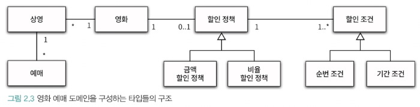
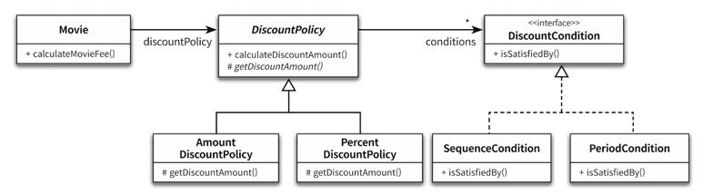

# 객체지향 프로그래밍

## 영화 예매 시스템
'영화' 와 '상영' 이라는 용어를 구분해서 엔티티를 만들 것이다 <br>
특정 조건을 만족하는 예매자는 요금을 할인받는다 <br>
- 할인 조건
- 할인 정책

위 규칙을 기반으로 작성한다 <br>

할인 조건은 가격의 할인 여부를 결정하며, 순서 조건 과 기간 조건 의 두 종류로 나눌 수 있다 <br>
순서 조건은 상영 순번을 이용해 할인 여부를 결정한다 <br>
기간 조건은 영화 상영 시작 시간을 이용해 할인 여부를 결정한다 <br>

할인 정책은 할인 요금을 결정한다 <br>
- 금액 할인 정책
- 비율 할인 정책

## 객체지향 프로그래밍을 통해
### 협력, 객체, 클래스
객체지향은 객체를 지향하는 것이다 <br>

1) 어떤 클래스가 필요한지를 고민하기 전에 어떤 객체들이 필요한지 고민하라.
   클래스는 공통적인 상태와 행동을 공유하는 객체들을 추상화한 것이다.<br>
   즉 클래스 윤곽을 잡기 위해서는 어떤 객체들이 어떤 상태와 행동을 가지는지를 먼저 결정해야 한다 <br>


2) 객체를 독립적인 존재가 아니라 기능을 구현하기 위해 협력하는 공동체의 일원으로 봐야 한다.
   객체는 홀로 존재하는 것이 아닌, 서로 도움을 주고 의존하면서 살아가는 존재이다 <br>
   객체를 협력하는 공동체의 일원으로 바라보는 것은 설계를 유연하고 확장 가능하게 만든다 <br>

### 도메인 구조를 따르는 프로그램 구조
소프트웨어는 사용자가 원하는 어떤 문제를 해결하기 위해 만들어진다 <br>
즉 문제를 해결하기 위해 사용자가 프로그램을 사용하는 분야를 '도메인' 이라고 부른다 <br>

 <br>

위 사진은 영화 예매 도메인을 구성하는 개념과 관계를 표현한 것이다 <br>
영화는 여러번 상영될수 있고 상영은 여러 번 예매될 수 있다는 것을 알 수 있다 <br>

### 클래스 구현하기
도메인 개념들의 구조를 반영하는 적절한 클래스 구조를 만들었다고 가정하자 <br>
이제 남은 일은 적절한 프로그래밍 언어를 이용해 구조를 구현하는 것이다 <br>

```java
@Entity
public class Screening {
	@Id @GeneratedValue(strategy = GenerationType.IDENTITY)
	private Long id;
	
	private Movie movie;
	private int sequence;
	private LocalDateTime whenScreened;

	public Screening (Movie movie, int sequence, LocalDateTime whenScreened) {
		this.movie = movie;
		this.sequence = sequence;
		this.whenScreened = whenScreened;
	}
	
	public LocalDateTime getStartTime() {
		return whenScreened;
	}
	
	public boolean isSequence(int sequence) {
		return this.sequence == sequence;
	}
	
	public Money getMovieFee() {
		return movie.getFee();
	}

}
```

위 클래스를 보면 인스턴스 변수의 가시성은 private 이고 메소드는 public 이다 <br>

클래스를 구현하거나 다른 개발자에 의해 개발된 클래스를 사용할 때 가장 중요한 것은 클래스의 경계를 구분 짓는 것이다 <br>
클래스는 내부와 외부로 구분되며 훌륭한 클래스를 설계하기 위한 핵심은 어떤 부분을 외부에 공개하고 어떤 부분을 감출지를 결정하는 것이다 <br>

위 코드를 보면 외부에서는 객체의 필드(=속성)에 접근하지 못하게 해야하며, 적절한 public 메소드를 통해서만 내부 상태를 변경할 수 있게 해야한다 <br>

그럼 왜 클래스 내부와 외부를 구분해야 할끼? <br>
그 이유는 경계의 명확성이 객체의 자율성을 보장하기 때문이다 <br>

### 자율적인 객체
객체는 = 상태 + 행동 두가지를 할 수 있는 복합적인 존재이다 <br>
그리고 객체는 스스로 판단하고 행동하는 자율적인 존재라는 것이다.<br>

객체지향 이전의 패러다임에서는 데이터와 기능이라는 독립적인 존재를 서로 엮어 프로그램을 구성했다 <br>
이와 달리 객체지향은 객체라는 단위 안에 데이터와 기능을 한 덩어리로 묶음으로써 문제 영역의 아이디어를 적절하게 표현할 수 있다 <br>

이처럼 데이터와 기능을 객체 내부로 함께 묶는 것을 **캡슐화** 라고 부른다 <br>

대부분의 객체지향 프로그래밍 언어들은 상태와 행동을 캡슐화 하는것에서 더 나아가 <br>
외부에서의 접근을 통제할 수 있는 접근 제어 매커니즘도 함께 제공한다 <br>
많은 프로그래밍 언어들은 접근 제어를 위해 접근제한자를 사용한다 ex) public, protected, private, default <br>

객체 내부에 대한 접근을 통제하는 이유는 객체를 자율적인 존재로 만들기 위해서이다 <br>

객제치향의 핵심은 스스로 상태를 관리하고, 판단하고, 행동하는 자율적인 객체들의 공동체를 구성하는 것이다 <br>
객체가 자율적인 존재로 있으려면, 외부의 간섭을 최소화 해야 한다 <br>

외부에서는 객체가 어떤 상태인지, 무엇을 가지고 있는지를 알 필요가 없다 <br>
즉 객체에 어떠한 개입을 해서는 안됀다 <br>

캡술화와 접근 제어를 더 나아가서 인터페이스와 구현의 분리 원칙으로 발전했다 <br>

일반적으로 객체의 상태는 숨기고 행동만 외부에 공개해야 한다 <br>
즉 필드는 private, 객체 내부 메소드는 public 으로 작성할 필요가 있다 <br>

어떤 메소드들이 서브 클래스나 내부에서만 접근 가능해야 한다면 가시성을 protected 나 private 으로 지정해야 한다 <br>
이 때 퍼블릭 인터페이스는 public 으로 지정된 메소드만 포함된다<br>
그 밖의 private 메소드나 protected 메소드, 속성은 구현에 포함된다 <br>

### 프로그래머의 자유
프로그래머의 역할을 클래스 작성자, 클라이언트 프로그래머 로 구분하는 것이 유용하다 <br>
클래스 작성자는 새로운 데이터 타입을 프로그램에 추가하고, 클라이언트 프로그래머는 클래스 작성자가 데이터 타입을 사용한다 <br>

클라이언트 프로그래머의 목표는 필요한 클래스들을 엮어서 애플리케이션을 빠르고 안정적으로 구축하는 것이다 <br>
클래스 작성자는 클라이언트 프로그래머에게 필요한 부분만 공개하고 나머지는 꽁꽁 숨겨야 한다 <br>

클라이언트 프로그래머가 숨겨 놓은 부분에 마음대로 접근할 수 없도록 방지함으로써 클라이언트 프로그래머에 대한 영향을 걱정하지 않고 내부 구현을 마음대로 변경할 수 있다 <br>
이를 '구현 은닉' 이라고 한다 <br>

이를 위해서는 클래스 개발시 인터페이스와 구현을 깔끔하게 분리하기 위해 노력해야 한다 <br>

설계가 필요한 이유는 변경을 관리하기 위해서라는 것을 기억하자 <br>
객체의 변경을 관리할 수 있는 기법 중에서 가장 대표적인 것이 바로 접근 제어 이다 <br>

### 협력하는 객체들의 공동체
어떤 시스템의 기능을 구현하기 위해 객체들 사이에 이뤄지는 상호작용을 협력이라고 부른다 <br>

객체지향 프로그램을 작성할 때는 먼저 협력의 관점에서 어떤 객체가 필요한지를 결정하고, 객체들의 공통 상태와 행위를 구현하기 위해 클래스를 작성한다 <br>
따라서 협력에 대한 개념을 간략하게라도 살펴보는 것이 이후의 이야기를 이해하는 데 도움이 될 것이다 <br>

앞에서 설명한 것처럼 객체의 내부 상태는 외부에서 접근하지 못하도록 감춰야 한다 <br>
대신 외부에 공개하는 퍼블릭 인터페이스를 통해 내부 상태에 접근할 수 있도록 허용한다 <br>

객체는 다른 객체의 인터페이스에 공개된 행동을 수행하도록 '요청'할 수 있다 <br>
요청을 받은 객체는 자율적인 방법에 따라 요청을 처리한 후 '응답' 한다 <br>

객체가 다른 객체와 상호작용할 수 있는 유일한 방법은 메시지를 전송 하는 것 뿐이다 <br>
다른 객체에게 요청이 도착할 때 해당 객체가 메시지를 수신 했다고 이야기 한다 <br>

즉 수신된 메시지를 처리하기 위한 자신만의 방법을 '메소드' 라고 부른다 <br>

메시지와 메소드를 구분해야 한다 <br>

## 할인 요금 구하기
### 할인 요금 계산을 위한 협력 시작하기
```java
@Entity
public class Movie {
	@Id @GeneratedValue(strategy = GenerationType.IDENTITY)
	private Long id;

	private String title;
	private Duration runningTime;

	@OneToOne(fetch = FetchType.LAZY)
	@JoinColumn(name="")
	private Money fee;

	private DisucountPolicy disucountPolicy;

	public Movie (String title, Duration runningTime, Money fee, DisucountPolicy disucountPolicy) {
		this.title = title;
		this.runningTime = runningTime;
		this.fee = fee;
		this.disucountPolicy = disucountPolicy;
	}

	public Money getFee() {
		return fee;
	}
	
	public Money calculateMovieFee(Screening screening) {
		return fee.minus(disucountPolicy.calculateDiscountAmount(screening));
	}

}
```

위 메소드 안에는 한 가지 이상한 점이 있다 <br>
어떠한 할인 정책을 사용할 것인지 결정하는 코드가 존재하지 않는다 <br>
단지 disucountPolicy 에게 메시지를 전송할 뿐이다 <br>

위 코드에는 두 가지 개념이 숨겨져 있다 <br>
1) 상속
2) 다형성

위 2가지 기반에는 추상화라는 원리가 숨겨져 있다 <br>

```java
@Entity
public abstract class DiscountPolicy {
	@Id @GeneratedValue(strategy = GenerationType.IDENTITY)
	private Long id;
	
	private List<DiscountCondition> conditions = new ArrayList<>();

	public DiscountPolicy (DiscountPolicy... conditions) {
		this.conditions = Arrays.asList(conditions);
	}
	
	public Money calculateDiscountAmount(Screening screening) {
		for(DiscountPolicy discountPolicy : conditions) {
			if(discountPolicy.isSatisfiedBy(screening)) {
				return getDiscountAmount(screening);
			}
		}
		return Money.ZERO;
	}
	
	abstract protected Money getDiscountAmount(Screening screening);

}

```

위 코드를 보면 할인 정책은 금액 할인 정책과 비율 할인 정책으로 구본된다 <br>
두가지 할인 정책을 각각 AmountDiscountPolicy, PercentDiscountPolicy 라는 클래스로 구현할 것이다 <br>

두 클래스는 대부분의 코드가 비슷하고, 요금을 계산하는 방식만 다를 것이다.<br>
즉 두 클래스 사이의 중복 코드를 제거하기 위해 공통 코드를 보관할 장소가 필요하다 <br>

부모 클래스인 DiscountPolicy 안에 중복 코드를 두고 따로 클래스를 만들어 <br>
상속한 후 재구현을 한다<br>
DiscountPolicy 의 인스턴스를 생성할 필요가 없기 때문에 추상 클래스로 구현했다 <br>

부모 클래스에 기본적인 알고리즘의 흐름을 구현하고 중간에 필요한 처리를 자식 클래스에게 위임하는 <br>
디자인 패턴을 '템플릿 메소드' 패턴이라고 한다 <br>

```java
public interface DiscountCondition {
	boolean isSatisfiedBy(Screening screening);
}

```

할인이 가능한 경우 true, 할인이 불가한 경우 false 를 반환한다 <br>

또 영화 예매 시스템에는 순번 조건과 기간 조건의 2가지 할인이 존재한다 <br>
```java
@Comment("순번 조건")
public class SequenceCondition implements DiscountCondition {
	private int sequence;

	public SequenceCondition (int sequence) {
		this.sequence = sequence;
	}

	@Override
	public boolean isSatisfiedBy (Screening screening) {
		return screening.isSequence(this.sequence);
	}

}

@Comment("기간 조건")
public class PeriodCondition implements DiscountCondition{
   private DayOfWeek dayOfWeek;
   private LocalTime startTIme;
   private LocalTime endTime;

   public PeriodCondition (DayOfWeek dayOfWeek, LocalTime startTIme, LocalTime endTime) {
      this.dayOfWeek = dayOfWeek;
      this.startTIme = startTIme;
      this.endTime = endTime;
   }

   public PeriodCondition () {
   }

   @Override
   public boolean isSatisfiedBy (Screening screening) {
      return screening.getStartTime().getDayOfWeek().equals(dayOfWeek) &&
              !startTIme.isAfter(screening.getStartTime().toLocalTime()) &&
              !endTime.isBefore(screening.getStartTime().toLocalTime());
   }

}
```

이제 할인 정책을 구현해보자, AmountDiscountPolicy 는 DiscountPolicy 의 자식클래스로 <br>
일점 금액을 할인해줄수 있게 해야한다. <br>
```java
@Comment("퍼센트에 따른 할인 정책")
@Entity
public class PercentDiscountPolicy extends DiscountPolicy{
	private Double percent;

	public PercentDiscountPolicy (Double percent, DiscountCondition... conditions) {
		super(conditions);
		this.percent = percent;
	}

	public PercentDiscountPolicy () {
	}

	@Override
	protected Money getDiscountAmount (Screening screening) {
		return screening.getMovieFee().times(percent);
	}

}

@Comment("일정 금액 할인 정책")
@Entity
public class AmountDiscountPolicy extends DiscountPolicy {

   @OneToOne(fetch = FetchType.LAZY)
   private Money discountAmount;

   public AmountDiscountPolicy () {

   }

   @Override
   protected Money getDiscountAmount (Screening screening) {
      return discountAmount;
   }


   public AmountDiscountPolicy(Money discountAmount, DiscountCondition... conditions) {
      super(conditions);
      this.discountAmount = discountAmount;
   }
}
```

 <br>
위 코드들의 클래스 다이어그램으로 표현했다 <br>

### 할인 정책 구성하기
이제 할인 정책을 만드는 로직을 구현해보자 <br>
하나의 영화에 대해 하나의 할인 정책만 설정할 수 있지만, 할인 조건의 경우에는 여러개를 적용할 수 있다 <br>

## 상속과 다형성
### 컴파일 시간 의존성과 실행 시간 의존성
한 클래스가 다른 클래스에 접근할 수 있는 경로를 가지거나 해당 클래스의 객체의 메소드를 호출할 경우 두 클래스 사이에 의존성이 존재한다고 말한다. <br>

코드의 의존성과 실행 시점의 의존성이 서로 다를 수 있다 <br>
다시 말해 클래스 사이의 의존성과 객체 사이의 의존성은 동일하지 않을 수 있다 <br>
확장 가능한 객체지향 설계가 가지는 특징은 코드의 의존성과 실행 시점의 의존성이 다르다는 것이다 <br>

코드의 의존성과 실행 시점의 의존성이 다를수록 코드를 이해하기 어려워지는 건 맞다 <br>
하지만 더 확장 가능하고 유연한 소프트웨어를 만들기 위해서는 의존성을 다르게 할 필요가 있다 <br>

설계가 유연해질수록 코드를 이해하고 디버깅 하기는 점점 더 어려워진다는 것을 기억하자 <br>
--> 진짜 인정합니다 위 부분은 <br>
반면 유연성을 억제하면 코드를 이해하고 디버깅 하기는 쉬워지지만, 재사용성과 확장 가능성은 낮아진다는 사실도 기억해야 한다 <br>

훌륭한 객체지향 설계자로 성장하기 위해서는 항상 유연성과 가독성 사이에서 고민해야 한다 <br>
무조건 유연한 설계, 무조건 읽기 쉬운 코드가 정답은 아니다 <br>

상속은 객체질향에서 코드를 재사용하기 위해 가장 널리 사용되는 방법이다 <br>

상속을 이용하면 클래스 사이에 관계를 설정하는 것만으로 기존 클래스가 가지고 있는 모든 속성과 행동을 새로운 클래스에 포함시킬 수 있다 <br>
상속은 부모 클래스의 구현은 공유하면서도, 자식은 자유롭게 메소드를 추가하고 사용할 수 있다 <br>

### 상속과 인터페이스
상속이 가치 있는 이유는 부모 클래스가 제공하는 모든 인터페이스를 자식 클래스가 물려받을 수 있기 때문이다 <br>
이것은 상속을 바라보는 일반적인 인식과는 거리가 있는데 대부분의 사람들은 상속의 목적이 메소드나 인스턴스 변수를 재사용하는 것이라고 생각하기 때문이다 <br>

인터페이스는 객체가 이해할 수 있는 메시지의 목록을 정의한다는 것을 기억하자<br>
자식클래스는 부모 클래스가 수신할 수 있는 모든 메시지를 수신할 수 있기 때문에 <br>
외부 객체는 자식 클래스를 부모 클래스와 동일한 타입으로 간주할 수 있다 <br>

Movie 의 calculateMovieFee 를 보자 <br>
```java
	public Money calculateMovieFee(Screening screening) {
		return fee.minus(discountPolicy.calculateDiscountAmount(screening));
	}
```

서로 의존성이 달라도 되는 이유는 '업캐스팅' 이 있기 때문이다 <br>
즉 자식 클래스가 부모 클래스를 대신할 수 있다는 뜻이다 <br>

### 다형성
메세지 와 메소드는 다른 개념이다 <br>
다형성은 객체지향 프로그램의 컴파일 시간 의존성과 실행 시간 의존성이 다를 수 있다는 사실을 기반으로 한다 <br>

Movie 클래스는 추상 클래스인 DiscountPolicy 에 의존한다 <br>
따라서 컴파일 시간 의존성은 Movie 에서 DiscountPolicy 향한다 <br>

반면 실행 시점에 Movie 의 인스턴스는 AmountDiscountPolicy, PercentDiscountPolicy 이다. <br>
위 인스턴스는 DiscountPolicy 를 상속받은 자식 클래스 이다 <br>
아까 말했듯이 업캐스팅 된 것이다. 즉 이런 특징을 다형성 이라고 한다 <br>

다형성이란 동일한 메시지를 수신했을 때 객체의 타입에 따라 다르게 응답할 수 있는 능력을 의미한다 <br>

따라서 다형적인 협력에 참여하는 객체들은 모두 같은 메시지를 이해할 수 있어야 한다 <br>
다시말해 인터페이스가 동일해야 한다는 것이다 <br>
위 AmountDiscountPolicy, PercentDiscountPolicy 가 다형성일 수 있는 이유는 DiscountPolicy 를 물려받았기 때문이다 <br>
그리고 두 클래스의 인터페이스를 통일하기 위해 사용한 구현 방법이 바로 상속인 것이다 <br>

다형성 구현은 컴파일 시점이 아닌, 실행 시점에 결정한다 <br>
즉 메시지와 메소드를 api 실행 시점에 결정한다는 것이다 <br>
이를 지연 바인딩, 동적 바인딩 이라고 한다 <br>

컴파일 시점에 실행될 함수나 프로시저를 결정하는 것을 초깁 바인딩, 정적 바인딩 이라고 한다 <br>
-> 객체지향은 지연 바인딩 메커니즘을 최대한 사용할 필요가 있다 <br>

객체지향이 컴파일 시점의 의존성과 실행 시점의 의존성을 분리하고, 하나의 메시지를 선택적으로 서로 다른 메소드에 연결할 수 있는 이유가 <br>
바로 동적 바인딩(=지연 바인딩) 이라는 메커니즘을 사용하기 때문이다 <br>

그에 반해 전통적인 함수 호출 처럼 컴파일 시점에 실행될 함수를 결정하는 것은 정적 바인딩이라고 한다 <br>

상속을 이용하면 동일한 인터페이스를 공유하는 클래스들을 최상위 객체의 타입 계층으로 묶을 수 있다 <br>
이런 이유로 다형성과 상속은 자주 같이 언급이 된다 <br>

클래스를 상속받는 것만 다형성을 구현하는게 아니라 , 다른 방법도 존재한다 <br>
이 책을 읽으면 다형성이란 추상적인 개념이며 이를 구현할 수 있는 방법이 꽤나 다양하다는 사실을 알게 될 것이다 <br>

상속은 구현 상속 과 인터페이스 상속으로 분류할 수 있다 <br>
상속은 인터페이스 상속을 해야 한다. 즉 부모 클래스와 자식 클래스가 인터페이스를 공유할 수 있도록 상속을 이용하는것을 의미한다 <br>

### 인터페이스와 다형성
인터페이스는 말 그대로 구현에 대한 고려 없이 다형적인 협력에 참여하는 클래스들이 공유 가능한 외부 인터페이스를 정의한 것이다 <br>

## 추상화와 유연성
### 추상화의 힘
추상화를 이용한 설계는 필요에 따라 표현의 수준을 조정하는 것을 가능하게 해준다 <br>
추상화를 이용해 상위 정책을 기술한다는 것은 기본적인 어플리케이션의 협력 흐름을 기술한다는 것을 의미한다 <br>

재사용 가능한 설계의 기본을 이루는 디자인 패턴이나 프레임워크 모두 추상화를 이용해 상위 정책을 정의하는 객체지향의 메커니즘을 활용하고 있기 때문이다 <br>
추상화를 이용해 상위 정책을 표현하면 기존 구조를 수정하지 않고도 새로운 기능을 쉽게 추가하고 확장할 수 있다 <br>

추상화를 사용하면 세부적인 내용을 무시한 채 상위 정책을 쉽고 간단하게 표시할 수 있다. <br>
추상화의 이런 특징은 세부사항에 억눌리지 않고 상위 개념만으로도 도메인의 중요한 개념을 설명할 수 있게 한다 <br>

### 유연한 설계
추상화가 유연한 설계를 가능하게 하는 이유는 설계가 구체적인 상황에 결합되는 것을 방지하기 때문이다. <br>
컨텍스트 독립성 이라고 불리는 이 개념은 프레임워크와 같은 유연한 설계가 필수적인 분야에서 진가를 발휘한다 <br>

즉 유연성이 필요한 곳에 추상화를 사용해야 한다. <br>
```java
public interface DiscountPolicy {
    BigDecimal calculateDiscountAmount();
}

public class NoneDiscountPolicy implements DiscountPolicy {

   @Override
   public BigDecimal calculateDiscountAmount () {
      return BigDecimal.ZERO;
   }

}

public abstract class DefaultDiscountPolicy implements DiscountPolicy {
   abstract BigDecimal getDiscountAmount();
}
```

### 코드 재사용
상속은 코드를 재사용하기 위해 널리 사용되는 방법이다 <br>

객제치향 설계와 관련된 내용을 좀 아는 사람은 코드 재사용을 위해 상속보다는 합성 이 더좋다고 말한다 <br>
'합성' 이란 다른 객체의 인스턴스를 자신의 인스턴스 변수로 포함해서 재사용하는 방법을 말한다. <br>

### 상속
상속은 객체지향에서 코드를 재사용하기 위해 널리 사용되는 기법이다 <br>
하지만 두 가지 관점에서 설계에 안 좋은 영향을 미친다 <br>

하나는 상속이 캡슐화를 위반한다는 것이고, 다른 하나는 설계를 유연하지 못하게 만든다는 것이다 <br>
상속의 가장 큰 문제는 캡슐화를 위반한다는 것이다 <br>

즉 부모 클래스의 구현이 자식 클래스에게 노출되기 때문에 캡슐화가 약화된다 <br>
캡슐화의 약화는 자식이 부모에게 강하게 결합되기 때문에, 부모 클래스를 변경하면 자식 클래스도 함께 변경될 확률을 높인다 <br>
상속을 과도하게 사용하면 코드 변경에 어려움을 겪는다 <br>

상속의 두 번째 단점은 설계가 유연하지 않다는 것이다 <br>

상속은 부모 클래스와 자식 클래스 사이의 관계를 컴파일 시점에 결정한다 <br>
따라서 실행 시점에 객체의 종류를 변경하는 것이 불가능하다 <br>
-> 런타임 시점에 인스턴스를 생성 주입하는 것이 불가하다...

상속보다는 인스턴스 변수로 관계를 연결한 설계가 더 유연하다 <br>

### 합성
합성은 상속이 가지는 두 가지 문제점을 모두 해결한다 <br>
인터페이스에 정의된 메시지를 통해서만 재사용이 가능하기 때문에 구현을 효과적으로 캡슐화 할 수 있다 <br>
또한 의존하는 인스턴스를 교체하는 것이 비교적 쉽기 때문에 설계를 유연하게 만든다 <br>

상속은 클래스를 통해 강하게 결합되는 데 비해 합성은 메시지를 통해 느슨하게 결합된다 <br>
즉 코드 재사용을 위해서는 상속보다는 '합성' 을 사용해야 한다.<br>

상속을 사용하짐 말라는게 아니고, 대부분의 설계는 상속과 합성을 같이 사용한다 <br>

코드를 재사용하는 경우는 상속보다 합성이 좋지만, 다형성을 위해 인터페이스를 재사용하는 경우에는 상속,합성 둘다 사용해야 한다 <br>

### 나의 생각
뭔가 이 챕터가 이해가 될랑 말랑한다 <br>
이해가 될듯 하면서도, 애매한게,,, 이상하다 <br>

분명 다 아는 개념들이고 사용하고 있지만, 뭐랄까 말로 표현할 수 없는 무언가가 있다 <br>
내용이 정말 좋다. 객체지향의 다시 깨닫게 해주고, 다양한 기법을 배울수 있다 <br>
하지만 아직 나한테는 어려운 책인 것 같다ㅠ <br>
1년차인 내가 쭉 정독을 한 후 (다 이해는 안돼겠지만) ~ 나중에 연차가 쌓였을 때 다시 읽어볼 필요가 있을 것 같다 <br>

시대에 따라 기술은 바뀌어도 이 객체지향을 본질과 패러다임은 변하지 않을테니